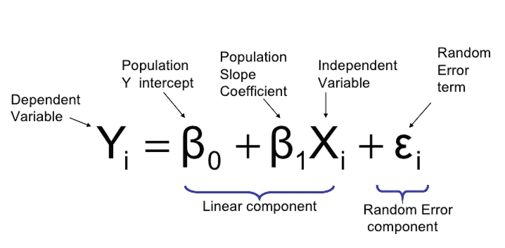
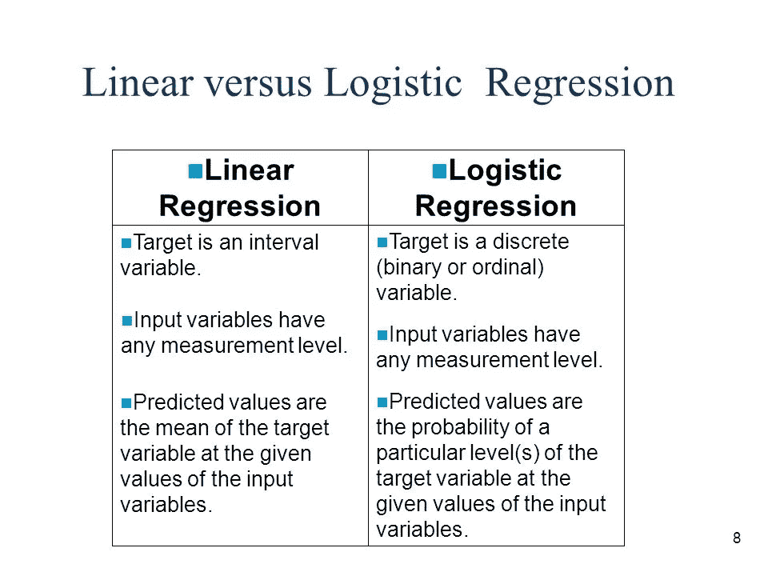
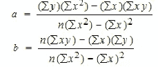
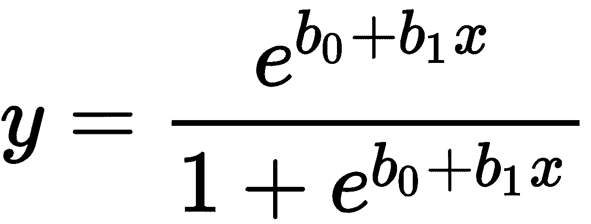
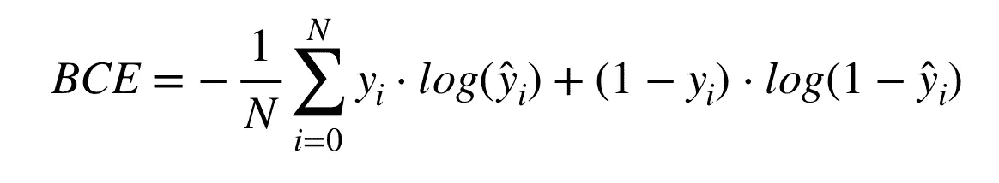

# 逻辑回归和普通最小二乘回归(线性回归)有什么关系？为什么会出现逻辑上的“回归”？

> 原文：<https://towardsdatascience.com/how-are-logistic-regression-ordinary-least-squares-regression-related-1deab32d79f5?source=collection_archive---------3----------------------->

[https://cdn-images-1.medium.com/max/1436/1*_TqRJ9SmwFzRigJhMiN2uw.png](https://cdn-images-1.medium.com/max/1436/1*_TqRJ9SmwFzRigJhMiN2uw.png)

如果你和我一样被“逻辑回归”中的“回归”所困扰，而逻辑回归实际上应该被称为“逻辑分类”，考虑到它确实分类，我对你的困扰有一个答案！

# 逻辑回归和普通最小二乘回归(又名线性回归)简介:

**逻辑回归**适用于根据一组预测变量的值预测某个特征或结果是否存在的情况。它类似于线性回归模型，但适用于因变量为二分变量的模型。它的系数可以用来估计模型中每个独立变量的奇数比率。它比判别分析适用于更广泛的研究情况。另一方面，逻辑回归用于确定事件的概率，该事件以二进制格式捕获，即 0 或 1。

## 如你所知，使用逻辑回归，多类分类是可能的，而不仅仅是二元分类。但 logistic 回归多用于二元分类。

**线性回归**又名最小二乘回归，估计线性方程的系数，涉及一个或多个自变量，能最好地预测因变量的值。例如，可以根据年龄、教育程度和经验年限等独立变量来预测销售人员的年总销售额(因变量)。

线性回归是连续的，而逻辑回归是离散的。

这里有更多关于[连续变量和离散变量的内容。](https://hackernoon.com/continuous-vs-discrete-variables-in-the-context-of-machine-learning-15d9005e2525)

# 它们有什么特别的联系？

*   逻辑回归估计结果的概率。事件被编码为二进制变量，值 1 表示目标结果的出现，值 0 表示不出现。
*   最小二乘回归也可以使用线性概率模型来模拟二元变量。最小二乘回归可能会给出超出范围(0，1)的预测值，但该分析仍可用于分类和假设检验。
*   逻辑回归模型将事件的概率估计为独立变量的函数。设 y 表示情况 I 的因变量上的一个值，同样情况下 k 个自变量的值表示为 x (j = l，k)。假设 Y 是一个二元变量，用来衡量某个群体的成员关系。如果情况 I 是该组的成员，编码 y = 1，否则编码 0，那么让 p = y = 1 的概率。y = 1 的几率由 p/(l-p)给出。p 的对数概率或 logit 等于 p/(l-p)的自然对数。逻辑回归将对数优势估计为独立变量的线性组合

logit(p) =B0 + B1X1 + B2X2+ ……。+ BkXk

(0、1、2、k 都是在时[缺乏媒介订阅能力的下标)](https://help.medium.com/hc/en-us/articles/226314627-How-can-I-add-superscript-)

*   最小二乘回归对因变量和自变量集合之间的关系进行建模。因变量的值被定义为自变量加上误差项ϵ.的线性组合

Y = B0 + B1X1 + B2X2+ ……。+ BkXk + ϵ

(0，1，2，k 都是下标)

其中(B0 … Bk)是回归系数，Xs 是独立变量的列向量，e 是预测误差的向量

*   逻辑回归应用于二元因变量的建模。逻辑回归模型的结构是为二元结果设计的。
*   最小二乘回归不是为二元分类而构建的，因为与最小二乘回归相比，逻辑回归在分类数据点方面表现更好，并且具有更好的对数损失函数。

**它们在哪里排列在一起:**

**线性回归使用一般线性**方程 Y=b0+∑(biXi)+ϵ，其中 y 是连续的因变量，自变量 Xi 通常是连续的(但也可以是二元的，例如当线性模型用于 t-检验时)或其他离散域。ϵ是模型无法解释的方差的术语，通常被称为“误差”。用 Yj 表示的独立相关值可以通过稍微修改等式来求解:

Yj=b0+∑(biXij)+ϵj

(j，0，I，j 都是下标，具有与所解释的相同的表示)

线性回归的输出如下所示:

[https://upload.wikimedia.org/wikipedia/commons/thumb/3/3a/Linear_regression.svg/400px-Linear_regression.svg.png](https://upload.wikimedia.org/wikipedia/commons/thumb/3/3a/Linear_regression.svg/400px-Linear_regression.svg.png)

**逻辑回归是另一种广义线性模型** (GLM)程序，使用相同的基本公式，但它不是连续的 Y，而是回归分类结果的概率。简单来说，这意味着我们只考虑一个结果变量和该变量的两种状态——0 或 1。

Y=1 的概率公式如下:

p(y = 1)= 1**/**(1+e−^(b0+∑(bixi)))

(0，我都是下标)

其中术语与先前解释的相同。

自变量 Xi 可以是连续的，也可以是二进制的。回归系数 bi 可以被指数化，以给出 Xi 每改变一次 Y 的几率的改变。

输出是一条如下所示的 s 形曲线:

[https://upload.wikimedia.org/wikipedia/commons/thumb/8/88/Logistic-curve.svg/1200px-Logistic-curve.svg.png](https://upload.wikimedia.org/wikipedia/commons/thumb/8/88/Logistic-curve.svg/1200px-Logistic-curve.svg.png)

**两者都是线性模型，然而:**

逻辑回归本身绝对不是一种分类算法。只有分类算法与决策规则相结合，才能使结果的预测概率二分法。逻辑回归是一种回归模型，因为它将类成员的概率估计为要素的多元线性函数(的变换)。

**我们可能会问，为什么它被称为“逻辑回归”，而不是“逻辑分类”？**

要回答这个问题，我们必须追溯到 19 世纪，在那里逻辑回归找到了它的目的。它被广泛用于发现种群的增长和自催化化学反应的过程，如这里的[所示](http://papers.tinbergen.nl/02119.pdf)。

同样需要明确的是，正如一些专家指出的那样,“逻辑回归”这个名字远在任何“监督学习”出现之前就被创造出来了。**此外，术语“回归”并不意味着结果总是连续的，正如本文** **中指出的** [**。所以，并不是每个“回归”都是连续变量预测。**](http://papers.tinbergen.nl/02119.pdf)

线性回归通常通过最小化模型对数据的最小二乘误差来解决，因此大的误差被平方惩罚。逻辑回归正好相反。

仅供参考:以下是线性回归的损失函数:

[https://www.researchgate.net/profile/Alexandros_Karatzoglou/publication/221515860/figure/fig1/AS:339586132791298@1457975051470/Figure-1-Mean-Squared-Error-formula-used-to-evaluate-the-user-model.ppm](https://www.researchgate.net/profile/Alexandros_Karatzoglou/publication/221515860/figure/fig1/AS:339586132791298@1457975051470/Figure-1-Mean-Squared-Error-formula-used-to-evaluate-the-user-model.ppm)

使用逻辑损失函数会导致较大的误差被罚为渐近常数。

考虑对分类{0，1}结果的线性回归，看看为什么这是一个问题。如果模型预测当真值为 1 时结果为 67，没有太大损失。线性回归会试图减少 67，而逻辑回归不会(同样多)，这意味着，对这一连续产出使用逻辑回归不会解释更多的损失。它认为损失并不大，换句话说，逻辑回归并不惩罚使“最佳拟合线”根本不是“最佳拟合线”的损失。

逻辑回归的结果在许多方面可以与最小二乘回归的结果相比，但它能更准确地预测相关结果的概率。最小二乘回归在从因变量预测连续值方面是准确的。

如上所述，重要的是要知道“回归”是一个抽象的术语。它根据上下文有不同的解释。

这是一个对比图像:

[http://slideplayer.com/slide/6183997/18/images/8/Linear+versus+Logistic+Regression.jpg](http://slideplayer.com/slide/6183997/18/images/8/Linear+versus+Logistic+Regression.jpg)

# 最后，让我们来看看每个属性:

# 产出:

**线性回归:**连续值【2 个以上输出】。

**Logistic 回归:**离散值。通常是 2 个输出{0，1}。输出是在舍入到最接近的值 0 或 1 后得出的。请记住，多类是允许的。

# 解释系数:

**线性回归:**线性回归系数代表预测变量变化一个单位的响应变量的平均变化，同时保持模型中其他预测变量不变。换句话说，保持所有其他变量不变，这个变量增加一个单位，因变量预计会增加或减少某个值 x。

**逻辑回归:**解释逻辑回归系数需要解释概率，而概率本身就是另一个话题。然而，这里有一个[直观的解释](https://www.youtube.com/watch?v=eX2sY2La4Ew)。

# 方程式:

**线性回归:**线性回归是一种对两个变量之间的关系进行建模的方法。你可能还会把这个方程看作**斜率公式**。该等式的形式为 **Y=a+bX** ，其中 Y 是因变量(Y 轴上的变量)，X 是自变量(即，它绘制在 X 轴上)，b 是直线的斜率，a 是 Y 截距。

Simple linear regression equation : [http://www.statisticshowto.com/probability-and-statistics/regression-analysis/find-a-linear-regression-equation/](http://www.statisticshowto.com/probability-and-statistics/regression-analysis/find-a-linear-regression-equation/)

总有一个误差项，又名剩余项 **ϵ** ，如图所示:

[https://cdn-images-1.medium.com/max/1436/1*_TqRJ9SmwFzRigJhMiN2uw.png](https://cdn-images-1.medium.com/max/1436/1*_TqRJ9SmwFzRigJhMiN2uw.png)

**逻辑回归:**逻辑回归使用一个等式作为表示，非常类似于线性回归。输入值( *x* )使用权重或系数值(称为希腊大写字母，beta)进行线性组合，以预测输出值( *y* )。与线性回归的一个关键区别是，被建模的输出值是二进制值( *0* 或 *1* )，而不是数值[(来自 Safari 在线图书)](https://www.safaribooksonline.com/library/view/ensemble-machine-learning/9781788297752/e2d207ff-3690-4e74-9663-2d946e2a7a1c.xhtml)。

Example for logistic regression: [https://www.safaribooksonline.com/library/view/ensemble-machine-learning/9781788297752/e2d207ff-3690-4e74-9663-2d946e2a7a1c.xhtml](https://www.safaribooksonline.com/library/view/ensemble-machine-learning/9781788297752/e2d207ff-3690-4e74-9663-2d946e2a7a1c.xhtml)

# 误差方程:

## 线性回归:均方误差:

[https://www.researchgate.net/profile/Alexandros_Karatzoglou/publication/221515860/figure/fig1/AS:339586132791298@1457975051470/Figure-1-Mean-Squared-Error-formula-used-to-evaluate-the-user-model.ppm](https://www.researchgate.net/profile/Alexandros_Karatzoglou/publication/221515860/figure/fig1/AS:339586132791298@1457975051470/Figure-1-Mean-Squared-Error-formula-used-to-evaluate-the-user-model.ppm)

**逻辑回归:**逻辑回归的输出是概率，这些概率随后被分类。底线是，你不能像以前看到的那样用逻辑回归做线性回归。

逻辑回归的通常成本或损失函数也称为误差方程，被称为“分类交叉熵”,如神经网络中所见。

Binary outcomes loss function aka binary categorical cross entropy (BCE): [http://cat.birdhabitat.site/categorical-cross-entropy-loss-formula/](http://cat.birdhabitat.site/categorical-cross-entropy-loss-formula/)

然而，由于这是一个分类，这里是来自 [sklearn 的分类常用指标。](http://scikit-learn.org/stable/modules/model_evaluation.html#classification-metrics)

# 线性关系:

**线性回归:**需要因变量和自变量之间的线性关系。

**Logistic 回归:**因变量和自变量之间不需要线性关系。

# 剩余分配:

**线性回归:**要求误差项呈正态分布。

**Logistic 回归:**不要求误差项呈正态分布。

既然我们知道了线性回归和逻辑回归之间的关系。

如果你喜欢这篇文章，那就鼓掌吧！:)也许一个跟随？

在社交网站上与我联系:

 [## Rakshith Vasudev | LinkedIn

### 查看拉克什特·瓦苏德夫在全球最大的职业社区 LinkedIn 上的个人资料。拉克什特教育上市…

www.linkedin.com](https://www.linkedin.com/in/rakshith-vasudev/)  [## 拉克什特·瓦苏德夫

### 拉克什·瓦苏德夫。和我一起学习人工智能，让这个世界变得更美好。张量流…

www.facebook.com](https://www.facebook.com/imrakshithvasudev/)  [## 拉克什特·瓦苏德夫

### Datascience 入门，最佳编程实践。主题包括机器学习和其他。

www.youtube.com](https://www.youtube.com/c/rakshithvasudev) 

# 来源:

[http://papers.tinbergen.nl/02119.pdf](http://papers.tinbergen.nl/02119.pdf)

[https://pdfs . semantic scholar . org/5a 20/ff 2760311 af 589617 ba 1b 82192 aa 42 de 4 e 08 . pdf](https://pdfs.semanticscholar.org/5a20/ff2760311af589617ba1b82192aa42de4e08.pdf)

[https://stats . stack exchange . com/questions/29325/线性回归和逻辑回归的区别是什么](https://stats.stackexchange.com/questions/29325/what-is-the-difference-between-linear-regression-and-logistic-regression)

[https://stats . stack exchange . com/questions/24904/least-squares-logistic-regression](https://stats.stackexchange.com/questions/24904/least-squares-logistic-regression)

[http://www . statistics solutions . com/what-is-logistic-regression/](http://www.statisticssolutions.com/what-is-logistic-regression/)

[https://stack overflow . com/questions/12146914/线性回归和逻辑回归的区别是什么](https://stackoverflow.com/questions/12146914/what-is-the-difference-between-linear-regression-and-logistic-regression)