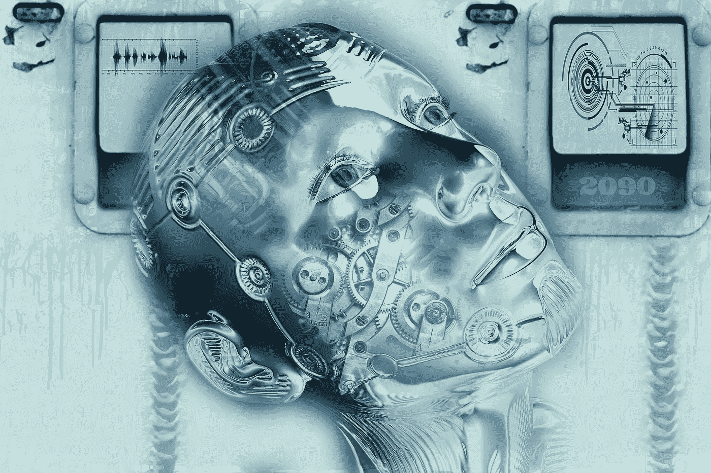

# 人工智能如何改变商业世界的面貌

> 原文：<https://towardsdatascience.com/how-artificial-intelligence-has-changed-the-face-of-business-world-f554da5ff8?source=collection_archive---------8----------------------->

人工智能行业已经成为商业和技术整合的主流。

人工智能不再是未来某个地方会发生在小企业身上的现象——它已经在这里了。企业主和管理人员现在可以利用商业世界中的这些创新，因为等待人工智能到来意味着在商业发展中被抛在后面。人工智能可以帮助企业的几乎每个方面，包括移动性、营销和广告、客户服务和安全。

[Artificial Intelligence](https://pixabay.com/en/cyborg-forward-digitization-robot-2765349/)

**通过人工智能实现卓越的企业移动性**

人工智能还允许员工在办公室之外的其他地方工作，并且仍然与办公室保持联系。例如，通过人工智能，员工可以通过云共享文档、信息、财务工作、营销和其他信息。移动性因素意味着办公室中的人可以在现场，他们可以在家工作，或者从不同的位置工作，但是团队中的每个人仍然能够相互联系以回答问题和进行协作。移动性的增加意味着员工可以随时随地工作。研究表明，当员工能够在不同的地点工作时，他们会感到更加快乐，并表现出更高的生产率。

**营销和广告**

人工智能改变了客户接收广告和营销信息的方式。任何上过社交媒体的人都知道人工智能在营销中扮演的角色。例如，如果客户在谷歌上搜索一家企业，该企业的广告可能会出现在他们的社交媒体订阅源上，而无需他们要求，因为人工智能能够识别某人过去的搜索，并使用搜索历史来做有针对性的广告。

人工智能对销售产品和服务的企业也至关重要，因为它能够通过有针对性的广告和搜索历史将客户带到企业。人工智能在网上收集重要的数据，并可以指出[企业可以增加网站](https://www.wix.com/blog/2018/03/8-ways-drive-traffic-to-website/)流量的方式，以及商店的位置。

**以更低的成本提高效率和精度**

使用人工智能的公司的增加只能意味着一件事——人工智能改变了任务的效率和速度。如前所述，人工智能在企业中的作用是增加企业以前留给员工的自动化量。例如，在 20 世纪 90 年代，人们被雇用来将公司必须支付的发票数据输入到计算机中，然后一名员工运行一个支票书写程序，该程序大约每周运行一次支票，以支付公司欠其他人的发票。然后，一个完全不同的员工会拿着公司从其他公司收到的支票，手动将其输入分类帐程序，然后将支票带到银行。然而，通过人工智能，计算机能够在没有输入的情况下根据从企业收到的数据生成发票，然后以电子方式支付发票上的存款，同时也以电子方式支付其他人，并将双方都记入其分类账，以便员工可以查看。

人工智能不需要喝咖啡休息，也不会在圣诞节休假，这意味着它能够生成数据，检索信息并进行分析，供员工在到达时或假期结束时查看和采取行动。

**人工智能和机器人在工作场所意味着更好的客户服务和支持**

虽然机器人不会像末日预言家们不断预测的那样，抹去世界上所有的工作，但机器人和先进的计算机编程可以自动完成一些任务。例如，[使用人工智能语音电话系统的企业](https://www.dialpad.com/ent/voice-ai)能够让客户接受服务，并在不与人类交谈的情况下回答他们的许多问题，这让客户感觉他们的问题已经得到解决，并允许与客户服务合作的员工帮助客户解决需要人工干预的更复杂的问题。此外，工作场所中的机器人技术允许通过计算机或机器人干预来完成重复性任务，而不可预测的任务可以由人类来完成。

**帮助整合和巩固业务运营**

AI 帮助商家巩固业务领域。虽然上面简要描述了，但还有其他方式可以整合业务，那就是通过使用人工智能结合云技术。有了人工智能和云，业务信息和文件不必保存在多个地方，而是可以保存在云中，这意味着不仅可以有多人查看文件，而且没有搜索文件，也没有因为文件丢失而导致的办公室混乱，因为使用云技术可以获得信息。此外，可以简化日常业务流程，减少从事相同工作的人员，让办公室内的人员专注于特定的业务领域。

**更强的网络安全**

当与云技术结合时，人工智能还增加了公司的安全性。人工智能能够发现在线或服务器内的威胁，并在违规发生前或发生时警告技术和安全人员。鉴于黑客不仅在信息损失方面给公司造成了数百万美元的损失，而且当黑客泄露数百万客户的个人信息时，客户的不信任也给公司带来了损失，因此[人工智能帮助公司更加安全](https://www.information-age.com/role-ai-cyber-security-123465795/)的概念尤为重要。出于这个原因，企业越来越多地指望人工智能来帮助填补他们的安全漏洞。

人工智能可能有点可怕，特别是如果一家企业难以将所有业务流程的控制权交给计算机。然而，通过一点灵活性和一点工作，企业可以让人工智能为他们工作。人工智能可以简化和自动化企业的许多方面，从客户服务电话到办公室程序到营销，甚至到完成销售。人工智能不再是一种说企业懂技术的方式。在 21 世纪的第二个十年，信息技术正迅速成为商业运作的重要组成部分。