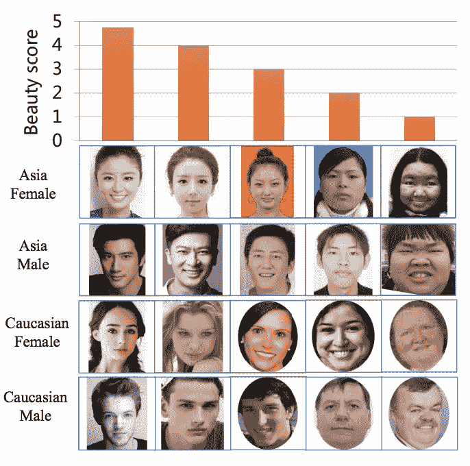
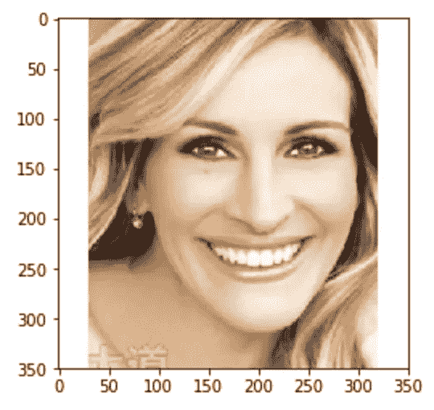
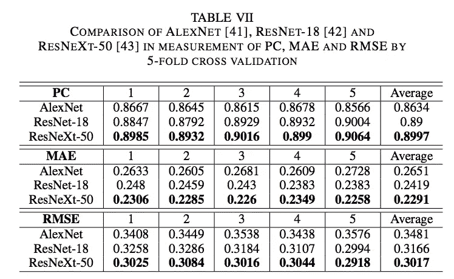
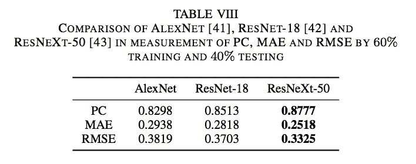
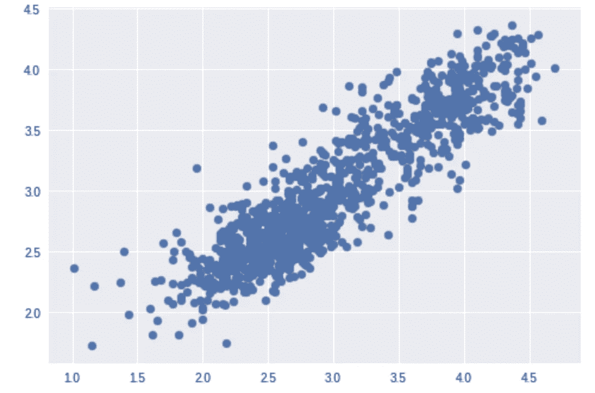
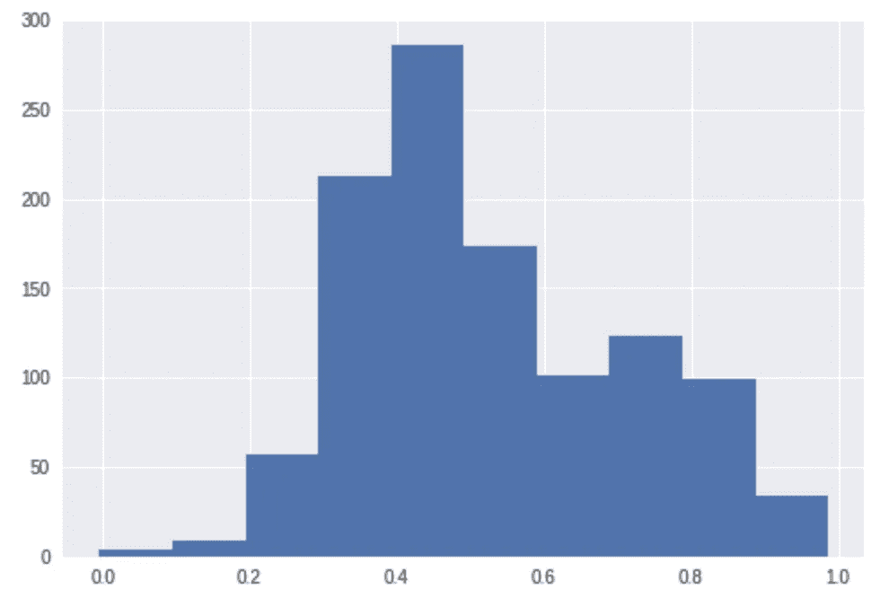
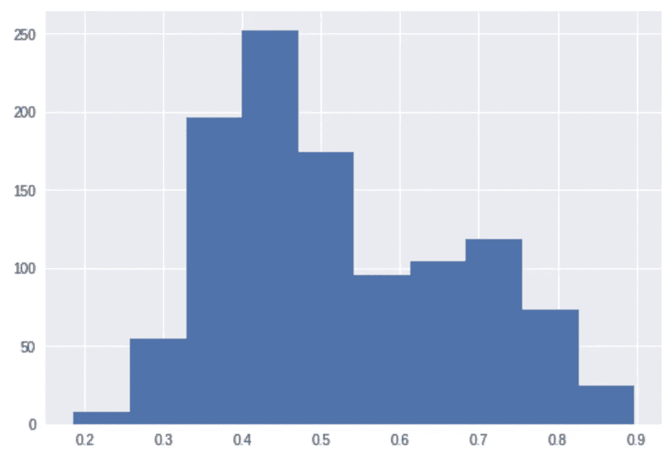
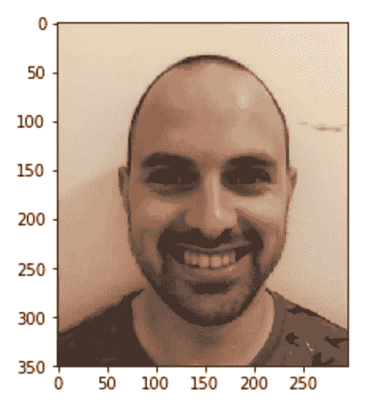
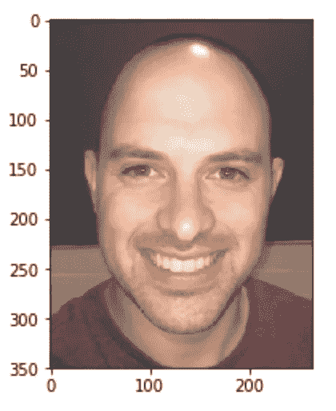

# 深度神经网络眼中的你有多有魅力？

> 原文：<https://towardsdatascience.com/how-attractive-are-you-in-the-eyes-of-deep-neural-network-3d71c0755ccc?source=collection_archive---------1----------------------->

几个月前，华南大学发表了一篇论文和一个关于“面部美容预测”的数据集。这里可以找到[。该数据集包括 5500 人，他们对自己的吸引力进行了 1 到 5 分的评分。

以下是文中的一些例子:](https://arxiv.org/abs/1801.06345)



片场还有几个名人。这张朱莉娅·罗伯特的照片平均得分为 3.78:



以色列著名模特芭儿·莱法利的这张照片得到了 3.7 分:


这些看起来可能很低，但 3.7 分意味着 bar 比数据集中的 80%的人更有吸引力。

除了数据集，作者还训练了多个模型，试图根据面部照片预测一个人的吸引力。

在这篇文章中，我想复制他们的结果，看看我有多有魅力。

原始论文实现了一堆不同的模型，包括具有手工制作功能的经典 ML 模型和 3 个深度学习模型:AlexNet、ResNet18 和 ResNext50。
我想让我的工作尽可能简单(我不想从头开始实施和培训整个`resnet`网络)，我想微调一些将完成工作的现有模型。在`keras`中，有一个叫做`applications`的模块，它是不同预训练模型的集合。其中一个就是`resnet50`。不幸的是，在`keras.applications`没有 ResNet18 或 ResNext50，所以我无法复制完全相同的作品，但我应该足够接近`resnet50`。

`from keras.applications import ResNet50`

ResNet 是一个深度卷积网络，由微软开发，并赢得了 2015 年 ImageNet 竞赛，这是一个图像分类任务。
当我们在`keras`中启动`resnet50` 模型时，我们创建了一个具有 ResNet50 架构的模型，并且我们还下载了在 ImageNet 数据集上训练的训练权重。

论文作者没有提到他们到底是如何训练模型的，所以我尽量做到最好。
我想删除最后一层(“softmax”层)并添加一个没有激活功能的密集层来执行回归。

```
resnet = ResNet50(include_top=False, pooling=’avg’)
model = Sequential()
model.add(resnet)
model.add(Dense(1))model.layers[0].trainable = Falseprint model.summary()# Output:
  Layer (type)                 Output Shape              Param #    ================================================================= resnet50 (Model)             (None, 2048)              23587712   _________________________________________________________________ dense_1 (Dense)              (None, 1)                 2049       ================================================================= Total params: 23,589,761 
Trainable params: 23,536,641 
Non-trainable params: 53,120
```

您可以看到，我将第一层(resnet 模型)设置为不可训练，因此我只有 2，049 个可训练参数，而不是 23，589，761 个。

我的计划是训练最后的密集层，然后，用更小的学习率训练整个网络。

```
model.compile(loss='mean_squared_error', optimizer=Adam())model.fit(batch_size=32, x=train_X, y=train_Y, epochs=30)
```

在那之后，我改变第一层为可训练的，编译并且适合另外 30 个时期的模型。

这里的`train_X`是照片，即`numpy`个形状`(350, 350, 3)`的数组，`train_Y`是被标记图像的分数。

# **结果**

论文使用两种技术训练模型:5 重交叉验证和 60%-40%的训练测试分割。他们使用皮尔逊相关(PC)、平均绝对误差(MAE)和均方根误差(RMSE)来衡量他们的结果。这些是他们使用五重交叉验证得到的结果:



这些是他们用 60%-40%的训练测试分割得到的结果:



我将进行 80%-20%的训练测试分割，因此这类似于执行 1 倍的交叉验证部分。

我得到了以下结果:

```
RMSE: 0.301799791952313 
MAE: 0.2333630505619627 
PC: 0.9012570266136678
```

非常好。此外，查看分数的散点图和直方图总是很好的:



原始分数分布(标准化):



预测分数分布(标准化):



结果看起来相当不错。现在让我们看看这个深度神经网络对我说了什么。我一开始用这张照片:



我得了 2.85 分，这意味着我比这个数据集中 52%的人更有吸引力。我不得不说我有点失望，我希望我会比那更好。所以我试图改善我的处境。

我拍了很多照片，最终这张照片我得到了 3.15 分，这意味着我比数据集中 64%的人都更有吸引力。



这好多了，我必须诚实地说，我希望更好:)

最后一点，我使用[谷歌合作实验室](https://colab.research.google.com/)构建并微调了这个模型，简而言之，它给你一个免费使用 GPU 的 python 笔记本！

希望你喜欢这篇文章。