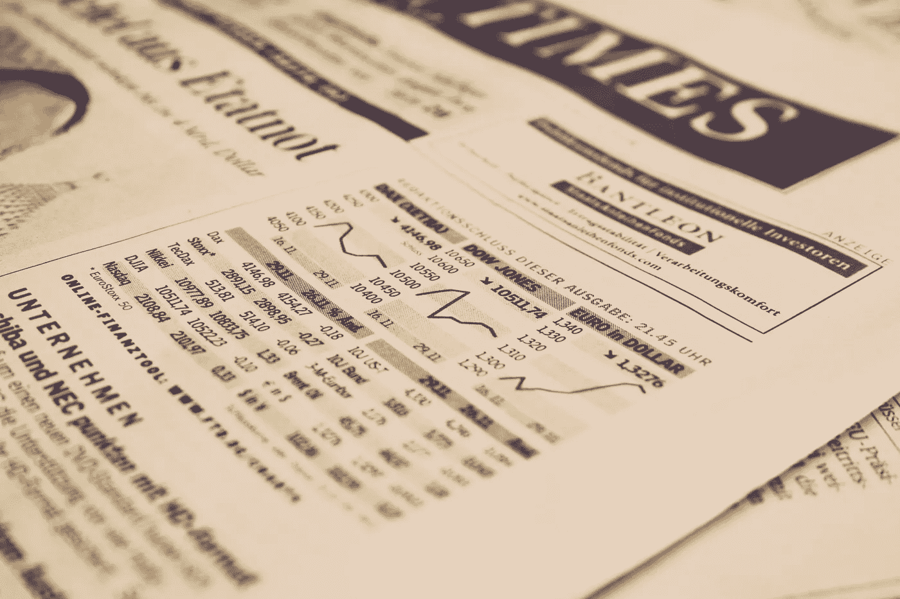

# 大数据和商业智能如何改变资本市场

> 原文：<https://towardsdatascience.com/how-big-data-and-business-intelligence-are-transforming-capital-markets-4ef61a06b2b8?source=collection_archive---------7----------------------->

商业决策通常会对财务产生影响，但在金融交易中影响最大，每个决策，无论大小，都会对底线产生直接影响，导致损失或收益。

因此，商业智能(BI)解决方案开始利用其处理大量结构化和非结构化数据的能力来支持交易决策就不足为奇了。对投资银行和大型交易机构来说是这样，但对小型金融企业甚至个人交易员来说也是如此。

金融交易市场一直非常依赖数据分析，因此大数据和高级商业智能的出现应该会扰乱这些市场参与者的运营方式。它确实做到了，其结果与本文简要探讨的三个结果一样重要。

# 金融交易变得数据驱动

投资银行和对冲基金从来都不缺数据。然而，自从大数据和[金融商业智能](https://www.iflexion.com/portfolio/financial-business-intelligence-platform)的出现，他们使用数据的方式发生了相当大的变化。更快地分析市场状况的需求已经将金融交易组织从数据消费者转变为真正的数据驱动型实体，这依赖于除金融专家和分析师之外的可用数据工程师和科学家的专业知识。

金融行业的许多企业都有非常具体的软件需求，因此决定从头开始构建大数据解决方案。对于这项任务，数据工程师是不可或缺的。

对于雇不起数据工程师的较小企业来说，答案往往是金融科技开发外包，这种做法反过来刺激了软件公司对金融专业知识的需求。

# 金融交易中的数据科学

数据科学家比工程资源更受欢迎。这部分是因为，与其他商业领域不同，数据的数量和种类通常过于复杂，无法在交易员可以理解的通用仪表盘上提供。相反，数据科学家需要识别微妙的数据模式，并在复杂算法的帮助下生成可操作的见解。

因此，大数据和商业智能在金融交易中的使用越来越多，这对科技行业来说是个好消息。然而，这也导致了分析专业人员的短缺，迫使金融服务和交易公司为他们雇佣的资源支付更多费用。

事实上，根据 Glassdoor 的数据，2018 年一名数据科学家的[中值基本工资](https://www.glassdoor.com/List/Best-Jobs-in-America-LST_KQ0,20.htm)约为 11 万美元。毫无疑问，这一高比率部分归因于金融行业，IBM 的一项研究显示，该行业目前对数据科学家和分析师的需求高于其他任何行业，占所有相关职位空缺的 19%。

# 大数据:新型交易者的数字黄金

对于能够访问大数据和金融商业情报的交易员来说，决策变得越来越明智，因此风险也越来越小。交易曾经主要基于对价格行为的分析，而大数据的整合使得支持和反对水平、政治和社会因素以及其他有影响的条件能够被添加到等式中。

预测性商业智能的应用可以进一步降低风险，使交易员能够评估每笔交易的可能结果和回报率。然而，整个过程都需要大量数据，这促使越来越多的企业准备收集数据并出售给金融交易机构。

# 量化对冲基金:大数据的大买家

通过购买或其他方式获得大数据，也催生了一种全新的交易实体——量化对冲基金。这些基金在某些方面类似于传统或“基本面”对冲基金，但几乎完全依赖数字算法和模型来选择和发起交易。

由于他们的商业模式，量化对冲基金需要大量的数据，讽刺的是，他们的胃口已经把出售数据变成了金融行业最赚钱的活动之一。事实上，在所谓的“替代数据”上的支出到 2016 年已经达到 2 亿美元，预计在五年内将翻一番。这是研究和咨询公司 Tabb Group 的[研究得出的结论之一。](https://research.tabbgroup.com/report/v14-062-capturing-alternative-alpha-rise-alternative-data-sets)

# HFT 让位于智能交易

金融科技行业进步产生的一个更有趣的动态可以被视为影响了有争议但广泛存在的高频交易实践(HFT)。高频交易本身是一个数据驱动的过程，一度非常有利可图(对一些 HFT 公司来说仍然如此)。

然而，随着在 HFT 领域竞争的技术要求变得越来越复杂，利润开始下降，机构开始将注意力从闪电般的机器启动交易转向基于大数据洞察的人工交易。例如，人类股票交易者可能使用市场情绪分析的结果来提取可操作的交易信号。

# HFST 的趋势？

考虑到 BI 技术的持续改进，这种动态变得更加有趣。例如，实时分析将成为金融科技领域的一股强大力量。随着交易实体可以实时收集和分析来自新闻、社交媒体和股票市场的数据，然后将情报输入自动化交易解决方案，我们可能会再次看到高频交易的兴起。

然而，在下一次迭代中(会是 HFT 2.0，还是高频智能交易？)区别可能在于机器执行更智能算法的能力，这使得高度知情的交易能够以极高的频率达成。

当然，尽管自动化金融交易在公平性方面名声不佳，但仍有很多值得称道的地方。毕竟，机器不会受到紧张、兴奋或任何其他导致错误决策的行为特征的影响，而在金融市场的世界里，这些行为特征确实非常昂贵。

# 这只是大数据和金融 BI 的开始

奇怪的是，对于一个一直依赖数据的行业来说，情绪分析、智能高频交易和数据科学等发展在金融交易领域相对较新。

实际上，这还只是皮毛，所以如果你的公司在资本市场交易或涉足金融服务，你应该预计大数据和商业智能将在你的业务中发挥越来越大的作用。

此外，机会不太可能仅限于创收。密切关注在中后台流程中利用财务 BI 的可能性，因为随着越来越多的公司适应大数据，这些领域的用例肯定会变得明显。