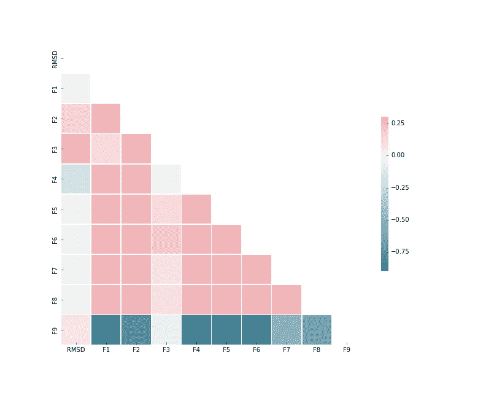
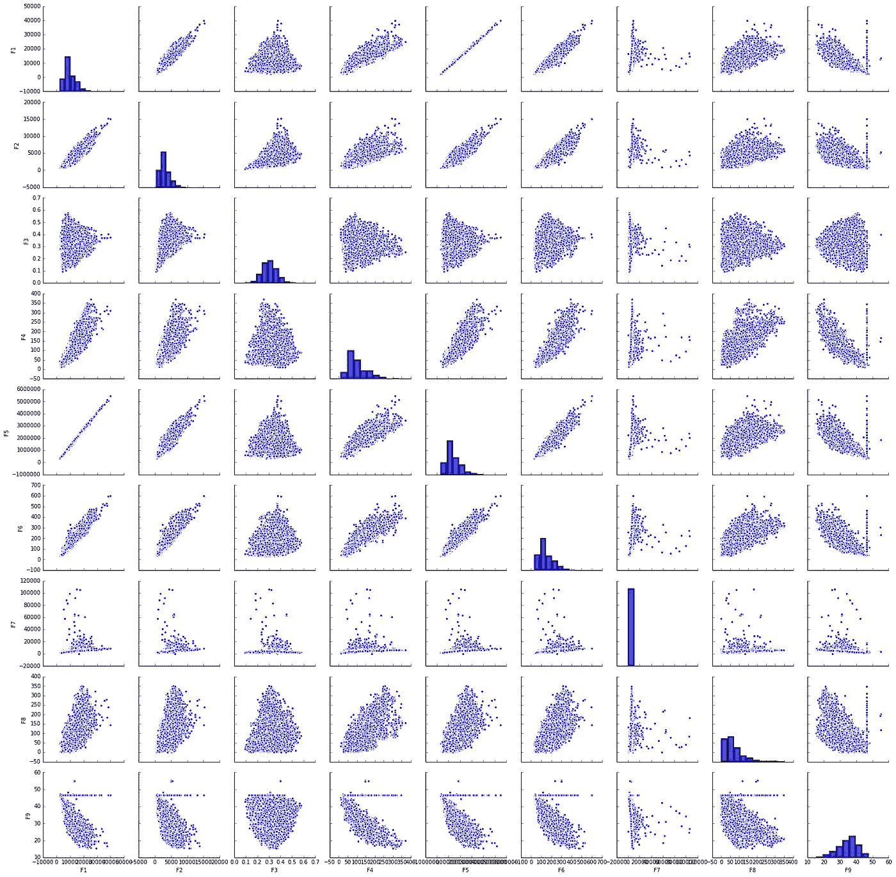
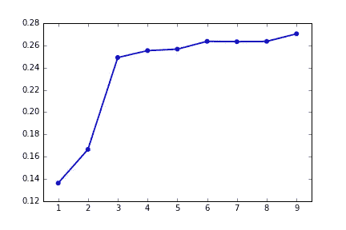
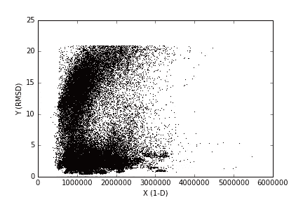
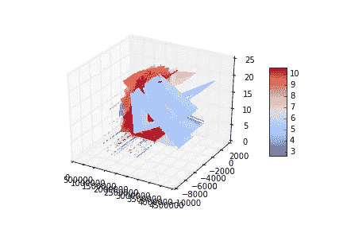
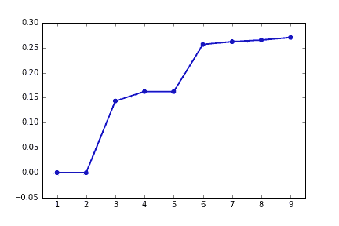
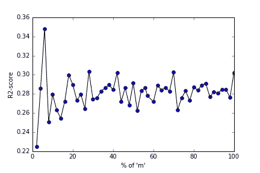

# 您的数据应该有多大？

> 原文：<https://towardsdatascience.com/how-big-should-be-your-data-fdace6e627e4?source=collection_archive---------6----------------------->

在设计机器学习模型时，所有数据科学家都会想到一个简单的问题:“数据集应该有多大？建模应该使用多少特征？”。本文将通过一项实验研究，向您展示如何决定数据集大小和模型所需的特性数量。


[https://commons.wikimedia.org/wiki/File:BigData_2267x1146_white.png](https://commons.wikimedia.org/wiki/File:BigData_2267x1146_white.png)

下面是我的 github 资源库的链接。它包含用于分析的 python 代码。您可以派生或克隆存储库，并使用代码:-P

[](https://github.com/bmonikraj/machine-learning-data-analysis-01.git) [## bmonikraj/机器学习数据分析-01

### 机器学习-数据分析-01 -使用统计方法对数据集进行实验分析，以获得更好的机器…

github.com](https://github.com/bmonikraj/machine-learning-data-analysis-01.git) 

下面是从 UCI 机器学习知识库到数据仓库的链接。它包含与数据集和属性相关的信息。这里提到，这个问题是一个回归问题。

[https://archive . ics . UCI . edu/ml/datasets/理化+属性+of+蛋白质+三级+结构](https://archive.ics.uci.edu/ml/datasets/Physicochemical+Properties+of+Protein+Tertiary+Structure)

```
**Description of Dataset**
Dataset inititally has 10 columns. 
Column with name 'RMSD' is the target column of our data set
Rest 9 columns with name F1, F2, ... , F9 are the features columns of the data set. m = Number of observations in the data set
Dimension of Y : m X 1
Dimension of X : m X 9
```

现在，我将向您展示数据帧的每一列之间的关联矩阵，包括 RMSD *(数据帧是一个术语，用来表示 Python 的 Pandas 模块读取的数据集)。*



Correlation Matrix — Heat Map , showing the correlation between each and every column of data frame

> *从上图中，我们可以得出结论，RMSD 与其他列几乎是独立的，因为理论上说如果，correlation(x，y)~0，那么‘x’和‘y’是彼此独立的(其中‘x’和‘y’是相同维数的向量)。*
> 
> **在我们不知道哪一列将被选为目标列的情况下，我们可以找到相关矩阵，并找到与所有其他列最独立的列。**

这是 x 中所有特征列之间的相关矩阵图。

*对于 X 的列‘I’和列‘j ’,它显示了两个变量之间的散点图，当‘I’时！= 'j '。如果' i'=='j '，那么它显示了变量的频率分布。*



Correlation Matrix plot — Correlation between two variables (feature column) and frequency distribution of the variable itself

> *上图讲述了变量之间的相互关系。同样，我们可以用图形来推断矩阵之间的相关性，以便更好地进行分析。*
> 
> ***变量的频率分布显示了它所遵循的分布类型，如果遵循一个已知的标准分布，如*** [***【高斯】***](https://en.wikipedia.org/wiki/Normal_distribution) ***分布或*** [***【瑞利】***](https://en.wikipedia.org/wiki/Rayleigh_distribution) ***分布，我们可以预测和分析变量的行为，这在进一步研究数据时会很方便。***
> 
> **注:变量的频率分布或直方图通常用于将变量拟合为标准分布。**

现在，我想请大家注意功能选择。在这里，我将阐明决定保留哪些特性的方法。我将使用 Python 的 Sci-kit 学习模块中的 SelectKBest 模块来完成这项工作。他们使用 f 检验估计从数据集中找到最佳特征。关于模块和理论的更多信息可以在参考资料中找到。

```
from sklearn.feature_selection import SelectKBest, f_regression
#Assuming X and Y are numpy array of dimension (m,9) and (m,1) #respectively
#We use f_regression function since our's is a regression problem
X_best = SelectKBest(f_regression, k=5).fit_transform(X,Y)
'''
After the code snippet is run, X_best keeps top k=5 features from X.
'''
```

现在，我将使用线性回归向您展示最佳“k”特征对模型的“ [R2 分数](http://scikit-learn.org/stable/modules/model_evaluation.html#r2-score)”指标的影响。这里你可以看到，通过增加“k”的值，我们的线性回归模型得到了更好的 R2 分数。我还存储了与' *SelectKBest* '方法相关的功能的降序。同样的代码可以在我上面的 github 链接中找到。



‘k’ vs ‘R2 Score ‘ plot on linear regression model (‘k’ determines the **top** **k features from the data set**)

这样，我们可以选择一个合适的“k”值作为模型的 R2 分数的相应值，这对于我们的问题陈述*来说是可接受的(我可能会选择 k=5，但对于您来说，可能会根据问题的需求而有所不同)。
以下是按降序排列的‘k’个特性列表:*【F3，F4，F2，F9，F6，F1，F5，F7，F8】

> **特征选择的主要应用之一是降低数据的维数，以获得更好的计算性能。**

[主成分分析](https://en.wikipedia.org/wiki/Principal_component_analysis)是将维度(特征)分解成更小维度空间的另一种方法。使用主成分分析的主要好处是:

*   ***降维***
*   ***将高维空间数据转化为低维空间数据进行可视化***

以下是将高维空间分解为低维空间后的数据可视化(对于“X”)。



Visualizing ‘X(1-D space)’ vs ‘Y’ after decomposing X into lower single dimension space



Visualizing ‘X(2-D space)’ vs ‘Y’ after decomposing X into lower 2 dimension space

现在，我将向您展示使用线性回归将数据投影到“p”分量特征空间对模型的“ [R2 分数](http://scikit-learn.org/stable/modules/model_evaluation.html#r2-score)”度量的影响。这里你可以看到，通过增加“p”的值，我们可以得到更好的线性回归模型的 R2 分数。



‘p’ vs ‘R2 Score ‘ plot on linear regression model (‘p’ determines the **top** **p components** **from the eigen vector projection of data set**)

查看图表，我们可以为我们的解决方案选择一个合适的“p”值。根据问题的要求，应通过相应的可接受的 R2 评分值来选择“p”的值。

现在我将讨论数据集大小的影响，***【m】=数据集*** 中的观察次数。我保留了最初出现在数据集中的 9 个特征，我改变了“m”，在训练集 *(80%)* 上训练，并使用线性回归模型计算了测试集 *(20%)* 上每个“m”的 R2 分数。



分析上面的图表，我们可以推断出以下几点:

*   R2 分数的最初峰值是由于较低的“m”值造成的数据偏差。
*   在尖峰之后，R2 分数在某种程度上饱和(忽略中间的尖峰，这是因为在分裂成‘m’’时随机选择数据点)，这意味着逐渐增加数据集大小，最终增加 R2 分数，直到饱和。
*   在某一点之后，它饱和，增加“m”，不影响 R2 分数。
*   较低的“m”导致模型中的偏差或较低的 R2 分数。

D 设计机器学习模型包括许多因素，如选择特征、决定数据大小以获得更好的模型性能、计算成本、实现实时数据的可行性(对于某些情况)，以及根据问题的要求的许多其他因素。这总是对数据的探索性分析，这导致了更好的模型设计，因为

> 机器学习中的每个问题都是不同的

参考:

1.  Sci-kit 模块:[http://scikit-learn.org](http://scikit-learn.org)
2.  SelectKBest 模块:[http://sci kit-learn . org/stable/modules/feature _ selection . html](http://scikit-learn.org/stable/modules/feature_selection.html)
3.  熊猫模块:[https://pandas.pydata.org/pandas-docs/stable/](https://pandas.pydata.org/pandas-docs/stable/)
4.  用于可视化的 Seaborn 模块:[https://seaborn.pydata.org/](https://seaborn.pydata.org/)
5.  主成分分析:[https://en.wikipedia.org/wiki/Principal_component_analysis](https://en.wikipedia.org/wiki/Principal_component_analysis)