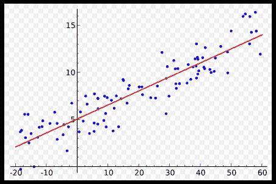
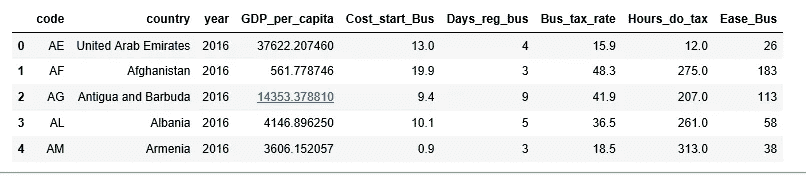
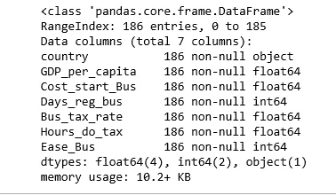
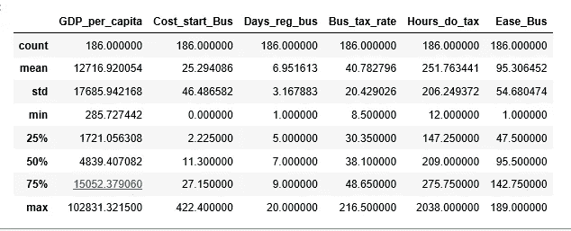
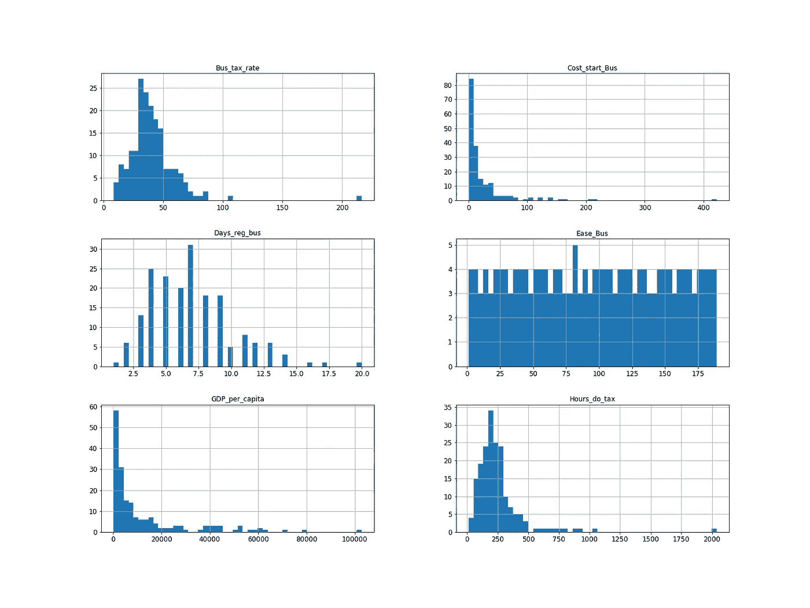
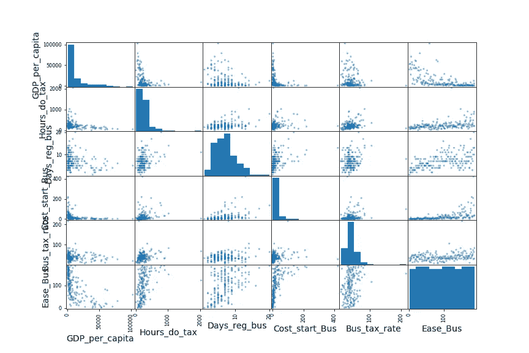
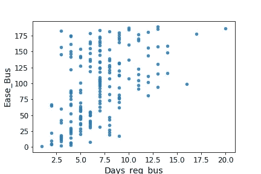
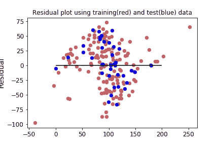

# 你的国家对商业有多友好？Python 中的线性回归

> 原文：<https://towardsdatascience.com/how-business-friendly-is-your-country-linear-regression-in-python-c22ff0fcebdd?source=collection_archive---------0----------------------->



Image courtesy: Wikipedia

# 动机

[世界发展指标(WDI)](https://data.worldbank.org/data-catalog/world-development-indicators) 是由[世界银行](http://www.worldbank.org/)编制的广泛而全面的数据汇编。WDI 包括 200 多个国家经济的 1400 个指标，它提供了现有的最新和最准确的全球发展数据。

“营商便利度排名”指标对各国进行比较，其排名范围从 1 到 190(1 =最有利于商业的法规)。我今天的目标是开发一个多元线性回归模型，以了解什么属性使一个国家排名更高。那么，我们开始吧。

# 数据

r 有一个叫做 [WDI](https://cran.r-project.org/web/packages/WDI/README.html) 的很棒的软件包，可以让你搜索和下载世界银行的数据系列。

```
library(WDI)
indicator1 <- WDI(country="all", indicator=c("NY.GDP.PCAP.CD", "IC.REG.COST.PC.ZS", "IC.REG.PROC", "IC.TAX.TOTL.CP.ZS", "IC.TAX.DURS", "IC.BUS.EASE.XQ"),
start=2016, end=2016)colnames(indicator1) <- c("code","country","year", "GDP_per_capita", "Cost_start_Bus", "Days_reg_bus", "Bus_tax_rate", "Hours_do_tax", "Ease_Bus")write.csv(indicator1, file = "indicator1.csv",row.names=FALSE)
```

根据常识，我选择了以下变量作为**预测值**(独立变量):

*   人均国内生产总值
*   创业程序成本占人均国民总收入的百分比
*   注册企业的天数
*   营业税税率
*   纳税时间

**预测变量:**

*   做生意容易(1 =最有利于商业的法规)

我选择 2016 年，因为它是最近的一年，并且缺少的值最少。在选择了所有我需要的变量后，我将它保存为一个 csv 文件。

## 多重线性回归假设

1.  线性
2.  无多重共线性
3.  同方差性
4.  多元正态性
5.  误差的独立性

我们将在分析过程中检查上述假设。现在我们来看看 Python。

# 数据预处理

```
%matplotlib inline
import numpy as np
import pandas as pd
np.random.seed(45)
import matplotlib
import matplotlib.pyplot as plt
plt.rcParams['axes.labelsize'] = 14
plt.rcParams['xtick.labelsize'] = 12
plt.rcParams['ytick.labelsize'] = 12indicator = pd.read_csv('indicator1.csv')
indicator.head()
```



很好，正是我们需要的。

现在，删除“代码”列和“年份”列。

```
indicator.drop(indicator.columns[[0, 2]], axis=1, inplace=True)
indicator.info()
```



我们正在处理 186 个观察值(国家)和 7 列(变量或属性或特征)。

我现在使用 describe()方法来显示数字变量的汇总统计信息。

```
indicator.describe()
```



计数、平均值、最小值和最大值行是不言自明的。std 显示标准偏差。25%、50%和 75%的行显示了相应的百分位数。

为了了解我们正在处理的数据类型，我们为每个数字变量绘制了一个直方图。

```
indicator.hist(bins=50, figsize=(20, 15))
plt.savefig('numeric_attributes.png')
plt.show()
```



Figure 1

两个直方图向右倾斜，因为它们向中间值的右侧延伸得比向左侧延伸得更远。然而，我会考虑他们所有的回归分析。

我们检查属性之间的相关性。

```
from pandas.plotting import scatter_matrixattributes = ["GDP_per_capita", "Hours_do_tax", "Days_reg_bus", "Cost_start_Bus", "Bus_tax_rate", "Ease_Bus"]
scatter_matrix(indicator[attributes], figsize=(12, 8))
plt.savefig("scatter_matrix_plot.png")
plt.show()
```



Figure 2

看来“人均 GDP”和“营商难易程度排名”是负相关的。其他自变量均与“营商难易程度排名”呈正相关。让我们找出最有希望预测“做生意容易程度排名”的变量。

```
from sklearn.linear_model import LinearRegression
X = indicator.drop(['country', 'Ease_Bus'], axis=1)
regressor = LinearRegression()
regressor.fit(X, indicator.Ease_Bus)
```

```
*print('Estimated intercept coefficient:', regressor.intercept_)*
```

****预计截距系数:59.9441729113****

```
*print('Number of coefficients:', len(regressor.coef_))*
```

****系数个数:5****

```
*pd.DataFrame(list(zip(X.columns, regressor.coef_)), columns = ['features', 'est_coef'])*
```

**

*预测“做生意容易程度”的最有希望的变量是“注册企业的天数”变量，所以让我们放大它们的相关散点图。*

```
*indicator.plot(kind="scatter", x="Days_reg_bus", y="Ease_Bus",
             alpha=0.8)
plt.savefig('scatter_plot.png')*
```

**

*Figure 3*

*相关性确实很强；你可以清楚地看到上升的趋势，而且这些点不是太分散。*

*将数据分为训练集和测试集。*

```
*from sklearn.cross_validation import train_test_split
y = indicator.Ease_BusX_train, X_test, y_train, y_test = train_test_split(X, y, test_size=0.2, random_state=0)*
```

# *建立线性回归模型*

```
*from sklearn.linear_model import LinearRegression
regressor = LinearRegression()
regressor.fit(X_train, y_train)*
```

****linear regression(copy _ X = True，fit_intercept=True，n_jobs=1，normalize=False)****

```
*y_pred = regressor.predict(X_test)regressor.score(X_test, y_test)*
```

****0.60703279859102988****

*因此，在我们的模型中，Y 的 60.7%的可变性可以用 x 来解释。*

*计算均方根误差(RMSE)。*

```
*from sklearn.metrics import mean_squared_error
regressor_mse = mean_squared_error(y_pred, y_test)import math
math.sqrt(regressor_mse)*
```

****33.582374172286****

*因此，在我们的测试集上进行预测时，我们离“做生意容易程度”的实际分数平均相差 33.59 分。*

*“做生意容易程度”的中值是 95，因此 33.59 的典型预测误差不是很令人满意。这是一个模型欠拟合训练数据的示例。当这种情况发生时，可能意味着这些特征没有提供足够的信息来做出正确的预测，或者模型不够强大。修复欠拟合的主要方法是从词库指标中选择更多的特征(例如，“获得信贷”、“登记财产”等)。*

# ***剩余剧情***

*最后，我们绘制残差图来检查线性回归假设。残差图是检验同质性的好方法。分布中不应该有明确的模式；特别是，不应该有锥形图案。*

```
*plt.scatter(regressor.predict(X_train), regressor.predict(X_train)-y_train, c='indianred', s=40)
plt.scatter(regressor.predict(X_test), regressor.predict(X_test)-y_test, c='b', s=40)
plt.hlines(y=0, xmin=0, xmax=200)
plt.title('Residual plot using training(red) and test(blue) data')
plt.ylabel('Residual')
plt.savefig('residual_plot.png')*
```

**

*Figure 4*

*我们的剩余地块看起来不错。*

# *结论*

1.  *在这个练习中，我下载并研究了一个世界银行业务相关指标数据集。我的目标是通过选定的特征来预测一个国家的“经商便利度”排名。*
2.  *我使用 Sklearn 对整个数据集进行线性回归拟合，并计算系数。*
3.  *我将数据分为训练集和测试集，并计算了测试集的 R 平方和 RMSE。*
4.  *我绘制了训练集和测试集的残差图。*
5.  *如前所述，为了获得更好的 RMSE 分数，我可以尝试添加更多的功能，或者尝试另一种模型，如随机森林或决策树。*
6.  *由于缺乏信息，朝鲜和索马里没有包括在本分析中。*
7.  *叙利亚最新的人均 GDP 是 2007 年的数据。因此，关于叙利亚的信息不是最新的。*

*创建这篇文章的源代码可以在[这里](https://github.com/susanli2016/Machine-Learning-with-Python/blob/master/Ease_of_Business.ipynb)找到。我将很高兴收到关于上述任何反馈或问题。*