# 人工智能如何成为你的营养师并预防糖尿病

> 原文：<https://towardsdatascience.com/how-can-ai-be-your-dietitian-and-prevent-diabetes-dd87196bdb7c?source=collection_archive---------2----------------------->

以下故事基于这篇文章:[通过预测血糖反应进行个性化营养](http://www.cell.com/cell/fulltext/S0092-8674(15)01481-6?_returnURL=http%3A%2F%2Flinkinghub.elsevier.com%2Fretrieve%2Fpii%2FS0092867415014816%3Fshowall%3Dtrue)发表在《细胞》上。

## 带回家的信息

1.  餐后高血糖(餐后高血糖)是二型糖尿病的主要危险因素。
2.  餐后葡萄糖反应因人而异。
3.  具有微生物组和个人数据的机器学习算法可以帮助区分改善或恶化餐后葡萄糖反应的食物。
4.  该算法可以提供有效改善餐后葡萄糖反应的个人定制饮食建议。

## 背景

糖尿病是影响全球 8.5%成年人口的主要健康负担，其并发症包括中风、心脏病发作、肾衰竭、视力丧失等。[(世卫组织，2016)](http://apps.who.int/iris/bitstream/10665/204871/1/9789241565257_eng.pdf)

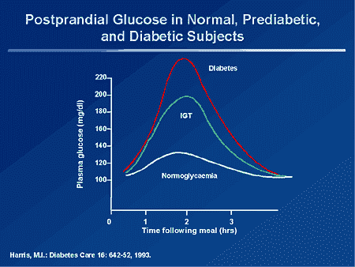

餐后高血糖(餐后高血糖)是发生二型糖尿病和前驱糖尿病的主要危险因素。而**饮食摄入是餐后血糖的核心决定因素**。[(加尔维茨，2009)](http://care.diabetesjournals.org/content/32/suppl_2/S322)

## 问题:差的葡萄糖反应预测导致差的控制

我们知道饮食摄入是餐后葡萄糖反应(PPGR)最重要的决定因素，但我们没有现有的方法可以准确预测 PPGR。

[碳水化合物计数](http://www.diabetes.org/food-and-fitness/food/what-can-i-eat/understanding-carbohydrates/carbohydrate-counting.html?utm_source=Offline&utm_medium=Print&utm_content=equal-carbcount&utm_campaign=CON?referrer=https://www.google.com.hk/)是目前的做法，但它不能提供良好的预测，因为不同的人对同一种食物的 PPGR 差异很大。例如，PPGR 的一些地区涨幅较大，而另一些地区涨幅较小。

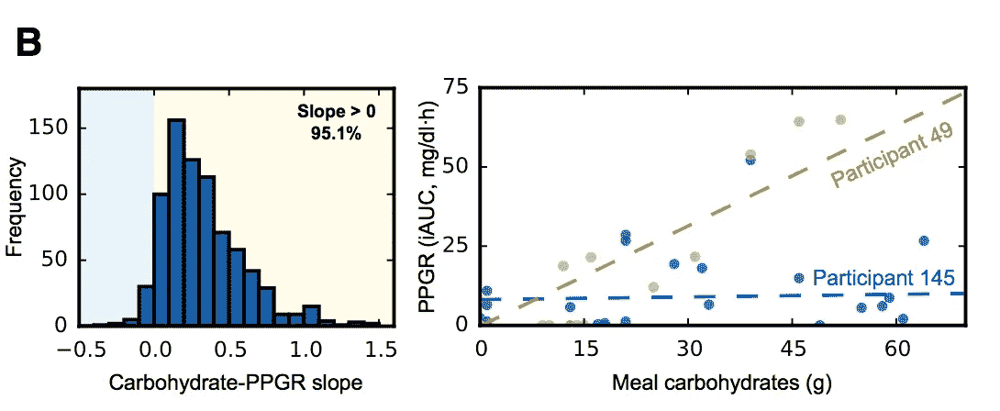

Variability of PPGR of different patients gathered from the study, doi: 10.1016/j.cell.2015.11.001

假设我的血糖目标是餐后血糖控制在 7.8mmol/L 以下([美国糖尿病协会推荐](http://care.diabetesjournals.org/content/32/suppl_2/S322))。

如果我能在决定自助餐选择什么食物之前有一个准确的预测值，那就简单多了。

## 问题的根源:没有考虑到个体差异

我们可以把计算 PPGR 看作一个数学函数。我们选择食物作为输入 x，我们的生理过程作为函数 f:，我们的 PPGR 将是输出 f(x)。

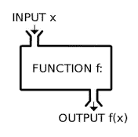

input: food. Function: physiological process. output: PPGR

我们生理功能的个体差异解释了为什么不同的患者会有不同的 PPGR，给定相同的输入 x(相同的膳食)。这是因为每个个体的功能部分是不同的。

以前的方法是基于广义总体，因此忽略了个体差异。

## 解决方案:学会用个人数据建立个人模型

目标是为 PPGR 建立一个准确的预测模型，我们可以通过找到个人的函数公式来实现。

生物过程非常复杂，许多因素都可能导致 PPGR，包括饮食习惯、体育锻炼、药物摄入、微生物群等..我们将期待该函数是一个多元线性回归模型，它将有许多不同的输入，不同的输入不同的权重。

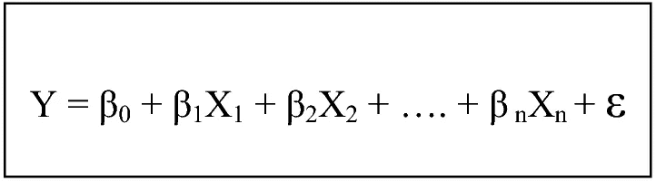

目标是:

1.  列出对 PPGR 有贡献的因素作为输入(X1，X2，…，Xn)
2.  找出不同输入(β1，β2，…，βn)的单独权重

# 用机器学习的方法解决它

我们将通过机器学习的方式来解决这个问题，我们收集了大量的数据，不同的**个人和微生物组数据作为特征**和 **PPGR 作为标签**。我们将数据交给计算机算法，我们将能够得到不同个体的 PPGR 的**预测模型**。

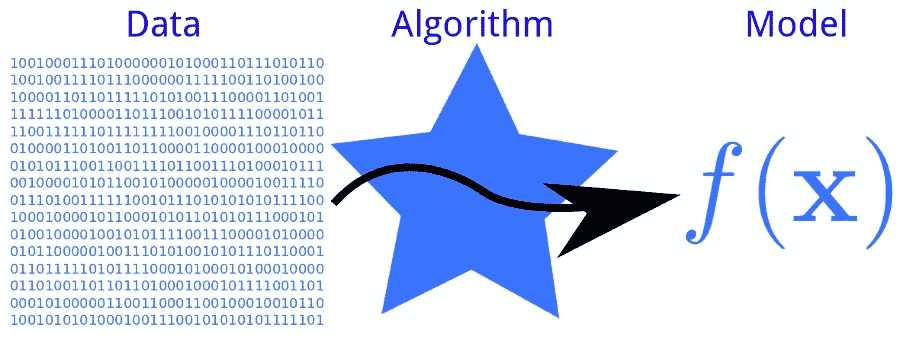

# 收集数据

## 患者人口统计:

该研究针对以色列成年非糖尿病人群。

该研究招募了 800 名年龄在 18-70 岁之间、之前未被诊断为二型糖尿病的人。

该算法来自于从上述 800 个人中收集的数据。

该算法随后被另外 100 名具有相似人口统计学特征的个体验证。

## 收集输入:

**生活方式信息**

一个移动网站[已经被开发出来，供患者记录他们的饮食、锻炼、睡眠和其他个人信息。](http://newsite.personalnutrition.org/WebSite/Home.aspx)

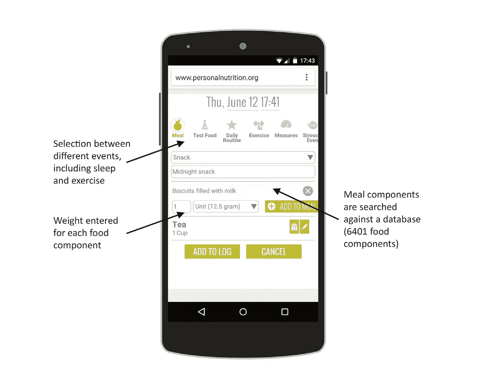

## 微生物组

患者使用[omni gene GUT](http://www.dnagenotek.com/US/products/OMR200.html)工具包收集他们的粪便样本。用 [MagAttract PowerSoil DNA 试剂盒](https://mobio.com/products/dna-isolation/soil/powermag-soil-dna-isolation-kit.html)提取 DNA(从粪便中自动分离 DNA)。用 [Illumina MiSeq](https://www.illumina.com/systems/sequencing-platforms/miseq.html) 对微生物组进行测序。

## 衡量产出:PPGR

连续血糖监测器(CGM)用于收集 800 名参与患者的血糖，连续 7 天，每 5 分钟一次。

# 算法

使用梯度推进回归来生成模型，作为 PGGR 和我们数据集中不同因素之间非线性关系的方法。

梯度推进回归使用决策树对数据进行分类。

决策树模型不断尝试用是/否问题对数据进行分类，直到我们得出最终答案。

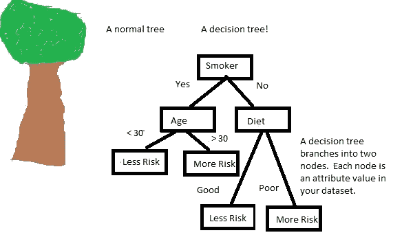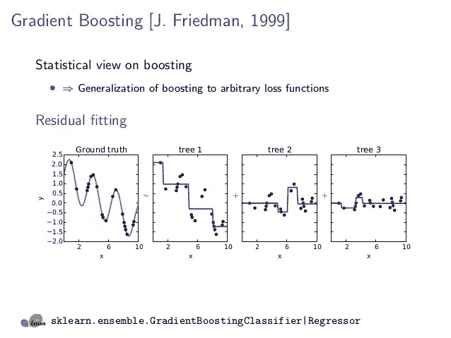

梯度推进回归基于先前树的残差来训练决策树。例如，黑点代表实际数据，蓝线代表我们模型的预测。我们可以观察到，每个树都建立在先前树的分类之上，并且与实际数据更加匹配。

使用梯度推进回归，该研究推断了数千棵决策树。**这些树的特征是从代表膳食含量(卡路里、营养含量)、血液参数(HbA1c)、日常活动和微生物组特征的 137 个特征中选出的。**

# 模型:在预测中超越黄金标准

一种定制算法的预测结果考虑了个体差异的 137 个特征，并与当前“碳水化合物计数”的黄金标准进行了比较。

我们可以通过使用[决定系数](https://en.wikipedia.org/wiki/Coefficient_of_determination)来比较模型与实际数据的拟合程度。

如果 *R* 2 =1，表示模型可以完全预测结果，如果 *R* 2=0，表示模型完全不能预测结果。

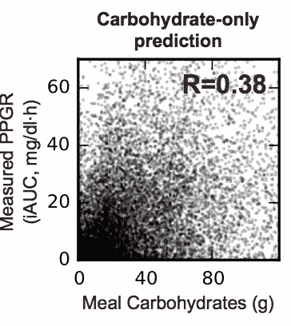

基于个体的模型比目前“碳水化合物计数”的黄金标准大大提高了预测能力。

# 给出定制饮食建议的算法

另外招募了 26 个人，旨在通过给出定制的饮食建议来研究该算法在 PPGR 改善中的有效性。

所有 26 名患者都经历了一个“分析周”,收集个人数据，供算法生成预测模型。

12 名患者被分为算法组，另外 14 名被分为营养师组。

根据个人的 PPGR 模型的预测，所有的参与者都经历了一个“好饮食”周和一个“坏饮食”周。无论在“好”或“坏”饮食周，所有建议的膳食都有相同的卡路里含量，但成分不同。

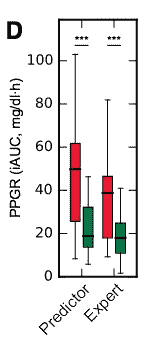

Red represents PPGR in “bad diet” week, green represents PPGR in “good diet” week. Both the expert’s and algorithm’s dietary suggestion shows significant difference in PPGR response.

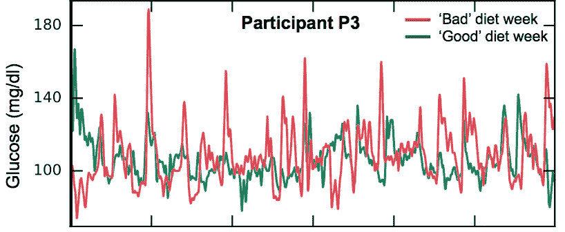

Individual data shows fewer glucose spikes and fewer fluctuations

## 注意:饮食建议是高度个性化的

对建议膳食的分析表明，不存在普遍的“好”或“坏”饮食。一些能有效控制一个病人 PPGR 的饮食对另一个病人来说可能是“坏”的饮食。

这就是为什么拥有一个适合您自己的 PPRG 的个性化模型对于管理您的血糖水平非常重要。

# 结论

这是“个性化医学”的一个例子，现代医学尚未了解个体差异，但这些差异确实很重要。

故事中的例子是关于 PPRG 的，但该原则也适用于医疗保健的其他方面，例如癌症治疗。

随着个人数据收集变得越来越可用，例如更便宜的基因组学测试成本，我们开始拥有更精确和个性化的医疗保健。