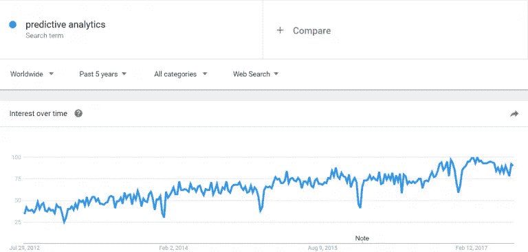
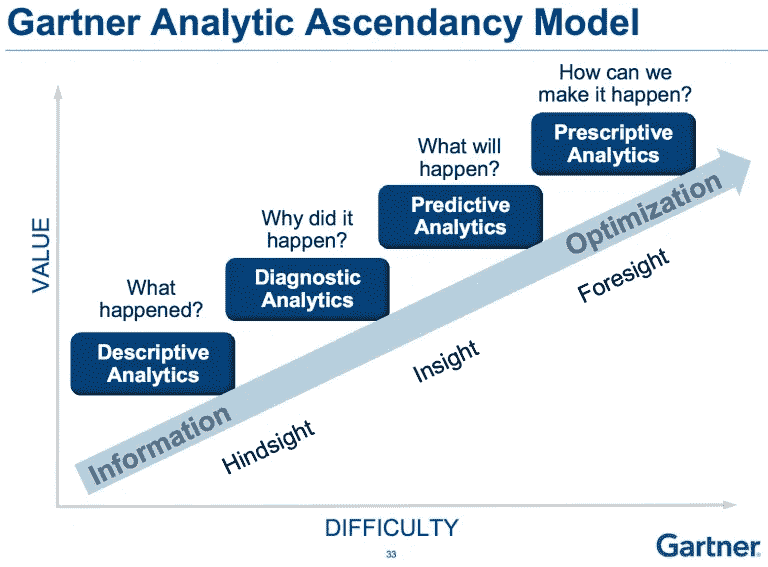

# 分析和人工智能如何让营销人员预测未来？

> 原文：<https://towardsdatascience.com/how-can-analytics-and-ai-allow-marketers-to-predict-the-future-2e7b46d6a48c?source=collection_archive---------15----------------------->

永远不要做预测，尤其是对未来。

我们并没有预测未来的良好记录，所以这似乎是明智的建议。

从 IBM 总裁 Thomas Watson 在 20 世纪 40 年代早期宣称将会有“大约 5 台计算机”的世界市场(诚然，这个星球上可能只容得下 5 台[早期的 IBM 机器](https://upload.wikimedia.org/wikipedia/commons/1/10/BRL61-IBM_702.jpg))，到 [Y2K](https://en.wikipedia.org/wiki/Year_2000_problem) 的喧嚣，人们无法抗拒浮夸的、常常是极其不准确的预测。

提前知道未来的回报太大了，以至于无法抗拒尝试一下，但我们相当依赖人类的直觉来形成我们的预测。因此，这些奖励经常无人认领。

然而，这是一个快速发展的行业，人工智能(AI)的进步可能很快会让我们将未来的预测建立在可靠的统计模型上，而不是我们熟悉但有缺陷的直觉上。

在这个由三部分组成的系列中，我们将探索人工智能在开发准确、可访问的预测分析以提高业务绩效方面的潜在作用。

本文将首先分析预测分析行业的现状，以及一些帮助企业充分利用现有技术和数据的技巧。

# 我们所说的“预测分析”是什么意思？

预测分析是一种数据挖掘形式，它采用机器学习和统计建模，根据历史数据预测未来的事态。

我们周围已经有了预测分析的例子。如果您的银行通知您，您的信用卡有潜在的可疑活动，很有可能已经使用统计模型根据您过去的交易来预测您未来的行为。严重偏离这种模式被标记为可疑。

作为理解该领域兴趣水平的一个简单代表，我们可以从 Google Trends 中看到，主题“预测分析”的搜索量在过去 5 年中显著上升:

我们可以看看这条线，预测它会继续增长。但这实际上只是基于最近的历史趋势，或者我们在业内听到了很多关于这个话题的议论。我们需要进行更多的调查，才能真正确定这条线的下一步走向。

这么多企业对这个话题感兴趣也是有道理的。据[预测](http://www.snstelecom.com/bigdata)到 2020 年，每年将有超过 760 亿美元花费在[大数据](https://www.clickz.com/tag/big-data/)技术上。获得投资回报的最佳方式是利用所有这些数据来预测未来的需求趋势。

正如我们所看到的，这对于人们来说是一项很难掌握的任务。如果我们要开始做出正确的预测，我们需要一点帮助。

因此，在 Gartner 的“分析优势模型”中，预测分析被视为描述性分析和诊断性分析的进化飞跃。

也就是说，对精确预测分析的渴望并不新鲜，使用分析来模拟未来消费者行为的尝试也不新鲜。例如，许多分析专业人员每天都在从事这一领域的工作，以计算典型客户的终身价值(LTV)等数字。大量不同的数据集的可用性有助于大大提高这些计算的准确性。

相对较新的是人工智能的应用，以填补我们技能组合中的差距，并扩展预测分析的可能性。

这种结合产生了更复杂的统计模型，这些模型可以发现过去消费者行为的模式，并利用这些模式来规划未来可能的行动。

但是为什么人工智能在实现我们自己发现几乎不可能的事情上如此有效呢？

# 习惯的生物:预测分析在现实世界中是如何应用的？

人们的可预测性极大地帮助了预测分析。

尽管我们愿意相信自己是独一无二的、有自由意志的，但人工智能可以根据我们过去的行为和类似人的行为，相当准确地预测我们将继续做什么。

麻省理工学院媒体实验室的科学家在 2007 年进行的一项[研究](https://www.newscientist.com/article/mg19526111-700-why-we-are-all-creatures-of-habit/)发现“大多数人每天所做的事情中有 90%都遵循着如此完整的常规，以至于他们的行为可以用几个数学公式来预测。”

许多营销活动都基于这一假设，但我们现在可以更准确、更负责地应用这一原则。

人工智能在这一领域发挥作用的地方在于它能够识别人类根本看不到的更广泛的模式。我们根据我们认为安全的假设选择调查领域，但 AI 可以识别其他变量，当这些变量被改变时，会相互影响。

这种方法(在很大程度上是通过使用[回归分析](https://en.wikipedia.org/wiki/Regression_analysis)形成的)恰当地反映了消费者所处的不断变化的世界。

例如，根据我的位置、年龄、过去的购买和性别，如果我刚刚在篮子里放了面包，我有多大可能会买牛奶？网上超市可以利用这类信息，根据我预测的购买倾向，自动向我推荐产品。

此外，金融服务提供商可以利用我和类似人的在线互动产生的数千个数据点来决定何时向我提供哪张信用卡。一家时装零售商可以根据我刚买的牛仔裤，使用我的数字档案来决定我下一次购买哪双鞋。

这有助于企业提高转化率，但其影响远不止于此。预测分析允许公司根据消费者预期和竞争对手基准制定定价策略。它允许零售商预测需求，从而确保每种产品都有合适的库存水平。

预测分析甚至可以通过发现客户偏好的变化，为新的产品线提供建议。这标志着分析从数据专家的追溯工具转变为塑造业务战略、改善客户关系和创造运营效率的重要预测功能。

事实上，最近的一份 Forrester [报告](http://resources.everstring.com/industry-trends-and-reports/how-predictive-marketing-boosts-b2b-business-performance)指出，“预测型营销人员报告收入增长率高于行业平均水平的可能性是 2.9 倍。”

这场革命的证据已经在我们周围了。例如，每次我们在谷歌、脸书或亚马逊输入搜索查询，我们都在向机器输入数据。机器因数据而繁荣，随着接收这些反馈信号，变得越来越智能。

这种现象给营销人员带来了很多好处。谷歌使用这项技术已经有一段时间了，通过其在分析领域的 Smart Goals 产品，以及去年底推出的[会话质量评分](https://searchenginewatch.com/2016/10/05/google-optimize-and-session-quality-score-a-brief-guide/)功能。这些是由机器学习技术推动的预测分析的例子。

有一种观点认为预测是智能的基石，所以这对人工智能来说是一个壮举。

然而，这仅仅是开始。目前预测分析的大部分工作都集中在提出建议或推荐上，但基于人工智能的预测有机会成为营销战略的支点。

在这方面，最近的发展提供了很多乐观(或者有些人可能会说是恐惧)的理由。谷歌的 DeepMind 团队刚刚[创造了一个人工智能](https://deepmind.com/blog/agents-imagine-and-plan/)，它能够规划未来，并在行动前考虑不同的结果。

这在预测分析的范围内是相关的，因为想象力是创建预测的一个基本方面。这种能力只会巩固人工智能作为成功预测分析活动的重要组成部分的作用。

# 企业如何整合预测分析？

为了利用人工智能和预测分析的潜力，组织需要落实四个要素。

# 1.正确的问题

最好的预测分析项目始于一个要测试的合理假设。尽管我们应该为机器学习算法提供空间，让它们能够在数据点之间建立自己的客观关联，但我们需要着手解决一个我们希望克服的商业挑战。这有助于提供一些努力的形状。

# 2.正确的数据

过去十年数据科学的进步意味着我们可以更准确地从大量非结构化数据中获得洞察力，但我们仍然需要完整的数据集来得出令人信服的结论。

因此，在定义了您希望用预测分析来回答的问题之后，下一步就是弄清楚哪些数据可供您使用，以及这些数据是否足以令人信服地回答您的问题。

# 3.正确的技术

正如预计到 2020 年价值 760 亿美元所暗示的那样，大数据技术是一个蓬勃发展的行业。数据产生的速度如此之快，以至于我们需要不断改进的技术能力来捕捉、存储和理解数据。

许多领先的分析软件包已经推出了预测分析工具，但它们的方法各不相同。要决定哪种解决方案最适合您的企业，现在比以往任何时候都更需要一个团队，他们对每种解决方案都有经验，能够确定最合适的方案。

# 4.合适的人

本质上，这将我们带回到第一步。没有合适的人，很难提出合适的问题。也很难知道可能需要什么数据来回答这些问题，或者从最新技术中获得最佳效果。对于所有关于人工智能取代人的讨论，它只是真正加强了对让正确的人充分利用它创造的新机会的关注。

这项技术的应用已经很广泛了，但我们还只是刚刚触及皮毛。在本系列的下一篇文章中，我们将了解目前使用预测分析来提高业务绩效的五家企业。

*最初发表于*[*【www.clickz.com】*](https://www.clickz.com/how-can-ai-allow-marketers-to-predict-the-future/112268/)*。*