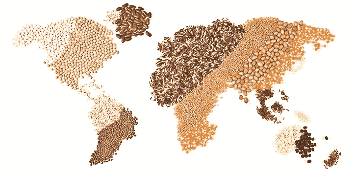

# 数据如何刺激创新？

> 原文：<https://towardsdatascience.com/how-can-data-spur-innovation-6f6cbdab1bfa?source=collection_archive---------2----------------------->

Photo credit : The Vegan Society

如果管理是为了降低风险、不确定性和模糊性；数据科学就是将数据转化为集体行动。今年的[皇后国际创新挑战赛](https://youtu.be/GhxUswUSfaQ)为研究生提供了一个利用他们的分析技能和创造力解决食品安全问题的机会——这是一个普遍的、永恒的挑战，不会消失。竞赛面向在本学年注册学位或证书研究生课程的所有学生。数据科学和创新之间的关系是什么，为什么参与这样的挑战，为什么是食品安全，以及你的努力会有什么回报？

大学挑战和创新之间有什么联系？斯蒂夫·约翰森对创新历史的十年研究使他得出结论，某些“空间”的固有特征，如 18 世纪的英国咖啡馆、19 世纪的 T4 赌场和今天的万维网，有利于创新思想、产品和实践的诞生。这种空间的一个特点是，它们将注意力集中在特定的问题上，而不是久经考验的“解决方案”。第二个特征是，这种空间允许参与者以新的眼光看待数据，促进了现在和可预见的未来的无限结合。最后，这些空间鼓励小预感的对抗，这种对抗随着时间的推移发展成在新的环境中应用想法。与他研究的例子类似，创新挑战提供了一个将数据转化为创新的绝佳机会。

在这个比赛中你能学到什么关于数据科学的知识？数据科学是衡量要解决的问题，鉴定手头的数据，应用适当的方法，并将数据转化为行动。加拿大丰业银行客户分析中心副主任 Dean McKeown 指出，创新挑战为每个参与者提供了一个独特的平台，与来自世界各地的高度多元化的学生、从业者和专家团队合作。您将与 Queen ' s Master of Management Analytics 的员工一起研究来自各种公共和私人数据源的真实数据。您将被要求开发一个数据科学模型，以理解数据，提供可操作的见解，并以激励行动的方式传达您的结果。数据科学永远不会在教室里掌握，而是通过在处理现实世界挑战时练习分析方法来掌握。

为什么关注粮食安全？根据联合国世界粮食安全委员会的定义，粮食安全是指所有人在物质、社会和经济上都能获得积极健康生活所需的营养的状况。麦克欧文教授提醒我们，在可预见的未来，对自然资源的管理充满了风险、不确定性和模糊性。全球变暖、大规模移民、商品价格波动和政治动荡严重影响着粮食安全。公共政策以及企业预测需要适应当地和全球条件，包括处理土地使用模式、用水、商品贸易和食品加工的战略。

你努力的回报是什么？女王国际创新挑战赛为您提供了使用最先进的分析平台(如 SAS Institute 的 VIYA)解决重要问题的可能性。这是一个与来自其他学校和文化的学生联系的理想场合，面对你的经历和见解，并提出可以对社会产生真正影响的做法。该活动提供了一个向经验丰富的从业者学习和向潜在雇主展示你的技能的绝佳机会。前五名团队将被邀请到多伦多展示他们的作品，获奖者将获得 2 000 至 20 000 加元的奖金。带上你的思考帽，今天就报名吧——因为正如斯蒂夫·约翰森会补充的那样——“未来属于互联的头脑”。

Lee Schlenker 是 Pau 商学院的教授，也是 http://baieurope.com T2 商业分析研究所的负责人。他的 LinkedIn 个人资料可以在 www.linkedin.com/in/leeschlenker.[查看](http://www.linkedin.com/in/leeschlenker.)你可以在 https://twitter.com/DSign4Analytics[通过 Twitter 关注我们](https://twitter.com/DSign4Analytics)

更多关于女王 2017 年国际创新挑战赛的信息可以在[https://www.facebook.com/queenschallenge](https://www.facebook.com/queenschallenge)找到。

研究生可以在[https://Smith . queensu . ca/centres/scotiabank/competition/index . PHP](https://smith.queensu.ca/centres/scotiabank/competition/index.php)报名参赛

_________

约翰逊，S. (2010)，好主意从何而来:创新的自然史，河源图书公司

[【ii】](#_ednref2)[世界粮食安全委员会](http://www.fao.org/cfs/en/)，网站