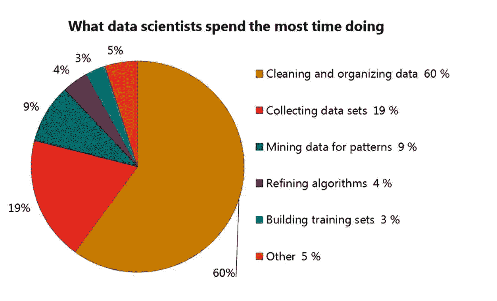

# 怎样才能写出更好的 AI 文章？

> 原文：<https://towardsdatascience.com/how-can-i-write-better-articles-on-ai-6b37e1baad5a?source=collection_archive---------3----------------------->

我很清楚，我在媒体上的写作让我获得了有趣的联系，这些联系可以转化为我业务发展渠道中的线索。对我在 medium.com 上发表的 35 篇文章的分析告诉我，你们——我的读者——喜欢阅读更多关于人工智能的业务，以及我作为顾问的经历。你似乎不太关心技术建议或学习资源。

数据告诉我，像“[如何雇用一名人工智能顾问](https://medium.com/towards-data-science/how-to-price-an-ai-project-f7270cb630a4)”和“[如何为一个人工智能项目](https://medium.com/towards-data-science/how-to-price-an-ai-project-f7270cb630a4)定价”这样的文章，比关于[如何提取电子邮件有效性的演示](https://medium.com/@lemaysolutions/scandal-what-happens-to-a-leaked-email-address-ee90fe765af9)或关于机器视觉的演示[有趣 10 倍。](https://medium.com/@lemaysolutions/machine-learning-in-medicine-demo-time-ffd17ed8a72a)

## 支点:少一些科学，多一些远见

好吧，与其和数据斗争，我要听听你们的点击和掌声，把我的文章集中在我收集的经验上。这将需要一些额外的认知努力，但我会在不违反任何保密协议的情况下做到这一点，基本上是通过用说明性的例子来讲述故事，而不是使用声明性的“我为 y 公司做了 X，”事实上，我在这篇文章中承诺不会成为一个名字滴漏者。我将从我俯瞰人工智能工程和商业化漩涡的树枝上，给你我对正在发生的事情的诚实看法。所以不要再说“这是做 x 的代码。”而且，从严格的自私的角度来看，为这些文章编写代码并不简单。所以当我写观点和经历的时候，我花费的时间更少，吸引的眼球也更多。

在开始这一系列文章时，我问自己，如何在不违反 NDAs 的情况下，表达我公司做的**事情**。这些是回归、分类、标准化、云、物联网、教育等等。相反，我转而谈论**经验**和**观点**。正如我的商业伙伴马特指出的，我的努力需要赚钱、省钱或者节省工作和时间。这个支点将节省工作和时间(我的工作和时间)，它将赚钱(通过介绍你，我的观众，给我)。所以，亲爱的读者，如果我误解了你对人工智能世界中商业故事的渴望，而你真正想要的是技术细节…告诉我。发表评论。

## 经验和观点:付费数据清理

现在，关于我要写的许多经历中的第一个……一个客户最近要求我在他们签订合同之前帮助他们组织他们的数据。这种态度忽略了一点，即数据科学的核心是数据，而不是算法。下面这张漂亮的图片让你感受到清理数据是一项多么艰巨的工作。这通常比项目的其余部分要大得多。

From [Mohamadreza Mohtat](https://www.linkedin.com/in/mohamadreza-mohtat-8a3612aa/) in [this post](https://www.linkedin.com/feed/update/urn:li:activity:6299879490373980160/).

现在，一旦组织好数据，就需要一些时间来为数据找到合适的解决方案，并将解决方案与体系结构挂钩。通常我们的客户端会从某种数据库(例如 postgres)进入 tensors，然后从 tensors 返回某种可调用的 JSON 服务，发出响应。

总结一下，当我做人工智能咨询时，我不会让数据清理逃避工作声明。这是工作。对客户来说，项目的其余部分可能看起来很难，但对顾问来说这并不是最难的部分。困难的部分是整理你的数据。剩下的就是魔法了。

如果你喜欢这篇文章，那么请试试屏幕右下角的**新鼓掌工具**。就像我之前说的，我也很高兴在评论中听到你的反馈。

编码快乐！

——丹尼尔
丹尼尔@ lsci . ioLemaySolutions.com