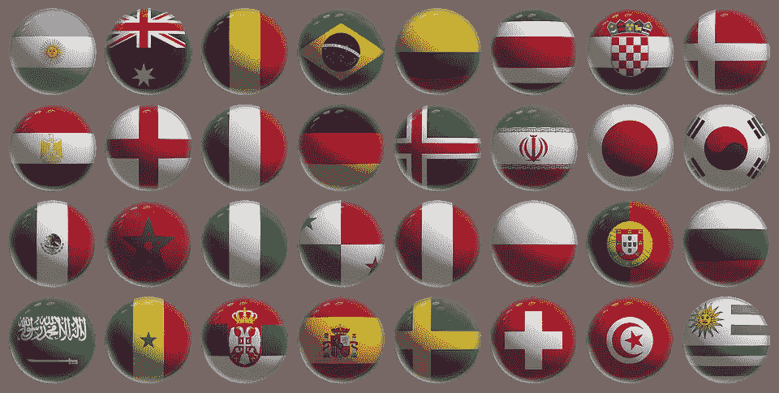

# 如何用球员名字预测世界杯，准确率 80%？

> 原文：<https://towardsdatascience.com/how-can-use-player-name-to-predict-world-cup-with-80-accuracy-262d076544c4?source=collection_archive---------13----------------------->



在这个内核中，我将演示如何通过 Tensorflow 使用球员姓名来预测历史世界杯结果，准确率达到 80%。后来，我试图预测 2018 年世界杯的结果，似乎有一些有趣的发现

# 阶段

1.  数据摄取:首先，我从给定的数据集中获得 3 个数据框架，并从网站上手工构建 2018 年世界杯数据
2.  预处理:对建筑物特征嵌入输入所需的特征进行预处理
3.  转换:为模型输入转换处理过的数据
4.  模型构建:构建字符嵌入模型
5.  评估:尝试预测 2018 年世界杯结果

# 特征工程

为什么球员名字和教练名字选择为特色？这是因为我们发现这些名字可能为我们做预测提供关键信号(来自测试集结果)。

# 标记

为了建立一个训练数据，让冠军的标号为 1，亚军的标号为 2，季军的标号为 3，依次为 4。团队的其他成员为 0。从数据来看，我们有大约 20 个世界杯记录。

数据分布:标签 1、2、3 和 4 分别有 20 条记录，大约有 300 条负数据。

# 模型结构

我们使用字符嵌入来建模预测模型。如果你不熟悉，你可以看看这篇文章。通过使用定义的函数，我们可以简单地用几行代码构建模型

```
char_cnn = CharCNN(max_len_of_sentence=256, max_num_of_setnence=1)
char_cnn.preporcess(labels=training_df['label'].unique())
```

然后处理原始数据

```
x_train, y_train = char_cnn.process(
    df=train_df, x_col='name', y_col='label')
x_test, y_test = char_cnn.process(
    df=test_df, x_col='name', y_col='label')
```

试着预测结果

```
char_cnn.build_model()
char_cnn.train(x_train, y_train, x_test, y_test, batch_size=32, epochs=10)
```

输出

```
Train on 341 samples, validate on 86 samples
Epoch 1/10
341/341 [==============================] - 13s 40ms/step - loss: 0.9741 - acc: 0.7801 - val_loss: 1.0188 - val_acc: 0.7674
Epoch 2/10
341/341 [==============================] - 10s 30ms/step - loss: 0.7981 - acc: 0.8240 - val_loss: 1.0271 - val_acc: 0.7674
Epoch 3/10
341/341 [==============================] - 11s 31ms/step - loss: 0.7864 - acc: 0.8240 - val_loss: 1.0512 - val_acc: 0.7674
Epoch 4/10
341/341 [==============================] - 10s 30ms/step - loss: 0.7660 - acc: 0.8240 - val_loss: 0.9753 - val_acc: 0.7674
Epoch 5/10
341/341 [==============================] - 10s 30ms/step - loss: 0.7506 - acc: 0.8240 - val_loss: 1.0135 - val_acc: 0.7674
Epoch 6/10
341/341 [==============================] - 10s 30ms/step - loss: 0.7426 - acc: 0.8240 - val_loss: 1.0135 - val_acc: 0.7674
Epoch 7/10
341/341 [==============================] - 10s 30ms/step - loss: 0.7824 - acc: 0.8240 - val_loss: 1.0176 - val_acc: 0.7674
Epoch 8/10
341/341 [==============================] - 10s 30ms/step - loss: 0.7763 - acc: 0.8240 - val_loss: 1.0137 - val_acc: 0.7674
Epoch 9/10
341/341 [==============================] - 10s 30ms/step - loss: 0.7805 - acc: 0.8240 - val_loss: 0.9793 - val_acc: 0.7674
Epoch 10/10
341/341 [==============================] - 10s 31ms/step - loss: 0.7624 - acc: 0.8240 - val_loss: 1.0138 - val_acc: 0.7674
```

# 估价

来到这篇文章的结尾，准确率好像很不错，大概是 80%左右。让我们看看 2018 年世界杯的预测结果。

在我们的编码中，4 表示团队失败。说到这一点，你可能会认为这有什么不对吗？请看看结论部分。

输出

```
array([4, 4, 4, 4, 4, 4, 4, 4, 4, 4, 4, 4, 4, 4, 4, 4, 4, 4, 4, 4, 4, 4, 4,
       4, 4, 4, 4, 4, 4, 4, 4, 4, 4, 4, 4, 4, 4, 4, 4, 4, 4, 4, 4, 4, 4, 4,
       4, 4, 4, 4, 4, 4, 4, 4, 4, 4, 4, 4, 4, 4, 4, 4, 4, 4, 4, 4, 4, 4, 4,
       4, 4, 4, 4, 4, 4, 4, 4, 4, 4, 4, 4, 4, 4, 4, 4, 4])
```

# 结论

完整源代码请去 [kaggle](https://www.kaggle.com/makcedward/world-cup-prediction-with-80-accuracy-in-dl-model) 看看。

谢谢你看了这个毫无意义的模型。实际上，我想展示的是特性的重要性，而不是模型架构。

*   当人们谈论“我们正在使用机器学习”、“应用深度神经网络”时，你可能更好地询问特征和数据，而不是询问模型架构。当然，模型架构很重要，但是特性和数据也很重要。请记住**垃圾进，垃圾出**。
*   当人们谈论拥有 80%甚至 90%的准确率时。你最好检查一下是**实验的结果还是实际**的结果。许多模型在实验阶段过度拟合，尽管数据科学家认为他们已经很好地防止了这种情况。
*   对于测量，更好地理解**其他指标**，而不仅仅是准确度。比如我们在分类上也有精准和召回。我们有机器翻译的 BELU。
*   作为一名数据科学家，与其谈论使用 CNN，LSTM bla bla bla，**花更多的时间去理解你的特性和数据**
*   如果您**没有足够大的数据**(在本例中，少于 500 条记录)。不要相信你可以从零开始建立一个惊人的模型。

# 关于我

我是湾区的数据科学家。专注于数据科学、人工智能，尤其是 NLP 和平台相关领域的最新发展。

中:[http://medium.com/@makcedward/](http://medium.com/@makcedward/)

领英:[https://www.linkedin.com/in/edwardma1026](https://www.linkedin.com/in/edwardma1026)

github:[https://github.com/makcedward](https://github.com/makcedward)

https://www.kaggle.com/makcedward