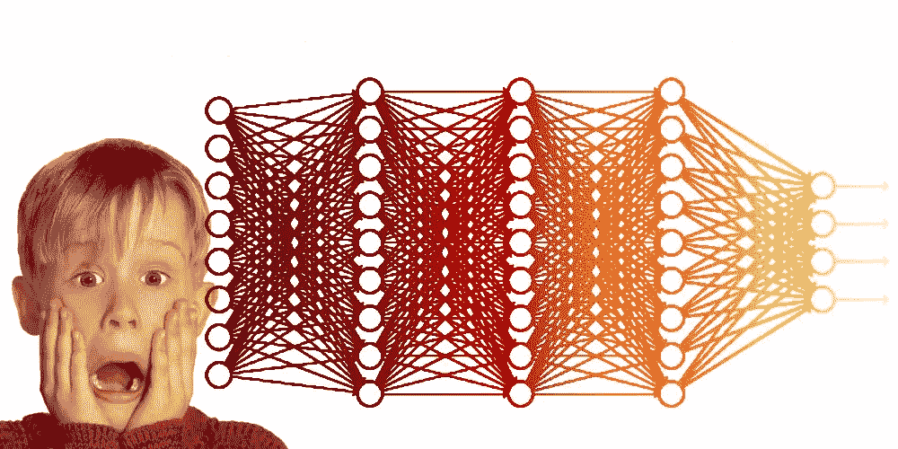
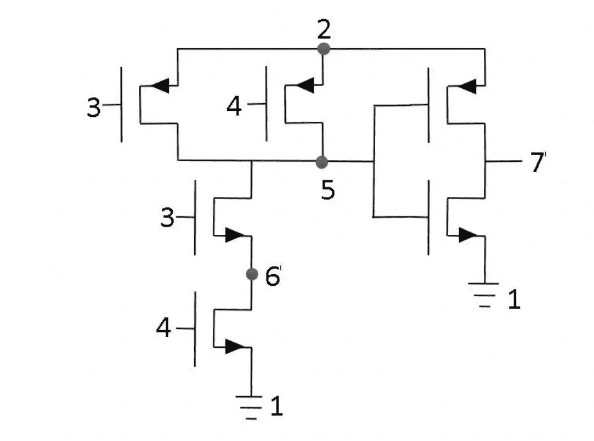
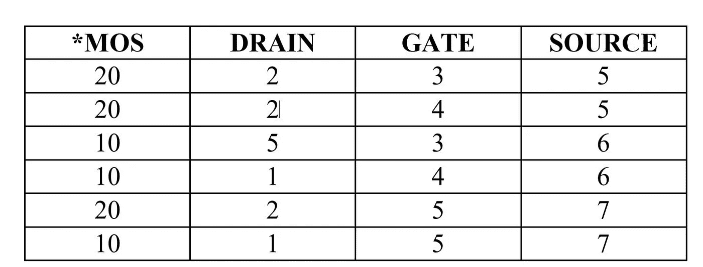

# VLSI 设计的模式检测有多复杂？

> 原文：<https://towardsdatascience.com/how-complex-pattern-detection-can-be-for-vlsi-designs-1ca729260899?source=collection_archive---------13----------------------->

VLSI pattern detection can be exciting and scary at the same time !

早期，电子设计自动化行业吸引我的主要原因之一是过多的 NP 完全问题及其天文复杂性。在机器学习的时代，这仍然是正确的，全世界都震惊于训练一个神经 50 层 CNN 所需的天数。就性能而言，EDA 问题的复杂性让图像识别等现实生活中的解决方案相形见绌。请允许我用神经网络展示一个简单 VLSI 单元模式检测的简单问题的艰巨性。

为了便于讨论，我们假设在电路级使用一个简单的 VLSI 单元，如下图所示。

transistor schematic of simple AND gate

上图显示了一个简单与门的晶体管原理图。这个电路的连接性被转化为适合输入深度学习网络的数字矩阵的形式。该矩阵的第一列显示了分别表示为任意整数 20 和 10 的 PMOS 和 NMOS 晶体管。矩阵中其余 3 列是 MOS 器件的漏极、栅极和源极节点，编号如下图所示。

每个器件有三个电节点。受 M. Ohlrich 的工作[1]的启发，我们分别为特殊节点地和电源保留节点号 1 和 2。其余的节点可以在不改变电网络的情况下任意标记。

让我们假设 *n* 是节点的数量， *d* 是电气网络中设备的数量。电网络可以标记的排列数由下面的等式给出:

> (n-2)！

其中感叹号代表一个数的阶乘。上面的表达式减去了 2，因为 2 个特殊的节点地/电源是不可置换的。现在，节点已被标记，它们与符合 SPICE 格式[2]的表 1 所示的器件放在一起。排列设备可以在矩阵中排序，矩阵由下式给出:

> *维！*

给定任何器件(矩阵行)的漏极和源极端子可以在不改变电气网络的情况下互换，该操作的组合总数给定为:

> *σd！/我！。(d-i)！*

从 1 到 n-2。一个电网络的排列总数可以表示为矩阵，它是上述三个表达式的简单乘积。这在下面给出。

> *d！。(n-2)！。(σd！/我！。(d-i)！)*

让我们为上面的例子计算矩阵排列的数量。在 n=7 和 d=6 的情况下，矩阵排列的总数刚好低于**140 亿。**

# **走向无限…** ∞

对于具有(d=) 351 个设备和(n=) 44 个节点的数据集中的较大尺寸的单元之一，矩阵置换超过 1e900。

> 这个数字是 1 后面跟着 900 个零。

如果这还不足以惊叹设计自动化中模式检测数据集的巨大规模，我会让你计算出在最快的 GPU 上训练一个具有 50 层的深度神经网络需要多少年，就像 nVidia 的 Titan X Pascal 每秒仅 11 万亿次浮点运算(1e13)。

**提示:远远超过宇宙的年龄(即 4.35e17 秒)**

# **超越👊**

该计算时间是针对具有 351 个晶体管的非常小的单元的。我将给你们留下一个真实的例子，nvidia 的 Volta 芯片有超过 210 亿个晶体管。这么说吧，为这种模式训练一个神经网络所需的时间超出了…嗯，超出了我的想象。

Totem spinning forever (credit: [Movie Inception](https://en.wikipedia.org/wiki/Inception))

# 参考

1.  米（meter 的缩写））Ohlrich，C. Ebeling，E. Ginting 和 L. Sather，“使用快速子图同构算法识别子电路”，Proc .1993 年设计自动化会议，第 31-37 页，1993 年 6 月。
2.  长度以集成电路为重点的模拟程序。第十六届中西部电路理论研讨会，加拿大滑铁卢，1973 年 4 月 12 日。
3.  [设计自动化中的机器智能](http://amzn.to/2paZ53b)