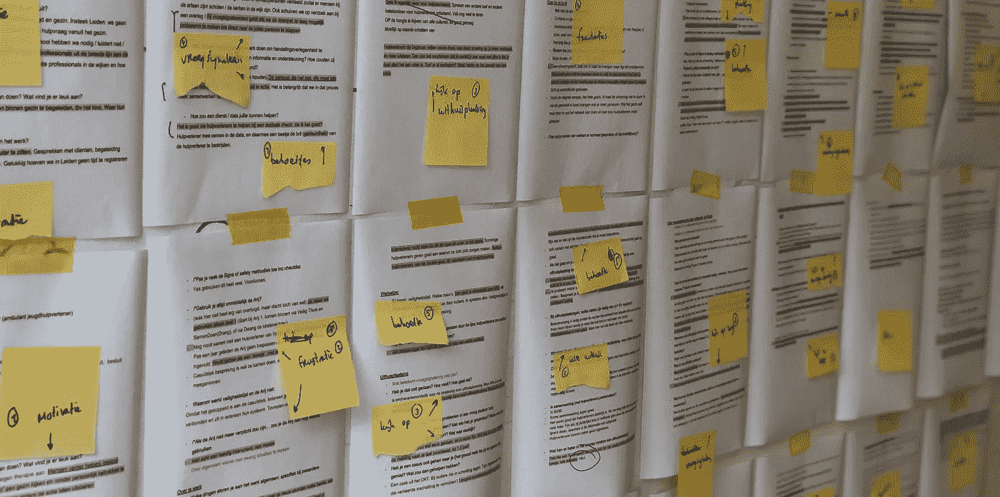
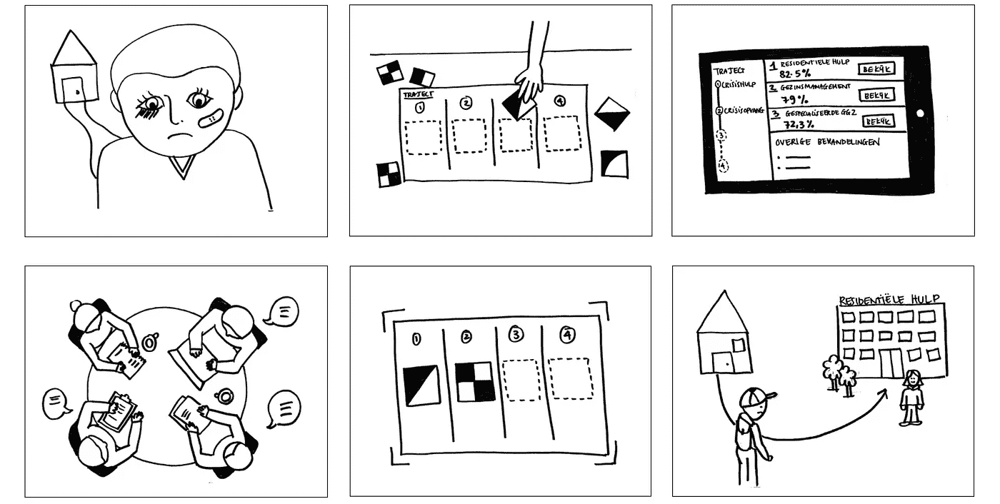
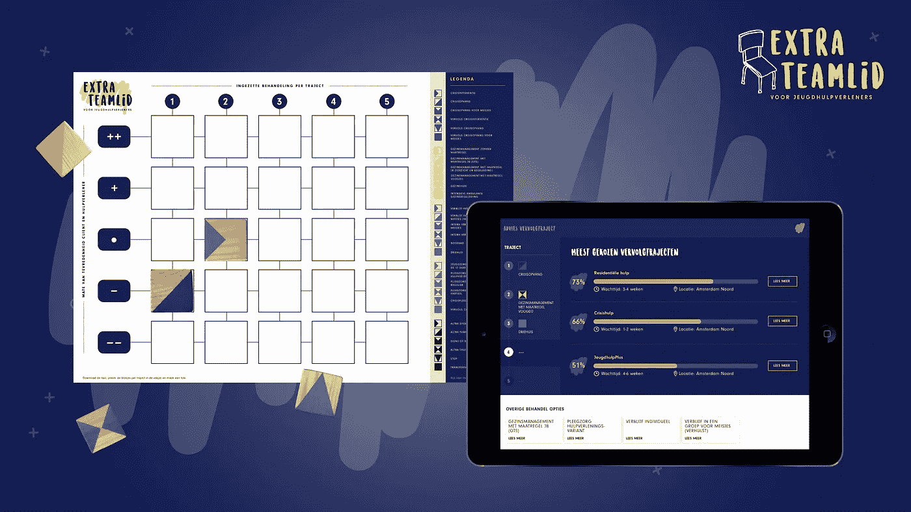

# 数据和设计如何帮助防止托管安置。

> 原文：<https://towardsdatascience.com/how-data-and-design-can-help-prevent-custodial-placements-b4662e07f273?source=collection_archive---------14----------------------->

Prototype of the Extra Team member application and game board at Dutch Design Week 2018

## 把孩子从家里带走是一件令人痛苦的事情。青年福利部门的社会工作者尽一切可能防止这种情况发生。然而，在 2017 年，每 10，000 名儿童中，就有 121 名儿童被带离家庭。2017 年，阿姆斯特丹市政府(青年部)和 Garage2017 使用数据分析来深入了解影响监管安置的因素。

在*荷兰市政协会(VNG)和[荷兰设计基金会](http://www.dutchdesignfoundation.com/)的“如果实验室:智能社会遇见设计*”中，数字设计机构 [Greenberry](http://www.greenberry.nl) 与[garages 2020](http://www.garage2020.nl)一起着手在青年社会工作者中寻找这些数据的应用。我们希望通过假设实验室回答的关键问题是:我们如何成功地利用青少年福利部门的数据，以最大限度地降低监管安置的可能性？原型可以在荷兰埃因霍温举行的 2018 年[荷兰设计周](https://www.ddw.nl/en/home)上看到

阿姆斯特丹市政府进行的数据分析确定了某些可识别的模式。它还表明，在向社会工作者提供的信息方面还有改进的余地。然而，仅仅听到“数据”这个词就会让许多社会工作者吃惊。说到底，数据不就是冷冰冰的、硬邦邦的、匿名的信息，与社工的同理心和直觉工作关系不大吗？

Mapping insights from the interviews

## **不是放在地球上坐在电脑前**

我们设计流程的第一步是对一线专业人员进行一系列全面的采访。我们总共采访了八名社会工作者。在采访中，我们决定不要过多谈论数据。相反，我们把讨论集中在参与者的工作，他们的挫折，他们的动机。这些都是很棒的谈话，在谈话中，我们获得了对社会工作者工作的更多尊重。但我们也越来越深入地了解到青年福利部门面临的挑战:从极高的工作量到专业人士不愿采取行动。

> *“帮助社工复查一下很好:我是不是把事情看清楚了？”—社会工作者玛丽莎*

采访向我们表明，青年福利是一个直观的职业。在经验和感觉的基础上，与家庭、儿童和其他专业人员协商(在个案讨论期间)，就下一种干预形式作出决定。数据目前在这方面不起作用。我们了解到，社会工作者来到这个世界上不是为了坐在电脑前，他们主要是想把时间花在他们的客户身上。我们还发现，社会工作者需要确认他们的决定。我看清形势了吗？对我的当事人来说这是正确的干预途径吗？

Co-design session with experts & designers

## **我们如何……**

在与来自 Garage2020、阿姆斯特丹市政当局和 Greenberry 的设计师、护理专业人员和团队负责人的设计会议上，我们开始在合作设计过程中开发原型。我们把采访作为我们的出发点:我们如何创造一个工具，方便专业人士在不同的干预途径之间作出决定？我们如何让社会工作者洞察可比的情况？我们如何向他们展示干预过程中所有可能的选项(包括不太为人所知的选项)？我们如何帮助他们更快更有效地分析一个案例？

> *“我来到这个世界上不是为了坐在电脑前。”—朱迪思，社会工作者*

经过几次合作设计会议，我们开发了两个概念。我们使用故事板研究每个概念的细节，并再次与社会工作者交谈。我们在格林伯里实验室展示了故事板，并让社会工作者在实践中测试这些概念。他们被要求深入探索原型，对其进行改进和补充。在原型测试结束时，我们达成了一个可行的概念:为青年社会工作者增加一名“额外的团队成员”。

## **玩玩具**

在与社会工作者的访谈中，我们发现社会工作者从来不会在没有与其他专业人士和同事进行深入讨论的情况下就某个客户做出决定。为了进一步支持这一过程，我们提出了“额外团队成员”的概念。想象一下，有一个团队成员拥有阿姆斯特丹(以及后来整个荷兰)所有青少年福利案例的信息。最重要的是，在与团队或客户讨论时，你可以咨询谁。

然而，我们不想生产一种社会工作者被迫坐在电脑前使用的数据工具。我们的偏好是创造一个实体产品，通过它可以很容易地检索数据，而不需要在屏幕上点击太多。所以，我们玩玩具。当我们这样做时，我们寻找合适的格式。

Early storyboard of the concept

## **额外的团队成员**

额外的团队成员包括一个游戏板、木块和一个软件应用程序。每个干预路径都由一个特定的木块代表，这些木块由社会工作者按时间顺序放置在游戏板上。这创建了到目前为止部署的所有干预路径的可视化时间线。

> “如果这个概念行得通，结果可能会改变游戏规则。”社会工作者萨宾

额外团队成员应用程序“了解”所有可能的情况，并通过数据分析支持社会工作者为其客户选择下一个干预途径。通过在应用程序中拍摄游戏板的照片(木块通过图像识别被识别为代码)，社会工作者可以立即看到下一个合乎逻辑的干预可能是什么。此外，extra team member 应用程序提供了与不同干预途径相关的故事和背景信息。还显示了不同选项的等待时间、可用性和位置。更重要的是，通过数字化游戏板，我们积累了关于不同干预途径的新的匿名数据。

The Extra Team member prototype

## **在实践中**

在 2018 年荷兰设计周期间，Greenberry、Garage2020 和阿姆斯特丹市政府将展示原型:一名额外的团队成员。与社会工作者一起为他们设计。原型可以在 4 号展厅 Klokgebouw 的 VNG 现实主义展台上看到。下一步是将原型转化为我们可以在实践中测试的功能应用程序。想法？感兴趣吗？小贴士？我们希望通过[extra teamlid @ garages 2020 . nl](mailto:extrateamlid@garage2020.nl)收到您的来信

产品演示:[https://vimeo.com/295986844](https://vimeo.com/295986844)

*本文由*[*green berry*](http://www.greenberry.nl)*的创意总监 Alain Dujardin 撰写。
译本:丽贝卡·海鲁尔，* [*D2E 译本*](http://www.d2etranslations.nl/) *。*