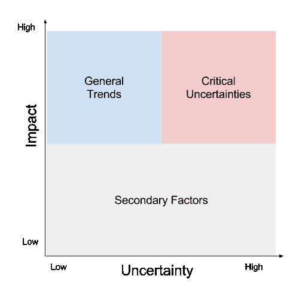
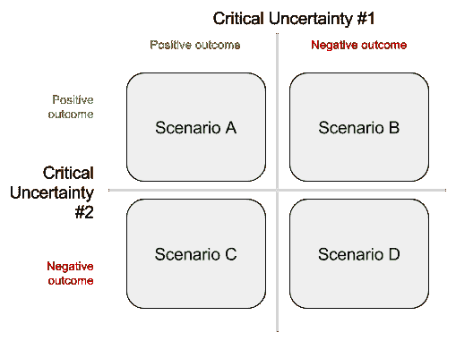

# 数据驱动的企业如何进行场景规划

> 原文：<https://towardsdatascience.com/how-data-driven-businesses-approach-scenario-planning-7ba3e9a89e79?source=collection_archive---------2----------------------->

> 有已知的已知。这些是我们知道自己知道的事情。有已知的未知。也就是说，有些事情，我们知道我们不知道。但也有不为人知的未知。有些事情我们不知道我们不知道。 [*拉姆斯*](https://en.wikipedia.org/wiki/Donald_Rumsfeld)

**情景规划**是 20 世纪 50 年代开发的一种规划技术，用于帮助军方更好地应对意外变化。在情景规划之前，许多军事规划都是以类似于影响分析技术的方式进行的，假设未来与现在非常相似。相比之下，情景规划迫使你分析许多可能的未来，这些未来可能与现在非常不同。

场景规划会因业务而异，因为您需要考虑的未来场景取决于您的业务。本周我们将介绍情景规划的基本框架，这样你就可以将它应用到你自己的需求中。具体来说，我们将涵盖:

*   [识别驾驶趋势](http://outlier.ai/2017/01/10/scenario-planning-identifying-driving-trends)
*   [选择场景](http://outlier.ai/2017/01/11/scenario-planning-choosing-scenarios)
*   [情景模拟](http://outlier.ai/2017/01/12/scenario-planning-scenario-simulations)
*   [高级场景](http://outlier.ai/2017/01/13/scenario-planning-advanced-scenarios)

让我们从确定将形成我们需要考虑的未来的驱动趋势开始吧！

> [**离群值**](http://outlier.ai/about-outlier/) **监控您的业务数据，并在发生意外变化时通知您。**我们帮助营销/发展&产品团队从他们的业务数据中获取更多价值。 [**今天安排试玩。**](http://outlier.ai/)
> 
> - Outlier 是 Strata+Hadoop World 2017 观众奖得主。

# 场景规划:识别驱动趋势

在你开始构建未来的场景之前，你需要确定可能塑造这些未来的力量。这些力量很大程度上取决于你的业务类型，但通常可以分为社会，技术，经济，环境和政治趋势，这就是所谓的陡峭。例如，如果你是一家电子公司，你的未来可能会受到进口关税(政治)、运输成本(经济)、制造成本(技术)、回收法规(环境)和客户认知(社会)的影响。让我们通过几个简单的步骤来识别你所有的驾驶趋势。

第一步。集思广益，找出你的企业可能存在的所有驱动趋势。这可能会是一个非常大的列表，所以寻找相似之处和可能包含许多不同趋势的更大趋势。理想的情况是，你希望汇集一个合理的主要趋势列表，而没有太多的重复。

第二步。即使在整合之后，您的业务也可能有大量潜在的驱动趋势。下一步是对这些趋势进行分类，并找出最重要的趋势来塑造你的场景。为此，我们将从两个不同的方面对每位驱动因素进行评估:

*   影响:这个驱动因素对未来的潜在影响有多大？
*   不确定性:你能多好地预测这个驱动因素在未来会发生什么？

回到我们的电子公司，构建产品的组件成本具有较低的不确定性(不太可能在没有警告的情况下改变)，但具有较高的影响(影响您的利润)。同时，竞争性的产品发布具有很高的不确定性(你不知道你的竞争对手在计划什么)和很高的影响(可能会降低销量)。影响和不确定性是定性的衡量标准，因此您应该决定自己的评分标准。无论你用什么标准，确保你对每个司机的相对评分是一致的。

第三步。评分后，您现在可以根据潜在驾驶员的两个得分将他们分为三类:

*   **次要因素**是对塑造你的未来影响较小、不太重要的驱动因素。
*   **总体趋势**是重要的驱动因素，但也很容易理解和预测。
*   **关键的不确定性**是很难预测其未来的重要驱动因素。

显然，关键的不确定性是最重要的，也是你应该用来构建你的场景的！次要因素和总体趋势将成为你从关键不确定性中构建的情景的背景。接下来，我们将讨论如何做到这一点。

# 方案规划:选择方案

在您确定了业务的驱动趋势(昨天的那些关键不确定性)之后，是时候选择值得研究的场景了。如果你只是简单地选择你最感兴趣的场景或者你已经知道的场景，那么整个场景规划的过程就是一种浪费！为了使情景规划有效，你需要面对可能的不愉快或未知的未来。

幸运的是，你已经确定的关键不确定性将为你塑造你的场景。例如，给定任意两个不确定性，您可以使用它们可能的结果(积极或消极)构建场景:

如果没有例子，这可能很难想象，所以让我们用一个例子！假设我们是一家电子公司，在中国生产产品，主要在美国销售。通过我们的流程，我们发现最大的关键不确定性是竞争性价格变化和进口关税变化。每种情况都有两种可能的结果:

然后，我们可以根据这两个关键的不确定性构建四种情景:

每个场景都有很大的不同，对每个场景进行分析将有助于深入了解这些以前不确定的业务领域。这是一个简单的例子，只使用了你的两个关键不确定性来创建场景，但是你可能会有两个以上的不确定性。您可以通过组合成对的不确定性(重复这个简单的过程)或者将两个以上的不确定性组合成一个更复杂的矩阵来构建更多的场景。无论哪种方式，您都应该有一个有趣的场景集合来分析。

如果你有太多的场景需要在有限的时间内考虑，按照可能性对它们进行排序会很有帮助，这样你就可以在极不可能的场景上花费更少的时间。例如，如果你的一个场景依赖于心灵运输的发明，你可以跳过这一个，因为你可能不会很快看到心灵运输的发明。

接下来，我们将介绍分析这些场景的不同方法，因为您已经掌握了这些方法！

一旦你确定了你的场景，以及产生这些场景的关键不确定性，是时候模拟这些场景，看看它们会如何发展。这里的目标不是完美地预测场景的未来，而是充分地探索它，以便您可以使用获得的知识做出更好的决策。你可以通过思考场景中的一连串事件以及它们在未来可能会如何发展来做到这一点。

你的模拟将依赖于你的业务经验、你能收集到的关于总体趋势和关键不确定性的任何数据以及外部建议。许多公司会聘请顾问来帮助他们进行场景规划，以确保他们避免在这个阶段引入偏见。如果你真的希望你的利润增加，你可能会无意中添加到你的模拟偏差，显示利润增加。

与任何模拟一样，最重要的部分是您建立的规则。运行良好的模拟具有以下规则:

*   **…反映公司潜在的战略选择**。如果你的公司位于加州，搬迁是不可能的，你应该避免考虑搬迁到其他国家。
*   **…不受制于你当前的战略**。情景规划的发展是为了攻击“官方未来”的想法，即简单地将今天延伸到明天。你需要愿意改变现状，考虑彻底的改变。
*   **…足够严格以提供一个结果**。生活非常复杂，有很多因素，这就是为什么很难预测下周会发生什么。你需要限制你的模拟中的因素，否则你真的不能取得很大进展。

当你发现自己在考虑以前没有考虑到的选项和因素时，你就会知道你的模拟在起作用。请记住，情景模拟的目标不是最终结果，而是过程和它迫使你思考业务的不同方式。

接下来我们将介绍如何模拟真正复杂的场景，包括许多不同的竞争者或组织相互作用:战争游戏！

# 方案规划:高级方案

有些场景太复杂，不能简单地在白板上思考，因为要考虑的因素太多了。例如，如果您的场景涉及与三个或四个竞争对手的竞争性价格战，则很难理解每个参与者对每个变化的反应。这些可能是需要理解的最重要的场景；你如何管理复杂性？

正如我前面提到的，情景规划最初源于军事规划技术。军方预测未来的一个非常有效的方法是运行战争游戏(模拟)，让团队在模拟的战斗中相互竞争，以观察不同部队之间的事态发展。战争游戏运行良好，因为每个团队只需要担心他们的利益和资源，给他们清晰的决策和更有效的整体模拟。这是一个有效的工具，您可以部署它来理解这些高度复杂的多方场景。而且很好玩！

最简单的部分是把你的人分成小组，在你的场景中每一方一个小组。困难的部分是建立模拟的规则(正如我们昨天所讨论的)，以便它以一种对决策有用的方式进行。这与我们之前模拟的场景没有太大的不同，不同的是在你的战争游戏中每个团队可能有不同的规则。例如，一个大的竞争对手可能比一个小的竞争对手更灵活地调整他们的价格和利润(由于大量的现金流)。你为每个团队设计的规则越好，你的模拟结果就越好。

轮换你的团队总是一个好主意，这样每个人都有机会从不同的角度看问题。如果你定期重复这个过程，这是很容易的，这也将帮助你的团队提高他们的模拟技能。

**延伸阅读**:我在这里只触及了场景规划的皮毛！如果你想了解更多关于场景规划的知识，并看到更多详细的例子，我推荐[莱比锡管理研究生院](http://www.hhl.de/fileadmin/texte/publikationen/arbeitspapiere/hhlap0098.pdf)发表的关于场景规划的[的优秀论文](http://www.hhl.de/fileadmin/texte/publikationen/arbeitspapiere/hhlap0098.pdf)。

> [**离群值**](http://outlier.ai/about-outlier/) **监控您的业务数据，并在发生意外变化时通知您。**我们帮助营销/发展&产品团队从他们的业务数据中获取更多价值。 [**今天安排演示。**](http://outlier.ai/)
> 
> - Outlier 是 Strata+Hadoop World 2017 观众奖得主。