# 数据科学如何实现早期癌症诊断

> 原文：<https://towardsdatascience.com/how-data-science-enables-early-cancer-diagnosis-6221ae841ae3?source=collection_archive---------8----------------------->

> 在这篇文章中，我提出了一个使用两步法的癌症早期检测的解决方案。第一步是使用霰弹枪法，如质谱法，利用常规检查样品收集尽可能多的化学信息；第二步是建立一种可靠的方法来筛选化学信息，并标记可疑的癌症样本以供进一步测试。开发了一个网络应用程序，以促进癌症预测和发现用于癌症诊断的指纹化学物质。

癌症的早期发现和治疗对于提高癌症患者的生存率和生活质量至关重要。根据[英国癌症研究](http://www.cancerresearchuk.org)的数据，对于女性和男性最常见的癌症乳腺癌和前列腺癌，如果在 I 期/之前诊断，五年存活率几乎是 100%，而在 IV 期存活率显著下降到不到 30%！

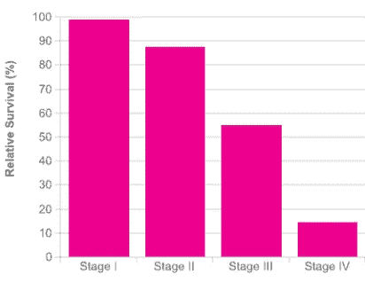

Figure. 5-Year Survival Rate for Breast Cancer at Different Stages

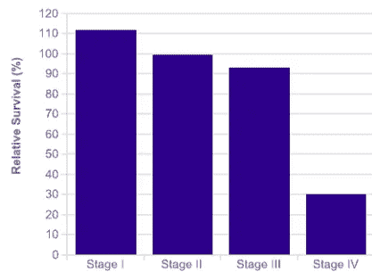

Figure. 5-Year Survival Rate for Prostate Cancer at Different Stages

目前，癌症通常是在患者出现呕吐和头晕等症状后才被诊断出来。然而，在大多数情况下，症状只有在晚期才明显，即使症状出现，病人和医生也不会首先怀疑癌症。因此，最好是找到一种可靠的方法，使用常规体检样本(*，例如*，血液样本)来检查癌症，并且甚至在症状出现之前就“标记”可疑的癌症样本以进行进一步的测试。

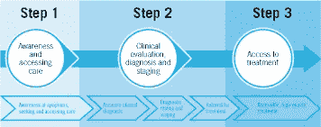

# 早期癌症检测的两步法

## 第一步。猎枪法

> [质谱](https://en.wikipedia.org/wiki/Mass_spectrometry)提供了一种经济、快速的解决方案，可从唾液、血液或其他样本中收集尽可能多的化学信息，已被制药公司广泛应用于药物筛选和测试。

一般来说，质谱通过化学物质的重量或质量来区分化学物质，即使化学物质的浓度很低，质谱也具有很高的灵敏度。此外，质谱分析通常使用微小的样品(毫克)，需要几分钟才能完成，并且可以很容易地与机器人样品制备技术结合，这是高通量化学筛选和测试的理想方法。

然而，太多的信息意味着很难找到哪个肿块是癌症诊断的决定性因素，即使是有经验的专业人员。通常的做法是，人们根据有限数量的已知癌症决定化学物质(或标准)来预测癌症，这将由于样本差异而导致大量的错误分类。

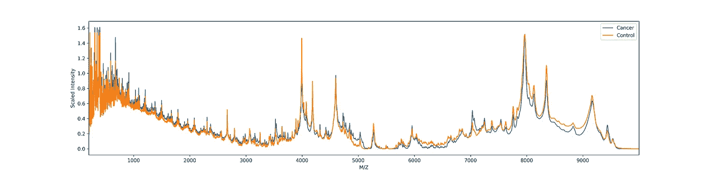

**Figure. Typical mass spectra of ovarian cancer samples and ovarian control samples**

## 第二步。受数据科学启发的频谱分析

> 在人们的印象中，数据科学和机器学习更多的是与高科技行业相关，比如图像处理、语音处理、人工智能，但它们与频谱分析有什么关系呢？换句话说，如何将现实世界的癌症早期诊断问题转化为机器学习问题来解决？让我们在下面几节中演示这种“转换”。

## 数据收集

[*查看我的 github 了解更多详情@第一节*](https://github.com/liudj2008/High-Accuracy-Cancer-Prediction-based-on-Mass-Spectra/blob/master/High%20Accuracy%20Cancer%20Prediction%20Using%20Machine%20Learning%20Inspired%20Mass%20Spectrum%20Analysis.ipynb)

首先，让我们收集一些质谱数据。我正在调查的数据可以从[国家癌症研究所](https://www.cancer.gov/) (NCI)公开获得。在这里，我主要关注两种癌症:卵巢癌和前列腺癌。对于卵巢癌，我采用了两组，一组由机器人准备，另一组按照标准协议手工准备。对于前列腺癌，所有样品都是按照标准方案手工制备的。每组都有癌症组和对照组(健康组)。大约 20%的癌症样品处于 I 期，而其余 80%的癌症样品处于 II、III 和 IV 期。

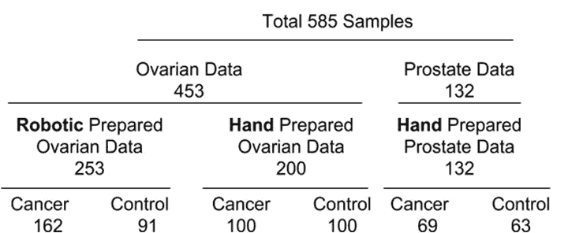

**Figure. Mass spectra samples collected for cancer prediction**

这种情况下的数据争论是将单个质谱结合到光谱矩阵，每行代表单个样品，每列代表单个 M/Z。所有样品都标记为癌症为 1，非癌症为-1。

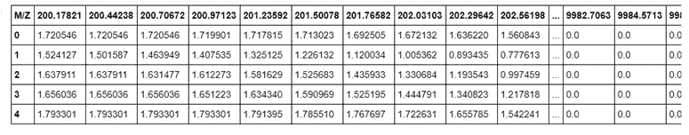

Figure. Mass spectra matrix after combining individual mass spectrum

## 数据可视化

[*查看我的 github 了解更多详情@ Section 2*](https://github.com/liudj2008/High-Accuracy-Cancer-Prediction-based-on-Mass-Spectra/blob/master/High%20Accuracy%20Cancer%20Prediction%20Using%20Machine%20Learning%20Inspired%20Mass%20Spectrum%20Analysis.ipynb)

那么我们的数据是什么样的呢？他们可以很容易地被分为癌症或非癌症群体吗？现在，我们面对的数据集的特征(不同的质量)明显大于样本(质谱的数量)。这对于所有光谱数据都是常见的，通过实验收集大量样本相对困难，但通过光谱分析获得大量特征或数据点却相当容易。由于我们数据的高维数(> 9000 个特征)，不可能直接查看我们的数据。相反，我们可以将我们的数据“投影”到 2D 空间，并将其可视化。[主成分分析](https://en.wikipedia.org/wiki/Principal_component_analysis)为我们提供了很好的工具来做到这一点，在这里我们可以很容易地看到和知道我们的数据。在这里，我们使用前两个主成分绘制了数据分布图。

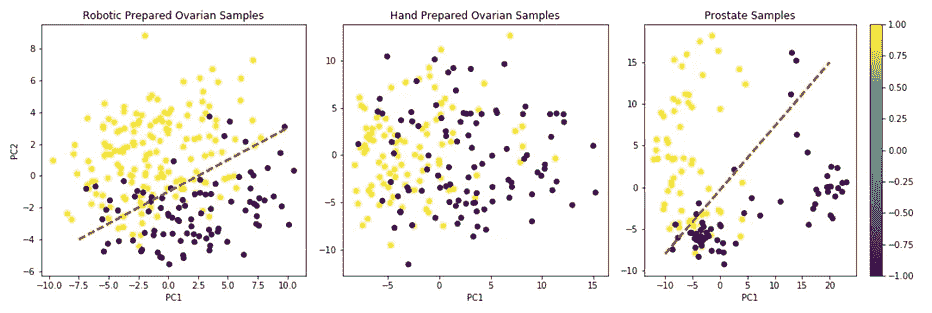

Figure. Comparison of cancer and non-cancer group in three groups. Purple plots represent the non-cancer group, while yellow plots represent the cancer group. From left to right: robotic prepared ovarian samples, hand-prepared ovarian samples, and prostate samples

我们可以看到，对于机器人制备的卵巢样本和前列腺样本，癌症和非癌症样本可以合理地分离，而对于手工制备的卵巢样本，癌症和非癌症样本在很大程度上重叠，无法仅使用前两个主成分进行分离(与机器人制备的卵巢组和前列腺组相比，更难预测癌症/非癌症)。

## 特征选择

[*查看我的 github 了解更多详情@ 3.1 节*](https://github.com/liudj2008/High-Accuracy-Cancer-Prediction-based-on-Mass-Spectra/blob/master/High%20Accuracy%20Cancer%20Prediction%20Using%20Machine%20Learning%20Inspired%20Mass%20Spectrum%20Analysis.ipynb)

我们知道我们的光谱数据是高维数据。事实上，高维数据不仅带来了高维的诅咒，还带来了相关和噪声特征，这可能导致我们的模型过拟合数据或难以收敛。因此，在应用机器学习算法之前，我们需要选择重要的特征。

决策树是一种自然的特征选择方法。树分裂基于基尼不纯的最大增益，因此树总是向着更重要的特征分裂。随机森林算法是一种集成方法，对每次分裂使用树打包和随机特征选择。在这里，我使用随机森林来选择最重要的特征。我将阈值设置为 95 %,这意味着我预计最重要的特征可以解释数据集 95%以上的差异。

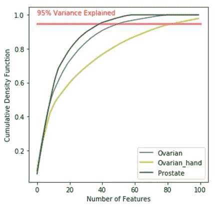

Figure. Explained Variance vs. Number of Features rendered by **Random Forest.**

值得注意的是，在 9，200 个特征(M/Z)中，仅使用 40 个特征(总特征的 0.43%)就可以解释前列腺样本 95%以上的差异，52 个特征(总特征的 0.58%)将解释机器人制备的卵巢样本 95%以上的差异，而手工制备的卵巢样本需要 86 个特征(总特征的 0.93%)。特征选择将显著减少噪声和冗余特征。

> **选择的特征有意义吗？**
> 
> **是的，这意味着指纹肿块可以确定癌症**

【T4*查看我的 github 了解更多详情@第 4.4 节*

对于机器人制备的卵巢样本，200 到 1000 之间的指纹质量数为 25，确定卵巢癌的癌症的一个关键代谢物 [**(分子量 472)**](https://academic.oup.com/ajcp/article/134/6/903/1760577) **在我们用于卵巢预测的重要质量列表中。**换句话说，我开发了一种工具，用于选择可能用于癌症诊断的指纹分子，这对新发现代谢和致癌化学物质具有重要价值。在这种情况下，研究人员可以只关注 52 个预测卵巢癌的分子，或者 40 个预测前列腺癌的分子，而不是关注所有 9300 个可能的分子，这将大大提高研发效率并节省成本。

## 癌症预测模型

[*查看我的 github 了解更多详情@ 3.2 和 3.3*](https://github.com/liudj2008/High-Accuracy-Cancer-Prediction-based-on-Mass-Spectra/blob/master/High%20Accuracy%20Cancer%20Prediction%20Using%20Machine%20Learning%20Inspired%20Mass%20Spectrum%20Analysis.ipynb)

使用选择的特征，我应用了[支持向量机](https://en.wikipedia.org/wiki/Support_vector_machine)(SVM)[随机森林](https://en.wikipedia.org/wiki/Random_forest)(RF)[K 最近邻](https://en.wikipedia.org/wiki/K-nearest_neighbors_algorithm) (KNN)和[集成方法](https://en.wikipedia.org/wiki/Ensemble_learning)，通过投票进行癌症预测。模型参数通过网格搜索交叉验证进行调整。基于预测准确性、AUC 评分和 F1 评分比较模型性能。

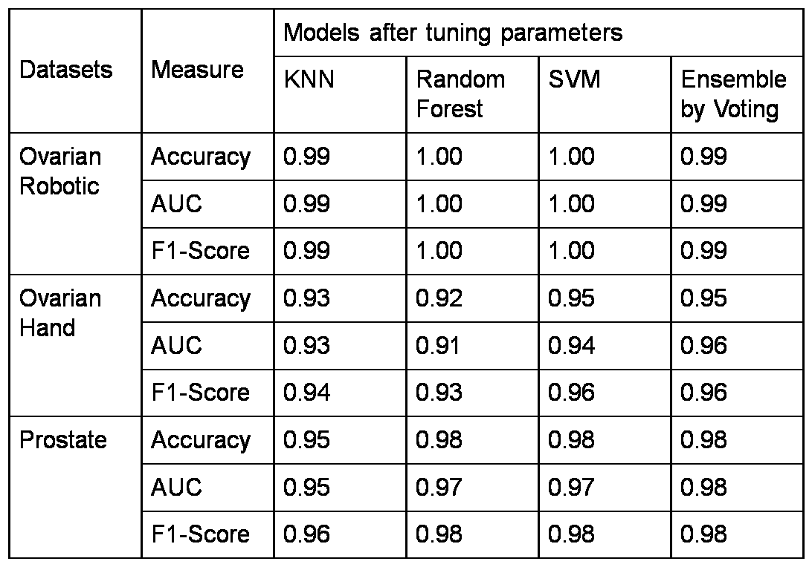

**Figure. Comparison of model performance on robotic-prepared ovarian samples, hand-prepared ovarian samples, and prostate samples**

值得注意的是，对于卵巢癌和前列腺癌的预测，所有机器学习模型都表现良好。对于机器人准备的卵巢数据，随机森林和 SVM 可以达到 100%的准确性，1.0 的 AUC 和 1.0 的 F1 评分，使它们成为预测的完美模型；对于手工准备的卵巢数据，SVM 和系综方法表现相似，达到 95%的准确性，0.95 的 AUC 和 0.96 的 F1 评分；对于前列腺数据，SVM、随机森林和集成方法可以实现高达 98%的准确性、0.98 的 AUC 和 0.98 的 F1 分数。然而，我们不应该对我们的模型过于自信，因为我们的结果是基于小规模的样本，我们将需要更大的数据来优化我们的模型和测试模型的性能。我们的模型还必须灵活，这意味着它们应该能够处理质谱中出现比平时更多噪音的情况(*例如*，仪器误差和样品制备过程中引入的杂质)。

> 我们可以看到 SVM 和集成模型在预测准确性、AUC 和 F1 评分方面相似，但是哪一个对于癌症的早期确定更好呢？

[*查看我的 github 了解更多详情@第 4.1 节*](https://github.com/liudj2008/High-Accuracy-Cancer-Prediction-based-on-Mass-Spectra/blob/master/High%20Accuracy%20Cancer%20Prediction%20Using%20Machine%20Learning%20Inspired%20Mass%20Spectrum%20Analysis.ipynb)

让我们回到这项工作的目标。我们将对疑似癌症样本进行“危险标记”以进行进一步检测，因此敏感性是我们首要关注的问题。换句话说，如果有癌症，我们的模型应该尽可能地预测癌症。这类似于机场的安全检查，警报被调整为对所有金属物体敏感，甚至对钥匙和手机也是如此。

如果我们看一下下面显示的混淆矩阵，它显示了当有癌症时有多少样本没有被预测为癌症(假阴性结果)，我们希望尽可能少地出现假阴性结果。这里，1 代表癌症，而-1 代表非癌症。可以容易地看出，SVM 模型在所有三组中呈现 0 假阴性结果，使得 SVM 是比集合模型更好的预测卵巢癌和前列腺癌的模型。

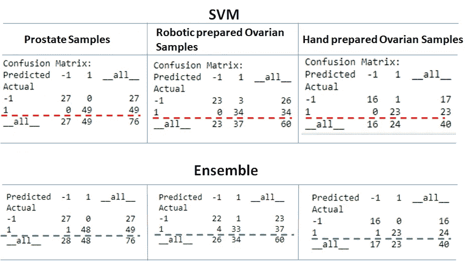

**Figure. Comparison of Confusion Matrix between SVM and Ensemble models**

> 如果样本不小心混在一起，我们能知道它属于哪一组吗？

[*查看我的 github 了解更多详情@ 4.3 节*](https://github.com/liudj2008/High-Accuracy-Cancer-Prediction-based-on-Mass-Spectra/blob/master/High%20Accuracy%20Cancer%20Prediction%20Using%20Machine%20Learning%20Inspired%20Mass%20Spectrum%20Analysis.ipynb)

经常会有人把样本搞混的情况，尤其是处理大量样本的时候。在这里，我提供了一个如何使用机器学习工具将未知样本分配到组中的解决方案。在这个数据集中，我们有六个单独的组。我们必须使用多分类来决定样本属于哪一组。通过比较三种模型(SVM、随机森林和 KNN)，我们得出结论，SVM 在这种多分类中表现最佳，准确率高达 93%。进一步证明，我们的模型可以根据性别(高达 97%的准确率)以及机器人准备和手工准备(高达 100%的准确率)来分离样本。

> 我们能否开发一个应用程序，只需上传一个质谱文件，它就会提供预测结果？
> 
> 是的。为了实现这个目标，我开发了一个名为癌症诊断 1.0 的应用程序

在这里，我开发了一个基于 Dash 的 **web app** ，你只需上传一个质谱文件，癌症诊断结果就会立即显示出来。该应用程序已通过 Heroku 部署。

*   上传文件

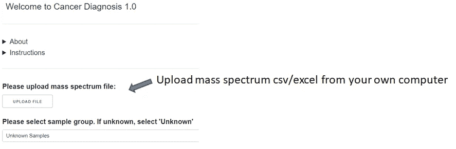

*   质谱将通过热图和曲线图显示，您可以选择质量范围

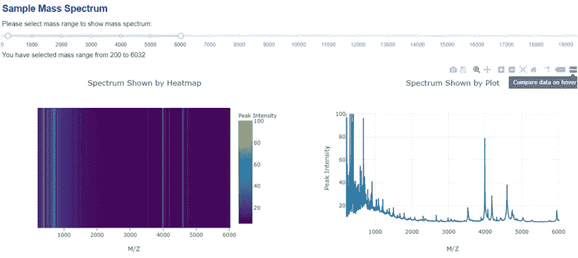

*   它显示所有训练样本中新样本的可视化，并通过四个模型预测概率。您可以选择不同的分类标准:全部、性别或准备

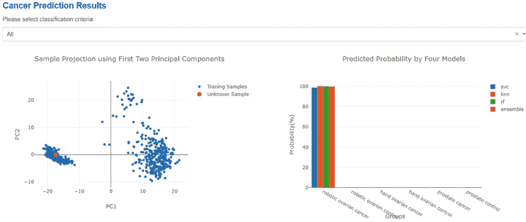

*   如果您选择一个特定的组(此处为机器人准备的卵巢组)，它会显示该组中训练样本内新样本的可视化，并通过四个模型预测癌症/非癌症的概率

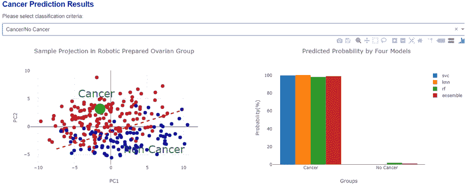

*   它还将显示特定组(此处为机器人准备的卵巢组)内的指纹质量，您可以选择质量范围来显示感兴趣的指纹质量

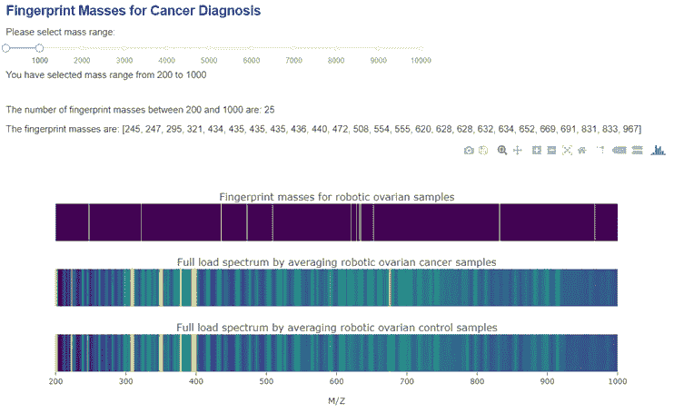

# 结论

*   SVM 被选为预测卵巢癌和前列腺癌的最佳模型，准确率高(95-100%)，假阴性率为零，非常适合“标记”疑似癌症样本
*   确定了决定卵巢癌的指纹分子之一，这被文献报道所证实
*   开发了一个癌症诊断应用程序，以提供快速的癌症预测结果以及用于癌症诊断的指纹分子列表

# **建议**

*   在癌症筛查的常规检查中，患者应该要求进行质谱检测
*   医生应该建议患者在常规体检时做质谱测试
*   保险公司应该支付质谱测试费用，作为一种预防性测试，以鼓励人们进行常规癌症筛查