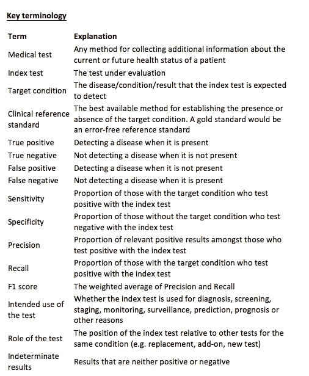
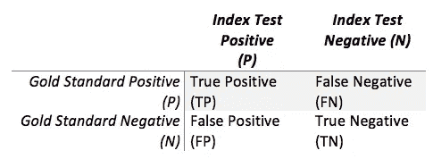
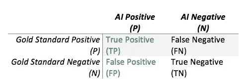
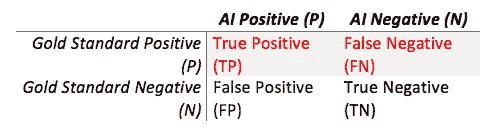
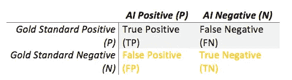
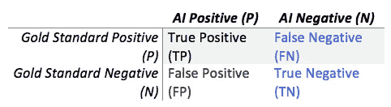
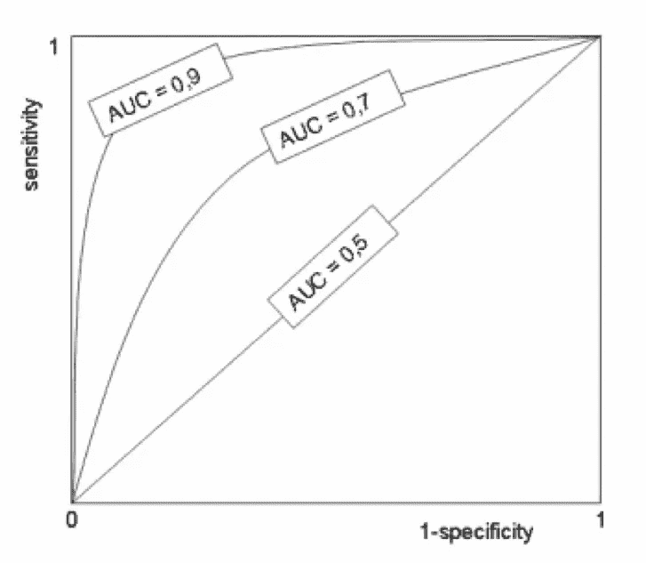
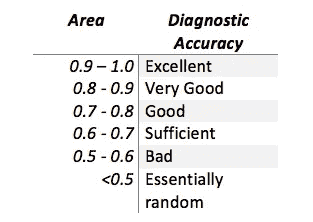
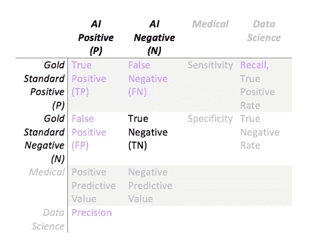
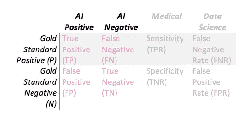

# 数据科学家如何让医生相信人工智能有效

> 原文：<https://towardsdatascience.com/how-data-scientists-can-convince-doctors-that-ai-works-c27121432ccd?source=collection_archive---------0----------------------->

当我在医学院的时候，我被教导对一个病人说的四个最重要的词是*‘你没有癌症’*。我相信你会同意，这一声明对于正确行事至关重要。为了作出这一声明，观察者必须尽可能地确信这一声明在当时确实是正确的(癌症已经被证明是不存在的)。在统计学术语中，这种说法被称为真正的否定。可惜医学不是非黑即白的，医生也有可能搞错。这种情况并不经常发生(嗯，比我们希望的要多，但还不足以让每个人都放弃)，但一旦发生，结果对患者来说可能是灾难性的。

当人工智能系统进行诊断或报告发现时，确保新技术也是准确的，或者至少像人类一样准确是很重要的。这是通过临床验证过程完成的，其目的是评估系统的“准确性”。我们当然不希望 AI 开始错误地告诉人们，他们比人类更容易患癌症或不患癌症！在这篇文章中，我将回顾在临床环境中为 AI 开发者报告准确性的最相关的指标。

**准确性到底是什么？**

“准确性”不是一个已定义的科学统计术语，但它本质上包含了指数测试(被测试的系统)表现如何的概念，通常与另一个预先存在的系统相比较，在人工智能的背景下，该系统通常是人类医生。“准确性”可以使用替代测量来评估，例如可靠性、灵敏度、精确度和误差率，等等。

指标测试的“准确性”最好通过与黄金标准的无误差测试进行比较来衡量。然而，在医学诊断领域(或其他领域，如放射学或病理学发现)，往往没有无错误的黄金标准。因此，应该使用建立“基础事实”的最佳方法，即临床参考标准(CRS)。CRS 可以定义为“一组合格医生的一致意见”，或者更简单地说是“一名合格医生的专家意见”。CRS 的全部意义在于尽可能接近一个完美的系统。在进行临床验证时，CRS 的定义非常重要，因为它会影响任何统计检验的方法、分析和结果。我经常看到发表的关于人工智能系统准确性的文献，相比之下只有一两个医生，这可能还不够。(但是，占用几百个医生的时间，大概是不合理的，所以尽你所能吧！)

有几种统计方法来衡量“准确性”。然而，必须指出的是，大多数统计测试旨在评估二元分类(给定的疾病、条件或生理测量)中仅一个目标条件的测试的“准确性”，而不是大量变量。

或者，测试间比较(kappa 一致性、一致性、可靠性)可用于评估“准确性”，尤其是在缺乏具体定义的目标条件的情况下。然而，这些测试只是衡量 AI 和人类之间的一致程度，并不能反映‘准确性’。不一致并不能告诉你两个测试哪个更好，只能说明他们不一致。因此，我将在本文中忽略这些比较测试。

最后，任何对“诊断准确性”的方法学评估都应尽可能消除偏见，适用于具体情况，透明，并有适当的依据。出于这个原因，产生了报告“诊断准确性”的国际标准,这是一个同行评审的框架，使研究人员能够充分记录和合理化他们的研究和发现。

**测量二元分类的“准确度”**

在结果是二分的环境中(二元；存在或不存在)，没有不确定的结果，可以使用统计二元分类器。

通过将指数测试与黄金标准进行比较，可以创建一个简单的 2x2 表格，称为混淆矩阵或列联表。

Standard confusion matrix

基于真/假正/负的计算可以提供“准确性”的替代测量。

一般来说，系统越“精确”，出现的真阳性和真阴性就越多，假阳性和假阴性就越少。

**两个世界碰撞**

在报告诊断“准确性”时，医学和数据科学指标之间有相当大的重叠。在临床领域，使用的主要指标是真实柱比率——真实阳性率和真实阴性率(灵敏度和特异性)。在数据科学中，最常报告的指标是真阳性率，即阳性预测值(PPV)和真阳性率(TPR)，分别称为精确度和召回率。

传统上，非医疗部门的人工智能系统仅根据精确度和召回率进行评级。这是因为在将模型应用于非临床问题(例如，为文档或信息检索而设计的系统)时，真正的负面因素可能并不重要。然而，当将人工智能应用于医疗情况时，真正的负面因素必须包括在你的统计分析中。

**精度**

精确度(绿色单元格)是对阳性结果与*相关性*的度量，也称为阳性预测值(PPV)。

其计算方法如下:

精度= TP / (TP + FP)

Precision

当黄金标准完全没有误差时，精确度是一种有用的“准确度”衡量标准。然而，当金本位制可能出现错误时，必须小心谨慎。这是因为指数测试实际上可能更“准确”(例如，人工智能比人类医生更好*)，但因为它只是与 CRS 进行比较，指数测试产生的任何真阳性都可能被错误地归类为假阳性，从而人为地降低了报告的精确度。医生的一致意见是有癌症，而实际上没有。人工智能系统正确地说没有癌症。在这种情况下，AI 系统是正确的，但因为我们只是将结果与医生的不正确共识意见进行比较，所以 AI 系统的精度受到了负面影响)。*

***召回/灵敏度***

*回忆(红细胞)是对正确阳性结果的*比例*的测量，也被称为真阳性率，或灵敏度。*

*其计算方法如下:*

*召回= TP / (TP + FN)*

**

*Recall*

*只有当黄金标准是无误差的，召回/灵敏度才能真正有用，因为它假设黄金标准的所有阳性结果确实是阳性的。如果一个人是不正确的，一个诊断实际上是一个真正的否定，那么报告召回将被人为地减少。*

*值得注意的是，精确度和召回率/灵敏度都没有考虑真正的负面因素，因此不能提供“准确性”的完整描述。出于这个原因，传统的数据科学的精确度和召回率指标不足以在临床环境中评估准确性。记住——“你没有癌症”是一个真正的否定，无论是精确度还是召回率都不能告诉我们任何关于人工智能系统是否能做出这种声明的事情。*

***特异性***

*特异性(黄色细胞)是对正确阴性结果的*比例*的测量，也称为真阴性率。*

*其计算方法如下:*

*特异性= TN / (TN + FP)*

**

*Specificity*

*真正的阴性率在诊断测试中至关重要，因为它是衡量指标测试正确否定诊断的频率。这在临床上很重要，因为排除诊断对所需的分类/进一步调查/治疗水平有很大影响，更不用说假阴性对患者的情绪影响了。*

*然而，只有当金标准产生真阴性时，才能测量真阴性率，而医生在做出临床诊断决定时往往不会这样做。想象一下，医生的鉴别诊断列表必须包括所有可能的阴性诊断，或者放射学报告必须包括所有可能的阴性发现——这几乎是不可能的！在实践中，可以假设，如果医生没有*而不是*将一个诊断包括在鉴别诊断中，则所有其他可能的诊断都被自动排除。*

***阴性预测值***

*阴性预测值(NPV，蓝色单元格)衡量的是*与阴性结果*的相关性。*

*其计算方法如下:*

*NPV = TN / (FN + TN)*

**

*Negative predictive value*

*至于真负率，只有金本位产生真负才能算出来。*

*具有高 NPV、特异性和敏感性的人工智能系统很可能被批准用于临床。*

***组合二元分类***

***ROC 曲线***

**

*为每个诊断临界值绘制 1-特异性和敏感性对给出了接收器操作特征曲线(ROC 曲线)。*

*左上角的曲线越高，诊断测试就越“准确”。*

*曲线下面积(AUC)给出了诊断测试的区分能力的单一数字指标。*

**

*Arbitrary AUC cut-off meanings*

*当比较两种不同的诊断试验时，AUC 通常比对照金标准比较指数试验更有用，因为它不提供关于试验在裁定或排除诊断或发现方面有多好的信息。还需要进行统计显著性计算(p 值),以便将结果放入上下文中。(我甚至不打算触及支持和反对 p 值的论点！).*

*如果两条 ROC 曲线不相交，那么一种方法优于另一种方法，因为它在各方面都优于另一种方法。如果两条曲线相交，那么这表明存在一个平衡点，在这个平衡点上，对于某项任务，一个系统比另一个系统好，在这个平衡点之上，另一个系统更好。例如，人工智能系统可能比人类更具体，但人类可能更敏感。这可能表现为两条曲线在两个系统执行两个指标的点上相交。*

*有趣的是，与完美的黄金标准相比，人工智能系统永远不会有更好的 AUC。这是因为不可能在完美的金本位上有所改进。你所能期望的最好结果是同等的。幸运的是人工智能开发者，但不是病人，人类容易出错！*

***F1 得分***

*精确度和召回率的加权平均值(紫色单元)被称为 F1 分数，是机器学习中分类系统的常用度量。*

*其计算方法如下:*

*F1 得分= 2x((精确度 x 召回率)/(精确度+召回率))*

**

*然而，重要的是，这个分数没有考虑真正的否定(TN)。人工授精系统的阴性率对于确定(诊断“遗漏”率)很重要，因此也应尝试报告特异性和/或 NPV。*

***可能性和诊断优势比***

*为了涵盖阳性率和阴性率，需要一个包含检测概率和误报概率的综合单一指标。假阳性是“假警报”，假阴性是“假再确认”。*

**

*阳性似然比(LR+ = TPR / FPR)是检测的概率，高 LR+值是包括诊断的良好指标。*

*负似然比(LR- = FNR / TNR)是虚警的概率，低 LR 值是排除诊断的良好指标。*

*这两个比率(包括所有 4 个粉红色细胞)可以结合起来形成诊断比值比(DOR ),它是一项测试诊断准确性的量度。*

*其计算方法如下:*

*DOR = LR+ / LR- = (TPR/FPR) / (FNR/TNR)*

*DOR 的优势在于它不依赖于潜在的患病率，是一个不需要统计学意义的单一指标，具有 95%置信区间的简单计算，并且得到医学认可。*

***效力***

*测试的有效性可能最接近于“准确性”的定义，因为它是所有情况下指数测试的正确输出比例的度量。*

*其计算方法如下:*

*有效性= (TP + TN) / (TP + TN + FP + FN)*

*然而，有效性受潜在患病率的影响很大，这使得它成为一个较差的统计测试。例如，给定一组灵敏度和特异性，人群中高患病率的疾病比低患病率的疾病更有可能被指数测试诊断出来。因此，成效从不作为单一指标报告，而总是与 PPV 和 NPV 等其他指标一起报告。在测试人工智能系统的情况下，当计算有效性时，极高的流行率可能是一个问题，因为测试的每个案例都有一个诊断。*

***总结***

*不符合严格方法标准的研究通常会高估或低估测试性能的指标，因为它们限制了研究结果的适用性。人工智能开发人员可以使用几种统计方法，每种方法都有自己的优点和缺点。在临床环境中验证人工智能系统时，重要的是要考虑是否会报告真正的阴性结果，因为这将影响可以应用哪些统计测试。目前，医生的鉴别诊断、报告或发现不包括所有可能的阴性结果(这将过于详尽)，因此必须假设被排除的诊断/发现是阴性的。但是，由于错误/疲劳/知识偏差，这可能会错误地将排除的诊断/发现计算为阴性，从而导致一些错误的结果。相反，如果没有真正的阴性结果，只能推断出精确度、召回率和 F1 值，这不能提供医学相关阴性诊断/发现和遗漏方面的完整情况。*

*最后的信息是，没有 100%正确的方法来报告人工智能系统在临床环境中的准确性，因为每个人都有自己的怪癖！我的建议是报告 ROC 曲线、AUC 和 DOR——这样你就可以用医学家理解的统计语言涵盖阳性率和阴性率的所有方面。令人欣慰的是，ROC 曲线在机器学习界越来越受欢迎，所以对于那些将你的技能应用于医疗问题的人来说，你将能够让你遇到的医生理解你的结果。*

***参考文献:***

*【http://www.stard-statement.org/ 号*

*【http://bmjopen.bmj.com/content/6/11/e012799 *

*[http://www.ifcc.org/ifccfiles/docs/190404200805.pdf](http://www.ifcc.org/ifccfiles/docs/190404200805.pdf)*

*[http://gim.unmc.edu/dxtests/roc3.htm](http://gim.unmc.edu/dxtests/roc3.htm)*

* [## 选择和解释诊断测试|生化医学

### 诊断检查的范围从从病人的病史和体检中获得的体征和症状到…

www.biochemia-medica.com](http://www.biochemia-medica.com/content/selecting-and-interpreting-diagnostic-tests)* 

*如果你和我一样对人工智能在医学成像领域的未来感到兴奋，并想讨论这些想法，请联系我们。我在推特@drhughharvey*

*如果你喜欢这篇文章，点击推荐并分享它会很有帮助。*

**关于作者:**

*哈维博士是一名委员会认证的放射科医生和临床学者，在英国国民医疗服务体系和欧洲领先的癌症研究机构 ICR 接受过培训，并两次获得年度科学作家奖。他曾在 Babylon Health 工作，领导监管事务团队，在人工智能支持的分诊服务中获得了世界第一的 CE 标记，现在是顾问放射科医生，皇家放射学家学会信息学委员会成员，以及人工智能初创公司的顾问，包括 Kheiron Medical。*