# 我们如何在一小时内构建图书推荐系统第二部分— k 近邻和矩阵分解

> 原文：<https://towardsdatascience.com/how-did-we-build-book-recommender-systems-in-an-hour-part-2-k-nearest-neighbors-and-matrix-c04b3c2ef55c?source=collection_archive---------0----------------------->

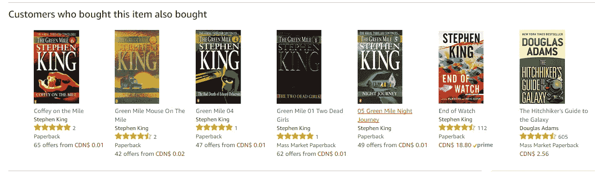

在[的上一篇文章](https://medium.com/@actsusanli/how-did-we-build-book-recommender-systems-in-an-hour-the-fundamentals-dfee054f978e)中，我们看到了如何使用简单的相关技术，根据图书用户的评分记录，在他们之间建立一个相似性的衡量标准。在本帖中，我们将展示如何使用这些相似性度量向读者提出建议。

# 基于 k 近邻的协同过滤

kNN 是一种机器学习算法，可以根据常见的书籍评级来找到相似用户的聚类，并使用前 k 个最近邻居的平均评级进行预测。例如，我们首先在矩阵中显示评级，矩阵中每个项目(书籍)占一行，每个用户占一列，如下所示:

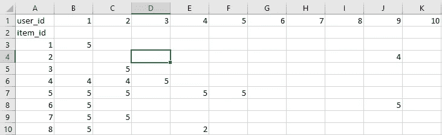

然后，我们找到具有最相似的用户参与度向量的 k 个项目。在这种情况下，项目 id 5 的最近邻居= [7，4，8，…]。现在让我们将 kNN 实现到我们的图书推荐系统中。

## 数据

我们使用上次使用的相同的图书数据:它由三个表组成:ratings、books info 和 users info。我从[这里](http://www2.informatik.uni-freiburg.de/~cziegler/BX/)下载了这三张表。

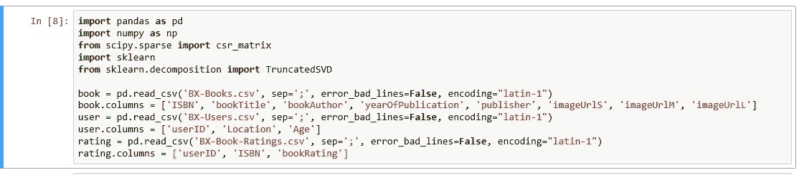

**评分信息**

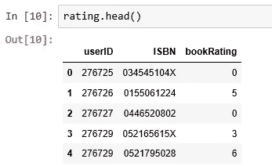

**用户信息**

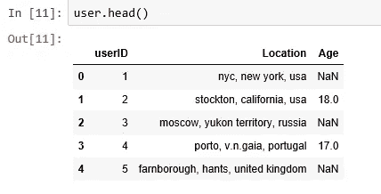

**图书信息**

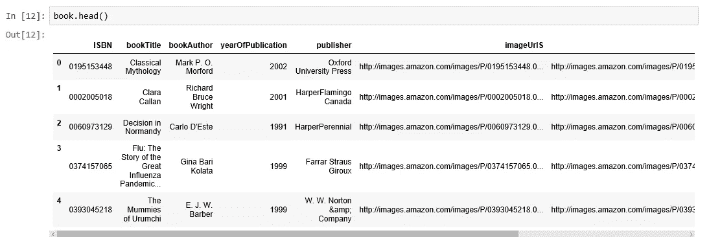

## 为了确保统计上的显著性，我们将只看流行书籍

为了找出哪些书受欢迎，我们需要结合书籍数据和评分数据。

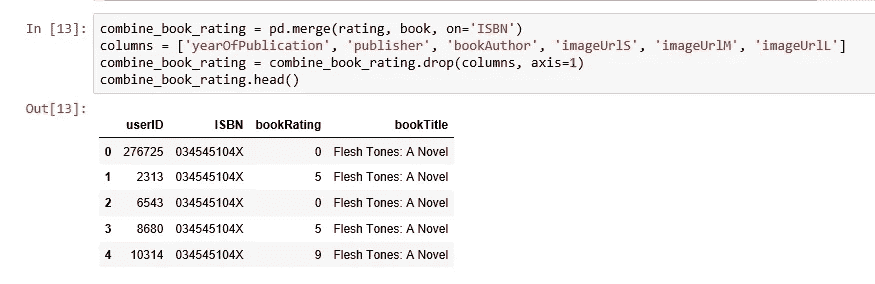

然后，我们按书名分组，并为总评分创建一个新列。

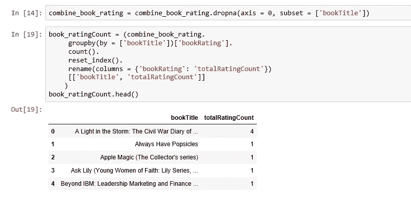

我们现在将评分数据与总评分计数数据相结合，这正好给了我们过滤掉不太出名的书所需的数据。

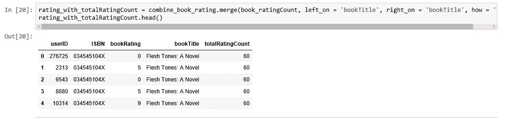

让我们来看看总评分的统计数据:

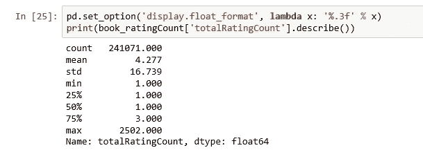

中值书只被评价过一次。让我们看看分布的顶端:

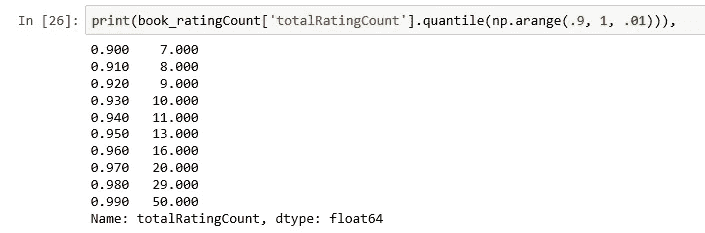

大约 1%的书获得了 50 或更多的评分。因为我们的数据中有如此多的书，我们将把它限制到前 1%，这将为我们提供 2713 本独特的书。

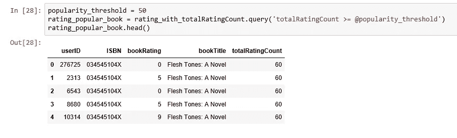

## 仅过滤美国和加拿大的用户

为了提高计算速度，并避免遇到“内存错误”问题，我将把我们的用户数据限制在美国和加拿大。然后将用户数据与评级数据和总评级计数数据相结合。

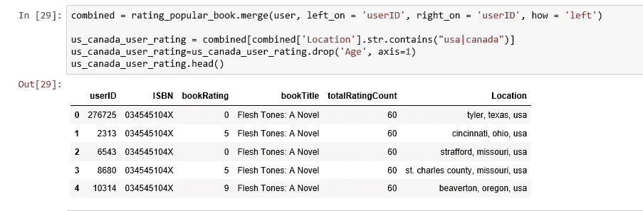

## 实现 kNN

我们将表格转换为 2D 矩阵，并用零填充缺失的值(因为我们将计算评级向量之间的距离)。然后，我们将矩阵数据帧的值(等级)转换成一个稀疏矩阵，以便进行更有效的计算。

## 寻找最近的邻居

我们使用带有 *sklearn.neighbors.* 的无监督算法我们用来计算最近邻的算法是“brute”，我们指定“metric=cosine”这样算法就会计算评分向量之间的余弦相似度。最后，我们拟合模型。

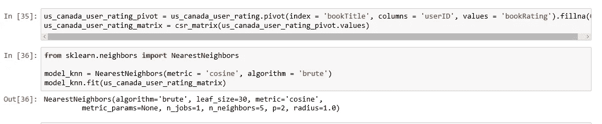

## 测试我们的模型并提出一些建议:

在这一步中，kNN 算法测量距离以确定实例的“接近度”。然后，它通过查找最近的邻居对实例进行分类，并在邻居中挑选最受欢迎的类。

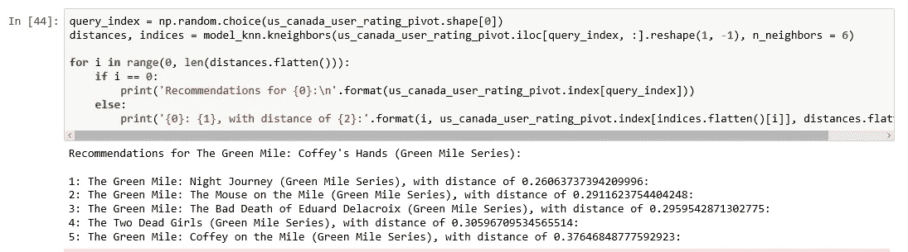

完美！《绿色一英里》系列书籍绝对值得推荐，一本接一本。

# 使用矩阵分解的协同过滤

Source: [ohAI](http://katbailey.github.io/page/2/)

矩阵分解只是一个玩弄矩阵的数学工具。矩阵分解技术通常更有效，因为它们允许用户发现用户和项目(书籍)之间交互的潜在(隐藏)特征。

我们使用奇异值分解(SVD)——一种矩阵分解模型来识别潜在因素。

与 kNN 类似，我们将美加用户评级表转换为 2D 矩阵(这里称为效用矩阵),并用零填充缺失值。

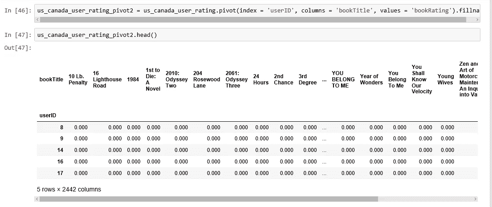

然后我们转置这个效用矩阵，这样书名变成了行，用户标识变成了列。在使用 TruncatedSVD 对其进行分解后，我们将其拟合到模型中进行降维。这种压缩发生在数据帧的列上，因为我们必须保留书名。我们选择 *n_components = 12* 作为 12 个潜在变量，您可以看到，我们的数据维度已经从 40017 X 2442 显著减少到 2442 X 12。

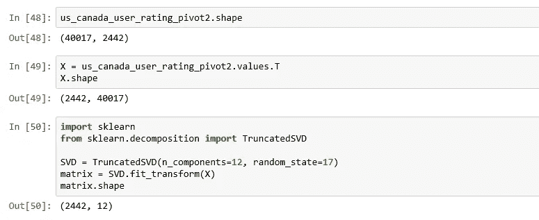

我们为最终矩阵中的每个图书对计算皮尔逊相关系数。为了与 kNN 的结果进行比较，我们选择了同一本书“绿色里程:科菲的手(绿色里程系列)”，以找到与它具有高相关系数(在 0.9 和 1.0 之间)的书籍。

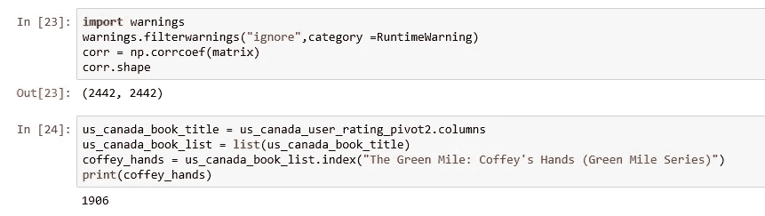

你有它！

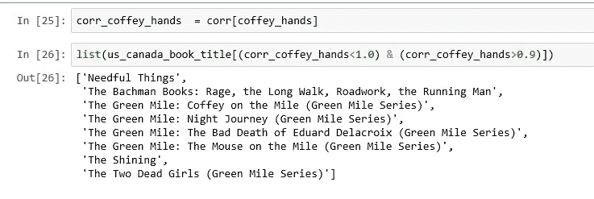

不算太寒酸！我们的系统可以打败亚马逊的，你说呢？看标题截图！

参考:[音乐推荐](https://beckernick.github.io/music_recommender/)