# 我们如何在一小时内建立图书推荐系统第一部分——基础

> 原文：<https://towardsdatascience.com/how-did-we-build-book-recommender-systems-in-an-hour-the-fundamentals-dfee054f978e?source=collection_archive---------3----------------------->

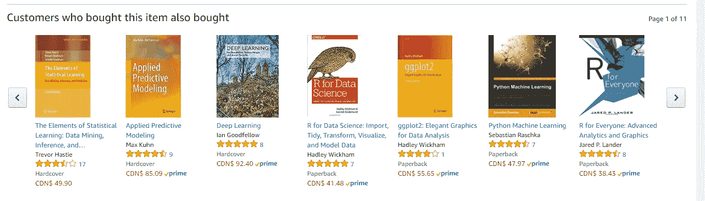

几乎每个人都有过这样的网上体验:网站为了未来的销售或持续的流量而提供个性化的推荐。亚马逊告诉你“买了这个商品的顾客也买了”，Udemy 告诉你“看过这个课程的学生也看过”。2009 年，网飞向一个开发团队颁发了 100 万美元的奖金，奖励其将公司推荐系统的准确率提高了 10%的算法。

如今，构建推荐系统需要分析、机器学习和软件工程方面的专业知识，学习新的技能和工具既困难又耗时。在这篇文章中，我们将从头开始，讲述 Python 中的一些基本技术和实现。在以后的文章中，我们将介绍更复杂的方法，如基于内容的过滤和基于协作的过滤。

所以，如果你想从头开始学习如何构建推荐系统，那就开始吧。

## 数据

[Book-Crossings](http://www2.informatik.uni-freiburg.de/~cziegler/BX/) 是由蔡-尼古拉斯·齐格勒编制的图书评分数据集。它包含 90，000 个用户对 270，000 本书的 110 万个评级。等级从 1 到 10。

该数据由三个表组成:评级、图书信息和用户信息。我从[这里](http://www2.informatik.uni-freiburg.de/~cziegler/BX/)下载了这三张表。

```
import pandas as pd
import numpy as np
import matplotlib.pyplot as pltbooks = pd.read_csv('BX-Books.csv', sep=';', error_bad_lines=False, encoding="latin-1")
books.columns = ['ISBN', 'bookTitle', 'bookAuthor', 'yearOfPublication', 'publisher', 'imageUrlS', 'imageUrlM', 'imageUrlL']
users = pd.read_csv('BX-Users.csv', sep=';', error_bad_lines=False, encoding="latin-1")
users.columns = ['userID', 'Location', 'Age']
ratings = pd.read_csv('BX-Book-Ratings.csv', sep=';', error_bad_lines=False, encoding="latin-1")
ratings.columns = ['userID', 'ISBN', 'bookRating']
```

## 评级数据

评级数据集提供了用户对图书的评级列表。它包括 1，149，780 条记录和 3 个字段:userID、ISBN 和图书评级。

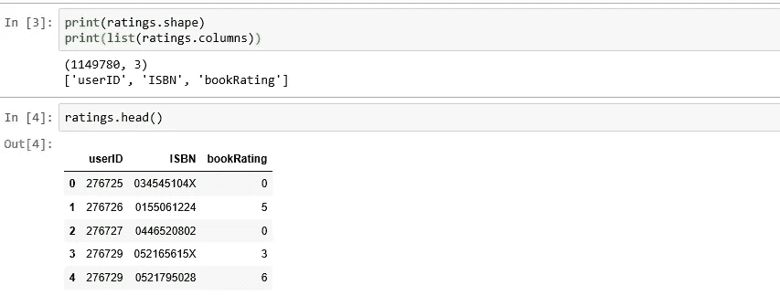

## 收视率分布

收视率分布很不均匀，绝大多数收视率都是 0。

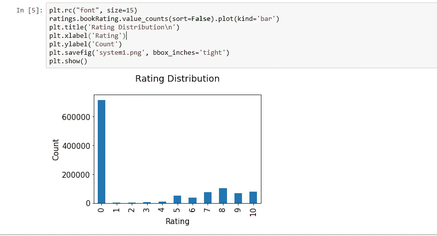

## 书籍数据

图书数据集提供了图书的详细信息。它包括 271，360 条记录和 8 个字段:ISBN、书名、图书作者、出版商等。

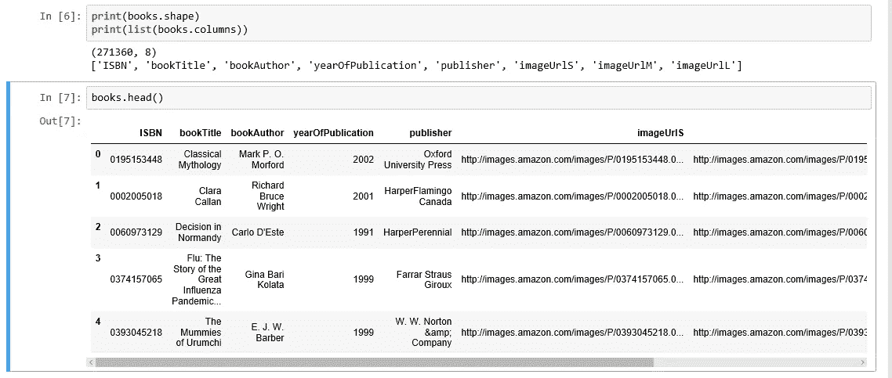

## 用户数据

该数据集提供用户人口统计信息。它包括 278，858 条记录和 3 个字段:用户 id、位置和年龄。

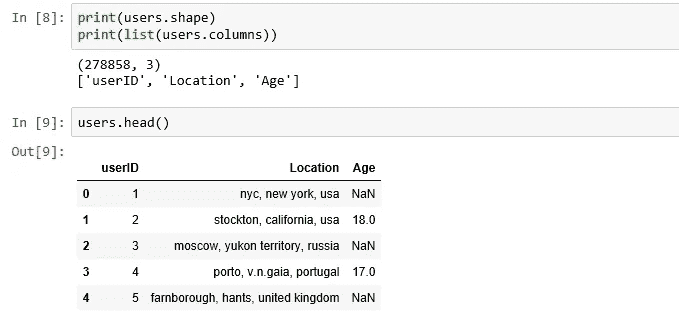

## 年龄分布

最活跃的用户是那些 20-30 岁的人。

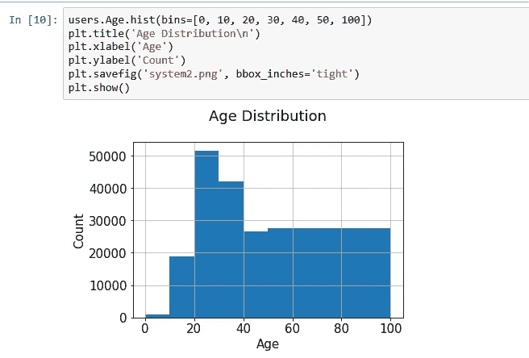

## 基于评级计数的建议

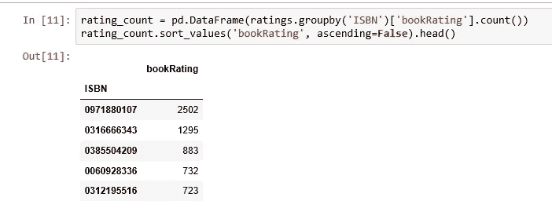

ISBN 为“0971880107”的书获得了最多的评分。我们来看看是什么书，前 5 都有哪些书。

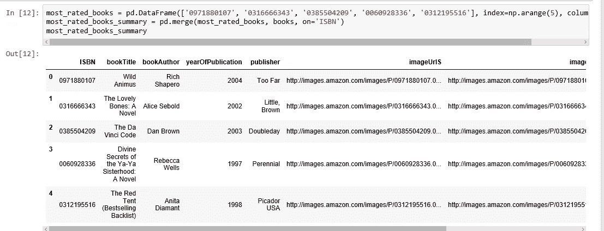

在这个数据集中获得最多评分的书是里奇·沙佩罗的《野性的阿尼姆斯》。这五本书有一个共同点，那就是它们都是小说。这位推荐者认为小说很受欢迎，可能会获得更高的收视率。而如果有人喜欢《可爱的骨头:一部小说》，我们大概也应该向他(或她)推荐《野阿尼姆斯》。

## 基于相关性的建议

我们使用皮尔逊相关系数来衡量两个变量之间的线性相关性，在我们的例子中，两本书的评级。

首先，我们需要找出平均评分，以及每本书获得的评分数。

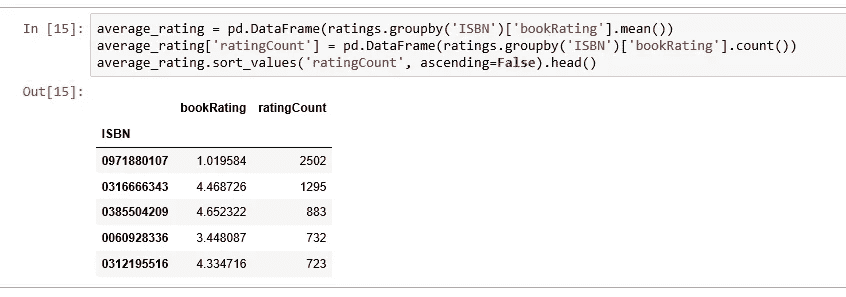

**观察结果**:

在这个数据集中，获得最多评价的书根本没有得到很高的评价。因此，如果我们使用基于评分的推荐，我们肯定会犯错误。所以，我们需要一个更好的系统。

## 为确保统计显著性，评级低于 200 的用户和评级低于 100 的图书被排除在外。

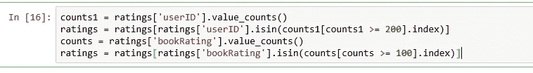

## 评级矩阵

我们将评级表转换成 2D 矩阵。这个矩阵将是稀疏的，因为不是每个用户都对每本书进行评级。

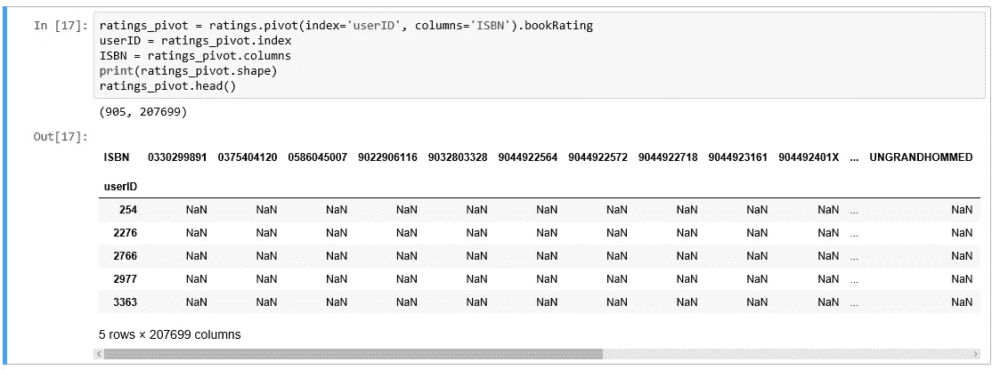

让我们来看看哪些书与排名第二的书《可爱的骨头:一部小说》相关。

引用[维基百科](https://en.wikipedia.org/wiki/The_Lovely_Bones)的话:“这是一个十几岁的女孩在被强奸和谋杀后，在她的个人天堂看着她的家人和朋友努力继续他们的生活，同时她接受了自己的死亡”。

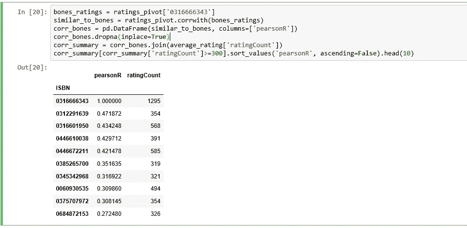

我们获得了图书的 ISBNs，但是我们需要找出书名，看看它们是否有意义。

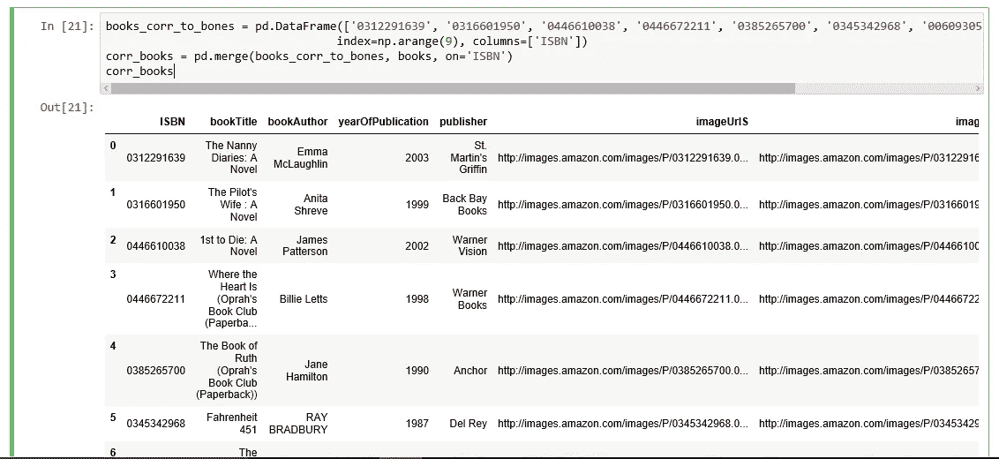

让我们从上面高度相关的列表中选择三本书来考察:《保姆日记:一部小说》、《飞行员的妻子:一部小说》和《心在哪里》。

**《保姆日记**》讽刺了曼哈顿上层社会在照看孩子的人眼中的形象。

《可爱的骨头》的作者是同一个人，《飞行员的妻子》是 Shreve 非正式三部曲中的第三部小说，故事发生在新罕布什尔州海岸的一座大型海滨别墅里，这里曾是一座修道院。

《心在何处》详细描述了美国低收入家庭和寄养儿童的苦难。

这三本书听起来会与《可爱的骨头》高度相关。看来我们的关联推荐系统正在发挥作用。

## 摘要

在这篇文章中，我们学习了如何设计简单的推荐系统，你可以在一个小时内实现并测试它。这篇博文的 Jupyter 笔记本版本可以在[这里](https://github.com/susanli2016/Machine-Learning-with-Python/blob/master/Recommender%20Systems%20-%20The%20Fundamentals.ipynb)找到。如果你想了解更多，Xavier Amatriain 的讲座是一个很好的起点。

在未来的帖子中，我们将介绍更复杂的方法，如基于内容的过滤、[k-最近邻](https://medium.com/towards-data-science/how-did-we-build-book-recommender-systems-in-an-hour-part-2-k-nearest-neighbors-and-matrix-c04b3c2ef55c)、协作过滤，以及如何提供推荐和如何测试推荐系统。在此之前，享受推荐！