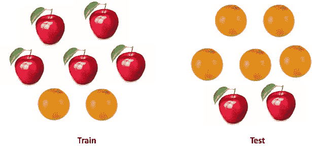
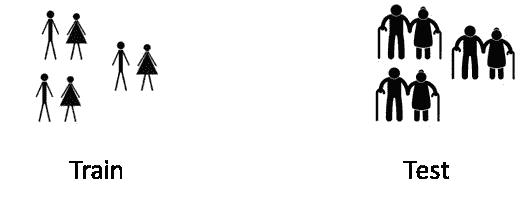
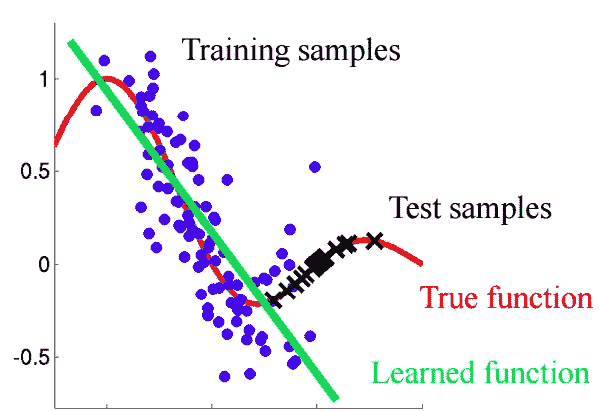
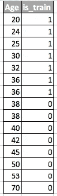
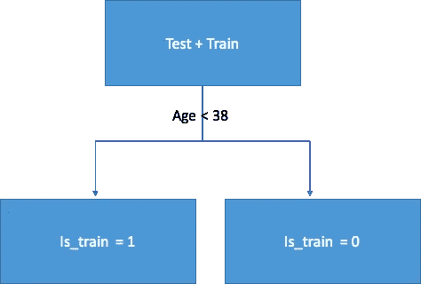
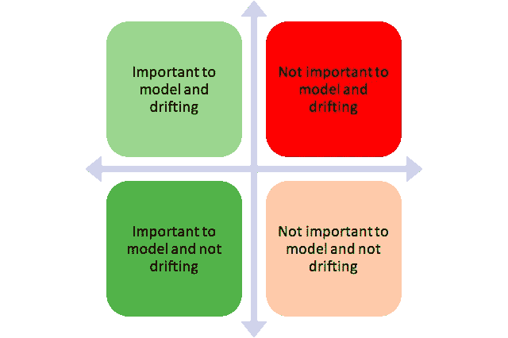
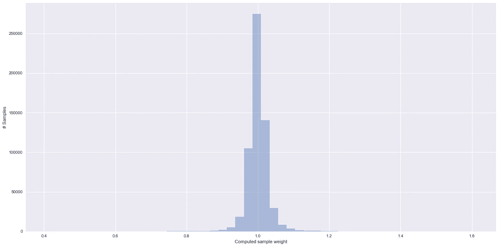

# 我的训练和测试数据有多相似？

> 原文：<https://towardsdatascience.com/how-dis-similar-are-my-train-and-test-data-56af3923de9b?source=collection_archive---------0----------------------->

## 了解机器学习模型可能失败的场景


他们总是说不要拿苹果和橘子比较。但是如果我们比较一种苹果和橘子的混合物和另一种苹果和橘子的混合物，但是分布是不同的呢？还能比吗？你会怎么做？

在现实世界的大多数情况下，你会遇到后者。



这在数据科学中经常发生。在开发机器学习模型时，我们遇到了这样一种情况，我们的模型在训练数据上表现很好，但在测试数据上却无法达到同样的性能。

我这里指的不是过度适应。即使我选择了基于交叉验证的最佳模型，但它在测试数据上的表现仍然很差，测试数据中仍有一些我们没有捕捉到的固有模式。

想象一下这样一种情况，我正试图模拟顾客的购物行为。现在，如果我的训练和测试数据如下所示，那么您可以清楚地看到这里的问题。



> 与测试相比，该模型将针对平均年龄较低的客户进行培训。这个模型从未见过像测试数据中那样的年龄模式。如果年龄是你的模型中的一个重要特征，那么它在测试中就不会有好的表现。

在这篇文章中，我将谈论如何识别这个问题，以及我们如何解决它的一些原始想法。

# 协变量移位

我们可以更正式地定义这种情况。**协变量**是指我们模型中的预测变量。**协变量移位**是指预测变量在训练和测试数据中具有不同**特征(分布)**的情况。

在有许多变量的现实世界问题中，协变量的变化很难发现。在这篇文章中，我试图讨论一种方法来识别这一点，以及如何解释这种训练和测试之间的转换。



# **基本思路**

> 如果存在协变量偏移，那么在混合训练和测试时，我们仍然能够以良好的准确性对每个数据点的来源(无论是来自测试还是训练)进行分类。



我们来了解一下原因。考虑上面的例子，其中年龄是测试和训练之间的漂移特征。如果我们采用类似随机森林的分类器，并尝试将行分类为测试和训练，年龄将成为分割数据时非常重要的特征。



# **实施**

现在，让我们尝试将这个想法应用到真实的数据集上。我用的是这次 kaggle 比赛的数据集:[https://www . ka ggle . com/c/Porto-seguro-safe-driver-prediction/data](https://www.kaggle.com/c/porto-seguro-safe-driver-prediction/data)

***第一步:数据预处理***

我们必须首先清理我们的数据，估算所有缺失值，并对所有分类变量进行标签编码。对于这个数据集，不需要这一步，所以我跳过了这一步

```
#loading test and train data
train = pd.read_csv(‘train.csv’,low_memory=True)
test = pd.read_csv(‘test.csv’,low_memory=True)
```

***Step2:*** ***表示产地来源***

我们必须在训练和测试数据中添加一个特征**‘is _ train’***。该特性的值对于测试为 **0，对于序列**为 1。*

```
*#adding a column to identify whether a row comes from train or not
test[‘is_train’] = 0
train[‘is_train’] = 1* 
```

****第三步:*** ***训考结合****

*然后我们必须把两个数据集结合起来。**此外，由于训练数据具有测试中不存在的原始“目标”变量，我们也必须删除该变量。***

***注意:**对于您的问题，“目标”将被您的原始问题的因变量的名称所替代*

```
*#combining test and train data
df_combine = pd.concat([train, test], axis=0, ignore_index=True)
#dropping ‘target’ column as it is not present in the test
df_combine = df_combine.drop(‘target’, axis =1)y = df_combine['is_train'].values #labels
x = df_combine.drop('is_train', axis=1).values #covariates or our independent variablestst, trn = test.values, train.values*
```

****第四步:*** ***构建并测试一个分类器****

*出于分类的目的，我使用**随机森林分类器**来预测组合数据集中每一行的标签。您也可以使用任何其他分类器。*

```
*m = RandomForestClassifier(n_jobs=-1, max_depth=5, min_samples_leaf = 5)
predictions = np.zeros(y.shape) #creating an empty prediction array*
```

*我们使用分层的 4 倍，以确保每个类别的百分比得到保留，并且我们一次覆盖全部数据。对于每一行，分类器将计算它属于训练的概率。*

```
*skf = SKF(n_splits=20, shuffle=True, random_state=100)
for fold, (train_idx, test_idx) in enumerate(skf.split(x, y)):
 X_train, X_test = x[train_idx], x[test_idx]
 y_train, y_test = y[train_idx], y[test_idx]

 m.fit(X_train, y_train)
 probs = m.predict_proba(X_test)[:, 1] #calculating the probability
 predictions[test_idx] = probs*
```

****第五步:*** ***解释结果****

*我们将输出我们的分类器的 ROC-AUC 度量，作为对该数据有多少协变量偏移的估计。*

> *如果分类器能够以良好的准确性将行分类到训练和测试中，我们的 AUC 得分应该在较高的一侧(大于 0.8)。这意味着训练和测试之间的强协变量转移。*

```
*print(‘ROC-AUC for train and test distributions:’, AUC(y, predictions))# ROC-AUC for train and test distributions: 0.49944573868*
```

> *AUC 值为 0.49 意味着没有明显的协变量变化。这意味着大多数观察值来自不特定于测试或训练的特征空间。*

*由于这个数据集取自 Kaggle，所以这个结果是意料之中的。因为在这种竞争中，数据集是经过精心策划的，以确保这种变化不存在。*

*在我们开始建模之前，可以对任何数据科学问题重复这一过程，以检查协变量的变化。*

# ***超越***

*在这一点上，我们要么观察协变量转移，要么不观察。那么，我们可以做些什么来提高测试数据的性能呢？？*

1.  *漂移特征的丢弃*
2.  *使用密度比估计的重要性权重*

***漂移特征的丢弃:***

***注:**此方法适用于你见证协变量移位的情况。*

*   *从我们在上一节中构建的随机森林分类器对象中提取特征重要性*
*   *顶部的特征是那些正在漂移并导致转变的特征*
*   *从顶部的功能中，一次放下一个变量，构建您的模型并检查其性能。收集所有不会降低性能的特性*
*   *现在，在构建最终模型时，删除所有这些功能*

**

*Bucketing of features*

> *我们的想法是移除红色桶中的要素*

***使用密度比估计的重要性权重***

***注:**无论是否存在协变量移位，该方法都适用。*

*让我们来看看我们在上一节中计算的预测。对于每个观察值，该预测告诉我们根据我们的分类器它属于训练数据的概率。*

```
*predictions[:10]
----output-----array([ 0.34593171])*
```

*因此，对于第一行，我们的分类器认为它属于概率为. 34 的训练数据。我们姑且称之为 P(火车)。或者我们也可以说它有 0.66 的概率来自测试数据。我们姑且称之为 P(测试)。魔术是这样的:*

*对于每一行训练数据，我们计算一个系数 **w = P(测试)/P(训练)**。*

*这个 w 告诉我们训练数据的观察值与我们的测试数据有多接近。下面是笑点:*

> *我们可以在我们的任何分类器中使用这个 w 作为样本权重，以增加这些看起来与我们的测试数据相似的观察值的权重。直觉上，这是有意义的，因为我们的模型将更侧重于从观察中捕捉模式，这似乎类似于我们的测试。*

*这些重量可以使用下面的代码来计算。*

```
*plt.figure(figsize=(20,5))
predictions_train = predictions[len(tst):] #filtering the actual training rows
weights = (1./predictions_train) — 1\. 
weights /= np.mean(weights) # Normalizing the weightsplt.xlabel(‘Computed sample weight’)
plt.ylabel(‘# Samples’)
sns.distplot(weights, kde=False)*
```

*您可以传递在模型拟合方法中计算的权重，如下所示:*

```
*m = RandomForestClassifier(n_jobs=-1,max_depth=5)m.fit(X_train, y_train, ***sample_weight=weights***)*
```

**

*Weights distribution for the training observations*

*以上情节中需要注意的一些事情:*

*   *观察值的权重越高，与测试数据越相似*
*   *几乎 70%的训练样本具有接近 1 的样本权重，因此来自对训练或测试高密度区域不是非常特定的特征空间。这与我们计算的 AUC 值一致*

# *结束注释*

*我希望现在你对协变量转换有了更好的理解，你可以如何识别它并有效地对待它。*

# *参考*

*[1] Shimodaira，H. (2000 年)。通过加权对数似然函数改进协变量移位下的预测推断。统计规划与推论杂志，90，227–244。
【2】比克尔，S. *等* (2009)。协变量移位下的鉴别学习。机器学习研究杂志，10，2137–2155*

*[https://github.com/erlendd/covariate-shift-adaption](https://github.com/erlendd/covariate-shift-adaption)*

*[4]所用数据集的链接:[https://www . ka ggle . com/c/Porto-seguro-safe-driver-prediction/data](https://www.kaggle.com/c/porto-seguro-safe-driver-prediction/data)*