# 温哥华人对(取消)拥挤收费有什么看法？一种社交媒体文本挖掘方法。

> 原文：<https://towardsdatascience.com/how-do-vancouverites-feel-about-de-congestion-pricing-a-social-media-text-mining-approach-90b3635f840c?source=collection_archive---------3----------------------->

温哥华是世界上许多考虑移动定价策略的城市之一，希望以此减少交通拥堵，促进公平，支持交通投资。成立了一个[移动定价独立委员会](https://www.itstimemv.ca/)，对在温哥华市引入[去拥堵收费](https://www.itstimemv.ca/decongestion-charging.html)的可行性进行研究并提出建议，以实现这些目标。

几周前，我在委员会的脸书官方网页上浏览对其中一个[帖子](https://www.facebook.com/itstimemv/posts/1977924269096300:0)的评论——“是时候了，Metro Vancouver*”——这两条评论引起了我的注意:*

*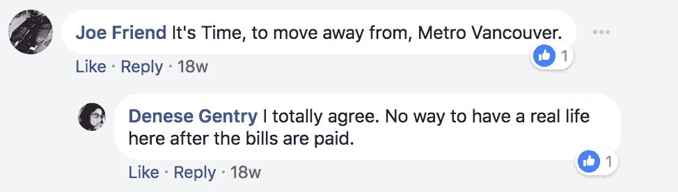*

*在同一周，我有机会参加了由新威斯敏斯特市组织的小组讨论，会上发表了不同的意见。许多与会者认为移动定价是减少拥堵的灵丹妙药，而其他人则严重关注公平、公正和可负担性。在脸书和推特的官方页面上，我也观察到了一个类似的趋势，这让我很好奇——温哥华人对拥堵费有什么看法？*

*我的假设是:这是一种消极的感觉。显而易见先生——嘿，我听到了！不要认为我的话是理所当然的。正如 w .爱德华兹·戴明曾经说过的:****我们信赖上帝；所有其他人带来的数据****。因此，让我们获取数据，进行一些分析，并对这一假设进行测试。***

******

***正如你将在几分钟后看到的，我的分析得出结论，虽然关于这个有争议的话题确实有复杂的感情，但负面的**情绪占主导地位。这是一种自然的反应:没有人愿意为他们曾经“免费”拥有的东西付费(许多纳税人认为这不是真正的免费)。这适用于任何形式的移动定价，尤其是在像美丽的温哥华这样的昂贵城市，以及我们目前支付的所有税收(包括汽油税)之外。也许这个一般观察的(唯一)例外是当人们看到引入新收费的价值时。不幸的是，真正的价值可能我们很多人都不清楚。*****

> ***在我们看结果之前，我想指出一个重要的注意事项。这种分析所感受到的表达出来的情绪可能不能用它们的真实程度来表示。只有通过精心设计的实验，从**的代表性样本**中收集数据，才能对感兴趣的量进行准确的估计。在这一分析中，来自用户在脸书官方帖子上互动的数据只被**使用了**。诚然，这个样本不能被认为是一个代表性的样本，但尽管如此，它提供了一个镜头来回答这个有趣的问题。***

***在接下来的两节中，我将解释数据是如何收集和分析的。分析在`R`中完成，源代码可在 [Github](https://github.com/moh-salah/Mobility-Pricing-Sentiment-Analysis) 上获得。***

# *****数据*****

***数据收集自 2017 年 10 月下旬至 2018 年 3 月中旬委员会的官方[脸书页面](https://www.facebook.com/pg/itstimemv/posts/)。这一时期涵盖了*是时候了*项目的整个公众参与阶段。***

**我使用了`Rfacebook`包——它提供了一个到[脸书 API](https://developers.facebook.com/) 的接口——来获取页面内容。数据分 3 步查询。首先我查询了帖子，然后是评论，最后是评论回复。帖子数据集包括发布的消息和类型(状态、照片、视频等。)，喜欢的次数和反应(喜欢，难过，生气等。)、份额数量、时间戳和 ID。评论和评论回复数据集的结构几乎相同。两个数据集都包括发表的评论、赞数、时间戳和 ID。**

# ****分析****

**为了测量用户的印象，我们将从两个方面分析这些数据:一个是通过用户对每个帖子做出反应的显式情绪(对帖子的分析)。另一种是通过使用文本挖掘技术的情感分析(评论分析)。我将在下面的小节中详细讨论这两种方法。**

****一、职位分析****

**为了将事情放入 perceptive 并了解页面的活跃程度，让我们看看每月的帖子数量:**

****

**下图显示了每月的参与度。我不是社交媒体专家(甚至不是一个非常活跃的用户！)，但是，我理解“参与度”一词在营销和广告领域可能有不同的含义。在这个分析中，我将参与度定义为“用户每月的总活动量”，包括喜欢、反应、评论和分享的数量。**

> **理想情况下，敬业度计算为一个比率或加权平均值，其中不同类型的敬业度根据其重要性进行加权。例如，一个帖子的分享应该比一个评论或类似的东西更重要。然而，就我有限的知识而言，没有明确的方法来量化这一点。因此，我决定简单地将不同类型的约定放在一起。也就是说，可能有一些重复计算(同一个人可能喜欢、分享和评论同一篇帖子)，这在下图中没有考虑到。由于我无法访问只有页面所有者或管理员才能访问的“洞察”数据(如帖子的总点击量或浏览量)，因此限制重复计算和/或计算更有意义的比率是不可行的。**

**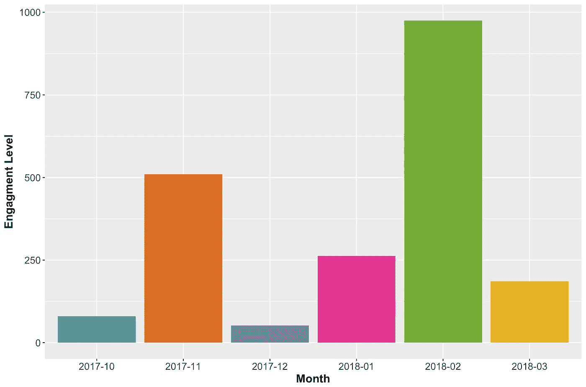**

**回到正题:看起来二月是参与度最高的月份。接下来，我们来看看帖子反应的分布情况:**

**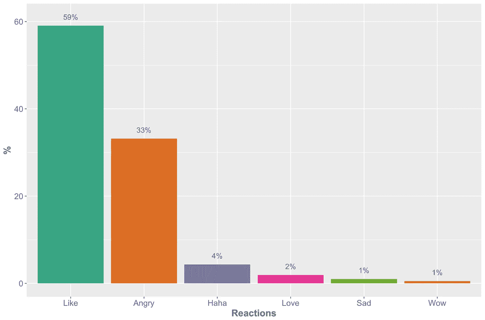**

**特别感兴趣的，点赞数和愤怒情绪。总的来说，喜欢的情绪多于愤怒的情绪。以下是在参与阶段每个月的平均反应数，即喜欢和愤怒反应数的趋势:**

**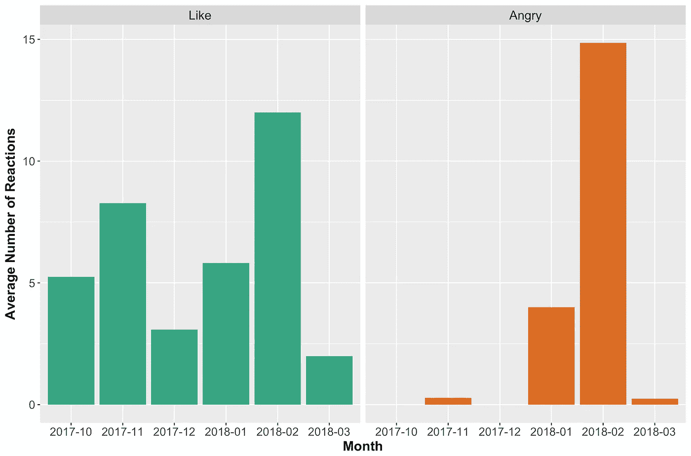**

**在参与活动的早期阶段，没有太多的愤怒反应，然而，这一数字在 2 月份达到了最高水平。有意思！看起来二月份的帖子收到了最多的喜欢和愤怒情绪！**

**让我们看看最受欢迎的帖子是什么？**

```
**We’re studying Distance-Based Charges: charging per kilometre driven within a given boundary, varying by time and location. We’re exploring ways this type of charge could work in Metro Vancouver to figure out whether this approach would reduce congestion, improve fairness, and support transportation investment in our growing region. We want to hear your thoughts when online engagement opens on February 26!**
```

**收到最多愤怒反应的帖子是什么？**

```
**We’re studying Distance-Based Charges: charging per kilometre driven within a given boundary, varying by time and location. We’re exploring ways this type of charge could work in Metro Vancouver to figure out whether this approach would reduce congestion, improve fairness, and support transportation investment in our growing region. We want to hear your thoughts when online engagement opens on February 26!**
```

**不，这不是一个错误！同样的帖子获得了最高数量的喜欢和愤怒的反应。在不同的拥挤收费方法(警戒线收费、过路费等)中。)，看起来“基于距离的收费”是页面上讨论的最有争议的方法。有道理，对吧？**

**在我们进入下一部分之前，让我们将反应分为积极(喜欢和爱)和消极(生气、悲伤、哈哈和哇)情绪。我把哈哈和哇的反应归类为负面情绪，因为在这种情况下，它们分别与讽刺和震惊联系在一起。**

**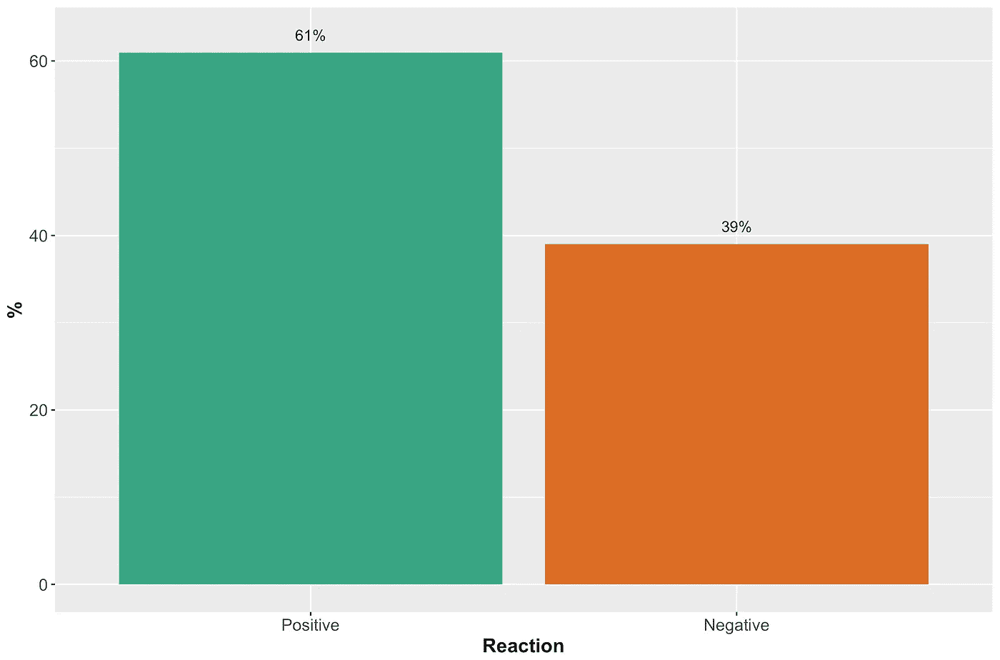**

**耶！**

**抓紧…我们不要太兴奋太快。评论中仍然隐藏着大量我们尚未看到的信息。下一节重点分析评论和评论回复。**

****二。评论分析****

**根据所选的分析单位，有许多可能的方法来分析文本数据。一种方法是将分析单位定义为单词。另一种方法是将其定义为文本块(一句或多句)。后一种方法更现实，但也更复杂。**

> **在我们深入分析之前，值得注意的是，我将评论和评论回复合并在一个数据集中。我还删除了页面管理员的所有评论，以便分析只关注用户的评论。在文本挖掘分析中，去除“停用词”和数字是很典型的，我也是这样做的。**

**现在，让我们来看看评论中最常用的词语:**

**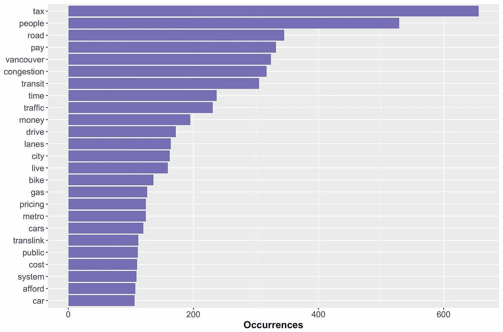**

**“拥堵”这个词没有进入前五名！“税”是使用最多的词，其次是“人”——嗯，“税务人”只是提醒一下，以防你想知道:“不”是一个停用词，从正在分析的词包中删除。**

**这里是评论中使用的漂亮的彩色单词云——颜色和大小表示每个组的排名:**

**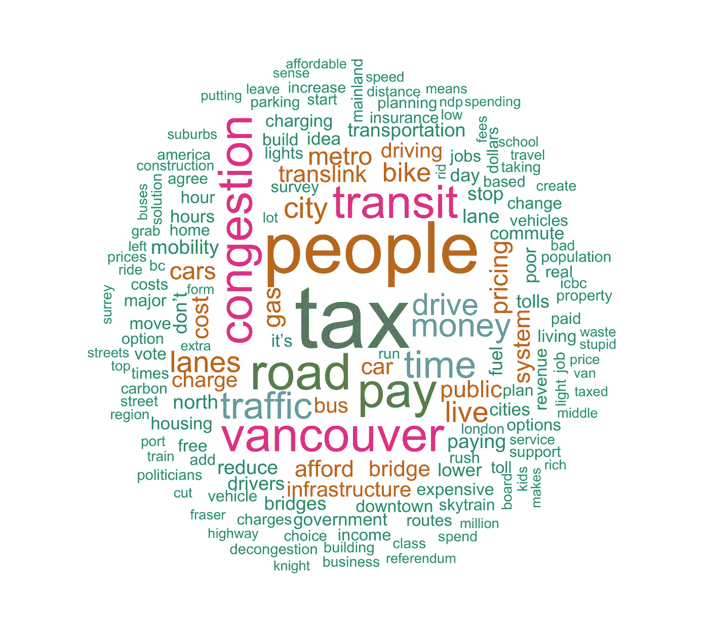**

**接下来，我们将讨论从用户评论中挖掘情感的两种方法:作为单词和作为评论。**

****二世。a .情感分析—字数****

**在我们看了词频之后，现在让我们来看看这些词背后潜在的情感。这个过程通常被称为**意见挖掘**或**情感分析。为了做到这一点，我们需要知道每个单词的相关情绪。幸运的是，有字典可以用来评估超过 27，000 个单词的相关意见或情绪。****

**在这个分析中，我使用了三个通用词汇:`AFINN`、`bing`和`nrc`——这三个都是`tidytext` `R`包的一部分。值得注意的是，这些词典是基于单字(即单个单词)。单字方法不考虑单词组合，如“不高兴”或“非常悲伤”。在某些文本中(如小说)，这可能不是一个问题。然而，对于预期会出现否定和讽刺的情况，比如在社交媒体文本中，基于词汇的方法可能不会返回最准确的结果。尽管如此，它们仍然可以用来获得评论中情感内容的总体感觉。**

**如使用 R 的 [*文本挖掘中所述，`nrc`词典以二元方式(“是”/“否”)将单词分类为积极、消极、愤怒、预期、厌恶、恐惧、快乐、悲伤、惊讶和信任。`bing`词典以二元方式将单词分为积极和消极两类。`AFINN`词典给单词打分在-5 到 5 之间，负分表示消极情绪，正分表示积极情绪。*](https://www.tidytextmining.com/sentiment.html#the-sentiments-dataset)**

**让我们来看看基于三种词汇的结果是如何比较的:**

**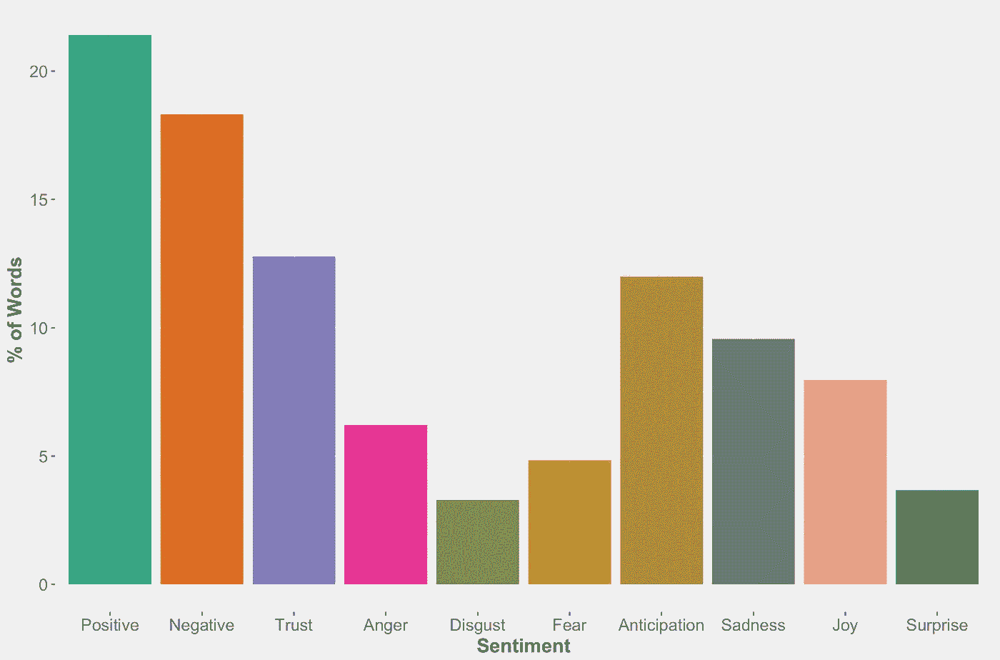**

**Word Sentiments using nrc lexicon**

**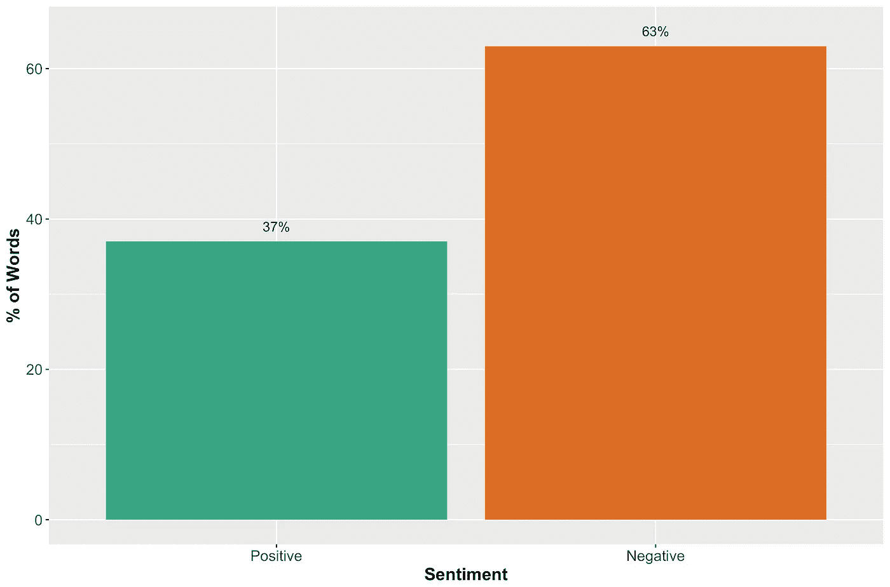**

**Word Sentiments using bing lexicon**

**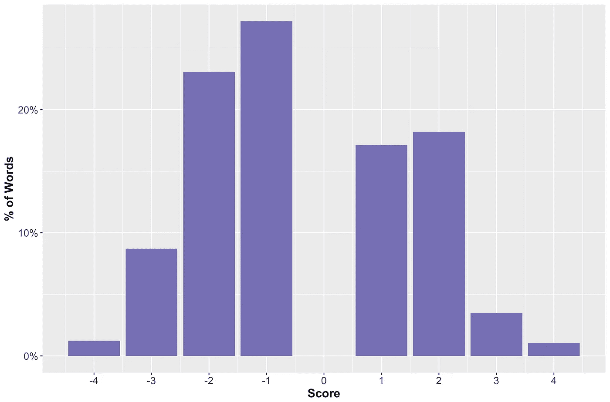**

**Word Sentiments using AFINN lexicon**

**看起来,`bing`和`AFINN`词汇的结果更加一致——负面情绪的词汇更多。另一方面，将`nrc`词典中的不同情绪分为积极情绪和消极情绪(类似于我们之前对帖子反应所做的)会导致两组之间的单词份额几乎相等。鉴于我前面提到的这种方法的局限性，我不想在这些结果上多费口舌。相反，让我们看看如何将评论作为一个文本单元而不是一个词来进行情感分析。**

****二。b .情感分析—评论****

**在本节中，我们的目标是为每条评论分配一个情感分数，同时将评论视为一个文本单元，而不是单个单词。几年前，这不是一个简单的问题。然而，多亏了谷歌，这现在变得更加可行和容易实现。**

**[谷歌云平台](https://cloud.google.com/)的[最新更新](https://cloud.google.com/blog/big-data/2017/01/new-features-in-the-google-cloud-natural-language-api-thanks-to-your-feedback)提供了强大的机器学习 API，这些 API 运行在复杂的深度学习模型背后，这些模型是多年来利用谷歌源源不断的数据和巨大的计算能力开发的。这些工具和服务使用户更容易在指尖驾驭机器学习的力量。自然语言处理(NLP) API 也不例外。我使用了`[googleLanguageR](https://cran.rstudio.com/web/packages/googleLanguageR)`包来访问 NLP API。为了能够访问这个 API，必须首先获得一个密钥。查看[谷歌文档](https://cloud.google.com/natural-language/docs/basics)获取快速入门指南。建立一个软件开发帐户，除了 300 美元的注册积分之外，还提供每月一定限额(NLP API 为 5000)的免费访问。**

**NLP API 提供不同的服务。出于本文的目的，我将只关注**情绪分析。**分析的重点是识别给定文本中的主流情感观点。根据谷歌的文档，情感是由数值`score`和`magnitude`来表示的。`score`的范围在-1 和 1 之间，表示总体情绪是消极的还是积极的。与`score`不同的是，`magnitude`没有规格化。然而，它是一个正整数，表示情绪的强度(消极或积极)，通常与文本的长度相关(文本越长，`magnitude`越高)。**

> **为了验证 API 结果，我评估了一堆注释和它们的赋值`scores`。结果相当不错。正如人们所料，API 背后的模型并不完美，但我多次惊讶于其对潜在情绪的捕捉。请记住，社交媒体文本通常是低质量的文本，包括拼写错误、表情符号和缩略语。我还注意到，非常短的评论经常得到零或接近零的`scores`。这可能表明，如果模型是不确定的，它会分配一个低的`score`——这是需要记住的。**

**下面是用户评论的`score`分布:**

**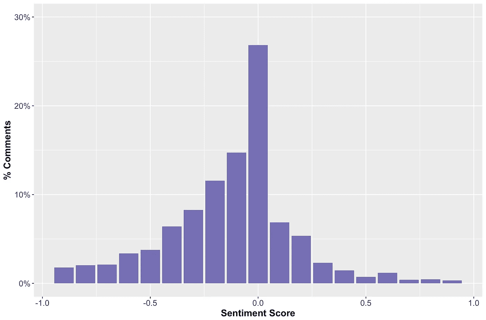**

**如你所见，负面评论比较多。然而，有很多零或接近零的评论`score`。我们应该如何处理这些问题？**

**总的来说，`score`和`magnitude`指标可用于测量四种情绪水平，即:积极、消极、中性和混合情绪。例如，零或接近零的文本`score`可能被解释为低情绪或混合情绪的文本。低情绪文本是一个中立的观点，而混合情绪文本是一个积极和消极情绪相互抵消的文本。谷歌建议用`magnitude`来区分两者。具有低`score`和低`magnitude`的文本应归类为中性文本，而混合文本将具有低`score`和高`magnitude`。低和高的定义相当宽松；这在很大程度上取决于分析的背景。基于`score`的分布，并通过检查个人评论，我发现，平均而言，`score`在-0.2 和 0.2 之间的文本既不明显是负面的，也不明显是正面的。类似地，通过查看`magnitude`低`score`评论的分布(在-0.2 和 0.2 的范围内)，0.5 似乎是定义低/高`magnitude`的合理界限。**

**如果你还记得，根据明确的反应(例如，喜欢，愤怒的情绪)，我们发现关于“基于距离的收费”的帖子是同时收到最多喜欢和愤怒情绪的帖子。你猜怎么着？结果发现，同一篇帖子收到的正面和负面评论最多(基于四个定义的情绪水平)。这是对情感分析结果的很好的验证。**

**我们来看看用户评论中情绪的四个层次的分布情况:**

**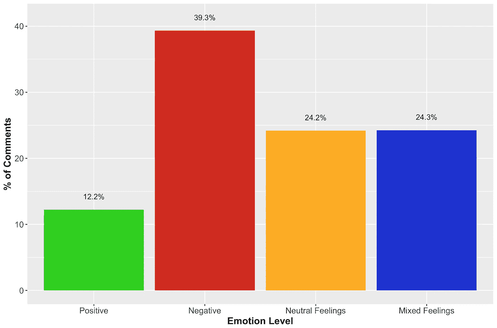**

**这并不奇怪。我们从`score`分布中得知，负面评论会更多。但是，正如你所看到的，也有相对较高比例的低情绪评论被分为中性和混合情绪评论。**

**现在让我们考虑一下看待这个问题的另一种方式。如果你是脸书用户，你可能知道评论和评论回复也可以被用户喜欢。让我们考虑这个假设的例子，对于一个给定的帖子，有两条评论:一条负面评论获得 10 个赞，一条正面评论获得 15 个赞。如果我们忽略喜欢的数量，我们会得出结论，该帖子被感知的比例为 50/50。然而，与一个负面评论和 10 个喜欢(11 个负面印象)相比，得出帖子被正面看待的结论可能更现实，因为有一个正面评论和 15 个喜欢(16 个正面印象)。下图显示了基于他们收到的评论和相关赞数的分布情况。**

**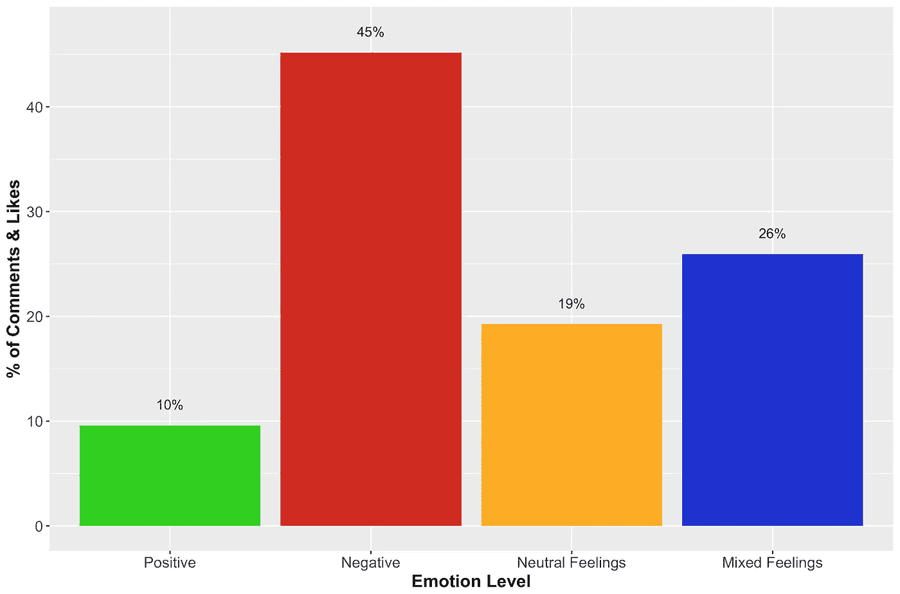**

> **这种方法是一种改进，但并不完美。同一个人可以任意多次评论一篇文章，也可以喜欢自己的评论。此外，更有可能的是，一个写了负面(或正面)评论的人也会喜欢同一帖子上的其他负面(或正面)评论。因为我们不知道对帖子(或评论)发表评论和/或喜欢评论(或评论回复)的用户的 id，所以我们在解释这些结果时必须小心——它们不代表用户的百分比。然而，有人可能会争辩说，这些影响可能会相互抵消，不应该对结果产生太大影响。不幸的是，我们没有更多的数据来确认。**

**最后，为了把事情放在一起，让我们把我们从用户对每个帖子的反应的显性情绪和我们从他们的评论中提取的隐性情绪结合起来。与我们之前所做的类似，我将喜欢和爱的反应的数量添加到正面评论及其相关喜欢的数量中，将愤怒、悲伤、哇和哈哈的反应的数量添加到负面评论及其相关喜欢的数量中。下面是情绪水平的总体分布:**

**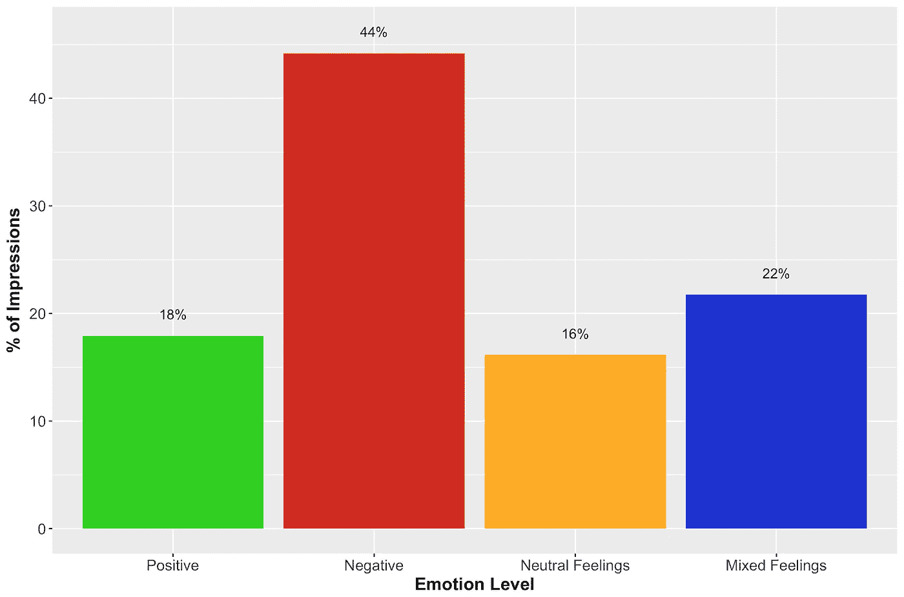**

**哒哒！该图总结了分析。它结合了我们从帖子和评论分析中学到的见解。这也证实了我最初的假设——负面情绪占主导地位。好消息是，现在我们对情绪水平的分布有了更好的认识。中性和混合感觉占整体分布的 40%左右。与强烈反对的人相比，不确定引入移动定价的人可能更容易改变看法。这可以通过解决他们关心的问题并帮助他们理解问题的复杂性和欣赏提议的解决方案来实现。第一步是确定这些评论和相关的意见/关注点——这种类型的分析有助于实现这一点。**

# **TL；博士；医生**

**在这篇文章中，我们使用文本挖掘技术来分析社交媒体源。特别是，从独立移动定价委员会的官方脸书网页收集数据。我们探索了几种分析公开可用数据的方法，并提出了一种了解用户情绪水平的方法。这是数据科学和机器学习如何从半非结构化数据中提供有价值的见解的一个例子。**

**交通拥堵和移动定价是影响每个人日常生活的争议话题。个人不太可能意识到向他们曾经免费拥有的东西收费的价值。这解释了为什么就需求管理这样一个复杂的概念教育公众不是一件容易的事情。我们发现，虽然用户表达了许多中性和混合的情绪，但负面情绪占主导地位。这样的反应是意料之中的。这一分析帮助我们理解了不同情绪水平的分布，这对制定公众参与策略非常有用。**

**谢谢你的来访！我希望你喜欢阅读这篇文章，我很想听到你的反馈。欢迎在评论中给我留言。**

> **在这个帖子中表达的观点和看法完全是我的。用于进行分析的数据和信息都是公开的，不包含任何敏感和/或个人信息。代码可在[这里](https://github.com/moh-salah/Mobility-Pricing-Sentiment-Analysis)获得，但是，数据集不符合 API 服务提供商的条款和条件。您可以通过按照代码中提供的步骤获取数据来重现结果。探索愉快！**