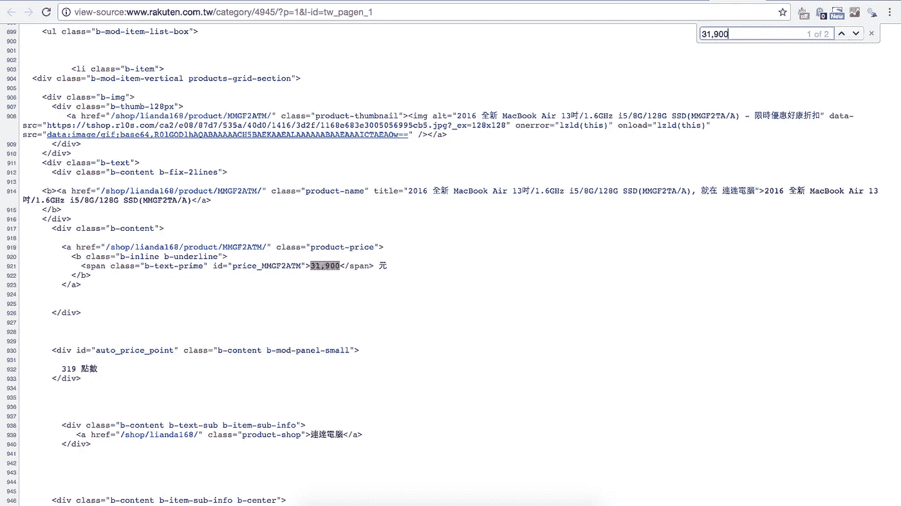
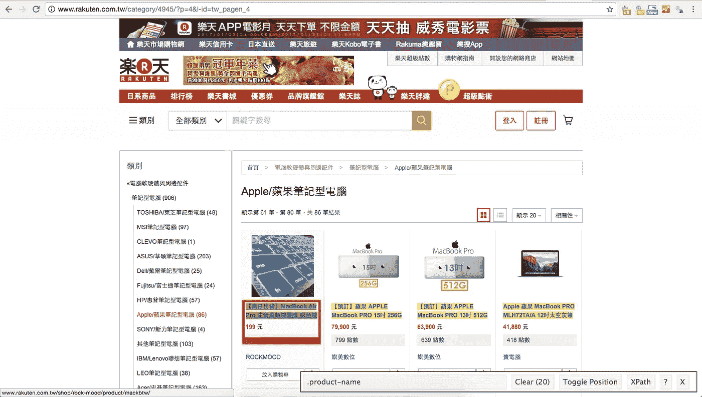
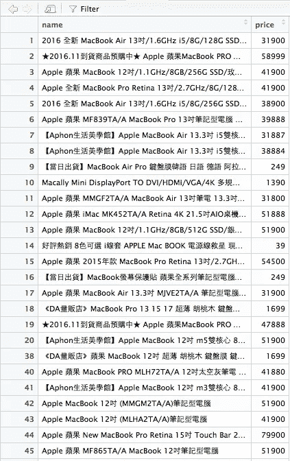
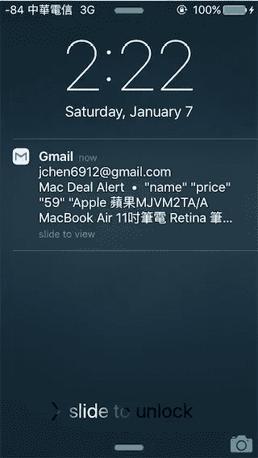
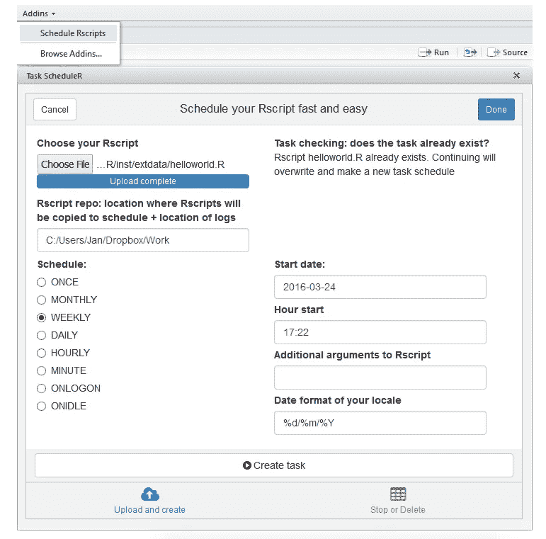

# 我们如何在网上自动找到每天的好交易？

> 原文：<https://towardsdatascience.com/how-do-we-find-daily-good-deals-online-automatically-fe8cfc8f783a?source=collection_archive---------0----------------------->


## 使用 R 进行基本的 web 内容抓取，以自动化枯燥的任务

> 背景

正如这里所定义的那样，“数据科学家比任何软件工程师都更擅长统计，比任何统计学家都更擅长软件工程。”因此，这篇博客文章重点关注 web 内容废弃的实践，这是数据科学家在结构化数据库之外获取信息的一项基本技能，当 API 不可用时。

当在网上寻找好的交易时，我们经常去一些电子商务网站查看我们想要的商品的价格。过了一段时间，这就变成了一项乏味的任务。受 [*程序员预订飞机指南*](https://hackernoon.com/the-programmers-guide-to-booking-a-plane-11e37d610045#.z50j983vh) 的启发，Zeke 在 Node 中编写了一个脚本来自动完成寻找廉价机票的过程，我们想在好的 MacBook 交易中复制他的方法，使用 r

> 目标

目的是当 MacBook 价格跌至某个点以下时，可以收到自动电子邮件提醒。

> 方法

1.  **从电子商务网站上删除产品信息**

我们需要首先加载网站的 html 结构，以便检索我们需要的信息。我们将使用的 R 包是 *rvest* 。

```
library(rvest)
library(XML)#save html of URL
url <- "[http://www.rakuten.com.tw/category/4945/?p=1&l-id=tw_pagen_1](http://www.rakuten.com.tw/category/4945/?p=1&l-id=tw_pagen_1)"
```

保存 URL html 后，我们需要通过检查页面源代码来找到我们需要的信息部分。我们将搜索价格以导航到产品相关信息，如下所示。



Screenshot of the page source

我们注意到产品相关信息在
**<div class = " b-content ">**
下，因此我们将只提取这一部分。

```
product <- url %>%
  read_html() %>%
  html_nodes(".b-content")
```

一个优秀的 Chrome 插件叫做 **SelectorGadget** 可以在这里下载[。这个工具可以让我们直观地选择我们想要的具体内容。](https://chrome.google.com/webstore/detail/selectorgadget/mhjhnkcfbdhnjickkkdbjoemdmbfginb?hl=en)

当我们选择产品名称时，内容将以绿色突出显示，如下所示。该工具还猜测我们还需要其他产品名称，因此它会用黄色突出显示其他产品名称。对于我们不需要的任何内容，我们可以单击它，它将被删除(颜色将变为红色)。



我们发现可以使用**提取产品名称。产品名称**，如页面底部所示。

```
name <- product %>%
  html_nodes(".product-name") %>%
  html_text()
```

接下来，我们将重复这个过程来查找价格并以数字格式保存它。

```
price <- product %>%
  html_nodes(".b-underline .b-text-prime") %>%
  html_text() %>%
  gsub(",","",.) %>%
  as.numeric()
```

完成后，我们可以将名称和价格保存在一个数据帧中。

```
all <- data.frame(name, price,stringsAsFactors = FALSE)
```

我们还需要删除多个页面来提取所有信息。

```
for (i in 1:10){
starturl <- "[http://www.rakuten.com.tw/category/4945/?p=](http://www.rakuten.com.tw/category/4945/?p=)"
nexturl <- "&l-id=tw_pagen_"
url <- paste(starturl,i,nexturl,i,sep="")product <- url %>%
  read_html() %>%
  html_nodes(".b-content")name <- product %>%
  html_nodes(".product-name") %>%
  html_text()price <- product %>%
  html_nodes(".b-underline .b-text-prime") %>%
  html_text() %>%
  gsub(",","",.) %>%
  as.numeric()mydata <- data.frame(name, price,stringsAsFactors = FALSE)
all <- rbind(all,mydata)
}all<-all[!duplicated(all),]
```

最终结果以 dataframe 格式存储在下面。



Screenshot of the scrapped prices on MacBooks

**2。创建发送电子邮件提醒的规则**

接下来，我们将设置接收电子邮件提醒的规则。假设我们只希望收到价格在新台币 25，000 元到新台币 30，000 元之间的产品的警报。

```
alert <- all[all$price>25000&all$price<=30000,]
```

接下来，如果至少有一个警报，我们将使用 *mailR* 包发送电子邮件，如下所示。

```
if (nrow(alert) >=1){write.table(alert,"alert.txt",fileEncoding = "UTF-8")send.mail(from = "[jchen6912@gmail.com](mailto:jchen6912@gmail.com)",
          to = c("[jchen6912@gmail.com](mailto:jchen6912@gmail.com)"),
          subject = "Mac Deal Alert",
          body <- "alert.txt",
          smtp = list(host.name = "smtp.gmail.com", port = 465, user.name = "[jchen6912@gmail.com](mailto:jchen6912@gmail.com)", passwd = "xxxxxxxx", ssl = TRUE),
          encoding = "utf-8",
          authenticate = TRUE,
          send = TRUE)
}
```



Screenshot of the automatic email alert received

**3。通过定期安排任务来自动化流程**

这可以通过 *taskscheduleR* 包来完成，但是目前只在 Windows 中可用。点击[此处](https://github.com/bnosac/taskscheduleR)了解更多详情。我们可以安排 Rscript 以所需的频率运行，并相应地接收自动警报。



Screenshot of the UI in taskscheduleR

这总结了关于如何为静态内容的网站删除内容的简短博客，然而，动态网站更复杂，可能需要额外的代码来模拟真实的浏览行为，如会员登录和表单提交。或者，类似的任务也可以用 Python 中的 *scrapy* 和 *BeautifulSoup* 来执行。

> r 代码

```
library(rvest)
library(XML)
library(taskscheduleR)
library(mailR)setwd("~/Desktop/deals")url <- "[http://www.rakuten.com.tw/category/4945/?p=1&l-id=tw_pagen_1](http://www.rakuten.com.tw/category/4945/?p=1&l-id=tw_pagen_1)"
product <- url %>%
  read_html() %>%
  html_nodes(".b-content")name <- product %>%
  html_nodes(".product-name") %>%
  html_text()price <- product %>%
  html_nodes(".b-underline .b-text-prime") %>%
  html_text() %>%
  gsub(",","",.) %>%
  as.numeric()all <- data.frame(name, price,stringsAsFactors = FALSE)for (i in 1:10){
starturl <- "[http://www.rakuten.com.tw/category/4945/?p=](http://www.rakuten.com.tw/category/4945/?p=)"
nexturl <- "&l-id=tw_pagen_"
url <- paste(starturl,i,nexturl,i,sep="")product <- url %>%
  read_html() %>%
  html_nodes(".b-content")name <- product %>%
  html_nodes(".product-name") %>%
  html_text()price <- product %>%
  html_nodes(".b-underline .b-text-prime") %>%
  html_text() %>%
  gsub(",","",.) %>%
  as.numeric()mydata <- data.frame(name, price,stringsAsFactors = FALSE)
all <- rbind(all,mydata)
}all<-all[!duplicated(all),]alert <- all[all$price>25000&all$price<=30000,]if (nrow(alert) >=1){write.table(alert,"alert.txt",fileEncoding = "UTF-8")send.mail(from = "[jchen6912@gmail.com](mailto:jchen6912@gmail.com)",
          to = c("[jchen6912@gmail.com](mailto:jchen6912@gmail.com)"),
          subject = "Mac Deal Alert",
          body <- "alert.txt",
          smtp = list(host.name = "smtp.gmail.com", port = 465, user.name = "[jchen6912@gmail.com](mailto:jchen6912@gmail.com)", passwd = "xxxxxxxx", ssl = TRUE),
          encoding = "utf-8",
          authenticate = TRUE,
          send = TRUE)
}
```

问有什么问题、意见或顾虑吗？
jchen6912@gmail.com