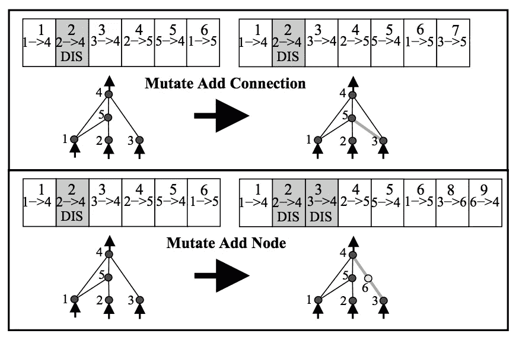
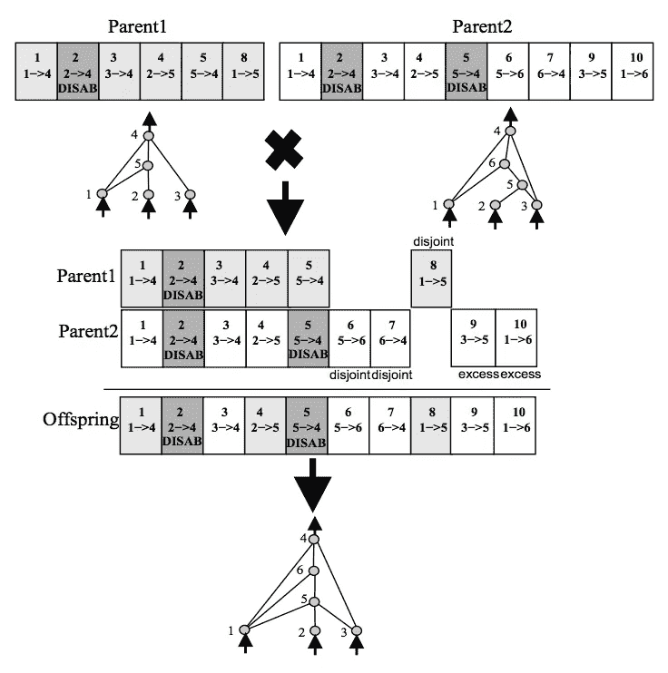

# 我们如何教会一台机器自己编程？—整洁的学习。

> 原文：<https://towardsdatascience.com/how-do-we-teach-a-machine-to-program-itself-neat-learning-bb40c53a8aa6?source=collection_archive---------1----------------------->

在这篇文章中，我将尝试解释一种叫做通过扩充拓扑进化神经网络(NEAT)的机器学习方法。

# **简介:**

我喜欢学习。打开一本书或一篇论文，谈论一个我还没有遇到的话题，并试图理解它，这真的很令人兴奋。有些人喜欢在空闲时间解决纵横字谜、数独或谜语来刺激他们的意识——我喜欢阅读论文并尝试实现所提出的算法。因为我喜欢学习，但遗憾的是，我无法学到我真正想学的所有东西，所以我对学习如何让计算机为我学习并向我提供有趣的信息特别感兴趣，这些信息可能会最大限度地提高我的学习效率。这些算法有助于构建复杂的信息，是“专家系统”领域的一部分。因此，我们的目标是“创造”一个“专家”,当你需要做决定的时候，你可以向他咨询。让我们从高层次上来看一个模型，它有助于创建那些被称为 NEAT 的“专家”。本文将介绍这个概念。在以后的文章中，我可能会分享实现示例。

# 什么是整洁？

Neat 代表“通过增强拓扑结构的神经网络”，并描述了自学习机器的算法概念，这些概念是由进化过程中的基因修改激发的。

生活本身绝对是迷人的。每当我观察自然时，我倾向于在所有生物中看到一个共同的特性，那就是信息。信息似乎是繁衍的核心传承。大自然能够优化过去 37 亿年传递的信息，创造了许多共存的不同物种。查尔斯·达尔文的适者生存的概念启发了我们对某些物种进化而其他物种灭绝的理解。进化计算机科学家的目标是通过模仿自然进化来构建寻求解决复杂问题的系统。

 [## 基因复制——维基百科

### 基因复制(或染色体复制或基因扩增)是产生新基因的主要机制

en.wikipedia.org](https://en.wikipedia.org/wiki/Gene_duplication) 

描述 NEAT 如何工作的最简单的方法是通过一个例子。如果你必须设计一个专家系统，让它以最优的方式为你玩游戏，那么相关的因素是什么？

**首先，**定义“玩家”被允许执行的所有潜在动作是很重要的。例如，超级马里奥能够跳跃、蹲下、向左、向右行走、扭动身体、快速奔跑等等。如果我们将一台机器连接到这些变量，并允许它执行这些变量，它将有可能做一些事情。

**其次，**给电脑定义一个目标很重要。NEAT 的工作原理有一个概念，叫做“健身得分”。健康分数是一个奖励成功的数学函数。在像马里奥这样的游戏中，体能分数是玩家向终点线前进的程度。健身分数函数中可以包含更多的变量，如收集的硬币、击败的敌人或完成比赛的总时间。

**第三，**定义进化的规则很重要。NEAT 允许节点的突变，节点之间的新连接，以及最适合的神经网络遗传到新的后代中。此外，NEAT 确保不同种类的“物种”可以共存，直到它们被允许相互竞争产生新的更健康的后代。为了确保最适合的物种生存下来，已经尝试过的网络不会在未来重复自己，并且现有的网络会优化自己，NEAT 为每个基因添加了一个创新编号，作为历史标记。

上图显示了通过添加连接的变异和通过添加节点的变异。在图中的上例中，从 2 到 4 的连接被禁用，而从 3 到 5 的新连接被创建。在下面的节点突变示例中，可以看到从 2 到 4 的连接是如何被禁用的，以及新节点 6 是如何被引入的，以及它是如何生成从 3 到 6 和从 6 到 4 的两个新连接的。

上图显示了进化是如何发生的。Parent 1 和 Parent 2 在节点和连接上确实有相似的结构，但是它们也有区别。现在，机器使用二进制逻辑来包含节点/连接或删除它。基本的决定机制是基于真与真是真，真与假是假，假与假是假。以这种方式，后代确保继承的信息是关于适应度分数的有希望的有效性，同时在后代中考虑新的进化节点和/或连接，并且禁用的父节点保持禁用。匹配基因是随机遗传的，而分离基因(那些中间不匹配的基因)和多余基因(那些最终不匹配的基因)是从更适合的亲本遗传的。在这种情况下，假设适合度相等，因此不相交和多余的基因也是随机遗传的。被禁用的基因可能会在未来几代中再次启用:如果父母中的任何一方禁用了某个遗传基因，该基因就有可能被禁用。”[斯坦利，Miikkulainen，109 页，整洁]

现在一切都或多或少清楚了，NEAT 可以通过迭代和进化新的神经网络来完成游戏，以达到最佳的健身分数。我强烈推荐阅读这篇论文，它写得非常好，只需要一点谷歌搜索的努力，初学者就能理解。但是如果你想有一个快速速成班，你也可以在 youtube 上观看这个精彩的视频:

NEAT 通过将复杂的问题分成可以优化的更小的问题来解决复杂的问题。可以为许多不同的单独任务开发 NEAT 代理，然后联合起来解决更复杂的问题。一个例子可以是使用 NEAT 创建新的药房，首先布局所有可以使用的原子，其次定义一个适应度函数，使模拟理解奖励系统，最后定义进化规则。另一个 NEAT 可用于选择生产新设计的药物的制造技术。一旦这两个系统结合在一起，针对成本效率优化的新适应度函数可以为新设计的药房创建最佳生产方法。这在理论上听起来很棒，但显然是一项非常复杂的任务，需要花费大量精力进行研发。

这是论文: