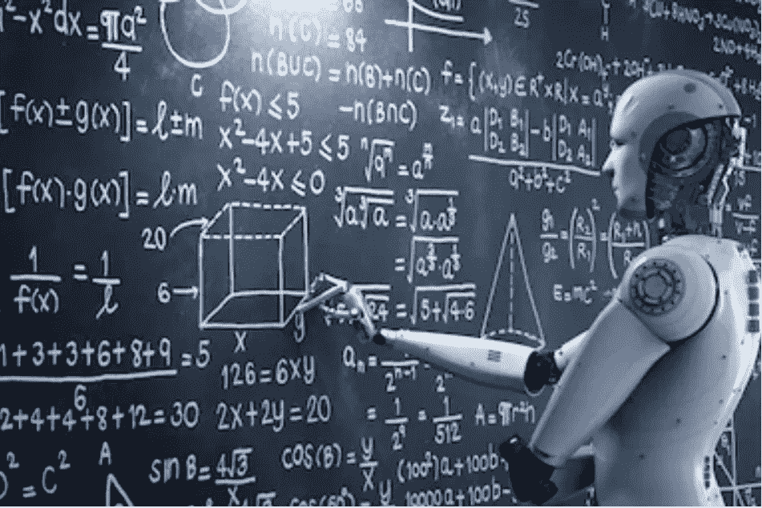
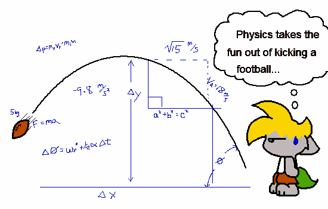
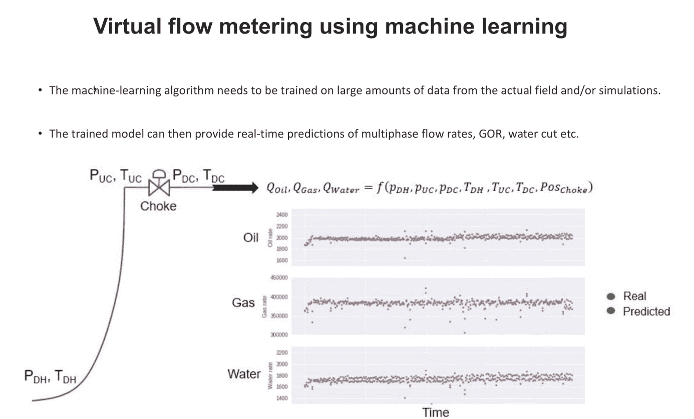

# 怎么把物理教给机器学习模型？

> 原文：<https://towardsdatascience.com/how-do-you-combine-machine-learning-and-physics-based-modeling-3a3545d58ab9?source=collection_archive---------7----------------------->

## 混合分析:结合两个世界的精华

在我的其他帖子中，我已经涉及了一些主题，如:[用于异常检测和状态监控的机器学习](https://www.linkedin.com/pulse/how-use-machine-learning-anomaly-detection-condition-flovik-phd/)、[机器学习如何用于生产优化](/machine-learning-for-production-optimization-e460a0b82237)，以及[如何避免机器学习用于时间序列预测的常见陷阱](/how-not-to-use-machine-learning-for-time-series-forecasting-avoiding-the-pitfalls-19f9d7adf424)。

但你知道吗，你也可以结合机器学习和基于物理的建模？在这里，我将描述它是如何实现的，以及我们如何向机器学习模型“教授物理”。

# 机器学习与基于物理的建模

作为一名物理学家，我喜欢制作数学模型来描述我们周围的世界。有了关于当前情况的足够信息，一个制作精良的基于物理学的模型使我们能够理解复杂的过程并预测未来的事件。这种模型已经在我们的现代社会中广泛应用于非常不同的过程，例如预测大型太空火箭的轨道或纳米大小物体的行为，这些都是现代电子学的核心。

做出预测的能力也是机器学习(ML)的重要应用之一。一个常见的关键问题是如何在基于物理的模型和数据驱动的 ML 模型之间进行选择。答案取决于你想解决什么问题。在这种情况下，主要有两类问题:

> 1)我们没有关于该系统的直接理论知识，但是我们有关于它如何表现的大量实验数据。

例如，如果你对一个系统的行为没有直接的了解，你就不能用数学模型来描述它并做出准确的预测。

幸运的是，并没有失去一切。如果你有很多示例结果，你可以使用基于 ML 的模型。给定足够多的示例结果(训练数据)，ML 模型应该能够学习关于系统的信息(输入变量)和您想要预测的结果(输出变量)之间的任何潜在模式。

这方面的一个例子是预测一个城市的房价。如果你有足够的同一地区类似房屋销售价格的例子，你应该能够对待售房屋的价格做出合理的预测。

> 2)我们对系统有很好的理解，并且我们也能够用数学方法描述它。

如果一个问题可以用基于物理的模型很好地描述，这种方法通常会是一个好的解决方案。

这并不意味着机器学习对于任何可以使用基于物理的建模来描述的问题都是无用的。相反，在混合建模方案中结合物理和机器学习是一个非常令人兴奋的前景。如此激动人心，事实上，它正在被深入研究。与我的工作相关，我最近一直在深入研究机器学习和基于物理的建模之间的交集。

# 混合分析:结合机器学习和基于物理的建模

即使一个系统，至少在原则上，可以用基于物理的模型来描述，这并不意味着机器学习方法不起作用。ML 模型从经验中学习的能力意味着它们也可以学习物理:给定足够多的物理系统如何表现的例子，ML 模型可以学习这种行为并做出准确的预测。

这种通过经验而不是通过数学方程来学习物理的能力对我们很多人来说都很熟悉，尽管我们可能没有意识到这一点:例如，如果你曾经踢足球，你可能会试图做出完美的射门。为了做到这一点，你必须准确预测球的路径。这是一个有点复杂的物理问题，包括几个变量，比如你踢球的力，你的脚的角度，球的重量，空气阻力，草地的摩擦力，等等。

然而，当一名足球运动员踢球时，这并不是他在几分之一秒内完成的复杂物理计算的结果。相反，他从经验中学到了正确的动作，并获得了完美击球的直觉。

*(* [*插画作者:越轨艺术*](https://chaoskomori.deviantart.com/art/The-Physics-of-Football-1870988) *)*

原则上，ML 模型(或算法)从经验中学习的事实类似于人类学习的方式。一类称为人工神经网络的 ML 模型是受大脑如何处理信息和从经验中学习启发的计算系统。

这种从经验中学习的能力也启发了我和我的同事尝试向 ML 模型教授物理学:我们通过向模型展示输入变量和正确解的例子来训练模型，而不是使用数学方程。

# 当我们已经有基于物理的模型时，为什么还要使用机器学习？

一个重要的问题是，当我们有一个基于物理的模型能够描述正在讨论的系统时，我们为什么要实施基于 ML 的方法。
其中一个关键方面是模型的计算成本:我们可能能够使用基于物理的模型来详细描述系统。但是，解决这个模型可能是复杂和耗时的。因此，如果我们的目标是一个可以根据实时数据进行实时预测的模型，基于物理学的方法可能会失败。

在这种情况下，更简单的基于 ML 的模型可能是一种选择。ML 模型的计算复杂度主要在训练阶段可见。一旦模型完成训练，对新数据进行预测就很简单了。这就是结合机器学习和基于物理的建模的混合方法变得非常有趣的地方。

# 通过混合建模方案的虚拟流量计量

例如，我们已经考虑将这种方法用于油井虚拟流量计量的特定任务，如下图所示。几个传感器可以提供油井井下 *P_dh、T_dh* 以及油井节流器上游 *P_uc、T_uc* 和下游 *P_dc、T_dc* 的温度和压力测量值。我们想要解决的问题是油、气和水的流量如何依赖于这些测量值:即描述多相流率的函数:

> Q_o，Q_g，Q_w = F(P_dh，P_uc，P_dc，T_dh，T_uc，T_dc，Pos_Choke)

这是一个复杂的建模任务，但使用最先进的模拟器工具，我们可以做到这一点，具有高度的准确性。

该模型捕捉了来自生产井的油、气和水的多相流的热力学和流体动力学。利用这一点，我们可以为 ML 模型生成大量模拟训练数据，并将它们与来自物理井的真实数据相结合。

这种方法的优点是，我们可以离线执行所有计算要求高的部分，快速实时预测不是问题。通过从基于物理的模型生成大量训练数据，我们可以向 ML 模型传授问题的物理原理。

经过训练的 ML 模型可以仅使用来自物理井的传感器测量值，即压力和温度，来同时预测油、气和水的流量。更重要的是，它可以在几分之一秒内做出这些预测，使其成为运行生产井实时数据的理想应用。

这种方法允许我们为生产设施上的所有油井实施虚拟多相流量计。毫无疑问，它将成为监控和生产优化的一个非常有价值的工具。

# 你认为还有哪些领域会受益于机器学习？

在未来，我相信机器学习将会被用在比我们今天所能想象的更多的地方。你认为它会对各个行业产生什么影响？我很想在下面的评论中听到你的想法。

如果你有兴趣了解更多与人工智能/机器学习和数据科学相关的主题，你也可以看看我写的其他一些文章。你可以在我的中型作者简介[中找到它们，你可以在这里找到。](https://medium.com/@vflovik)

而且，如果你想成为一个媒体会员，免费访问平台上的所有资料，你也可以使用下面我的推荐链接。(注意:如果您使用此链接注册，我也会收到一部分会员费)

 [## 通过我的推荐链接加入媒体- Vegard Flovik

### 作为一个媒体会员，你的会员费的一部分会给你阅读的作家，你可以完全接触到每一个故事…

medium.com](https://medium.com/@vflovik/membership) 

# 更多来自 Vegard Flovik 媒体:

1.  蒙特卡洛方法简介
2.  [从物理学到数据科学的转变](/q-a-with-a-data-scientist-1f872518315f)
3.  [什么是图论，你为什么要关心它？](https://builtin.com/machine-learning/graph-theory)
4.  [用于图像分类的深度迁移学习](/deep-transfer-learning-for-image-classification-f3c7e0ec1a14)
5.  [构建一个能读懂你思想的人工智能](https://www.linkedin.com/pulse/building-ai-can-read-your-mind-vegard-flovik-phd/)
6.  [机器学习:从炒作到现实应用](/machine-learning-from-hype-to-real-world-applications-69de7afb56b6)
7.  [人工智能和大数据隐藏的风险](/the-hidden-risk-of-ai-and-big-data-3332d77dfa6)
8.  [用于供应链管理的人工智能:预测分析和需求预测](/artificial-intelligence-in-supply-chain-management-predictive-analytics-for-demand-forecasting-80d2d512f155)
9.  [如何(不)使用机器学习进行时间序列预测:避免陷阱](/how-not-to-use-machine-learning-for-time-series-forecasting-avoiding-the-pitfalls-19f9d7adf424)
10.  [如何使用机器学习进行异常检测和状态监控](/how-to-use-machine-learning-for-anomaly-detection-and-condition-monitoring-6742f82900d7)
11.  [如何利用机器学习进行生产优化:利用数据提高绩效](/machine-learning-for-production-optimization-e460a0b82237)
12.  我们能使用纳米级磁铁建立人工大脑网络吗？

## 人工智能研讨会——从宣传到现实应用