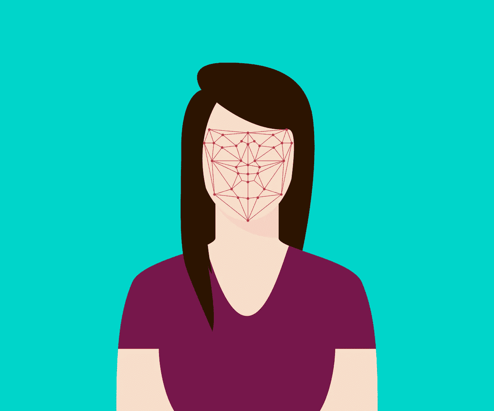
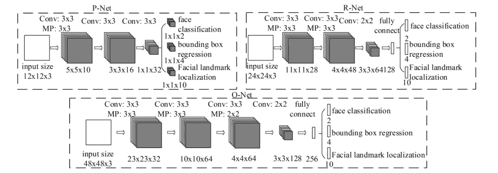
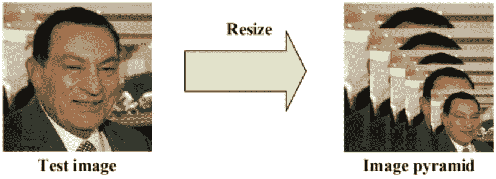
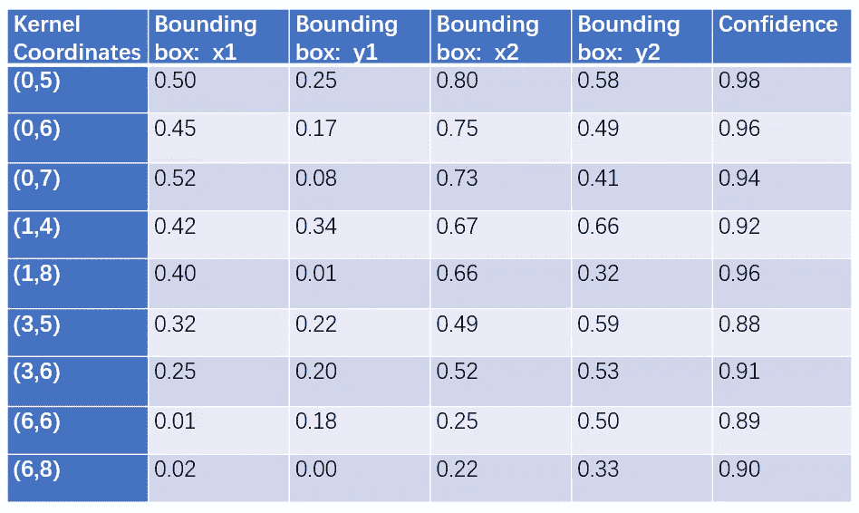
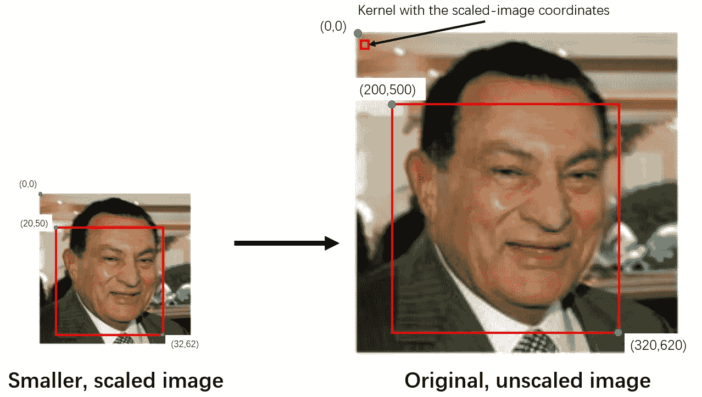
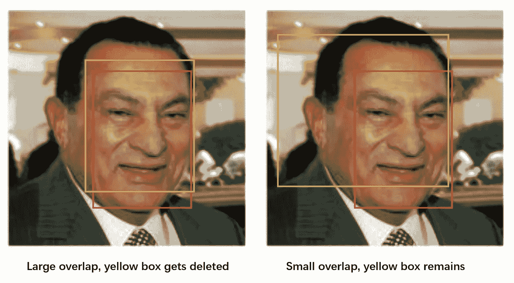
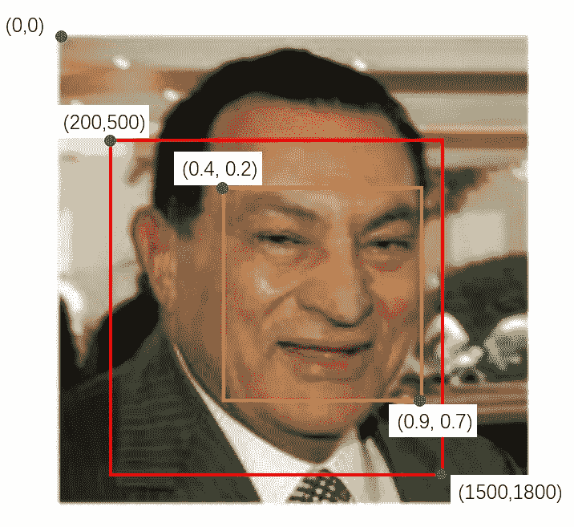
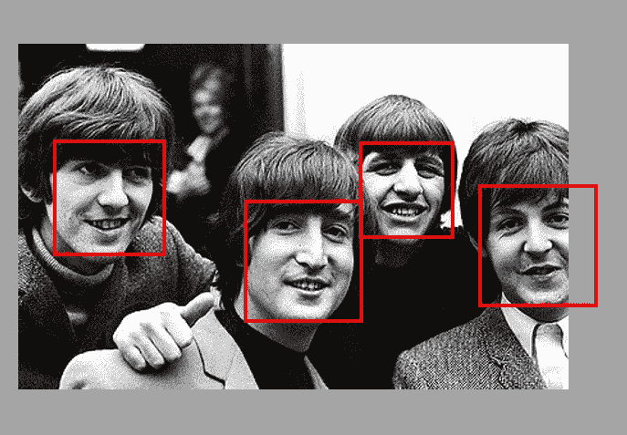

# 人脸检测程序是如何工作的？(使用神经网络)

> 原文：<https://towardsdatascience.com/how-does-a-face-detection-program-work-using-neural-networks-17896df8e6ff?source=collection_archive---------0----------------------->

## 神经网络人脸检测初学者指南

Cover image: Face Detection // [Source](https://pixabay.com/en/flat-recognition-facial-face-woman-3252983/)

最近，我一直在玩一个用于人脸检测的多任务级联卷积网络(MTCNN)模型。[该模型](http://arxiv.org/abs/1604.02878)具有三个卷积网络(P-Net、R-Net 和 O-Net ),能够在保持实时性能的同时超越许多人脸检测基准。但是，它到底是如何工作的呢？

***注:*** *如果你想要一个如何处理人脸检测神经网络的具体例子，我在下面附上了 MTCNN 模型的下载链接。下载后，打开。/mtcnn/mtcnn.py 并滚动到 detect_faces 函数。这是您在实现该模型时会调用的函数，因此浏览该函数会让您了解程序是如何计算和缩小边界框和面部特征的坐标的。但是，我不会一行一行地解读代码:这不仅会使本文变得冗长，而且对大多数读者来说也是适得其反的，因为代码中的许多参数只适用于这个特定的模型。*

Image 1: MTCNN Structure // [Source](https://arxiv.org/ftp/arxiv/papers/1604/1604.02878.pdf)

## 第一阶段:

显然，要做的第一件事是向程序传递一个图像。在这个模型中，我们想要创建一个**图像金字塔**，以便检测所有不同大小的人脸。换句话说，我们希望以不同的尺寸创建相同图像的不同副本，以便在图像中搜索不同尺寸的人脸。

Image 2: Image Pyramid // [Source](https://arxiv.org/ftp/arxiv/papers/1604/1604.02878.pdf)

对于每个缩放副本，我们有一个 12 x 12 的阶段 1 **内核**，它将遍历图像的每个部分，扫描人脸。它从左上角开始，是图像从(0，0)到(12，12)的一部分。图像的这一部分被传递给 P-Net，如果 P-Net 注意到人脸，它将返回边界框的坐标。然后，它将对部分(0+2a，0+2b)到(12+2a，12+2b)重复该过程，一次将 12 x 12 内核向右或向下移动 2 个像素。2 个像素的移动被称为**步距**，或者内核每次移动多少像素。

步长为 2 有助于降低计算复杂度，而不会显著牺牲精度。由于大多数图像中的人脸都比两个像素大得多，所以内核仅仅因为人脸移动了两个像素而错过它是极不可能的。同时，你的计算机(或任何运行这段代码的机器)将有四分之一的运算量要计算，使程序运行得更快，内存更少。

唯一的缺点是，我们必须重新计算与步幅相关的所有指标。例如，如果内核在向右移动一步后检测到一张人脸，输出索引将告诉我们该内核的左上角在(1，0)。但是，因为步幅是 2，所以我们必须将索引乘以 2 才能得到正确的坐标:(2，0)。

每一个核相对于一幅大图像来说都要小一些，所以它能够在大图像中找到更小的脸。类似地，相对于较小尺寸的图像，内核会更大，因此它能够在较小尺寸的图像中找到较大的人脸。

Video: Kernels can find smaller faces in larger images, and bigger faces in smaller images.

传入图像后，我们需要创建图像的多个缩放副本，并将其传入第一个神经网络——P-Net——并收集其输出。

Image 3: Sample output for P-Net. Note that the actual output has 4 dimensions, but for simplicity, I’ve combined it into a 2-dimensional array. Also, the coordinates for the bounding boxes are values between 0 and 1: (0,0) would be the top left corner of the kernel, while (1,1) would be the bottom right corner of the kernel.

P-Net 的权重和偏差已经被训练，使得它为每个 12×12 核输出相对准确的边界框。然而，网络对一些盒子比其他的更有信心。因此，我们需要解析 P-Net 输出，以获得每个边界框的置信度列表，并删除具有较低置信度的框(即，网络不太确定是否包含人脸的框)

Image 4: Standardizing kernel coordinates by multiplying it by the scale

在我们挑选出具有较高可信度的框后，我们必须标准化坐标系，将所有坐标系转换为实际的“未缩放”图像的坐标系。由于大多数内核位于缩小的图像中，因此它们的坐标将基于较小的图像。

然而，仍然有许多边界框留下，并且它们中的许多重叠。**非最大抑制**，或 NMS，是一种减少边界框数量的方法。

在这个特定的程序中，NMS 是通过首先根据置信度或得分对边界框(以及它们各自的 12×12 个内核)进行排序来进行的。在其他一些模型中，NMS 采用最大的包围盒，而不是网络最有信心的那个。

随后，我们计算每个核的面积，以及每个核与得分最高的核之间的重叠面积。与得分高的内核重叠很多的内核会被删除。最后，NMS 返回一个“幸存”边界框的列表。

Image 5: Non-Maximum Suppression

我们对每个缩放的图像进行一次 NMS，然后对每个尺度中所有幸存的内核再进行一次。这消除了多余的边界框，允许我们将搜索范围缩小到每张脸一个精确的框。

为什么我们不能只选择可信度最高的盒子，把其他的都删掉呢？上图只有一张脸。然而，在其他图像中可能有不止一张脸。如果是这样，我们将会删除其他面的所有边界框。

之后，我们将边界框坐标转换为实际图像的坐标。现在，每个边界框的坐标是一个介于 0 和 1 之间的值，其中(0，0)是 12 x 12 内核的左上角，(1，1)是右下角(见上表)。通过将坐标乘以实际的图像宽度和高度，我们可以将边界框坐标转换为标准的实际大小的图像坐标。

Image 6: Here, the red box is the 12 x 12 kernel, while the yellow box is the bounding box inside it.

在此图中，红框代表 24 x 24 内核，大小调整回原始图像。我们可以计算内核的宽度和高度:1500–200 = 300，1800–500 = 300(注意宽度和高度不一定是 12。这是因为我们使用了原始图像中内核的坐标。这里我们得到的宽度和高度是当缩小到原来的尺寸时内核的宽度和高度。)之后，我们将包围盒坐标乘以 300: 0.4x300 = 120，0.2x300 = 60，0.9x300 = 270，0.7x300 = 210。最后我们加上内核的左上坐标，得到包围盒的坐标:(200+120，500+60)和(200+270，500+210)或者(320，560)和(470，710)。

由于边界框可能不是正方形的，我们通过拉长较短的边将边界框整形为正方形(如果宽度小于高度，我们向侧面扩展；如果高度小于宽度，我们就垂直展开)。

最后，我们保存边界框的坐标，并将其传递给阶段 2。

## 第二阶段:

有时，图像可能只包含从框架侧面窥视的脸部的一部分。在这种情况下，网络可能会返回一个部分超出框架的边界框，就像下面照片中 Paul McCartney 的脸:

Image 7: The Beatles and their bounding boxes. Paul McCartney’s box is out of bounds and requires padding. // [Source](https://www.flickr.com/photos/beatlesmaniac11/4191790770)

对于每个边界框，我们创建一个相同大小的数组，并将像素值(边界框中的图像)复制到新数组中。如果边界框超出边界，我们只将边界框中的图像部分复制到新数组中，并用 0 填充其他所有内容。在上图中，麦卡特尼脸部的新数组在盒子的左侧有像素值，在右边附近有几列 0。这个用 0 填充数组的过程叫做**填充**。

填充边界框数组后，我们将它们的大小调整为 24 x 24 像素，并将其归一化为-1 到 1 之间的值。目前，像素值在 0 到 255 之间(RGB 值)。通过将每个像素值减去 255 的一半(127.5)并除以 127.5，我们可以将它们的值保持在-1 和 1 之间。

现在我们有了许多 24 x 24 的图像数组(与阶段 1 中幸存的边界框的数量一样多，因为这些边界框中的每一个都已被调整大小并归一化到这些内核中)，我们可以将它们输入 R-Net 并收集其输出。

R-Net 的输出类似于 P-Net 的输出:它包括新的、更精确的边界框的坐标，以及每个边界框的置信度。

再一次，我们去除具有较低置信度的盒子，并且对每个盒子执行 NMS 以进一步消除冗余的盒子。由于这些新边界框的坐标是基于 P-Net 边界框的，我们需要将它们转换成标准坐标。

标准化坐标后，我们将边界框整形为正方形，以传递给 O-Net。

## 第三阶段:

在我们可以从 R-Net 传入边界框之前，我们必须首先填充所有超出边界的框。然后，在我们将框的大小调整为 48 x 48 像素后，我们可以将边界框传入 O-Net。

O-Net 的输出与 P-Net 和 R-Net 略有不同。O-Net 提供 3 个输出:边界框的坐标(out[0])、5 个面部标志的坐标(out[1])和每个框的置信度(out[2])。

再一次，我们去除了具有较低置信水平的框，并且标准化了边界框坐标和面部标志坐标。最后，我们让他们通过最后一个 NMS。此时，图像中的每个面应该只有一个边界框。

## **交付结果:**

最后一步是将所有的信息打包到一个字典中，字典有三个关键词:“盒子”、“信心”和“关键点”。“框”包含边界框的坐标，“置信度”包含每个框的网络置信度，而“关键点”包含每个面部标志(眼睛、鼻子和嘴的端点)的坐标。

当我们想在自己的代码中实现这个模型时，我们所要做的就是调用 detect_faces，我们将得到这个字典，其中包含绘制边界框和标记面部特征所需的所有坐标。

## 下面是整个过程的简短总结:

**第一阶段:**

1.  传入图像
2.  创建图像的多个缩放副本
3.  将缩放图像输入 P-Net
4.  收集 P-Net 输出
5.  删除低置信度的边界框
6.  将 12 x 12 内核坐标转换为“未缩放图像”坐标
7.  每个缩放图像中内核的非最大值抑制
8.  所有内核的非最大抑制
9.  将边界框坐标转换为“未缩放图像”坐标
10.  将边界框整形为方形

**第二阶段:**

1.  填充未装订的盒子
2.  将缩放后的图像输入 R-Net
3.  收集 R-Net 输出
4.  删除低置信度的边界框
5.  所有框的非最大抑制
6.  将边界框坐标转换为“未缩放图像”坐标
7.  将边界框整形为方形

**第三阶段:**

1.  填充未装订的盒子
2.  将缩放图像输入 O-Net
3.  收集 O-Net 输出
4.  删除低置信度的边界框
5.  将边界框和面部标志坐标转换为“未缩放图像”坐标
6.  所有框的非最大抑制

**交付结果:**

1.  将所有坐标和置信度打包到一个字典中
2.  归还字典

## 最后备注:

这个模型与我以前遇到的模型很不一样。它不仅仅是一个普通的旧神经网络:它利用一些有趣的技术来实现高精度和更少的运行时间。

低计算复杂度导致快速运行时间。为了实现实时性能，它使用步长 2，将操作数量减少到原来的四分之一。在边界框坐标被校准之后，它直到最后一个网络(O-Net)才开始寻找面部标志，这甚至在它开始计算之前就缩小了面部特征的坐标。这使得程序快了很多，因为它只需要在通过 O-Net 的几个盒子中找到面部标志。

深度神经网络实现了高精度。拥有 3 个网络(每个网络都有多个图层)可以提高精度，因为每个网络都可以微调前一个网络的结果。此外，该模型采用图像金字塔来查找大脸和小脸。即使这可能会产生大量的数据，NMS，以及 R-Net 和 O-Net，都有助于拒绝大量的错误边界框。

看着这个模型的高性能，我不禁想知道我们还可以利用这个模型做什么。它能识别某些动物吗？某些车？能不能调成既能做面部识别，又能做面部检测？这个模型——以及它的应用——给了我们无数的未来应用。

*   点击[此处](https://medium.com/@reina.wang/mtcnn-face-detection-cdcb20448ce0)阅读实现 MTCNN 模型！
*   点击[这里](https://medium.com/@reina.wang/face-detection-neural-network-structure-257b8f6f85d1)阅读 MTCNN 模型的网络结构！

点击此处下载 MTCNN 论文和资源:

*   Github 下载:【https://github.com/ipazc/mtcnn 
*   研究文章:[http://arxiv.org/abs/1604.02878](http://arxiv.org/abs/1604.02878)