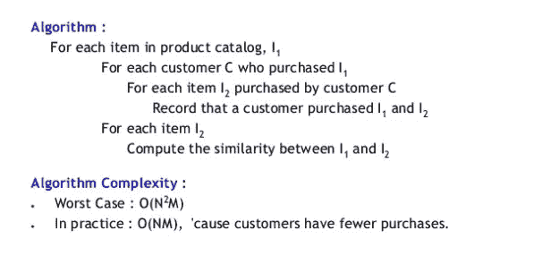
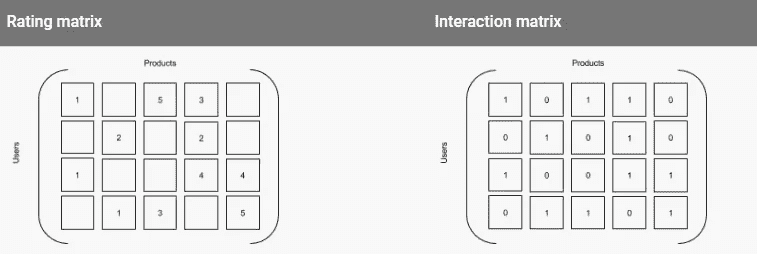
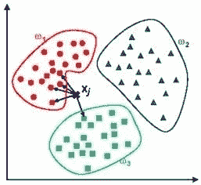

# 一个推荐引擎到底是怎么工作的？

> 原文：<https://towardsdatascience.com/how-does-a-recommendation-engine-really-work-656bdf12a5fc?source=collection_archive---------1----------------------->

在我们上一篇博客中，我们了解了推荐引擎的基本知识以及不同类型的推荐引擎。听了这么多关于推荐引擎的介绍，你一定很想了解它实际上是如何工作的，以及它是如何向客户展示他/她最可能喜欢的东西的。根据文章[在计算引擎上使用机器学习进行产品推荐](https://cloud.google.com/solutions/recommendations-using-machine-learning-on-compute-engine)，典型的推荐引擎通过以下四个阶段处理数据，即收集、存储、分析和过滤。

# 数据收集:

创建推荐引擎的第一步是收集数据。数据可以是显式数据，也可以是隐式数据。显式数据将由用户输入的数据组成，例如对产品的评级和评论。隐式数据将是订单历史/退货历史、购物车事件、页面视图、点进和搜索日志。将为访问该网站的每个用户创建该数据集。

行为数据很容易收集，因为你可以在你的网站上记录用户的活动。收集这些数据也很简单，因为它不需要用户的任何额外操作；他们已经在使用这个应用程序了。这种方法的缺点是更难分析数据。例如，从不太需要的日志中筛选出需要的日志可能很麻烦。

由于每个用户对某个产品肯定会有不同的喜好或厌恶，他们的数据集将是不同的。随着时间的推移，当你“喂”给引擎更多的数据时，它会越来越聪明地给出建议，这样你的电子邮件订户和客户就更有可能参与、点击和购买。就像亚马逊的推荐引擎如何与“经常一起购买”和“推荐给你”标签一起工作一样。

# 存储数据:

您可以为算法提供的数据越多，推荐就越好。这意味着任何推荐项目都可以迅速转变为大数据项目。

用于创建建议的数据类型可以帮助您决定应该使用的存储类型。您可以选择[使用 NoSQL 数据库](https://www.marutitech.com/nosql-big-data/)，一个标准的 SQL 数据库，甚至是某种对象存储。这些选项中的每一个都是可行的，具体取决于您是否在捕获用户输入或行为，以及实施的容易程度、存储可以管理的数据量、与环境其余部分的集成以及可移植性等因素。

当保存用户评级或评论时，可扩展和可管理的数据库最大限度地减少了所需的任务数量，并有助于专注于推荐。Cloud SQL 满足了这两个需求，并且使得直接从 Spark 加载数据变得很容易。

# 分析数据:

我们如何找到具有相似用户参与度数据的项目？为此，我们使用不同的分析方法过滤数据。如果你想在用户浏览产品时向他们提供即时的建议，那么你就需要一种更灵活的分析方式。[我们可以分析数据的一些方法有:](https://www.marutitech.com/recommendation-engine-benefits/)

*   **实时系统**可以在数据被创建时对其进行处理。这种类型的系统通常包含可以处理和分析事件流的工具。需要一个实时系统来给出即时的建议。
*   **批量分析**要求你定期处理数据。这种方法意味着需要创建足够的数据来进行相关的分析，比如日销售量。批处理系统可以在以后发送电子邮件。
*   **近实时分析**让您能够快速收集数据，以便每隔几分钟或几秒钟刷新一次分析。接近实时的系统最适合在同一浏览会话期间提供推荐。

# 过滤数据:

下一步是过滤数据，以获得向用户提供推荐所需的相关数据。我们必须从上面解释的算法列表中选择一个更适合推荐引擎[的算法。喜欢](https://www.marutitech.com/recommendation-engine-benefits/)

*   **基于内容:**一个受欢迎的、推荐的产品与用户观看或喜欢的产品具有相似的特征。
*   **集群**:推荐的产品搭配的很好，不管其他用户做过什么。
*   **协作**:喜欢与另一个用户查看或喜欢的产品相同的产品的其他用户，也会喜欢一个推荐的产品。

协同过滤使您能够将产品属性理论化，并根据用户口味进行预测。这种过滤的输出基于这样的假设，即过去喜欢相同产品的两个用户现在或将来很可能会喜欢相同的产品。

您可以将关于评分或互动的数据表示为一组矩阵，以产品和用户作为维度。假设以下两个矩阵相似，但我们用数字 1 替换现有评分，用数字 0 替换缺失评分，从第一个矩阵中减去第二个矩阵。结果矩阵是一个真值表，其中数字 1 代表用户与产品的交互。

Ref: [https://cloud.google.com/solutions/recommendations-using-machine-learning-on-compute-engine#storing_the_data](https://cloud.google.com/solutions/recommendations-using-machine-learning-on-compute-engine#storing_the_data)

我们使用 K-Nearest 算法、Jaccard 系数、Dijkstra 算法、余弦相似度来更好地关联基于评级或产品进行推荐的人的数据集。

上图显示了 k-nearest 算法的聚类过滤是如何工作的。

然后最后，过滤和使用算法后获得的结果，基于推荐类型的时效性向用户给出推荐。无论是实时推荐还是稍后发送电子邮件。

在我们的下一篇博客中，我们将解释您的组织如何实现产品推荐引擎，以及与它相关的好处。