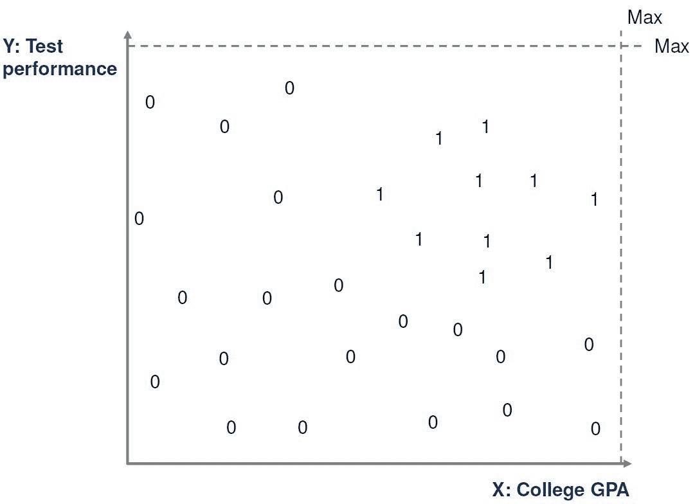
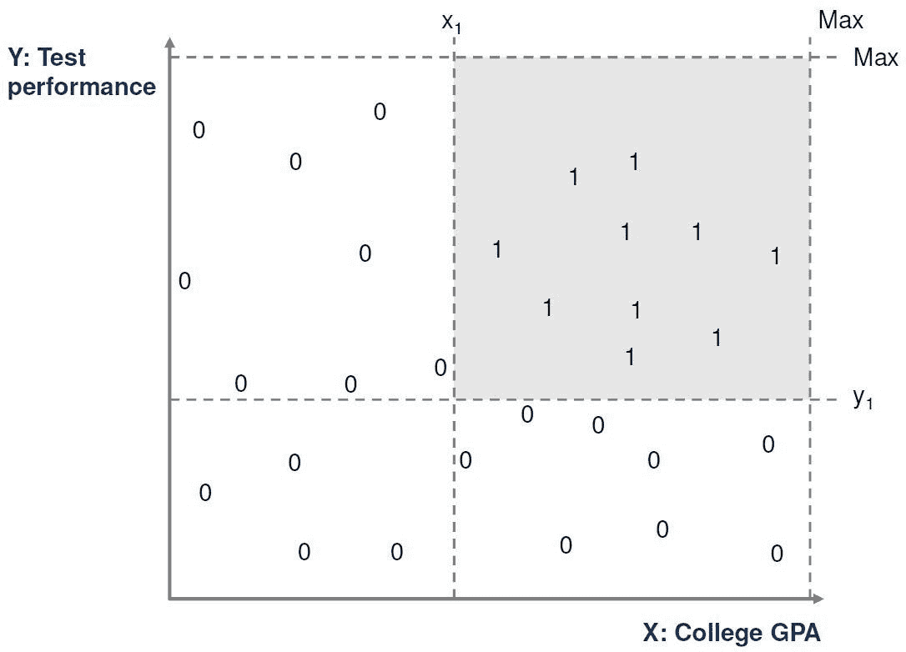
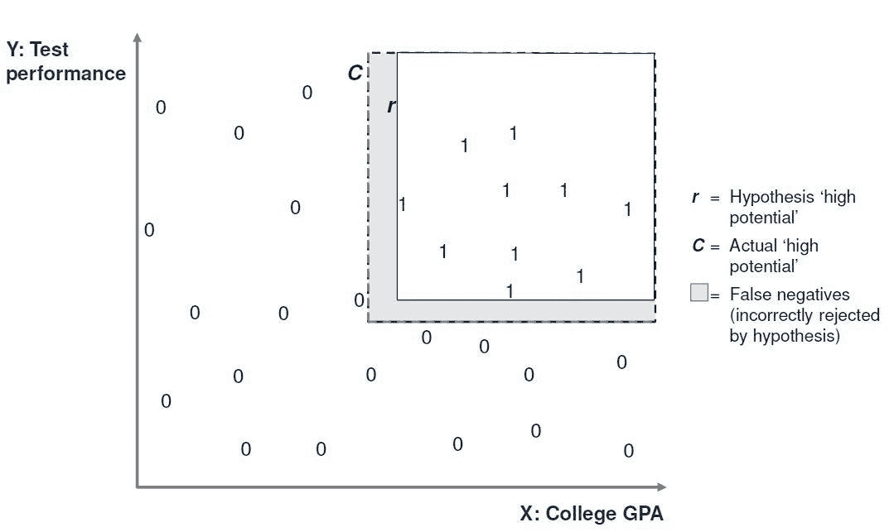
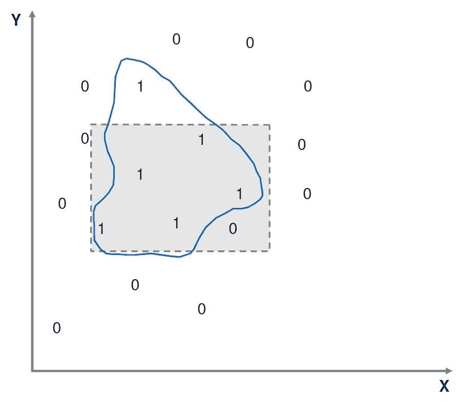

# 机器学习是如何工作的？

> 原文：<https://towardsdatascience.com/how-does-machine-learning-work-6dd97f2be46c?source=collection_archive---------6----------------------->

这是一系列文章中的第二篇，旨在使机器学习对那些没有受过技术培训的人来说更容易理解。第一篇，描述机器学习的典型用途和例子，这里可以找到**。**

*在本系列的这一期中，将使用一个简单的示例来说明从正反例中学习的底层过程，这是分类学习的最简单形式。我犯了一个简单的错误，让所有人都可以理解机器学习的原则，但我应该强调，现实生活中的用例很少像这样简单。*

# *从训练集中学习*

*想象一下，一家公司有一个招聘流程，该流程会查看成千上万份申请，并将它们分成两组——有“高潜力”获得该公司工作的人和没有“高潜力”的人。目前，人类决定每个应用程序属于哪一组。假设我们想要学习和预测哪些应用程序被认为是“高潜力”的。我们从该公司获得了一些数据，用于一组随机的先前申请，包括那些被归类为高潜力的申请(正面例子)和那些没有被归类为高潜力的申请(负面例子)。我们的目标是找到一个所有正面例子都有的描述，而没有负面例子。然后，如果出现新的应用程序，我们可以使用此描述来确定新的应用程序是否应该被视为“高潜力”。*

*对应用程序的进一步分析表明，有两个主要特征会影响应用程序是否可以被描述为“高潜力”。第一个是申请人的大学 GPA，第二个是申请人在申请过程中参加的考试的表现。因此，我们决定在确定某项申请是否具有“高潜力”时，只考虑这些因素。这些是我们的输入属性。*

*因此，我们可以选取当前申请的一个子集，并用两个数值 *(x，y)* 来表示每个申请，其中 *x* 是申请人的大学 GPA， *y* 是申请人在测试中的表现。如果是正面例子，我们也可以给每个应用程序赋值 1，如果是负面例子，赋值 0。这被称为*训练集*。*

*对于这个简单的示例，可以在二维图上绘制训练集，正面示例标记为 1，负面示例标记为 0，如下所示。*

**

*在进一步查看数据后，我们可以在两个维度上确定某些最小值 *x* 和 *y* ，我们可以说任何“高潜力”应用都必须在这些值以上。即 *x* > *x1* 和 *y* > *y1* 为 *x1* 和 *y1* 的合适值。*

*这将“高潜力”应用的集合定义为图表上的矩形，如下所示。*

**

*这样，我们就做出了这样的假设:我们的“高潜力”应用类是二维空间中的矩形。我们现在将问题简化为寻找 *x1* 和 *y1* 的值，以便我们在训练集中具有最接近的正例。*

*我们现在决定尝试一个特定的矩形，看看它与训练数据的吻合程度。我们称这个矩形为 T21。 *r* 是一个*假设函数*。我们可以在我们的训练集上尝试 *r* ，并计算在训练集中有多少个正例没有落入矩形 *r* 中。这些实例的总数称为 *r* 的*错误*。我们的目标是使用训练集使这个错误尽可能的低，如果可能的话，甚至使它为零。*

*一种选择是使用最具体的假设。也就是说，使用包含所有正例而不包含反例的最紧密矩形。另一种是使用最一般的假设，即包含所有正例而不包含任何负例的最大矩形。*

*事实上，在最具体和最一般的假设之间的任何矩形都将对我们已经得到的特定训练集起作用。*

*但是，我们的训练集只是应用程序的示例列表，并不包括所有应用程序。因此，即使我们提出的矩形 r 在训练集上起作用，我们也不能确定如果应用于不在训练集中的应用，它将没有错误。因此，我们的假设矩形 *r* 在训练集之外应用时可能会产生错误，如下所示。*

**

# *测量误差*

*当一个假设 *r* 从一个训练集中发展出来，然后在不在训练集中的数据上进行试验时，会发生以下四种情况之一:*

1.  ***真阳性(TP):** 当 *r* 给出阳性结果且与实际数据相符时*
2.  ***真阴性(TN):当 *r* 给出阴性结果且与实际数据相符时***
3.  ***假阳性(FP):** 当 *r* 给出阳性结果且与实际数据不符时*
4.  ***假阴性(FN):** 当 *r* 给出一个阴性结果，与实际数据不符。(这是上图中的阴影区域)*

*假设函数 *r* 的*总误差*等于 FP 和 FN 之和。*

*理想情况下，我们希望这个等于零。然而…*

# *噪音*

*前面基于两个输入属性学习“高潜力”应用程序的例子非常简单。大多数学习场景将涉及数百或数千个输入属性、训练集中的数万个示例，并且将花费数小时、数天或数周的计算机能力来处理。*

*由于*噪声*，在这些情况下几乎不可能创建零误差的简单假设。噪音是数据中不必要的异常，它可以掩盖或复杂化潜在的关系，并削弱学习过程。下图显示了一个可能受噪声影响的数据集，简单的矩形假设对其不起作用，更复杂的图形假设对于完美拟合是必要的。*

**

*噪音可能由以下原因引起:*

*   *输入数据中的错误或遗漏*
*   *数据标签中的错误*
*   *不可观察且无数据可用的隐藏属性，但会影响分类。*

*尽管有噪声，数据科学家通常会致力于在训练集上找到最简单的假设，例如直线、矩形或简单的多项式表达式。为了使假设尽可能简单，他们愿意接受一定程度的训练误差。简单假设更容易构建、解释，并且通常需要更少的处理能力和容量，这是大型数据集的一个重要考虑因素。*

# *泛化、欠拟合和过拟合*

*如上所述，数据科学家有必要假设哪个函数最适合训练集中的数据。实际上，这意味着数据科学家假设某个模型或算法最适合训练数据。学习过程需要这样的输入假设或假说，这被称为学习算法的*归纳偏差*。*

*正如我们所观察到的，某个算法可能非常适合训练集，但当应用于训练集之外的数据时却失败了。因此，一旦根据训练集建立了算法，就有必要针对训练集之外的一组数据来测试该算法，以确定它是否适合新数据。模型预测新数据结果的好坏被称为*泛化*。*

*如果数据科学家试图拟合过于简单的假设算法，尽管它可能会为训练数据提供可接受的误差水平，但在处理新数据时，它可能会有更大的误差。这被称为*欠拟合*。例如，尝试用一条直线来拟合一个高阶多项式的关系可能在某个训练集上工作得相当好，但不能很好地推广。*

*同样，如果使用太复杂的假设函数，它将不能很好地推广，例如，如果在关系接近线性的情况下使用多阶多项式。这叫做*过拟合*。*

*通常，学习算法的成功是三个因素之间的微妙平衡:*

1.  *训练集中的数据量*
2.  *新数据的概化误差水平*
3.  *符合数据的原始假设的复杂性*

*其中任何一个问题通常可以通过调整其他问题来解决，但只能在一定程度上解决。*

# *机器学习的典型过程*

*将上述所有观察放在一起，我们现在可以概述机器学习中使用的典型过程。这个过程旨在最大化学习成功的机会，并有效地测量算法的误差。*

***培训:**向数据科学家提供真实数据的子集。该数据包括足够数量的正面和负面示例，以允许任何潜在的算法进行学习。数据科学家在决定最适合训练数据的算法之前，会对许多算法进行实验。*

***验证:**向数据科学家提供真实数据的进一步子集，其具有与训练数据相似的属性。这被称为*验证集*。数据科学家将在验证集上运行选择的算法，并测量误差。产生最小误差的算法被认为是最好的。即使是最好的算法也可能对数据进行过拟合或欠拟合，从而产生不可接受的误差水平。*

***测试:**测量任何被认为是可实现的学习算法的误差将是重要的。验证集不应用于计算此误差，因为我们已经使用验证集来选择算法，以使其误差最小。因此，验证集现在实际上已经成为训练集的一部分。为了获得准确可靠的误差度量，应该使用第三组数据，称为测试集。在测试集上运行该算法并计算误差。*

# *分类算法的典型输出*

*分类算法的典型输出可以采取两种形式:*

***离散量词。**一个二进制输出(是或否，1 或 0 ),表示算法已将输入实例分类为正还是负。使用我们之前的例子，算法会简单地说应用程序是“高潜力”或者不是。如果在决策过程中不存在人工干预的预期，例如，如果公司对被视为“高潜力”的申请数量没有上限或下限，这一点尤其有用。*

***概率分类器。**概率输出(0 到 1 之间的数字),表示输入落入正类的可能性。例如，该算法可以指示该应用具有 0.68 的高潜力概率。如果在决策过程中需要人工干预，例如公司对被视为“高潜力”的申请数量有限制，这一点尤其有用。请注意，一旦人类定义了“截止”来确定哪些实例属于肯定类，概率输出就变成了二进制输出。*

**在下一期，我们将看看机器学习算法的一些典型例子，比如贝叶斯分类器和决策树。这里读一下***。***

**最初我是一名纯粹的数学家，后来我成为了一名心理计量学家和数据科学家。我热衷于将所有这些学科的严谨性应用到复杂的人的问题上。我也是一个编码极客和日本 RPG 的超级粉丝。在[*LinkedIn*](https://www.linkedin.com/in/keith-mcnulty/)*或*[*Twitter*](https://twitter.com/dr_keithmcnulty)*上找我。***