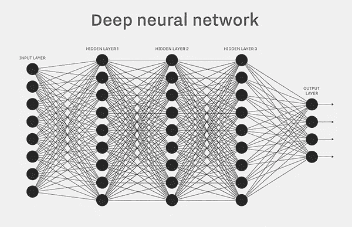

# 机器学习是如何工作的？像大脑一样！

> 原文：<https://towardsdatascience.com/how-does-machine-learning-work-a3bf1e102b11?source=collection_archive---------5----------------------->

## 图像分类中描述机器学习的人类类比

我可以举出几十篇关于机器学习和卷积神经网络的文章。每篇文章描述了不同的细节。有时会提到太多的细节，所以我决定用机器学习和人脑的相似之处来写我自己的帖子。我不会碰任何数学或者深度学习的细节。我们的目标是保持简单，帮助人们尝试 Vize.ai 来实现他们的目标。

# 介绍

> 机器学习为计算机提供了无需显式编程就能学习的能力。

对于图像:我们想要的东西可以看到一组图像，并记住模式。当我们给我们的智能**【模型】**曝光一个新图像时，它会**【猜测】**图像上是什么。人就是这么学的！

我提到了两个重要的词:

*   **模型**——我们称之为机器学习算法。不再编码(**if***green***then***grass*)。是一个可以学习和**概括**的结构(小的，圆形的，绿色的是苹果)。
*   **猜测** —我们不是在二元世界。现在，我们进入概率领域。我们收到一个图像是苹果的可能性。

# 深入但仍然简单

**模型**就像孩子的大脑。你给一个小孩看一个苹果，然后说“这是一个苹果”。重复 20 次，它大脑中的连接就建立起来了，现在它可以识别苹果了。重要的是开始时它不能区分小细节。你手中的小球将会是一个苹果，因为它遵循同样的模式*(小的，圆形的，绿色)*。只有苹果植根于小小的大脑。

显示给孩子的一组图像称为 [**训练数据集**](https://blog.vize.ai/how-to-prepare-images-for-a-training-dataset-f6889433249b) **。**

**大脑**是**模型**，它只能识别**图像数据集中的类别。**由层和连接构成。这使得它与我们的大脑结构相似。网络的不同部分正在学习不同的抽象模式。

**监督学习**意味着我们要说“这是苹果”，并给它添加一个视觉信息。我们正在给每张图片添加一个标签。

Simple deep learning network

# **评估—模型精度**

用人类的话来说，这就像考试时间。在学校，我们学习许多信息和一般概念。为了了解我们实际上知道多少，老师准备了一系列我们在课本上没有见过的问题。然后我们评估我们的大脑，我们知道 10 个问题中有 9 个回答正确。

教师的问题就是我们所说的测试数据集。它通常在训练前从训练数据集分离(提供图片的 20%[在我们的例子中](https://vize.ai))。

**准确率**是我们答对的图片数量(百分比)。重要的是:我们不在乎他对自己的答案有多确定。我们只关心最后的答案。

# 计算机的局限性

为什么我们还没有拥有人类水平技能的计算机？因为大脑是最强大的计算机。它有着惊人的处理能力，巨大的内存和一些我们连自己都不懂的神奇酱。

我们的计算机模型受限于**内存**和**计算** **功率**。我们在存储内存方面做得很好，但在处理器可访问的超高速内存方面做得不够。功率受到热量、技术、价格等的限制。

更大的模型可以容纳更多的信息，但需要更长的训练时间。这使得 2017 年的 AI 发展重点是:

*   让模型变小，
*   计算强度较低，
*   能够了解更多的信息。

# 连接到自定义图像识别- Vize.ai

这项技术驱动了我们的 [**自定义图像分类 API**](https://vize.ai) 。人们不需要很深的知识就可以在几分钟内建立图像识别器。有时客户问我，我们是否能识别 10 000 个类别，每个类别有一个训练图像。想象一下孩子的大脑学习这个。这几乎是不可能的。这个想法是你想让你的孩子知道更多的类别，看到更多的图像。我们的大脑需要很长时间来发展和理解这个世界。与子对象相同从基本对象开始从基本类别开始。

孩子自信什么是好/坏。[辨别好坏的教学模型](https://blog.vize.ai/how-to-prepare-images-for-a-training-dataset-f6889433249b)非常准确，不需要很多图像。

# 总结:

我试图将机器学习简化为仅视觉任务，并将其与我们都知道的东西进行比较。在 [Vize.ai](https://vize.ai) 中，我们在试验新模型和处理流水线时，经常会想到人脑。我将很高兴听到你的一些反馈。