# 缩放如何改变主成分？—第一部分

> 原文：<https://towardsdatascience.com/how-does-scaling-change-principle-components-part-1-822fa8be5462?source=collection_archive---------17----------------------->

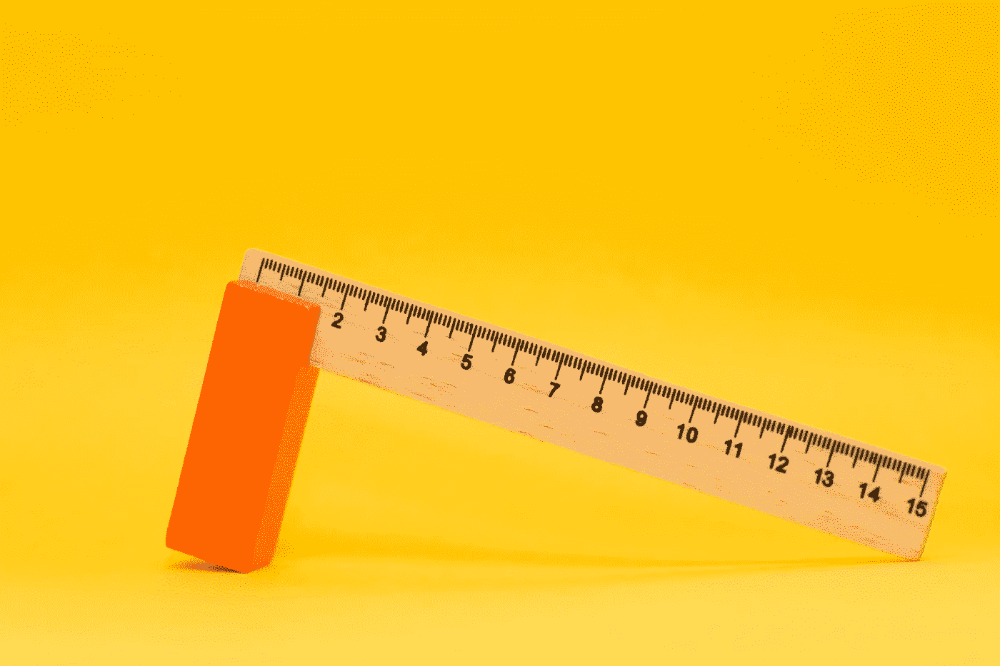

Photo by [Markus Spiske](https://unsplash.com/photos/pwpVGQ-A5qI?utm_source=unsplash&utm_medium=referral&utm_content=creditCopyText) on [Unsplash](https://unsplash.com/search/photos/scale?utm_source=unsplash&utm_medium=referral&utm_content=creditCopyText)

请注意，这篇文章是出于我自己的教育目的，也是为了满足我的好奇心。

**动机/摘要**

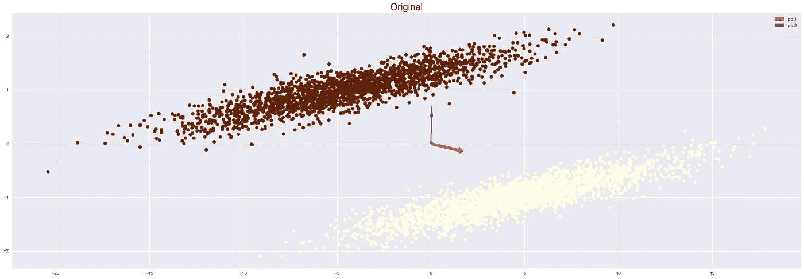

假设我们有一个像上面这样的数据，红色箭头表示第一个主成分，而蓝色箭头表示第二个主成分。规范化和标准化会如何改变这两者？我们还可以对方差进行某种标准化吗？(我将继续发布更多帖子。)

**正常化**

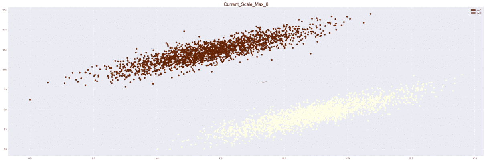

上面的 gif 显示了不同规模的数据看起来是什么样子，以及它的主要组成部分(红色表示第一台电脑，蓝色表示第二台电脑。).

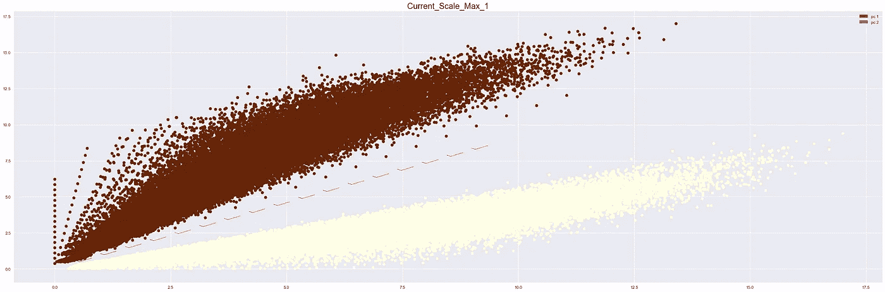

如上所述，PC 的方向不会随着不同的比例而改变。

**标准化**

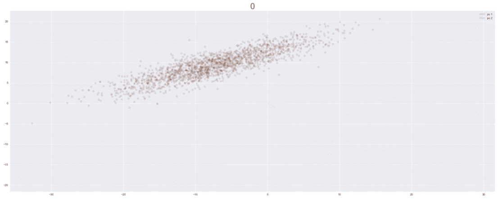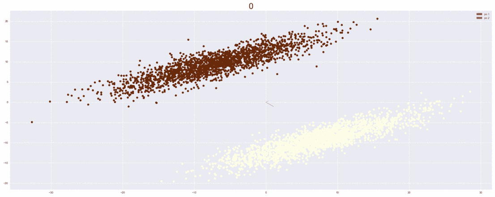

标准化并没有改变 PC 的方向，生成的图形也没有什么特别之处。

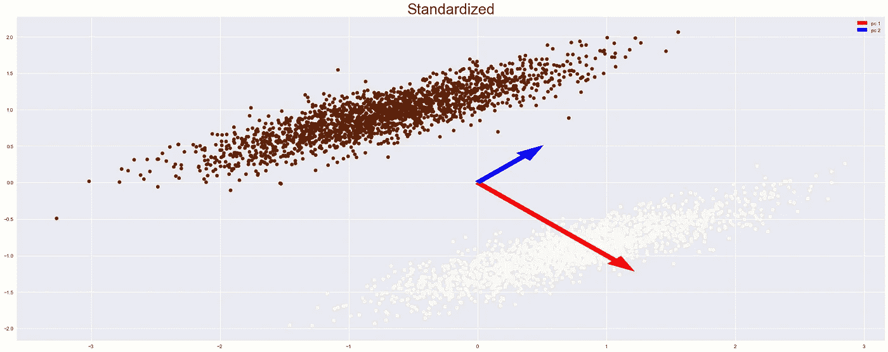

**投影到主元件**

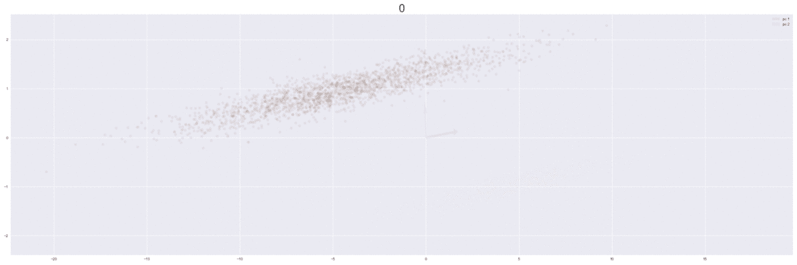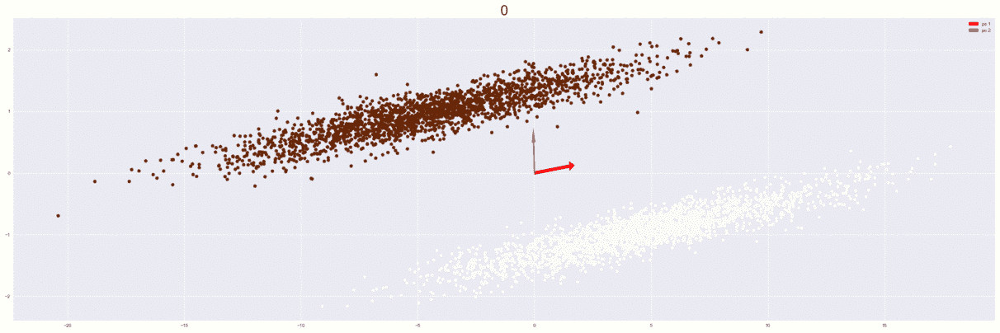

上面的过程显示了通过两个主要部分投影我们所有数据的旋转。左边的 gif 显示了相互重叠的结果，右边的 gif 显示了我们将数据投影到投影矩阵后的结果。

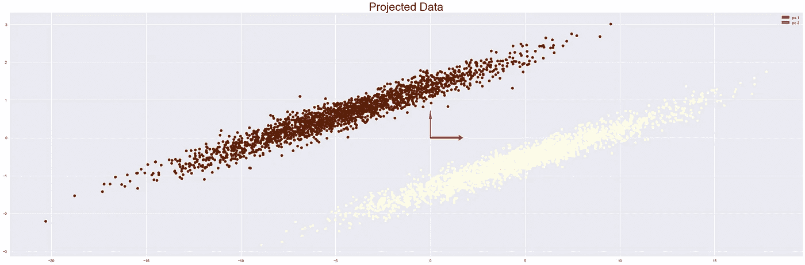

当我们完全投影到投影向量上时，我们会看到类似上面的东西，现在让我们将数据投影回原始空间。

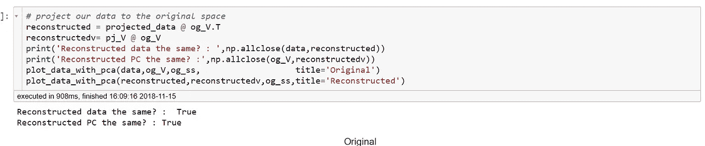

当我们将数据投影回数据空间时，我们可以看到原始数据。如上所述，这些值检查出来是相同的。

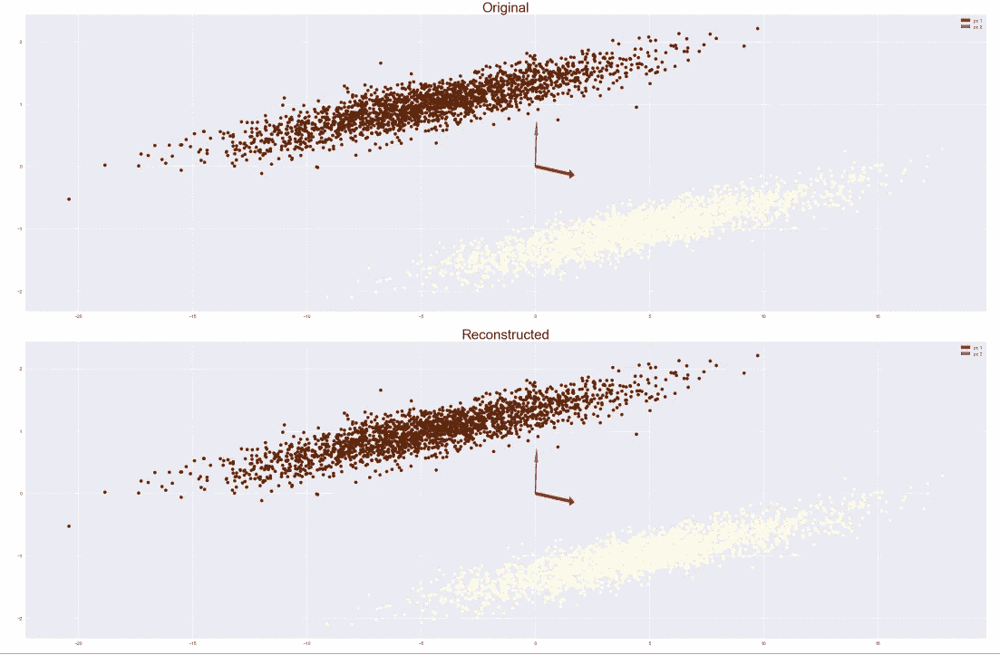

当我们将结果可视化时，我们会得到一个俯视图。

**交互代码**

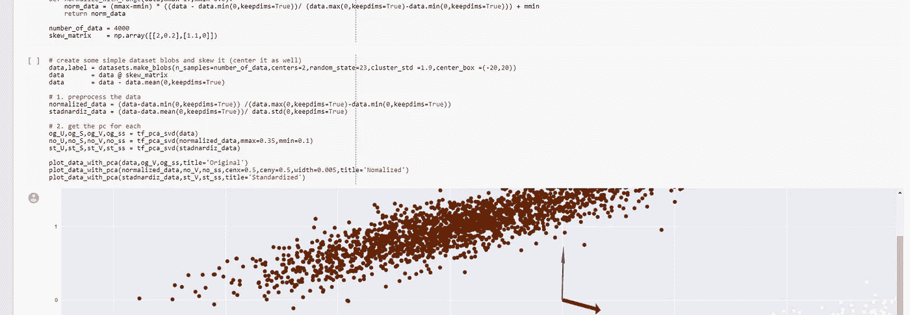

*对于 Google Colab，您需要一个 Google 帐户来查看代码，而且您不能在 Google Colab 中运行只读脚本，因此请在您的游戏场上制作一份副本。最后，我永远不会请求允许访问你在 Google Drive 上的文件，仅供参考。编码快乐！*

要访问该笔记本，请单击此处的[。](https://colab.research.google.com/drive/1lhFp1krVOfMtWFqFhQezAaJlC1Jc23pw)

**遗言**

关于 tensorflow 的 svd 需要注意的一点是，返回的 v 已经被转置，不需要被转置。Else numpy 的 svd 转置 v 矩阵。

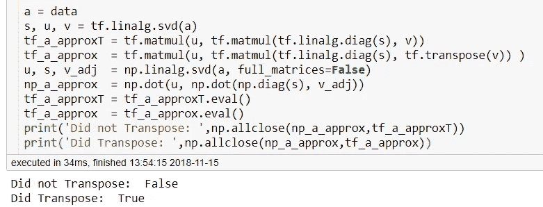

**参考**

1.  tf.linalg.svd | TensorFlow。(2018).张量流。检索于 2018 年 11 月 15 日，来自[https://www.tensorflow.org/api_docs/python/tf/linalg/svd](https://www.tensorflow.org/api_docs/python/tf/linalg/svd)
2.  PCA？，R. (2018)。奇异值分解与主成分分析的关系。如何用 SVD 进行 PCA？。交叉验证。检索于 2018 年 11 月 15 日，来自[https://stats . stack exchange . com/questions/134282/relationship-between-SVD-and-PCA-how-to-use-SVD-to-perform-PCA](https://stats.stackexchange.com/questions/134282/relationship-between-svd-and-pca-how-to-use-svd-to-perform-pca)
3.  PCA？，R. (2018)。奇异值分解与主成分分析的关系。如何用 SVD 进行 PCA？。交叉验证。检索于 2018 年 11 月 15 日，来自[https://stats . stack exchange . com/questions/134282/relationship-between-SVD-and-PCA-how-to-use-SVD-to-perform-PCA](https://stats.stackexchange.com/questions/134282/relationship-between-svd-and-pca-how-to-use-svd-to-perform-pca)
4.  PCA？，W. (2018)。为什么吴恩达更喜欢用奇异值分解而不是协方差矩阵的 EIG 来做主成分分析？。交叉验证。检索于 2018 年 11 月 15 日，来自[https://stats . stack exchange . com/questions/314046/why-do-Andrew-ng-prefere-to-use-SVD-and-not-EIG-of-协方差矩阵-do-pca](https://stats.stackexchange.com/questions/314046/why-does-andrew-ng-prefer-to-use-svd-and-not-eig-of-covariance-matrix-to-do-pca)
5.  【复本】，U. (2018)。理解 SVD 用于 PCA 时的输出。交叉验证。检索于 2018 年 11 月 15 日，来自[https://stats . stack exchange . com/questions/96482/understanding-the-output-of-SVD-when-use-for-PCA](https://stats.stackexchange.com/questions/96482/understanding-the-output-of-svd-when-used-for-pca)