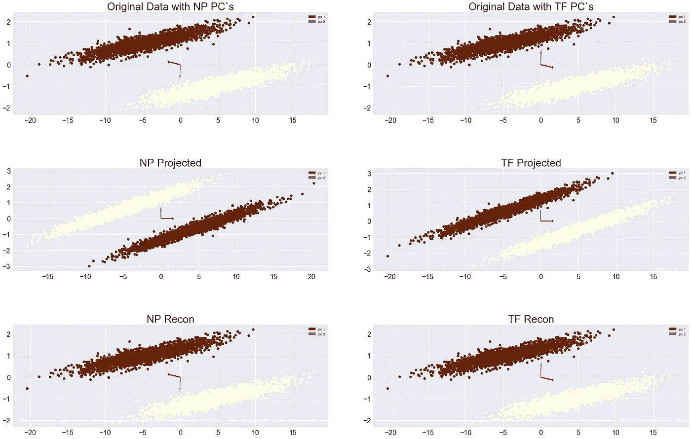
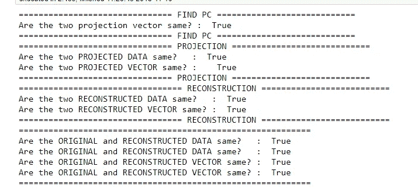
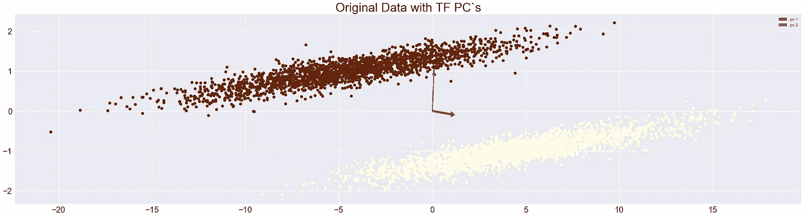
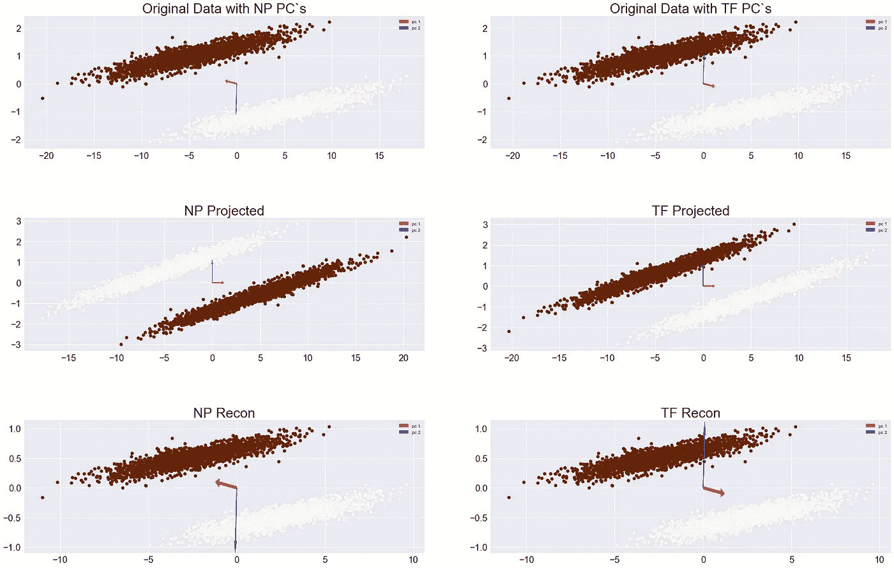
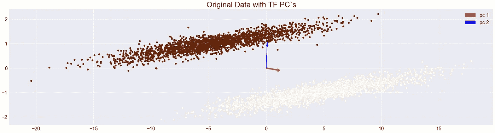
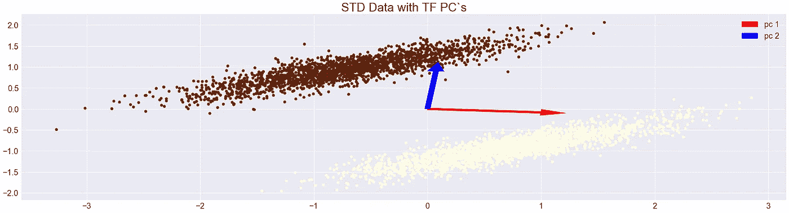
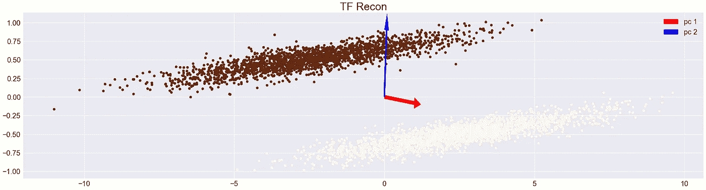
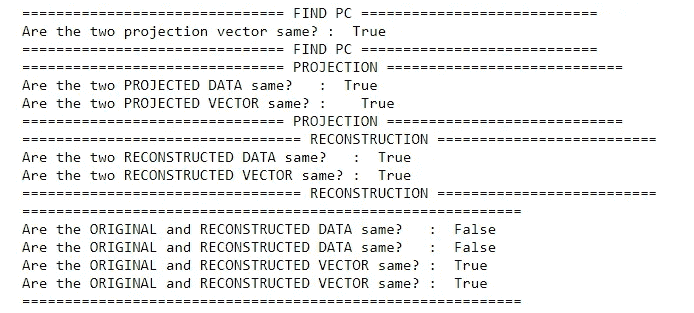
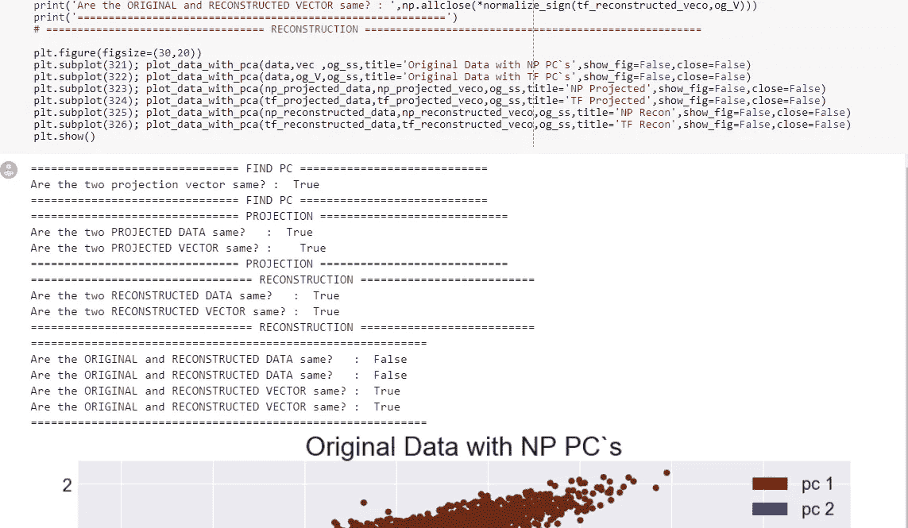
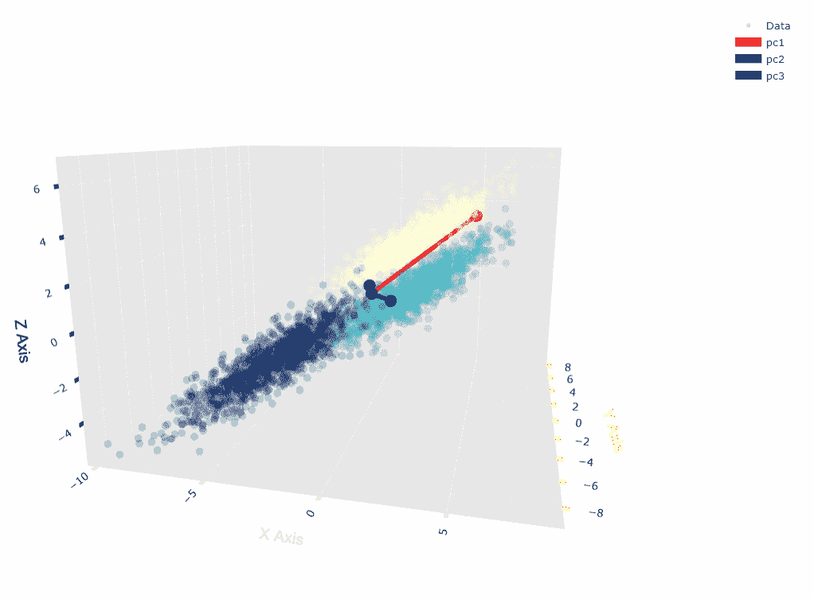

# 缩放如何改变主成分？—第二部分

> 原文：<https://towardsdatascience.com/how-does-scaling-change-principle-components-part-2-6974cf40aa60?source=collection_archive---------17----------------------->

Photo by [Nikita Taparia](https://unsplash.com/photos/Z7mREQaK0Pc?utm_source=unsplash&utm_medium=referral&utm_content=creditCopyText) on [Unsplash](https://unsplash.com/?utm_source=unsplash&utm_medium=referral&utm_content=creditCopyText)

今天，我想对数据中存在的差异进行某种标准化。

***请注意，这个帖子是出于我自己的教育目的。***

**比较 Numpy 和张量流 SVD**

当我使用特征值分解来寻找主分量时，主分量的符号已经翻转，因此当我们在主空间中投影数据时，我们注意到数据已经翻转。然而，当我们重建回原始数据空间时，我们可以看到结果是相同的。

**动机/摘要**

上图显示了标准化后对数据的影响，我们可以注意到每个轴的比例都发生了变化。特别是当我们观察 x 轴时，我们可以注意到刻度已经急剧缩小。

在上面的原始数据中，最小 x 轴值是-20，而最大 x 轴值是 15，但是标准化后，我们注意到它已经缩小到-3 到 3 的范围。批量标准化(即标准化)在深度学习中很有帮助，因为它将数据集中起来，并将其标准化。然而，如果我们(在每个轴上)根据它的变化量来定标，会有帮助吗？

**根据各轴的变化改变缩放比例**

上面的图像可能很难看到，但我们正在将投影数据重建到原始数据空间，然而，根据每个轴的变化量，缩放因子会有所不同。让我们仔细看看。

**上图** →原始数据
**中图** →带主轴的标准化数据
**下图** →带主轴的 PC 重新缩放数据

如上所述，最终结果不同于我们比较标准化和按比例缩放的结果。

这里需要注意的一个重要事实是，尽管重建的数据与我们开始时的原始数据不同(因为我们对其进行了不同的缩放)。两个主分量的方向确实匹配。

**交互代码**

对于 Google Colab，你需要一个 Google 帐户来查看代码，而且你不能在 Google Colab 中运行只读脚本，所以在你的操场上复制一份。最后，我永远不会请求允许访问你在 Google Drive 上的文件，仅供参考。编码快乐！

要查看这本笔记本，请[点击此处。](https://colab.research.google.com/drive/1E2HBss9KEq8rmSRrUYn667REiC_zOkmC)

**最后的话**

在下一篇文章中，我将增加维度。

**参考**

1.  matplotlib.pyplot，H. (2018 年)。如何用 matplotlib.pyplot 改变图例大小.堆栈溢出？检索于 2018 年 11 月 16 日，来自[https://stack overflow . com/questions/7125009/how-to-change-legend-size-with-matplotlib-py plot](https://stackoverflow.com/questions/7125009/how-to-change-legend-size-with-matplotlib-pyplot)
2.  plot，H. (2018)。如何更改 matplotlib 绘图的字体大小？堆栈溢出。检索于 2018 年 11 月 16 日，来自[https://stack overflow . com/questions/3899980/how-to-change-the-font-size-on-a-matplotlib-plot](https://stackoverflow.com/questions/3899980/how-to-change-the-font-size-on-a-matplotlib-plot)
3.  字符串，M. (2018)。Matplotlib xticks 字体大小如果字符串。堆栈溢出。检索于 2018 年 11 月 16 日，来自[https://stack overflow . com/questions/39211707/matplotlib-x ticks-font-size-if-string](https://stackoverflow.com/questions/39211707/matplotlib-xticks-font-size-if-string)
4.  Jupyter 笔记本教程。(2018).Plot.ly .检索 2018 年 11 月 16 日，来自[https://plot.ly/python/ipython-notebook-tutorial/](https://plot.ly/python/ipython-notebook-tutorial/)
5.  斧头。(2018).Plot.ly .检索 2018 年 11 月 16 日，来自[https://plot.ly/python/axes/](https://plot.ly/python/axes/)