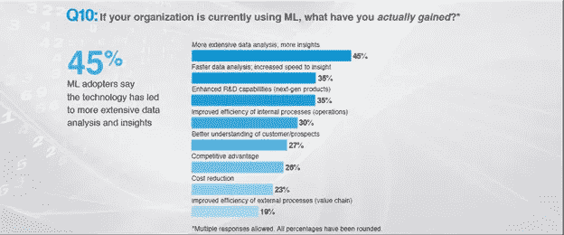

# 企业软件如何通过机器学习变得智能化

> 原文：<https://towardsdatascience.com/how-enterprise-software-is-getting-intelligent-through-machine-learning-4cafc2d7367e?source=collection_archive---------7----------------------->

Photo by [Hunter Harritt](https://unsplash.com/@hharritt?utm_source=medium&utm_medium=referral) on [Unsplash](https://unsplash.com?utm_source=medium&utm_medium=referral)

当想到自动化时，人们总是可以追溯其根源，而不是实际的发明家，而是富有想象力的作家。几个世纪以来，一个智能机器可以在改善人类生活的各个方面发挥关键作用的世界一直吸引着思想家和作家。他们让人们思考这种努力中蕴含的可能性和精彩。自从第一台计算机诞生以来，人们一直在努力使机器更加智能。

计算机的发展已经使它更接近那些作家和发明家很久以前预见的东西。人工智能、机器学习和神经网络已经成为计算领域创新和发展的焦点。它们已经逐步接近实现其全部潜力，目前正在从农业到交通运输的几乎每个人类活动领域中找到应用。此外，这种不断发展的计算形式在企业领域也产生了显著的影响。

其中，机器学习已经在企业中被广泛接受。通过将其集成到企业软件中，大多数公司发现了一种更可预测、更数据驱动的模型，这使他们能够实现流程自动化。机器学习利用数据集的核心动力有助于产生洞察力，从而促进创新和效率，并使企业软件更加智能。

在本文中，我们将深入探讨:

*   机器学习基础
*   为什么传统企业软件是无效的
*   机器学习将改变企业软件的原因
*   机器学习改革企业软件的方式

# 对机器学习的洞察

那么到底什么是机器学习呢？机器学习使计算机能够在没有任何编程或人工干预的情况下进行学习和改进。机器学习系统中专门编程的算法可以从数据中识别模式，并预测可能的结果。它革新了从医疗保健到零售的每个领域，采用率越来越高。

[联合市场研究](https://www.alliedmarketresearch.com/press-release/cognitive-computing-market-is-expected-to-reach-137-billion-globally-by-2020-allied-market-research.html)的预测指出，到 2020 年，像机器学习这样的认知计算的全球市场将增长约 137 亿美元。这将在企业和服务行业利用数据的方式上引发一场彻底的变革

通过机器学习，计算机可以挖掘和处理大量数据，以得出预测模型和见解。你可以在电子商务中找到机器学习的一个典型例子，像亚马逊这样的在线零售商正在使用这项技术为顾客提供更好的服务。

每当你购买或浏览其产品列表时，你都会留下一系列数据，供 it 机器学习系统用来为你提供个性化的产品推荐。此外，[机器学习的使用让电子商务平台在客户服务](https://www.fingent.com/blog/machine-learning-boosts-customer-experience)、交付和定价方面获得了优势。

# 传统企业软件的缺点

基本上，企业软件或企业应用软件(EAS)是一个组织为满足其特定需求而使用的任何软件。它构成了部署在公司内的计算系统的一部分，并作为面向业务的工具，在客户关系管理、人力资源、会计、企业资源规划等过程中提供帮助。

其他形式的软件，如系统和应用软件，不属于企业软件的范畴。它们只用于执行特定的功能，如运行计算机或创建电子表格、演示文稿、文档等。而企业软件是可扩展的和集中的，能够为整个组织提供解决方案。

企业软件将机器学习纳入其框架的转变是由特定原因引导的。传统的企业软件在效率、速度、可扩展性等方面都有自己的缺点。它依赖于人的干预，这种干预会以错误、信息不充分、个人偏见等形式影响输入系统的数据。

如果输入的与业务运营相关的数据不正确，可能会导致数据堆积。这使得它在很大程度上是分散的，在需要的时候很难整理。由于传统的企业软件依赖于人工努力的结合，因此与机器学习相比，它在快速准确地生成洞察方面最没用。

传统企业软件的一个共同缺点是适应性。大多数企业不得不改变他们的工作方法，以适应软件。此外，它在硬件和软件方面都有非常大的前期资本成本。可伸缩性也是一个问题，事实证明要满足不断变化的业务需求是困难和昂贵的。

# 为什么机器学习会改变企业软件

每天，企业都面临着从管理到运营的各种挑战。到目前为止，企业软件在处理这些重要过程中发挥了重要作用。但是商业中不断增长的需求意味着需要更新的方法来处理不同的领域。随着机器学习在企业中的引入，一扇可能性的窗户打开了。

机器学习正在提供企业可以依赖的正确框架。机器学习嵌入式计算系统中使用的算法和应用程序可以通过利用企业拥有的庞大数据集来产生预测性的洞察力。这些数据包括结构化和非结构化形式，如数据库和互联网。

根据麻省理工科技评论和谷歌的一项研究，60%的公司已经在他们的计算基础设施中采用了机器学习策略。18%的人计划在明年实施机器学习。

图一。来源——麻省理工科技评论和谷歌

向机器学习软件模型的转变，通过提供更好、更快的数据分析和见解，使组织明显受益。它可以提高组织内部运作的效率，同时增进对客户的了解。

当提到内部运作时，具有机器学习的企业软件的一个明显的用例是在物流领域。ML 系统可以在没有人工干预的情况下，通过做出数据驱动的决策，实现订单、库存、运输和仓储管理流程的自动化。

物流专业 [DHL](https://www.businesswire.com/news/home/20170524005934/en/DHL-Supply-Watch-Machine-Learning-Mitigate-Supplier/?feedref=JjAwJuNHiystnCoBq_hl-Q-tiwWZwkcswR1UZtV7eGe24xL9TZOyQUMS3J72mJlQ7fxFuNFTHSunhvli30RlBNXya2izy9YOgHlBiZQk2LOzmn6JePCpHPCiYGaEx4DL1Rq8pNwkf3AarimpDzQGuQ==) 最近整合了机器学习以降低其供应商风险。该公司最新进入其名为 DHL Supply Watch 的 Resilience 360 供应链管理平台，使用机器学习和自然语言处理的结合来早期识别任何潜在的中断。

此外，[世界各地的企业都在他们的软件中转向机器学习](https://www.siliconrepublic.com/video/machine-learning-google)，原因多种多样，例如:

*   改善行为分析以提供个性化的客户体验
*   利用自然语言处理(NLP)功能进行更好的分析
*   提供风险分析以提升数据安全性
*   挖掘和分类数据
*   经常提出建议
*   启用图像识别

此外，机器学习的复杂性正在阻止公司转向这种模式。目前正在开发中，完全转向机器学习模型可能被证明是不明智的。机器学习有几个局限性，因为其算法经常遇到错误，并且由于其复杂性，解决这些错误是一项艰巨的任务。

此外，机器学习嵌入式软件可能需要时间来熟悉数据，以便进行更好的预测。同时，在历史数据不可用的所有情况下，预测可能都不准确。从机器学习企业软件中提取期望的输出仍然需要人工干预。

# 机器学习改革企业软件

机器学习被认为是今年企业软件的主要趋势。通过使企业软件智能化，机器学习可以通过创造有价值的见解来接管评估的关键过程。一个组织可以利用这一点采取必要的行动，使他们的生产力得到提高。

将机器学习框架整合到企业软件中，可以确保所有的数据堆栈都得到充分利用，从而提高整体效率和生产率。这实际上增强了企业中使用的软件的功能，使其更加智能和自给自足。

例如，在销售领域，一个公司可以通过使用具有 ML 模型的软件而获益匪浅。机器学习可以扰乱关键流程，并在预测、客户行为和评估方面创造更多理解，从而使销售流程更加智能。

以下是机器学习将改变企业软件的一些方式:

# 产生更好的见解和分析

近年来，企业中数据的使用和生成已经大大增加。处理这些大量的数据是一个挑战，这正是机器学习适合的地方。拥有具有机器学习功能的企业软件有助于从这些大型非结构化数据集获得竞争优势。

通过提供收集的数据，机器学习嵌入式软件中的算法可以轻松处理这些数据集，并发现见解和模式。通过帮助他们实现目标并推动增长，组织可以从这些成果中受益匪浅。

跨国零售公司沃尔玛是成功实现机器学习软件的一个很好的例子。他们大量利用机器学习来发现客户在产品推荐等领域的行为和使用。

结果。沃尔玛极大地改善了他们的零售业务和顾客体验。此外，机器学习帮助他们在商店和在线平台提供的购物体验之间建立了一座桥梁

# 数据的非本地化

由于移动和社交媒体等技术的激增，数据现在在很大程度上是分散的。通常，企业软件使用特定种类的数据库模型来存储和组织数据。结构化和非结构化数据现在共同存在于外部源中，这需要更深入的处理才能生成有用的最终结果。

谷歌等科技巨头已经完全转向数据中心形式的外部存储模块，以处理其海量数据。这些位于世界各地不同位置的数据中心需要持续的监控和维护，以确保它们不间断地运行。

[谷歌利用机器学习](https://environment.google/projects/machine-learning/)软件来帮助这一过程，仅在 2014 年就大幅降低了 50%的能源使用量。这家科技巨头通过使用机器学习模型，能够优化和节省其数据中心的更多能源。

# 促进数据驱动的决策

以有效的方式使用数据对公司制定关键的商业决策有巨大的好处。使用机器学习的企业软件系统可以通过帮助组织基于从数据池中收集的见解单独和公正地做出决策，来极大地帮助这一过程。这对人才招聘、客户管理、R&D 等领域尤其有帮助。

例如，使用 TensorFlow，谷歌用于机器学习应用的开源库，使公司的研究部门能够发挥机器学习的潜力，以更好地洞察产品和服务的开发。当机器学习在 R&D 应用于做出数据驱动的决策时，DMAIC(定义、测量、分析、改进和控制)的使用是常见的。这导致了产品和服务质量的显著提高。

# 增强员工智能

机器学习通过自动评估组织中员工进行的搜索，将企业软件向前推进了一步。这实际上增强了员工的智能，通过监控他们参与的所有关键领域，促进了工作相关领域的决策。

通过这种方式，机器学习可以帮助提高生产率、节省时间并给出及时的响应。例如，IBM 已经建立了一个模型，说明机器学习等认知技术如何通过创造更好的参与和个性化的信息传播来增强员工的能力，以达到教练等目的。

IBM 全球员工发展合作伙伴 James Cook 表示，

"[认知技术的优势在于，它可以快速准确地处理大量结构化和非结构化数据，以找到与[员工]当前职业经历相匹配的培训课程。我们认为人力资源部门面临着前所未有的机遇来推动许多行业的数字化转型。](https://searchhrsoftware.techtarget.com/feature/How-AI-and-machine-learning-help-in-upskilling-employees)

IBM 自己的 Watson Discovery 广泛依赖于机器学习来快速整理和向员工提供信息，以便他们可以将这些信息用于当前的任务，而不必浪费时间进行广泛的搜索。此外，机器学习软件也在提升员工技能方面得到应用。

# **欺诈检测**

欺诈行为的持续存在每年都会给组织带来损失。具有机器学习框架的企业软件通过及早发现欺诈帮助降低了欺诈。机器学习算法使用的模式识别方法可以识别交易等操作中的任何违规行为。

机器学习如何帮助欺诈检测的一个例子是在企业的财务部门。通过在企业软件中包含机器学习，它可以评估交易数据和外部来源，以检测涉及个人网络的交易中的任何类型的欺诈活动和异常。

SAS 是欺诈检测等领域机器学习的早期采用者。在金融领域，SAS 涉足欺诈检测，其软件被多家信贷机构用于消除交易中的欺诈行为。

**总结**

像机器学习这样的计算技术的发展，通过提高组织的生产力和效率，使组织受益匪浅。已经实施了机器学习企业软件模型的组织已经获得了相对于仍然坚持传统系统的其他组织的优势。

因此，越来越多的公司正在转向机器学习，或者已经在考虑投资机器学习的可能性。在未来几年，更多的组织将拥有由机器学习驱动的企业软件，以利用其推动业务创新和增长的可能性。

**作者简介:**

Vinod 已经概念化和交付利基移动产品，以满足各种领域，包括物流，媒体和非营利组织。他在 Fingent 领导、指导和训练一个由项目协调员和分析师组成的团队。https://www.facebook.com/vsaratchandra
T3T5[https://in.linkedin.com/in/vsaratchandran](https://in.linkedin.com/in/vsaratchandran)