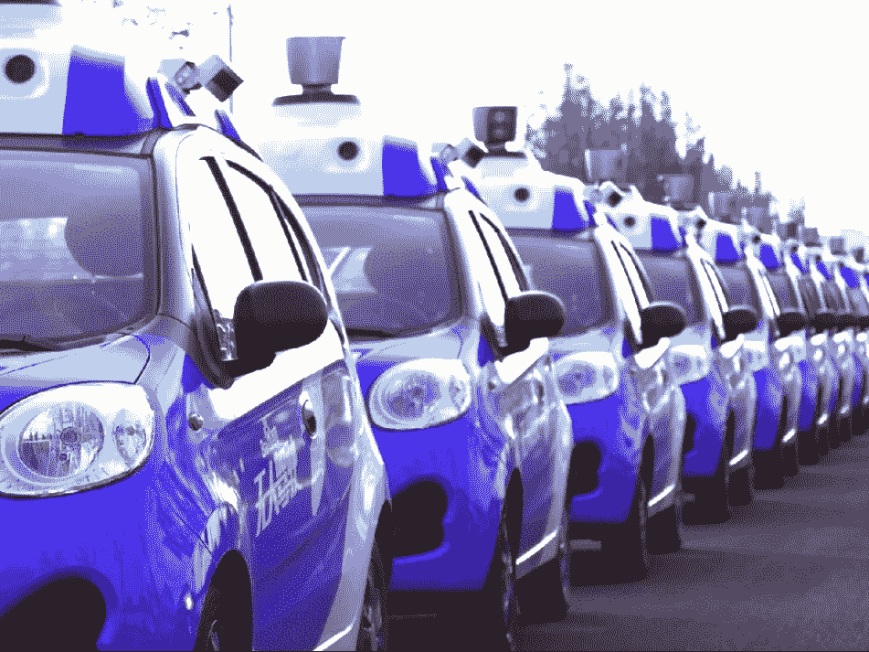
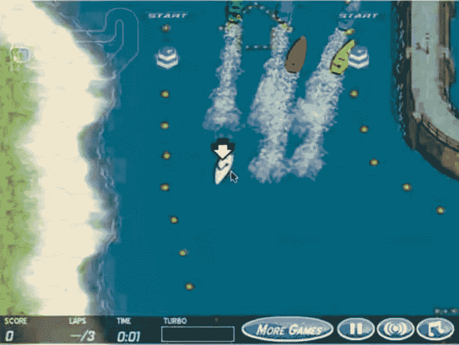
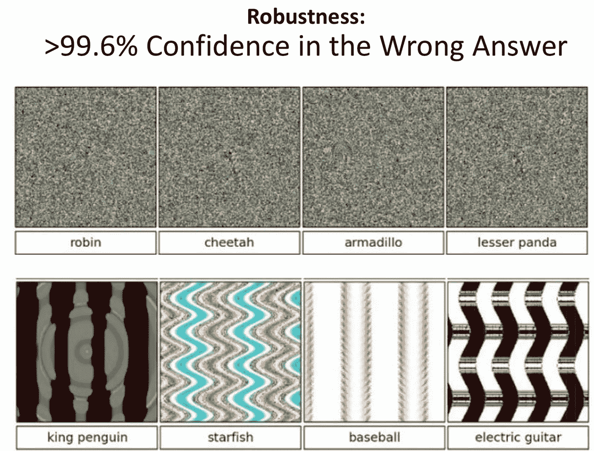

# 我们离完全自动驾驶的世界还有多远？

> 原文：<https://towardsdatascience.com/how-far-are-we-from-a-fully-autonomous-driving-world-89fde97b5352?source=collection_archive---------4----------------------->

> [你可以在 Twitter @bhutanisanyam1](http://twitter.com/bhutanisanyam1) 上找到我，在 [Linkedin 上联系我](https://www.linkedin.com/in/sanyambhutani/)
> 
> [这里是我的车库项目](http://sanyambhutani.com/)
> [这里](https://becominghuman.ai/a-self-driving-new-year-33284e592f35)和[这里](https://hackernoon.com/a-self-driving-new-year-2-d1bbc5a83570)是我[学习](https://hackernoon.com/tagged/learning)通往[自动驾驶汽车](https://hackernoon.com/tagged/self-driving-cars)的路上的两个帖子

Source: Business Insider

麻省理工学院自动驾驶汽车深度学习课程刚刚发布了他们的第一堂课视频

该讲座是对深度[学习](https://hackernoon.com/tagged/learning)技术的概述，也对自动驾驶技术的[未来](https://hackernoon.com/tagged/future)进行了一些讨论，并对当前系统的差距进行了简要警告。

以下是我们离自主驱动的未来还有多远，以及对伦理的简要介绍:

到 2017 年，计算机视觉已经达到 97.7%+的准确率！(ImageNet 挑战)很神奇吧？

# 那么，我们离一个完全自主的世界还有多远？

97.7%听起来足够好了。是吗？毕竟驾驶涉及很多计算机视觉，它确实比人类的高分更好——那么我们接近了吗？

ImageNet 挑战包括将 1400 万张图片分类到 22000 个可能的类别中。

当外推至真实世界时，这种准确性有多好？

现在，是的，挑战中涉及的类不会都涉及到 SDC 场景，但它们确实指出了一件事，计算机视觉，尽管它现在比人类更准确，但仍然不完美。这不是 100%准确。

这与现实世界的动态相结合，表明自治系统以意想不到的方式运行的可能性很小。在所有情况下，您会完全信任系统吗？比人类司机更好地处理各种情况？

讲座中提出的论点是，SDC 现在将作为工具，帮助我们更好地驾驶。他们甚至可能比我们开得更好，但在某些时候，人类需要干预。我们从 2018 年开始有一个半自治年。

大致来说，在 90%的情况下，汽车会比我们更好地自动驾驶，但在其余 10%的情况下，需要人工干预/控制。

100%的准确性将得到普遍认可，这也需要对所有意外情况进行概括，例如:百万分之一的情况，其中一只鹿将穿过道路，该情况必须得到处理。

Lex Fridman 在演讲中认为,“完美的系统”需要更多的研究工作，并提高深度学习算法的效率。这也是非常低效的(从计算角度来说)。

我说的完美情况不是指一辆能自动驾驶的汽车。最完美的情况是，我们对系统如此自信，以至于我们的汽车里不再有方向盘。人类驾驶会被认为比自动驾驶更危险。

在那之前，SDC 肯定会出现在道路上，毫无疑问，我们可能不必长时间握着方向盘。但是肯定会有需要人类控制的时刻。因此，术语半自治。

简要提及与强化学习相关的道德规范:

再举一个强化学习的例子——强化学习包括一套算法，在这套算法中，人工智能(agent)自我学习，以最大限度地实现既定目标，从而获得最大回报。[这里有一本入门书](https://medium.com/init27-labs/reinforcement-learning-part-0-8c2c3efe0ad6)做一个抽象的概述。

很多时候，系统(特定术语为代理)以完全出乎意料的方式运行。(哪些更擅长得到结果)。

Coast Runners. Source: Lecture Notes.

讲座中海岸跑步者的例子:你和我可能会参加比赛并收集绿色圆圈。代理人发现当地的高额奖励忽略了“隐含的”完成比赛的大目标。

前沿的 AlphaGo 和 AlphaGo Zero 系统已经证明了这一点，它们在围棋比赛中表演了令人类专家感到惊讶的棋步。

那么，如果我们想以最快的方式从 A 到达 B，而 SDC 决定采用一种意想不到的方法/路径，该怎么办呢？(我知道交通规则已被很好地编码到核心系统中——但这不允许我们忽略这种可能性)

鉴于结果可能是意想不到的，我们肯定需要对系统进行检查。

Source: Lecture 1 slides.

视觉系统的鲁棒性也是有问题的。这里有一个例子，说明了如何给图像添加一点扭曲，就能轻易地骗过 ImageNet 获奖模特。

最后，SDC 来了吗？随着 [Voyage](https://voyage.auto) 在乡村部署自动驾驶出租车；通用汽车公司测试他们的大规模生产车辆？

是也不是。是的，我们周围有半自动车辆。但是一个完全自主的世界还很遥远。一种汽车根本没有方向盘的模式。几年——也许几十年。

我们有一个开始成形的半自主的现在(或未来)。

我相信到目前为止，SDCs 会像丰田展示的[守护者模式那样运作良好。](https://www.youtube.com/watch?v=ajreRfot6co)

在人类可能无法迅速做出反应的情况下，机器会接管控制权，例如:当你前方的车辆发生碰撞，需要在毫秒内做出决定时。或者在恶劣的天气条件下，由于车上的传感器(在这种情况下是雷达),车辆可以比人类“看得更清楚”。

另一方面，当情况复杂时，司机会控制局面。

在高速公路上，你可以打开自动驾驶仪，看报纸，玩游戏。但是在复杂的情况下，自动驾驶系统需要人工控制。

> [订阅我的时事通讯，获取深度学习、计算机视觉文章的每周精选列表](https://tinyletter.com/sanyambhutani)