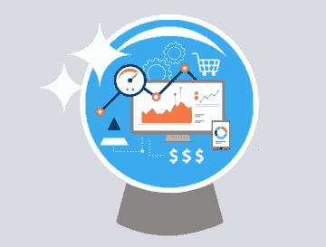
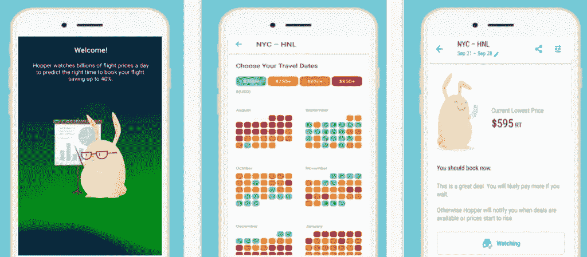
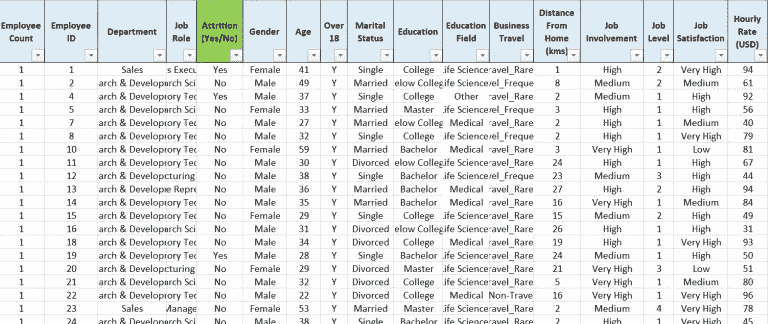
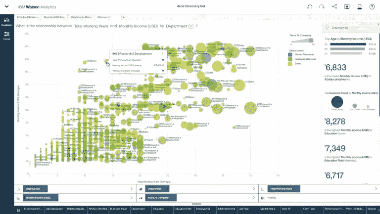

# 今天五家企业如何使用人工智能和大数据

> 原文：<https://towardsdatascience.com/how-five-businesses-are-using-ai-and-big-data-today-784abeb6f9ef?source=collection_archive---------6----------------------->

预测分析可以定义为一种数据挖掘形式，它使用统计建模来分析历史模式，然后使用这些模型来预测未来的结果。人工智能的部署使分析技术能够发现人类根本无法看到的变量之间的关系。

在本文中，我们希望通过五个预测分析用例将这一理论付诸实践。

在这个领域有一些有新闻价值的故事，特别是几年前引起如此多关注的[“目标知道你何时怀孕”](https://www.forbes.com/sites/kashmirhill/2012/02/16/how-target-figured-out-a-teen-girl-was-pregnant-before-her-father-did/#5ee539196668)头条新闻。

从那以后，事情有了很大的发展。广泛可用和可访问的分析平台的发展为各种规模的公司提供了对复杂统计模型的访问。除了稍微令人毛骨悚然的怀孕预测的夸张之外，[大数据](https://www.clickz.com/tag/big-data/)更典型地被小型和大型企业用来改善他们的日常功能。

通过定义他们想要解决的问题，获取正确的数据，雇用具有理解数据的技能的人，并为他们提供适当的技术，任何企业都可以从今天有利可图的预测分析领域开始。

竞争者太多了，无法在一篇文章的范围内考虑每一个例子，所以我们试图提供一个有效的基于人工智能的[分析](https://www.clickz.com/category/analytics/)的代表性样本，涵盖广泛的案例研究。

# 1.供应链优化:沃尔玛

我们从一个重量级的例子开始，但它为所有零售商提供了灵感。

当许多其他“传统”零售商还在苦苦挣扎时，沃尔玛已经连续 11 个季度公布了增长数据。值得注意的是，这是由网上销售额同比增长 63%推动的。

沃尔玛因其适应数字时代的意愿而备受赞誉，并押注于其连接线上和线下世界的能力，以与亚马逊竞争。

人工智能和预测分析是这一驱动力的核心。沃尔玛从其销售点系统即时获取数据，并将其纳入预测，以评估哪些产品可能售罄，哪些产品表现不佳。

*Photo by* [*chuttersnap*](https://unsplash.com/photos/kyCNGGKCvyw?utm_source=unsplash&utm_medium=referral&utm_content=creditCopyText) *on* [*Unsplash*](https://unsplash.com/?utm_source=unsplash&utm_medium=referral&utm_content=creditCopyText)

结合在线行为模式，这提供了大量的数据点([超过 40pb](https://www.rtinsights.com/walmart-cloud-inventory-management-real-time-data/))来帮助沃尔玛为产品需求的上升或下降做准备。

数据通过沃尔玛的“数据咖啡馆”在云中管理，该咖啡馆由硅谷的沃尔玛实验室团队维护。这是一项复杂的、大规模的工作，要根据可靠的数据做出准确的预测，就需要与如此规模的企业所需的变量数量保持一致。

尽管如此，它带来的好处也可以被小企业所追求。

例如，沃尔玛对人工智能和预测分析的使用对于库存管理来说非常宝贵，因为经理们可以适当地进货，而不必冒着在需求超过供应时不得不做出昂贵的最后一分钟调整来填补缺口的风险。

这些预测还允许沃尔玛个性化其在线存在，根据特定客户的预测购买可能性向他们展示产品。

这种方法带来的纪律和严谨性意味着沃尔玛可以坚持严格的交货日期，因为其供应链的每一步都通过使用预测分析进行了优化。所有这些领域都可以由任何企业通过谷歌和 Adobe 这样的可用技术来改进。

引人注目的是，如果顾客从实体店取货，沃尔玛还会以降价或插队特权的形式向他们提供激励。尽管基于人工智能的分析可以给企业带来所有好处，但在运输成本上与亚马逊竞争仍然是一项艰巨的任务。

# 2.预测价格趋势:Hopper

众所周知，T2 的旅游业竞争激烈，需求时好时坏，还有许多低利润的线路。这可能会让旅行者蒙在鼓里，不确定最佳预订时间。有时最好提前预订，有时最好等到离出发日期更近的时候。

这使得它成为一个成熟的领域，可以发挥人工智能驱动的预测分析的力量，这一事实见证了旅行应用 [Hopper](http://hopper.com/) 自 2015 年以来的受欢迎程度大幅增长。

Hopper 通过预测未来的价格模式并提醒旅行者购买飞往他们首选目的地的航班的最便宜时间，领先一步。

它通过每天观察数十亿的价格，并基于每条路线的历史数据，预测趋势将如何发展来做到这一点。然后，用户可以设置通知，提醒他们在价格下降时预订。

虽然不是唯一一家提供这种服务的公司，但 Hopper 报告称其预测准确率达到 95%，并声称每次飞行平均为客户节省 50 多美元。

下面的截图显示了这个过程是如何运作的。在一只可爱的、戴着眼镜的小兔子的陪伴下，我选择了纽约到檀香山的飞行路线，度过了一个当之无愧的假期。

Image created by author

根据我选择的日期，令人惊讶的专横的兔子告诉我现在预订，因为这条路线的门票只会随着时间的推移越来越贵。

Hopper 提供了一个将机器学习和预测分析作为其商业战略核心原则的商业范例。没有预测分析，就没有 Hopper。

然而，它所使用的统计模型对所有企业都有借鉴意义。Hopper 的成功本质上来自于它作为一个客观的消费者建议平台的可靠性。因此，许多其他公司可以通过使用统计数据来提供符合客户最佳利益的预测，而不仅仅是他们自己的底线。

# 3.小企业增长:迪法恩斯角动物园和水族馆

SAP 在 2016 年末进行的一项[调查](http://news.sap.com/wp-content/blogs.dir/1/files/SAP_IDC_infobrief_SMB_DX_102016.pdf)发现，超过 70%的小企业领导者认为他们仍处于从数据中获得洞察力的“早期阶段”。

华盛顿塔科马的一家动物园逆潮流而动，与国家气象局合作，找出导致游客人数如此不可预测地上升和下降的因素。这给管理人员带来了问题，他们总是为公园配备工作人员以迎合大量观众，但往往由于出席人数不多而导致工资超支。

凭直觉，我们可以假设，在温暖干燥的日子里，上座率较高，但在寒冷或潮湿的日子里，上座率较低。然而，通过将国家气象局的数据纳入 IBM 的人工智能驱动的沃森平台，动物园能够准确地确定哪些条件导致更多人参观。

这一知识随后被用于模拟未来的游客模式，使用历史游客人数和预测的天气统计数据。

Source: Unsplash

该项目取得了巨大的成功，现在是动物园商业规划的核心部分。Point Defiance 可以预测 95%以上的出席人数，使管理人员能够适当地为公园配备人员。这对游客如何体验公园没有负面影响(甚至可能相反)，并创造了一些重要的商业效率。

当然，这种方法的应用范围远远不止是出席人数。迪法恩斯港可以监控游客与动物园的互动，有助于提供更好的客户体验。还计划使用人工智能驱动的预测分析来监控健康数据，诊断公园动物的问题，以提供预防性治疗。

# 4.留住员工:IBM

预测分析的根本吸引力在于它有可能根据组织目标提供更好的结果。这些通常公开以利润为基础，但预测分析也可以帮助识别员工保留问题并提出解决方案。

通过上传结构化数据文件(如下图所示)，Watson 可以发现员工流失的常见原因。然后，根据每个员工预计不久离开公司的可能性，为他们生成一个“质量分数”。

真正发挥作用的是它响应用户自然语言请求的能力。与谷歌的新分析功能类似，Watson 可以根据用户的偏好响应特定的查询并构建数据可视化。

这是一个平台从探索性和诊断性分析快速进入预测性分析领域的绝佳例子。任何企业所有者或管理者都可以利用这些工具来精确地确定到底是什么导致员工离职，但他们也可以看到这些因素背后的原因，并采取预防措施来平息任何潜在的离职。考虑到招聘新员工与留住现有高绩效员工的成本，这将直接导致运营成本的降低。

# 5.观众延伸:安德玛

受众扩展是从人工智能和预测分析的使用中受益匪浅的另一个营销领域。通过了解现有高价值客户的数量特征，可以识别相似的个人，并向他们提供可能引起共鸣的个性化信息。

知道把广告预算花在哪里很重要，但知道不花在哪里也很重要。预测分析允许像安德玛这样的公司专注于将带来最大回报的领域，并将原本会被不准确花费的预算进行再投资。

安德玛使用人工智能来执行情感分析和社交倾听等任务，以了解客户对该品牌的看法，以及市场的差距在哪里。这使得该公司专注于成为一个数字健身品牌，这一举措使其在饱和的市场中开辟了一个新的利基市场。

安德玛生产健身产品，也生产应用程序和可穿戴设备，将线下和数字世界联系在一起。使用这些产品的人越多，安德玛就能收集到越多的数据来改进产品。每年有超过 2 亿的注册用户和超过 100 亿次的数字交互，因此不缺少数据。

*最初发表于*[*【www.clickz.com】*](https://www.clickz.com/5-businesses-using-ai-to-predict-the-future-and-profit/112336/)*。*