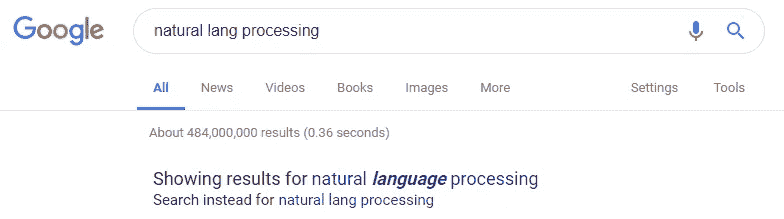

# 模糊匹配如何改进你的 NLP 模型

> 原文：<https://towardsdatascience.com/how-fuzzy-matching-improve-your-nlp-model-bc617385ad6b?source=collection_archive---------7----------------------->

## 模糊匹配


Photo by [Ross Joyner](https://unsplash.com/@rossjoyner?utm_source=medium&utm_medium=referral) on [Unsplash](https://unsplash.com?utm_source=medium&utm_medium=referral)

处理自然语言处理任务的挑战之一是文本模糊匹配对齐。当跳过这个文本处理文本时，您仍然可以构建您的 NLP 模型，但是代价是您可能不会获得好的结果。有人可能会说，在使用深度学习时，没有必要进行预处理。从我的经验来看，有适当的文本预处理至少可以提高你的模型 3% ~ 5%。

那么在什么样的场景下我们需要处理文本模糊匹配，我们能做些什么呢？如果输入源(即文本)不能保证 100%正确，或者存在别名，如“纽约”和“美国纽约”。

对于情况 1，输入可以来自用户，典型的例子是搜索。想象你正在构建[谷歌搜索](https://www.google.com)引擎，你必须验证输入而不是盲目地使用输入。



“language” is suggested to replace “lang” by Google

另一种可能的情况是输入是其他模型的输出。例如，输入来自光学字符引擎(OCR)的输出，您最好减少来自其他模型的错误。

对于第二种情况，即别名。尽管有人认为我们可以构建一个惊人的[单词嵌入](/3-silver-bullets-of-word-embedding-in-nlp-10fa8f50cc5a)，使得“纽约”和“美国纽约”的向量对于模型来说足够接近。但是，为什么不用一种简单的方法来解决呢？


Photo by [KEITH WONG](https://unsplash.com/@kwhatswong?utm_source=medium&utm_medium=referral) on [Unsplash](https://unsplash.com?utm_source=medium&utm_medium=referral)

# 模糊的

FuzzyWuzzy 是一个简单但有用的库，可以找到相似的文本和分数。这个库是由 [SeatGeek](https://seatgeek.com) 提供的。使用这个库非常简单。您只需要传递目标令牌和字典。对于下面的例子，我试着搜索国家，国家列表可以从[这里](https://github.com/umpirsky/country-list)下载。

```
from fuzzywuzzy import process
process.extract('Hong Kong', countries, limit=3)
```

第一个参数是你的目标词，而第二个参数是字典。

```
[('Hong Kong SAR China', 90), ('Kongo', 72), ('Tonga', 54)]
```

经过计算，fuzzywuzzy 提出“中国香港特别行政区”与“香港”的得分最高。

## 其他得分算法

Fuzzywuzzy 为我们提供了以下不同的算法来对字符串进行评分。详细实现可以访问[源代码](https://github.com/seatgeek/fuzzywuzzy/blob/master/fuzzywuzzy/fuzz.py)。

> ratio:sequence matcher 的包装器。根据 0 到 100 之间的匹配字符块的数量计算分数。

```
Formula: 2*(Matched Characters) / (len(String A) + len(String B))
```

以“Edward”为目标词，以“Edwards”、“Edwards2”和“drawdE”为词典。字符数分别为 7、8 和 6。

```
process.extract('Edward', ['Edwards', 'Edwards2', 'drawdE'], scorer=fuzz.ratio)
```

结果是

```
[('Edwards', 92), ('Edwards2', 86), ('drawdE', 50)]
```

“drawdE”的结果是 50，你可以看到它不是简单地计算匹配字符的数量，而是字符块。

> WRatio:默认计分器。使用不同的算法给 0 到 100 之间的字符串打分。

为了查看我们是否可以查询回预期的位置名称，让我们看看是否可以返回日本(输入“日本”)和美国(输入“美国”)。

```
# Default scorer is Weighed Ratio
for location in ['Hong Kong', 'jepen', 'United tates']:
    result = process.extract(location, countries, limit=2)
    print(result)
```

结果是

```
[('Hong Kong SAR China', 90), ('Congo - Kinshasa', 57)]
[('Japan', 60), ('Yemen', 60)]
[('United States', 96), ('United Arab Emirates', 86)]
```

> QRatio:字符串的快速比率比较。

```
# Partial Ratio
process.extract('Hong Kong', countries, scorer=fuzz.QRatio, limit=3)
```

结果是

```
[('Hong Kong SAR China', 64), ('Kongo', 57), ('Togo', 46)]
```

还有 UWRatio(与 WRatio 相同)和 UQRatio(与 QRatio 相同)，以防你必须处理 unicode。

# 拿走

要访问项目模板，您可以访问这个 [github](https://github.com/makcedward/nlp/blob/master/sample/preprocessing/nlp-preprocessing-string_matching-fuzzywuzzy.ipynb) repo。

# 关于我

我是湾区的数据科学家。专注于数据科学、人工智能，尤其是 NLP 和平台相关领域的最新发展。你可以通过[媒体博客](http://medium.com/@makcedward/)、 [LinkedIn](https://www.linkedin.com/in/edwardma1026) 或 [Github](https://github.com/makcedward) 联系我。

# 参考

[Python 中的 Fuzzywuzzy](https://github.com/seatgeek/fuzzywuzzy)(原创)

[Java 中的 Fuzzywuzzy](https://github.com/xdrop/fuzzywuzzy)

[国家数据集](https://github.com/umpirsky/country-list)

[文字嵌入故事](/3-silver-bullets-of-word-embedding-in-nlp-10fa8f50cc5a)