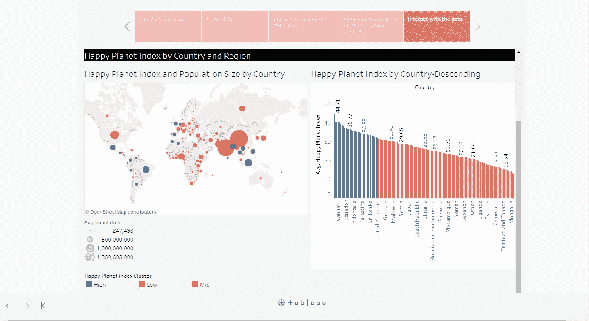
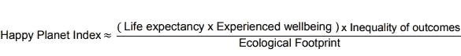
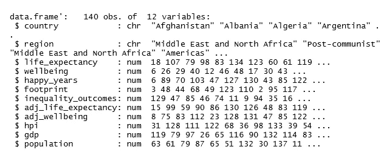
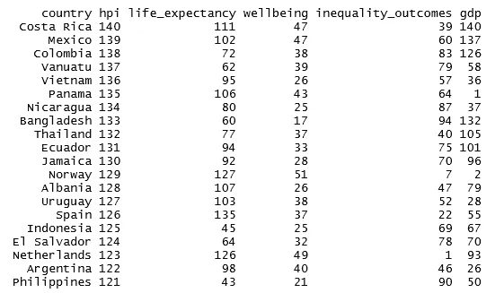
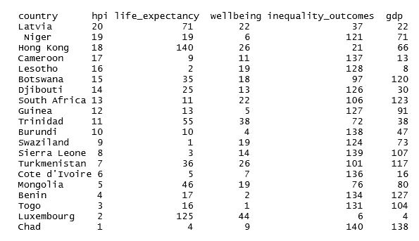
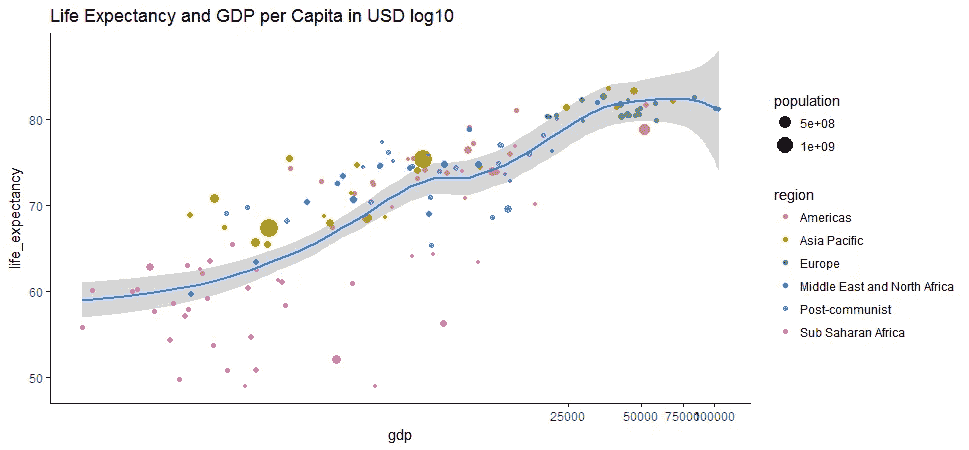
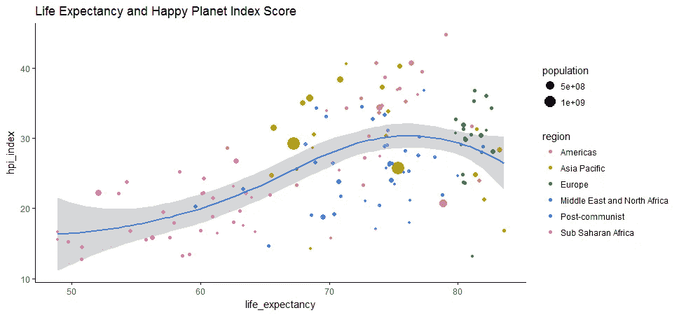
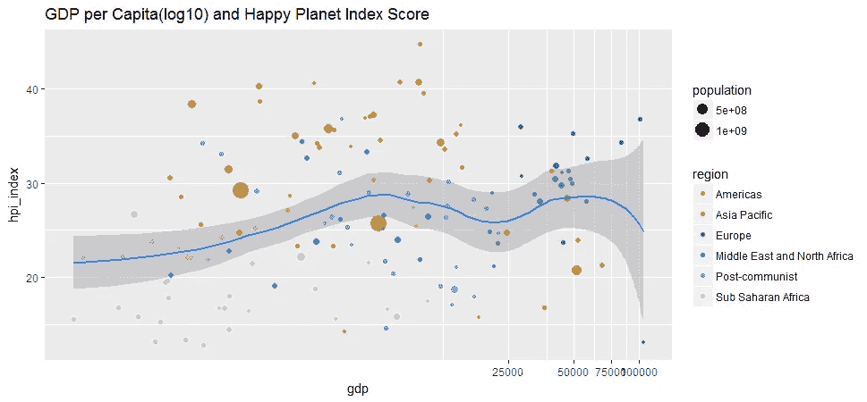
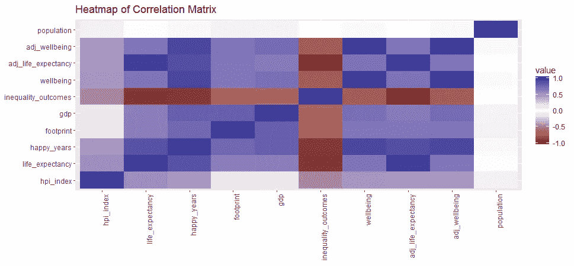
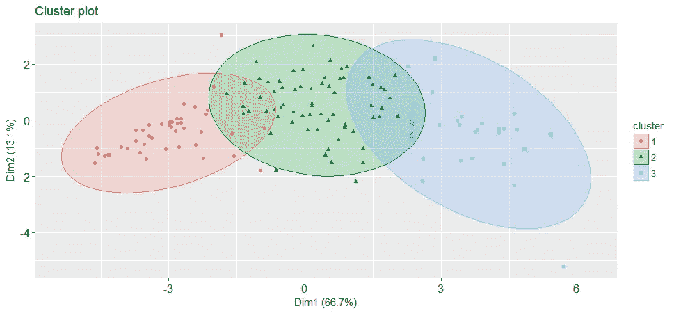

# 你的国家有多幸福？—快乐星球指数可视化

> 原文：<https://towardsdatascience.com/how-happy-is-your-country-happy-planet-index-visualized-32220715adaf?source=collection_archive---------2----------------------->



# 介绍

幸福星球指数(HPI) 是由英国经济智库 [NEF](http://neweconomics.org/) 推出的人类福祉和环境影响指数，旨在促进社会、经济和环境公平。它根据“什么最重要——所有人的可持续福祉”对 140 个国家进行了排名。

HPI 是这样计算的:



Source: HPI

它告诉我们“各国在实现长寿、幸福、可持续生活方面做得有多好”。该指数加权后，生态足迹越低的国家得分越高。

我从 [HPI 网站](http://happyplanetindex.org/countries)下载了 2016 年的数据集。我感兴趣的是找到幸福、财富、预期寿命、足迹等等之间的相关性，然后根据上述衡量标准，将这 140 个国家归入不同的组别。我想知道这些发现是否会让我吃惊。

注:对于那些想现在就看到结果的人，我已经建立了一个 [Tableau 故事](https://public.tableau.com/profile/susan.li#!/vizhome/HappyPlanetIndex_2/2016WorldHappinessStory)，可以从[这里](https://public.tableau.com/profile/susan.li#!/vizhome/HappyPlanetIndex_2/2016WorldHappinessStory)进入。

# 数据

经过预处理后，这是我们正在处理的数据:它包含 140 个国家和 12 个变量:国家，地区，预期寿命，幸福，幸福年，足迹，不平等结果，预期寿命，幸福指数，国内生产总值和人口。



**最幸福的 20 个国家(根据幸福星球指数)**

哥斯达黎加位居榜首，紧随其后的是墨西哥和哥伦比亚。挪威是排名最高的欧洲国家。



**最不快乐的 20 个国家(根据快乐星球指数)**

乍得排名垫底，其次是卢森堡。卢森堡是富裕国家中得分非常低的最极端的例子——它在预期寿命方面做得很好，但不平等程度较低；它是世界上人均 GDP 最高的国家之一，但却以世界上最大的人均生态足迹维持着这种生活方式。“如果卢森堡的生活在其他国家复制，我们需要 9.1 个地球来维持我们的生存！”快乐星球指数声称。



**人均 GDP 和预期寿命的关系**

人均国内生产总值和预期寿命之间的相关性相对较强，因为这两个变量是一致的。这两个变量之间的皮尔逊相关性相当高，约为 0.62。



Figure 1

```
Pearson's product-moment correlation

data:  hpi$gdp and hpi$life_expectancy
t = 9.3042, df = 138, p-value = 2.766e-16
alternative hypothesis: true correlation is not equal to 0
95 percent confidence interval:
 0.5072215 0.7133067
sample estimates:
      cor 
0.6208781
```

**预期寿命和幸福星球指数得分的关系**

尽管欧洲和美洲的许多国家预期寿命较长，但由于碳足迹较大，它们的 HPI 指数最终处于中低水平。



Figure 2

**GDP 与幸福星球指数得分的关系**

GDP 买不到幸福。GDP 和幸福星球指数得分的相关性确实很低，大概在 0.11 左右。



Figure 3

```
Pearson's product-moment correlation

data:  hpi$gdp and hpi$hpi_index
t = 1.3507, df = 138, p-value = 0.179
alternative hypothesis: true correlation is not equal to 0
95 percent confidence interval:
 -0.05267424  0.27492060
sample estimates:
      cor 
0.1142272
```

**一个简单的关联热图**



Figure 4

# 使聚集

在一系列统计分析之后，通过应用 [Pam 聚类分析](http://www.sthda.com/english/wiki/partitioning-cluster-analysis-quick-start-guide-unsupervised-machine-learning#pam-partitioning-around-medoids)，我将这 140 个国家按照财富、发展、碳排放和幸福程度分成三组(如果你对聚类分析的细节感兴趣，你可以在 [Github](https://github.com/susanli2016/Data-Analysis-with-R/blob/master/happy_planet_index.Rmd) 上的 [R Markdown](https://github.com/susanli2016/Data-Analysis-with-R/blob/master/happy_planet_index.Rmd) 文件中找到它们)。



Figure 7

这三个星团是如何出现在世界地图上的？


Figure 8

# 摘要

幸福星球指数被批评为对生态足迹的加权过重；生态足迹是一个有争议的概念。此外，幸福星球指数被误解为个人“幸福”的衡量标准，而事实上，它是地球“幸福”的衡量标准。

然而，快乐星球指数已经成为政治领域的一个考虑因素。对我们来说，它是有用的，因为它结合了福祉和环境方面，而且简单易懂。而且，它可以在网上找到，所以我们可以用它来创作一个故事。

创建这篇文章的源代码可以在[这里](https://github.com/susanli2016/Data-Analysis-with-R/blob/master/happy_planet_index.Rmd)找到。同样，欢迎你尝试用这些数据创建的[画面故事](https://public.tableau.com/profile/susan.li#!/vizhome/HappyPlanetIndex_2/2016WorldHappinessStory)。我将很高兴收到关于上述任何反馈或问题。