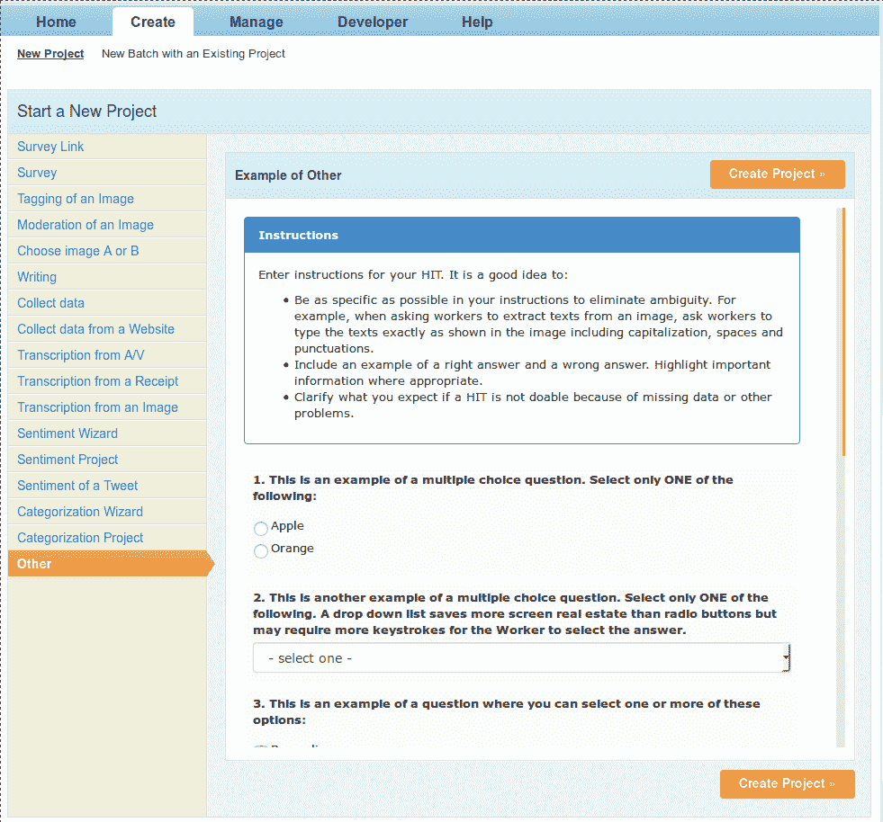
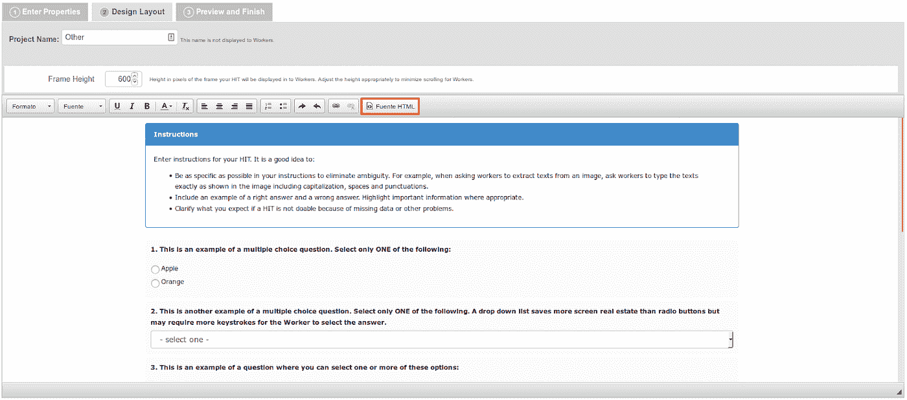

# 我如何用 4 小时的工作和 500 美元创建了一个 40，000 标签的音频数据集

> 原文：<https://towardsdatascience.com/how-i-created-a-40-000-labeled-audio-dataset-in-4-hours-of-work-and-500-17ad9951b180?source=collection_archive---------10----------------------->

## 我将向您展示如何使用 amazon mechanical Turk 创建定制的高质量数据集。

我已经开发深度学习产品好几年了，在我开始一个新项目之前，我对客户的要求之一是他们必须已经有一个数据集。这一直是一个要求，因为它确保我不必做任何我不太喜欢的数据集创建工作。这通常需要一段时间，并且会变得非常繁琐，尤其是在没有公开可用的数据源的情况下。虽然公平地说，每天都有许多数据集可用，而且越来越多，你现在可以使用[谷歌的新数据集搜索工具](https://toolbox.google.com/datasetsearch)进行搜索。

几个月前，一家读者公司找到我，希望帮助我开发一款产品，但他们没有数据集，这次我决定尝试一下。我想这将是一个探索过程和培养技能的绝佳时机。这是我发现亚马逊 Mechanical Turk 对于深度学习工程师的强大之处。经过 4 个小时的编码和跑腿工作，我发表了我的第一首热门歌曲。40 小时后，我有了一个包含 40k 标签图像的数据集，而我的钱包只轻了 500 美元。我觉得我刚刚用了一个作弊代码。我想分享一些我使用 MTurk 学到的东西，并希望它能帮助你为你的项目建立定制的深度学习数据集。

*尝试构建自定义数据集？不确定从哪里开始？和我一起聊 30 分钟，谈谈你的项目。我会帮助你更清楚地看到问题，并帮助你消除噪音。*

## [报名一个时间段](https://calendly.com/cdossman/cdossman-consultation)

# 什么是机械土耳其人

Mechanical Turk 或 MTurk 是一个众包市场，在这里你可以发布和协调广泛的人类智能任务(HITs)。任务可以是任何东西，如分类、标记、调查、转录、数据收集，以及任何你可以制作成网站的东西。工人可以查看/选择您的任务，并为每个任务赚取少量奖励。

该平台提供了许多有用的工具来创建您的工作，并使工人轻松地成功完成您的任务。假设您想要创建一个包含 1000 张带标签图像的数据集，您可以对每 10 张分类图像收取 0.25 美元，并以 25 美元的价格获得完整的数据集。最棒的是，你将在几个小时内获得数据集。

# 从现实世界的例子开始

## 1:选择击中的类型

MTurk 有多种 HIT 模板可供选择，这使得它很容易开始。它们的范围从调查模板到音频和视频的转录。花些时间检查不同的项目，了解你能做什么。

如果您看不到可以使用的项目模板，您可以随时使用通用调查链接模板，并将其链接到自定义网页，这样员工就可以执行任何任务。我用这种方法收集非标准的训练数据已经非常成功了。

## 2.设置点击的属性

命中属性对于成功收集数据非常重要。命中属性包括像标题和描述这样平凡的事情，但也有很多重要的设置，如每次命中的任务数量和每次命中的奖励。

每次点击的奖励是你要付给完成你的任务的工人多少钱。当试图计算一个公平的报酬率时，花点时间自己做，并计算好时间。看看你完成任务需要多长时间，然后计算出等价的报酬，假设完成任务需要 1 个小时，并且你支付了最低工资。我已经无数次使用这种方法来获得我所有任务的启动费，并且结果的质量一直很高。请记住，工作越努力，你就应该付出更多来保持质量。我花了高达 2.00 美元去做一件需要 10 分钟的工作。

每项任务分配的时间也是一个需要考虑的重要因素。我发现这一点时，我认为这只是一个数字，工人们看看他们是否有时间完成任务。我了解到，一旦他们开始工作，就会被限制在这个时间范围内。这导致了一些工人的问题，当他们的时间用完了，不能领取他们的奖励！

**其他一些有用的参数:**

*   点击过期
*   自动审批和支付员工
*   MTurk 大师
*   点击率
*   批准的点击次数
*   特定位置的工人
*   特定语言技能要求

## 3.自定义您的 HIT HTML 模板

设置好参数后，您可以创建或更改所有员工在决定是否接受您的工作时都会看到的 HTML 设计。MTurk 为你提供了一个非常用户友好的 HTML 编辑器来帮助你。如果你想要一个非常定制的模板，你也可以直接编辑 HTML 源代码。

# 最佳实践

花点时间为任务创建说明，因为这可能意味着好数据和坏数据之间的差异。这是每一击最关键的组成部分。保持你的指示简单明了，以避免工人的错误

## 为你的项目制定清晰的评估政策

您应该手动评估您的点击结果。当您制定评估政策时，无法满足这些指标的明确员工有机会不接受 HIT，而不是糟糕地完成它，这将浪费您和他们的时间。

## 包括黄金标准项目

黄金标准项目是那些你已经知道答案的项目。当您将这些项目包含到您的 HIT 中时，您就有办法在评估期间自动剔除不良员工的工作。

## 评估你得到的结果

总是评估你得到的结果。您可以选择自动或手动完成这项工作，但这是至关重要的一步。不检查工人的工作会导致质量低劣和彻头彻尾的欺诈。

我最近遇到过一个案例，一个工人正在提交由自动化系统生成的结果。幸运的是，我的黄金标准项目和我花在评估结果上的时间提醒了我这个坏演员，我能够阻止他们的帐户提交任何更多的工作。

*尝试构建自定义数据集？不确定从哪里开始？和我一起聊 30 分钟，谈谈你的项目。我会帮助你更清楚地看到问题，并帮助你消除噪音。*

## [报名一个时间段](https://calendly.com/cdossman/cdossman-consultation)

# 最后的想法

Mechanical Turk 对于深度学习工程师和团队来说是一个非常棒的工具。它可以用来建立数据集，只有大公司才能在很短的时间和成本内完成。它的 API 还允许你自动化剩下的大部分工作。我可以进行全自动的评估和职位发布。

除了显而易见的成本和时间优势，还有出色的员工群体。他们来自各行各业，为了完成你指定的 10 分钟任务，他们愿意走多远会让你吃惊。我最近开发了一个数据集，我用它来建立一个老年人监测和警报系统，我收到了 10 封电子邮件感谢我开发这个系统，还有几封电子邮件让我知道如何更好地帮助工人们完成它。

# 感谢阅读:)如果你喜欢它，尽可能多的点击下面的按钮！这对我意义重大，鼓励我写更多这样的故事

*咱们也连线上* [*Twitter*](https://twitter.com/cdossman) *或者*[*LinkedIn*](https://www.linkedin.com/in/christopherdossman/)