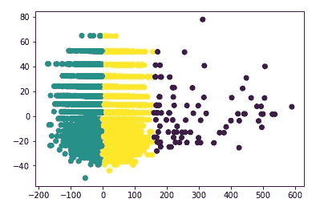
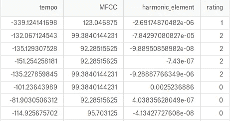
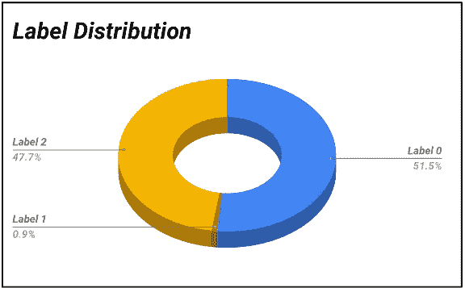
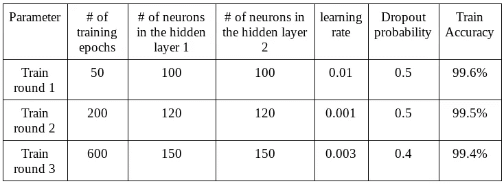
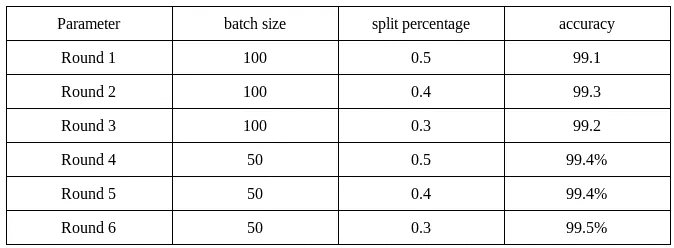
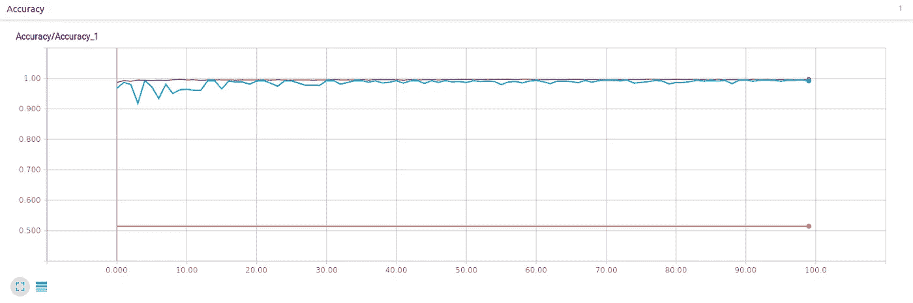
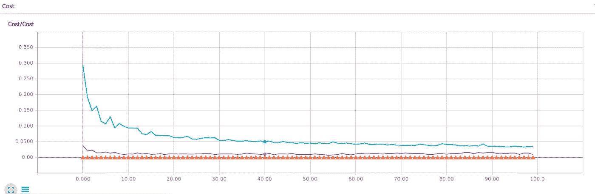
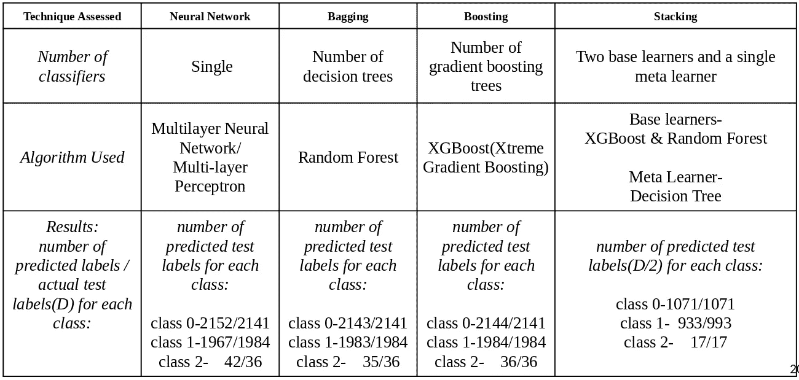
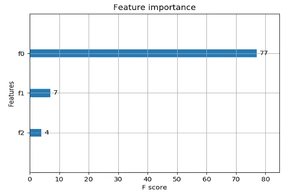
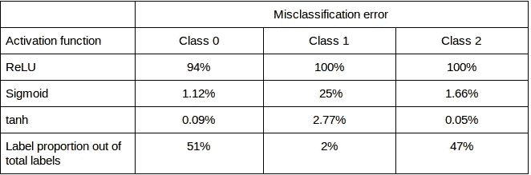

# 我如何创建一个分类器来确定一首歌的潜在流行度。

> 原文：<https://towardsdatascience.com/how-i-created-a-classifier-to-determine-the-potential-popularity-of-a-song-6d63093ba221?source=collection_archive---------5----------------------->

帮助音乐人成功的工具。

Source: [Unsplash](https://images.unsplash.com/photo-1524181385915-2104bc5514f1?ixlib=rb-1.2.1&q=80&fm=jpg&crop=entropy&cs=tinysrgb&dl=tom-pottiger-yxzl9lnxSNA-unsplash.jpg)

# 介绍

从我的角度来看，我看到许多音乐家，无论是乐队还是个人，都没有在社会上获得他们想要的受欢迎的地位，而很少有人主宰音乐行业。因此，我的努力是开发一个系统，让每个对通过歌曲展示自己独特才华感兴趣的音乐爱好者能够评估他们可能从观众那里获得的潜在受欢迎程度。

受欢迎程度与取决于音乐观众偏好的评级相关联。将有三个评级等级，分别标为优秀、中等和差。因此，较高的评价(优秀)表明在音乐观众中类似于其他高评价歌曲的流行度，反之亦然，而中等的保持在以上两者之间的音轨。

# 技术

tensor flow——一个流行的机器学习库

pandas——python 的数据处理和操作库

一个音乐和音频分析工具

另一个机器学习库(一个高级 API)

numpy——有效执行矩阵(2d 数组)运算的便捷工具

操作系统处理与文件系统相关的操作

CatBoost——一个用较少的过度拟合实现增强树的库

XGBoost- a 梯度推进算法

# 方法

我们将需要一个数据集来工作，我们需要手工制作，因为我将使用僧伽罗语歌曲，因为僧伽罗语是我的母语，以及基于这些做的研究较少。目前没有关于僧伽罗歌的数据集。因此需要创建一个。我们的任务将是一个采用监督学习方法的分类任务。我们将主要关注神经网络作为我们的分类算法。具体来说，我们将使用使用 tensorflow 实现的多层神经网络。我们还将在结果部分对使用多种技术获得的结果进行比较。

# 设计

A complete process execution of the system

# 方法学

在开发我们的解决方案时，我们考虑了各种方法来选择最佳方案。每种方法的性能比较可以在结果部分找到。考虑了以下实现。

1.香草神经网络(多层神经网络)

2.集合技术(随机森林)

3.升压(XGboost，CatBoost)

4.堆叠(2 个基础学习者，1 个元学习者)

## *创建数据集*

我们将使用 librosa 从 8000 多首音乐库中为每首歌曲提取三个有意义的特征。这三个特征将是节奏(每分钟节拍数)、梅尔频率倒谱系数(模仿人类[语音产生](http://recognize-speech.com/speech/speech-production)和[语音感知](http://recognize-speech.com/speech/sense-of-hearing)的某些部分)和谐波元素(音频信号内的谐波分量)。使用这三个特征的原因是因为它们被认为是音乐的高级特征，并且高级特征已经被证明是观众偏好的更具决定性的因素，因为它们捕获了观众最看重的特征。接下来，我们需要标记这个数据集。为此，我们使用 K-means 聚类将数据点分成三个聚类，这三个聚类的数量等于评级类别的数量。这里，我们假设具有相似特征的歌曲生成彼此接近的特征值，因此当计算距离度量以确定数据点所属的聚类时，具有相似评级的数据点的距离将具有微小的差异。从而落入相同的集群。确定标注后，合并要素和标注以创建数据集。

Clustering performed on the dataset using three clusters

聚类标签将被分配 0 和聚类数-1 之间的随机整数给三个聚类。这些标签 0、1 和 2 只是分隔三个集群的符号，因此没有数字表示。因此，如果有人需要确定哪个标签是优秀、中等和差，以评估他们的立场。他们必须从自己的角度来定义成功。原因是音乐因人而异的主观性。例如，如果我想根据我认为的流行歌曲来评价我的歌曲。我必须首先选择我认为优秀、一般和差的三首歌曲，并提取这些歌曲的特征，将它们提供给系统，并获得这些歌曲的评级/标签。现在，既然我知道了这些标签在我看来意味着什么，我就可以把我的作品交给系统，并获得标签/评级，然后比较我的立场。

First few records of the dataset

Label Distribution

## 数据预处理

sklearn 中的 LabelBinerizer()已用于在标签上创建等效的一键编码。

StandardScaler()用于将数据标准化为平均值为零、标准差为一的普通高斯分布。

## 构建神经网络

神经网络有一个输入层、两个隐藏层和一个输出层。首先，我们创建三个占位符，以提供每个神经元存在的特征、标签和概率，这是丢弃层中需要的参数。这些占位符的值将在运行时提供。然后，我们通过声明每一层的权重和偏差来创建网络的每一层。除了输出层之后，在每一层之后，将在激活函数的输出上添加漏失。前馈神经网络的基本概念是，输入到某一层的输入乘以一个权重矩阵，并添加到该层的偏差中。这些权重和偏差是可以改变的变量，以便使学习函数一般化。来自层的结果被给予激活函数，该激活函数根据激活函数将输入映射到特定范围内的输出。输入层和隐藏层的激活函数将是 *tanh* ，而输出层将具有 *softmax* 激活函数。中间层的最佳激活被证明是 *tanh* ，其流行的激活函数与性能的比较将在结果部分提供。

## 价值函数

我们使用的成本函数是交叉熵函数，它取预测标签的对数值，然后乘以实际标签。然后进行求和并创建新的矩阵值。为了获得每一批的成本，我们计算矩阵各行的平均值。现在我们有了一个列矩阵，它指定了每一批或一个时期的成本。

## 优化功能

作为优化函数，我们使用了随机梯度下降法，它通过学习率在降低成本的方向上调整学习曲线。

## 培养

训练是分批进行的，以减少过度拟合。此外，训练时期的数量被设置为 200。这应该在 Tensorflow 的会话中完成，因为 Tensorflow 中的计算图形仅在会话中进行评估。要提供给占位符的值是在训练期间使用 feed_dict 字典参数提供的。session 类中的 run 方法可用于运行计算图的操作。

设置超参数

**训练时期**

当我们将所有的训练数据用于训练过程时，我们说一个时期完成了。训练数据由我们的训练特征及其相应的训练标签组成。这里，我们将训练时期设置为 200，这意味着我们在 200 次迭代中训练我们的全部训练数据。没有我们可以使用的训练时期的理想数量。这取决于数据的复杂程度。因此，您应该进行参数调整或基本上尝试几个参数配置，以找到该参数的理想/合适值。

超参数 1:training_epochs = 200

因为我们正在实现一个多层神经网络。它将由一个输入层、两个隐藏层和一个输出层组成。

## 隐藏层中的神经元数量

隐藏层是对输入数据执行转换以识别模式并概括我们的模型的层。在这里，我在第一和第二个隐藏层中分别使用了 120 个神经元，这足以达到相当好的精度。但是正如我之前解释的那样，所有的超参数都应该以这样一种方式进行调整，以改善您的模型。

超参数 2:n_neurons_in_h1 = 120

超参数 3:n_neurons_in_h2 = 120

## 学习率

这是算法学习的阶段。机器学习大师说，我们应该从高学习率开始，逐步降低学习率，以达到最佳效果。此外，建议学习率保持在 0 & 1 的范围内。

超参数 4:learning_rate = 0.001

## 辍学者

用于减少训练时的过度配合。

keep_prob=0.5 用于训练，1.0 用于测试。退出仅用于培训，不用于测试。上述概率变量指定了每个神经元留在层中的概率。

最后，可以在训练后使用 save()类中的 save()方法保存模型。

为减少过度配合而采取的措施

1.打乱数据集

2.标准化数据集

3.添加漏失层

4.成批样本的训练数据集。

# **结果和讨论**

在本节中，我们将评估我们在解决问题时使用的每种方法的性能，以及我们可以获得的推论。

参数调整结果如下:

Hyper parameter configurations with changes in accuracy

其他参数(批量和分割百分比)变化:

Changes in accuracy with other parameter configurations

Accuracy variation against training epochs

Cost variation against training epochs

Performance comparison of each approach

Feature importance plot

上图显示了通过 F-score(2TP/2TP+FP+FN)测量的每个特征的预测能力。其中 TP 是真阳性的数量，FP 是假阳性的数量，FN 是假阴性的数量。

Variation in misclassification error with various activation functions

很明显，就预测精度而言，堆叠通过正确分类每个类中的每个元素提供了令人印象深刻的结果。而增压和装袋也进行得很好。神经网络的实现不是很令人印象深刻，但给出了可接受的结果。最重要的事实是，给定数据集的偏差性质，神经网络仍然能够识别类别 2 的小部分。但这是在上面提到的许多技术被结合以最小化过度拟合之后。此外 *tanh* 被认为是为输出层以外的层选择激活函数的最佳选择。

# **参考文献**

 [## 张量流

### 用于机器智能的开源软件库

www.tensorflow.org](https://www.tensorflow.org/)  [## LibROSA - librosa 0.5.1 文档

### LibROSA 是一个用于音乐和音频分析的 python 包。它提供了创作音乐所必需的构件…

librosa.github.io](https://librosa.github.io/librosa/)  [## sci kit-learn:Python 中的机器学习

### 编辑描述

scikit-learn.org](http://scikit-learn.org/stable/)  [## 催化增强/催化增强

### catboost 是一个开源的决策树梯度提升库，支持分类特征。

github.com](https://github.com/catboost/catboost)  [## XGBoost 文档- xgboost 0.4 文档

### 这是 xgboost 库的文档。XGBoost 是极端梯度增强的缩写。这是一个旨在…

xgboost-clone.readthedocs.io](http://xgboost-clone.readthedocs.io/en/latest/)  [## 城市声音分类，第 1 部分

### 基于神经网络的声音特征提取和分类

aqibsaeed.github.io](https://aqibsaeed.github.io/2016-09-03-urban-sound-classification-part-1/)  [## 语音识别维基

### 1.自动语音识别(ASR)中最常用的特征提取方法是 Mel-Frequency…

recognize-speech.com](http://recognize-speech.com/feature-extraction/mfcc) 

# **附录**

Source code for feature extraction

Source code fro neural network implementation,training and evaluation