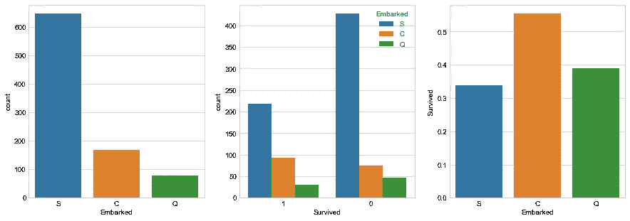
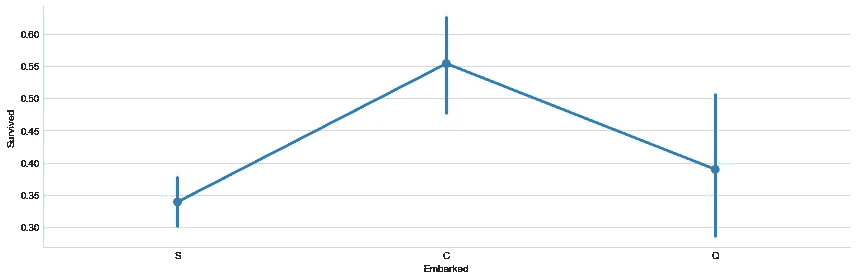
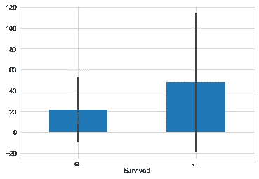
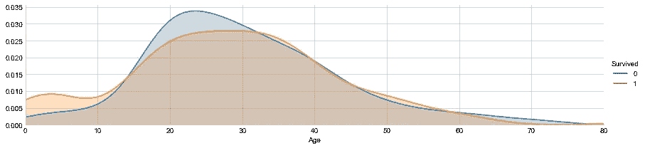
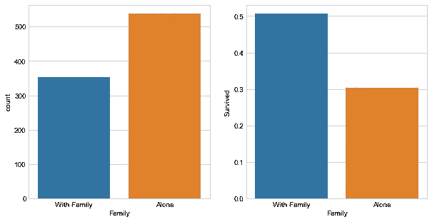
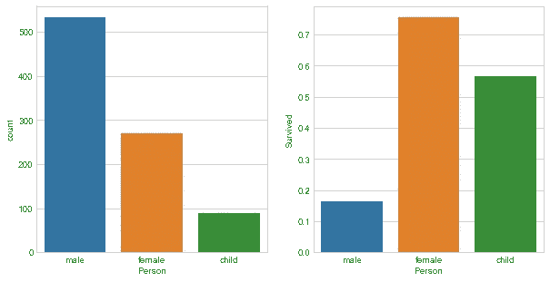

# 我是如何在凯格尔斯的泰坦尼克号比赛中获得 98%的预测准确率的

> 原文：<https://towardsdatascience.com/how-i-got-98-prediction-accuracy-with-kaggles-titanic-competition-ad24afed01fc?source=collection_archive---------1----------------------->

首先，我想开始目测数据，看看人们加入这艘船的城市是否有任何统计上的重要性。尽管从瑟堡开始旅程的旅行者在存活率上有轻微的统计改善。我决定放弃这个专栏。



Count of survivors vs non-survivors, grouped by arrival point



Survivors using mean (Southhampton, Cherbourg & Queenstown)

接下来，我想确定乘客支付的票价是否对整体存活率有影响。这是一个重要的发现，表明票价和存活率之间有很大的相关性。



Y Axis denotes ticket cost

在对数据集进行更多检查后，我发现 18 岁以下的人有更大的生存机会。18-35 岁年龄段的几率要低得多，此后基本上是 50:50。



Chance of survival by age

独自旅行的人比有家人的人死亡率更高:



Family vs Lone Passenger

因为 16 岁以下年龄组的存活率更高。当按性别分析数据时，我把孩子们分成单独的班级。妇女和儿童确实有更大的生存机会。



Gender breakdown of survival

让我们开始做一些机器学习吧！我使用了三种不同成功程度的模型。

首先，我尝试了传统的逻辑回归。

```
logistic_regression = LogisticRegression()
logistic_regression.fit(X_train, y_train)
y_pred = logistic_regression.predict(X_test)
logistic_regression.score(X_train, y_train)
```

这产生了大约 80%的准确度。接下来，我尝试了 K 近邻。

```
knn = KNeighborsClassifier(n_neighbors=3)
knn.fit(X_train, y_train)
y_pred = knn.predict(X_test)
knn.score(X_train, y_train)
```

~81%.略有改善，但也好不了多少。最后，我尝试使用随机森林。

```
random_forest = RandomForestClassifier(n_estimators=100)
random_forest.fit(X_train, y_train)
y_pred = random_forest.predict(X_test)
random_forest.score(X_train, y_train)
```

哇哦！使用该模型的准确率超过 98%!Kaggle 真的是一个很好的乐趣来源，我建议任何人都尝试一下。

我希望你喜欢我这篇概述了我的数据集分析过程的简短文章，并希望很快见到你！