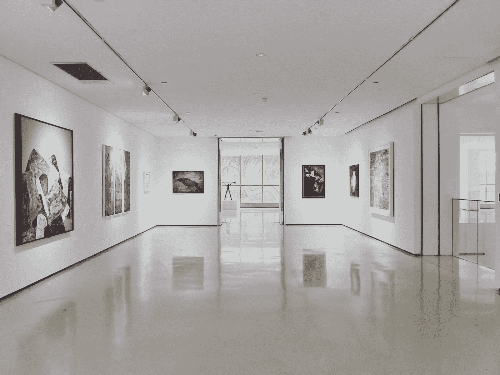
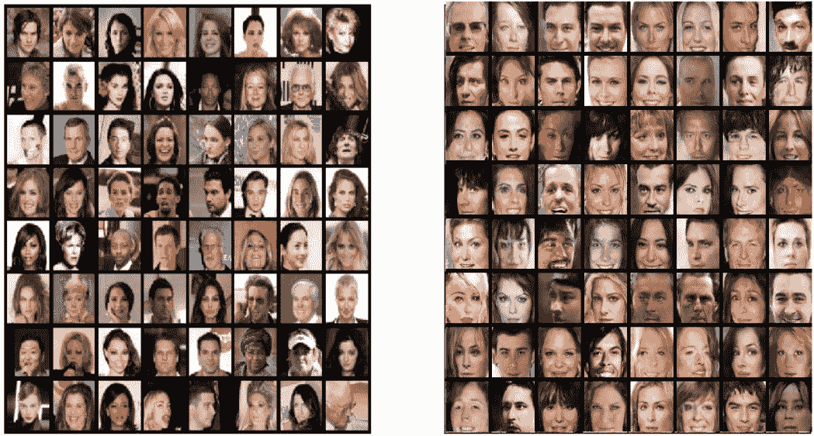
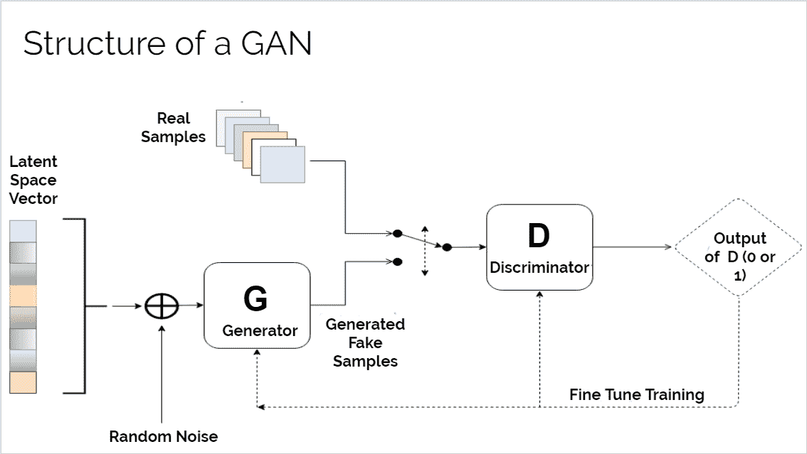
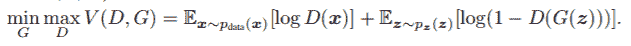
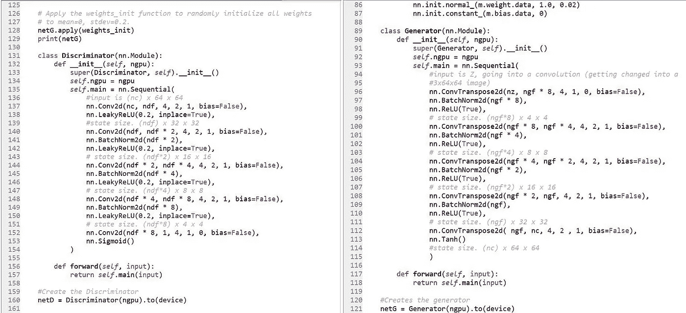
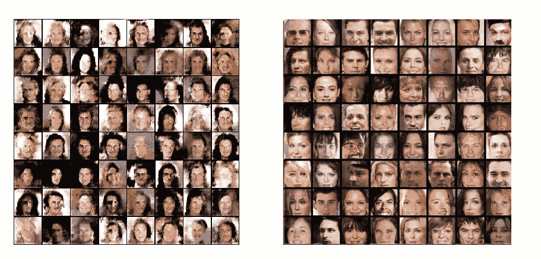
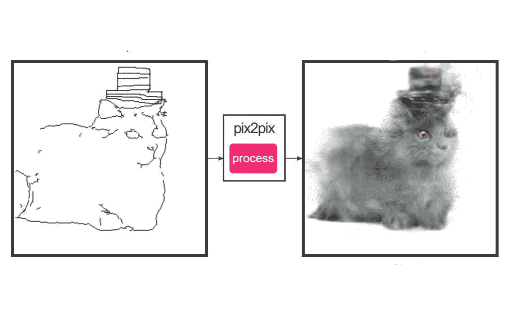

# 我如何用人工智能制造假的人

> 原文：<https://towardsdatascience.com/how-i-got-a-computer-to-make-fake-people-using-ai-gans-a8e2f542e992?source=collection_archive---------15----------------------->

## —以及为什么它很重要

下棋赢了人类？检查。

对恶性肿瘤和良性肿瘤的分类比医生更好？检查。

对数百万种可能治愈癌症的药物建模？等等，人工智能真的能做到吗？？

我们美丽的人类肤色呢？当然，人工智能不能模仿人类面部的纯粹的*华丽的*，对吗？

权利的反义词。

人工智能的最后两个令人兴奋的应用可以通过 GANs 来完成。但首先，在我们进入如何，什么，为什么和“哦，我的上帝，我想我只是拉屎我自己”之前，让我们用一个故事来描述这种特殊类型的人工智能背后的直觉。

Are these paintings even real or did AI make them too? Is it safe to trust your eyes?

假设几个月后有一家画廊开张，希望展示著名艺术家的真实可信的画作，所以他们雇了一名侦探来检查每一幅画。与此同时，这个地区有个伪造者试图卖掉他的一些赝品。但他还不是一个伟大的画家，所以他的艺术现在看起来就像随机的形状和涂鸦(他称之为抽象)。

起初，侦探能够很容易地分辨出真迹和赝品。请记住，这位侦探对他的工作来说也是新手，但不需要太多技巧就能看出伪造者现在的画非常糟糕，一点也不像真正的艺术。

但是随着几个月的过去，伪造者发现是什么让真正的艺术品看起来…嗯，是真的。他研究真正的艺术家为使他们的作品看起来是世界级的而使用的风格、模式和形状，并开始尽可能地复制它们。他做得如此之好，以至于侦探现在很难区分赝品和真品。尽管随着时间的推移，侦探也获得了更多的工作经验，但伪造者只是超过了他。

当画廊真正开放时，大约一半的画是真的，一半的画是伪造者画的。侦探非常困惑，最后只能猜测一件作品是真是假。

现在让我们更进一步；让我们看看*你*能不能分辨出哪些脸是真的，哪些是假的(如果有的话)。

可怕的是**右边所有的人脸都是由一个 AI 系统**生成的；具体来说，一种特殊类型的神经网络称为生成对抗网络(GAN)。

# GANs 概述

GANs 由两个神经网络组成，生成器和鉴别器，它们在游戏中相互竞争以最小化或最大化某个函数。鉴别器接收真实的训练数据以及来自生成器的生成(假)数据，并且必须输出每个图像是真实的概率。它的目标是最大化正确分类给定数据类型的次数，同时生成器试图最小化该次数；它试图让鉴别器将生成的输出分类为实数，使鉴别器不那么正确。

简单来说，发电机就像我们的伪造者；它的目标是制造假的图像来欺骗侦探，让他们以为这些图像是真的。鉴别者就像我们的侦探；它的工作是将真正的训练图像与伪造者制作的图像区分开来。

# 等等，为什么这里有两个神经网络？

The function that both networks are trying to minimize/maximize (the rules of the game)

上面这个复杂的函数实际上意味着，生成器(G)和鉴别器(D)都在进行一场博弈，竞争看谁更擅长实现他们的某个目标。当给两张图片供选择时，一张来自真实的数据集(艺术家),另一张是 G 画的，D 想知道如何分辨哪一张是真实的。它每次都想准确地挑出真正的一个。

G 认为它比 D 更聪明，可以很容易地愚弄它，所以它的工作是努力确保 D 认为 G 的图像是真实的，并使 D 得到正确答案的次数尽可能低。实际上，当鉴别器确信一幅图像是真的时，它会输出 1，当它发现一幅赝品时，它会输出 0。理想情况下，我们希望 D 的平均输出为 0.5，这证实了 G 非常擅长制作赝品，以至于它们看起来几乎与真实图像相同，这意味着 D 只需猜测，并且只有大约一半的时间是正确的。

What the Discriminator (left) and Generator (right) look like in code (PyTorch Implementation)

我构建的特殊类型的 GAN 是一个深度卷积生成对抗网络(DCGAN ),它生成了上面看到的伪假。基本思想是网络 D 和 G 都是使用卷积层结构构建的，其中特征图或内核扫描图像的特定部分以寻找关键特征。

这实际上是通过矩阵乘法来实现的，因为图像中的每个像素都可以表示为一个数字。像素组的值乘以矩阵，允许网络学习该像素组中存在的重要特征，如边缘、形状和线条。这在一开始是很难接受的；你可以在这里看到更深入的解释和可视化[。](http://setosa.io/ev/image-kernels/)

生成器扫描真实输入图像，以寻找尽可能接近地模仿真实训练图像的特征的模式。鉴别器扫描训练数据和生成的图像，以找到它们的特征之间的重要差异，从而可以将它们区分开来。这些重要的数据通过每一层进行传输，最终得到每幅图像中最重要的特征。

一遍又一遍地重复训练过程，让生成器和鉴别器更好地了解真实人脸的样子，我们可以从左边的图像到右边的超逼真的结果。我实际上有点敬畏；**右边的一些脸看起来真的像真人！**

Results over time look wayyyyyyyy more realistic

# 在现实生活中，我们能用甘斯做什么？

我个人最喜欢的也可以说是最有趣的应用程序之一是条件 GANs 的 pix2pix 实现。一个不熟练的艺术家只需要画出一幅画的轮廓，GAN 就可以根据它被训练模仿的图像来填充其余的特征(伪造的未来)。

Edges2cats draws a great cat, not that great of a hat

# 音乐

甘不仅仅对图像有好处；他们也可以制作音乐。我们可以识别和弦和旋律等方面来创作歌曲，而不是识别图片中的边缘和形状等特征来伪造绘画。

# 药物发现

GANs 最令人兴奋和实用的用途是在药物发现方面。生成器可以连续生成随机药物的分子结构，接收来自鉴别器的关于药物看起来是否真实的反馈，以继续迭代。理想情况下，我们最终希望生成器能够模仿真实药物结构中的模式。这将是疯狂的；**机器能够创造出前所未有的新药，**有可能征服世界上最有害的疾病。

# 关键要点

*   gan 是两个相互竞争的神经网络
*   生成器的目标是最小化某个函数；鉴别器试图最大化相同的功能
*   发生器制造模仿真图像的假图像来欺骗鉴别器，鉴别器试图准确地区分假图像和真图像
*   随着时间的推移，网络能够生成超逼真的数据
*   有多种变体，其中 2 种是条件和深度卷积 gan
*   甘斯可以用来制造假人、音乐、毒品和画猫
*   不要相信任何人；任何东西都可以伪造

*非常感谢您的阅读！关注我关于* [*中*](https://medium.com/@aliaadil2002) *更多和*[*LinkedIn*](https://www.linkedin.com/in/aadillpickles/)*。如果你想了解更多，或者让我知道你在做什么，请随时联系我！*