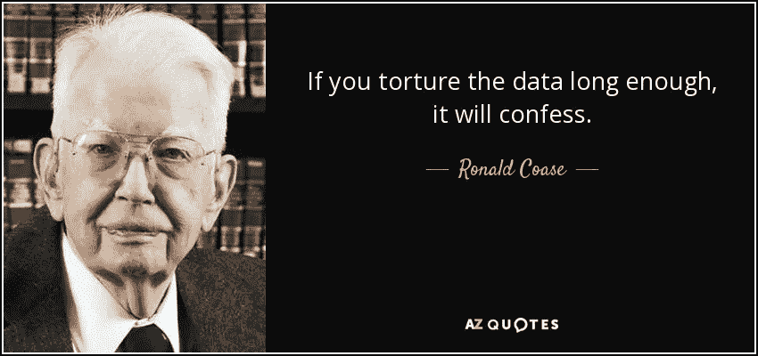

# 我是如何得到 82.3%的分数，并最终进入 Kaggle 的泰坦尼克号数据集的前 3%的

> 原文：<https://towardsdatascience.com/how-i-got-a-score-of-82-3-and-ended-up-being-in-top-4-of-kaggles-titanic-dataset-bb2875cee6b5?source=collection_archive---------1----------------------->

就我的经历而言，我不是一名专业的数据科学家，但我一直在努力成为一名数据科学家。幸运的是，有 Python 作为我的主要武器，我在数据科学和机器学习领域有优势，因为这种语言有大量的库和框架支持我。我也阅读这方面的书籍，我最喜欢的是“**Python 机器学习入门:数据科学家指南**”和“**用 Scikit-Learn 和 TensorFlow 进行机器学习**”。

但仅此还不够。在浏览各种博客、浏览几个网站并与朋友讨论后，我发现，要成为一名数据科学家专家，我肯定需要提高赌注。参与竞争，建立网上形象，这样的例子不胜枚举。然后我遇到了 Kaggle。就像 HackerRank 是为了一般的算法竞赛，Kaggle 是专门为机器学习问题开发的。不得不试试。它举办各种各样的比赛，其中著名的“泰坦尼克号”问题是欢迎你在门户网站上注册的。接下来呢？我下载了训练数据，在我的机器上安装了所有我需要解决的库。我甚至初始化了一个空的存储库来避免以后的麻烦。剩下的唯一部分是处理数据和训练模型。“应该很简单，能有多难？”，我问自己脸上有笑容。

> “应该很简单，能有多难？”，我问自己脸上有笑容。

我匆忙地从下载的 csv 文件中解析数据，将其输入决策树模型进行训练，预测测试乘客的生存能力，并上传结果。我得了 64 分，在排行榜上排名倒数 7%。是的，你没看错；垫底的 7%！！！

这是我的原始代码，第一个版本

结果在我面前粉碎了我的自尊。**是的，它教会了我现实世界的问题不能用 5 行代码来解决。**我是在我之前的一篇博客中说这些的——“[用 5 行代码用 Python 编写的简单机器学习模型](https://medium.com/towards-data-science/simple-machine-learning-model-in-python-in-5-lines-of-code-fe03d72e78c6)”:D

> 它教会了我现实世界的问题不是 5 行代码就能解决的。

我坐下来，重新访问并阅读了我之前提到的书中的更多章节。我通读了“*端到端建立一个完整的机器学习模型*”部分。因此，这不是向模型输入垃圾，数据需要尽可能干净，这直接反映了所用模型的性能。

分析现在开始…

Source : [http://www.azquotes.com/quote/593283](http://www.azquotes.com/quote/593283)

由于我曾使用 Jupyter 笔记本进行分析部分，请前往我的 github 项目进行详细分析。链接在这里:

## [<源代码—最终迭代>](https://github.com/ramansah/kaggle-titanic/blob/master/Analysis.ipynb)

 [## 拉曼萨/卡格尔-泰坦尼克号

### 在 GitHub 上创建一个帐户，为 kaggle-titanic 的发展做出贡献。

github.com](https://github.com/ramansah/kaggle-titanic/blob/master/Analysis.ipynb) 

[**我的卡格尔简介**](https://www.kaggle.com/ramansah)

我还建立了一个爱好项目，以提高我在 Python 和机器学习方面的技能。[目前托管在这里](http://ml4everyone.com)，(目前未激活)它可以在云上运行和保存一些机器学习模型。虽然还需要进一步改进…