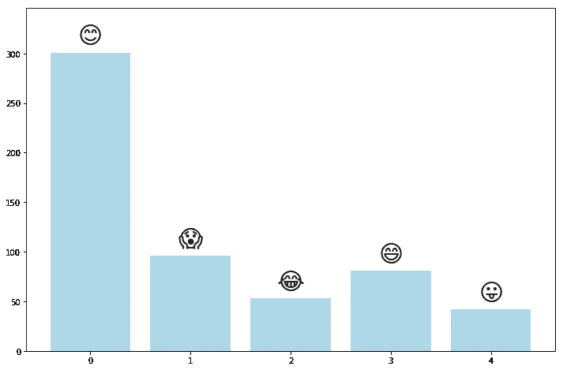
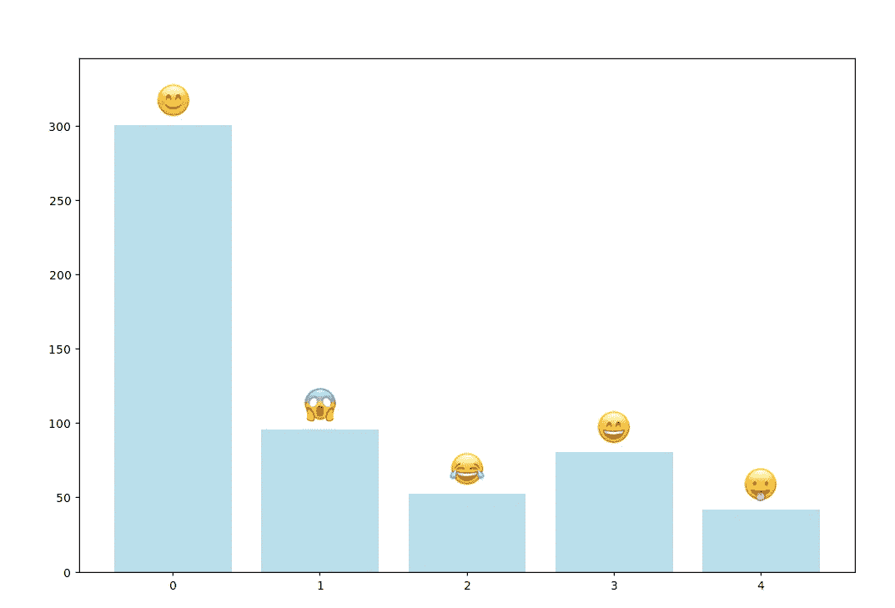

# 我如何让 Matplotlib 绘制苹果颜色表情符号

> 原文：<https://towardsdatascience.com/how-i-got-matplotlib-to-plot-apple-color-emojis-c983767b39e0?source=collection_archive---------18----------------------->

## 以及为什么图书馆目前不能

# 问题是

如果你尝试绘制表情符号，你可能会看到这样的东西:



This graph has no meaning other than to demonstrate the appearance of plotted emojis.

虽然我们明确指定为字体，但这些表情符号并不是苹果色表情符号。它们来自字体 DejaVu Sans，默认字体在 Matplotlib 无法处理我们指定的字体后接管，抛出以下错误:

```
RuntimeError: In FT2Font: Could not set the fontsize.
```

关于 Matplotlib 中绘制表情符号的堆栈溢出的一些相关问题:

*   [如何在 matplotlib 中绘制(高质量)表情符号？](https://stackoverflow.com/questions/47102873/how-to-plot-high-quality-emoji-in-matplotlib?noredirect=1&lq=1)
*   [matplotlib:用表情符号标签标注剧情](https://stackoverflow.com/questions/43419590/matplotlib-annotate-plot-with-emoji-labels?noredirect=1&lq=1)
*   [OS X Matplotlib 中的表情符号](https://stackoverflow.com/questions/30049760/emoji-in-matplotlib-figures-on-os-x)
*   [matplotlibs x ticks 中的表情符号](https://stackoverflow.com/questions/51989729/emojis-in-matplotlibs-xticks)
*   [无法加载 Matplotlib 中的表情字体](https://stackoverflow.com/questions/48765035/could-not-load-the-emoji-font-in-matplotlib/53368464#53368464)

所有这些都没有答案。最近版本的 Matplotlib 根本无法做到这一点。看看 Matplotlib 的 GitHub repo 就会发现问题 [#3135](https://github.com/matplotlib/matplotlib/issues/3135) 、 [#4492](https://github.com/matplotlib/matplotlib/issues/4492) 和 [#12830](https://github.com/matplotlib/matplotlib/issues/12830) ，其中第一个问题截至 2022 年已经开放了近 8 年。

为什么 Matplotlib 不能从苹果彩色表情符号字体中绘制表情符号？我们如何克服这种功能性的缺失来绘制表情符号呢？本帖回答了这些问题。

# 为什么 Matplotlib 不能绘制表情符号

苹果颜色表情符号是一个 TrueType 集合(TTC)文件。这种格式将多种字体合并到一个文件中，以节省空间。我们之前看到的抛出运行时错误的依赖项 FT2Font 只支持从 TTC 文件中获取第一种字体。虽然这可能行得通，但是转换依赖项 ttconv 的限制阻止了后端实际使用这种字体。

有一个解决方案是以拉请求的形式出现的 [#9787](https://github.com/matplotlib/matplotlib/pull/9787) 。目前正在等待进一步审查。

当我们等待拉请求被合并时，有一个直接的解决方案，我们可以使用 Matplotlib 成功地绘制表情符号。

# 直接解决方案:使用第三方后端

输入 [Mplcairo](https://github.com/anntzer/mplcairo) 。作为“Matplotlib 的 cairo 后端的一个全新的、本质上完整的实现”，Mplcairo 在最初后端的几个方面进行了改进。最值得注意的是，Mplcairo 引入了对在 TTC 文件中使用第一种字体的支持。

看起来我们应该能够通过`pip install mplcairo`轻松安装 Mplcairo，但是对我来说，当我试图将它导入到我的代码中时，这个安装继续抛出错误。

相反，我用 git 将 repo 克隆到我的机器上(`git clone https://github.com/matplotlib/mplcairo.git`)，然后遵循[构建](https://github.com/anntzer/mplcairo#building)和[安装](https://github.com/anntzer/mplcairo#installation)指令。下面我总结一下我的过程。

## 建筑物

由于车轮不可用于 OS X，我们需要建立自己的 OS X 车轮使用终端。为此，我们需要以下依赖关系:

*   **支持 C++17 的 C++编译器，如 GCC ≥ 7.2 或 Clang ≥ 5.0** 。我用`brew install llvm`安装了后者。
*   **Cairo 和 FreeType 头，以及定位它们的 pkg-config 信息。由于 cairo [在 1.15.8 版本中引入了对表情符号](https://www.phoronix.com/scan.php?page=news_item&px=Cairo-1.15.8-Colored-Emoji)的颜色支持，我们需要一个不早于此的 cairo 版本。直到康达-福吉[更新](https://github.com/conda-forge/cairo-feedstock/pull/44)它的开罗，`brew install cairo`。然后是`pip install pycairo`。**

一旦我们获得了依赖项，我们就可以激活 llvm(如`brew info llvm`所述)并构建 OS X 轮子，而在 mplcairo 的根文件夹中:

```
echo 'export PATH="/usr/local/opt/llvm/bin:$PATH"' >> ~/.bash_profile                
source ~/.bash_profile
export LDFLAGS="-L/usr/local/opt/llvm/lib"
export CPPFLAGS="-I/usr/local/opt/llvm/include"
export CC='/usr/local/opt/llvm/bin/clang'
export CXX='/usr/local/opt/llvm/bin/clang++'
tools/build-macos-wheel.sh
```

## 装置

现在我们已经构建了 Mplcairo，我们可以用`pip install dist/mplcairo-0.1.post47+g109b19f-cp37-cp37m-macosx_10_9_x86_64.whl`在系统范围内(或者在我们的虚拟环境中)安装它。

这可能是一个异常，但是在构建终端时，我的 Python 从版本 3.7.0 降级到版本 3.6.5。当我打开一个新的终端窗口时，Python 又回到了 3.7.0，我可以安装滚轮了。

*注(2020 年 8 月 16 日):确认 tools/build-macos-wheel.sh 和 dist/mpl cairo-0.1 . post 47+g 109 b 19 f-cp37-cp37m-ma cosx _ 10 _ 9 _ x86 _ 64 . whl 是正确的文件路径——2018 年我第一次发表这篇文章的时候，它们的命名是不同的。*

## 用法！

为了绘制我们的表情符号，我们只需导入 Mplcairo 并将其设置为 Matplotlib 的新后端。

```
import matplotlib, mplcairo
print('Default backend: ' + matplotlib.get_backend()) 
matplotlib.use("module://mplcairo.macosx")
print('Backend is now ' + matplotlib.get_backend())
```

运行上面的脚本后，您应该会看到以下输出:

```
Default backend: module://ipykernel.pylab.backend_inline
Backend is now module://mplcairo.macosx
```

您的默认后端可能会有所不同，这取决于您运行脚本的位置。我的默认后端来自 Jupyter 笔记本。(如果使用的是 Jupyter Notebook，必须先重置内核，然后才能重置后端。您还必须在导入 matplotlib.pyplot 之前重置后端。)

一旦你启动并运行 Mplcairo，Matplotlib 就能漂亮地绘制表情符号。



Lo and behold the emoji.

完整代码:

**如果你想阅读更多我的文章或者探索数以百万计的其他文章，你可以注册成为中级会员:**

[](https://brienna.medium.com/membership) [## 通过我的推荐链接加入 Medium-briena Herold

### 作为一个媒体会员，你的会员费的一部分会给你阅读的作家，你可以完全接触到每一个故事…

brienna.medium.com](https://brienna.medium.com/membership) 

**你也可以订阅我的邮件列表，以便在我发表新文章时得到通知:**

[](https://brienna.medium.com/subscribe) [## 每当布蕾娜·赫罗尔德发表。

### 每当布蕾娜·赫罗尔德发表。通过注册，您将创建一个中型帐户，如果您还没有…

brienna.medium.com](https://brienna.medium.com/subscribe) 

**你可能会对我的其他一些故事感兴趣:**

[](/how-to-download-twitter-friends-or-followers-for-free-b9d5ac23812) [## 如何免费下载 Twitter 好友或关注者

### Python 中的简单指南

towardsdatascience.com](/how-to-download-twitter-friends-or-followers-for-free-b9d5ac23812) [](/how-to-bulk-access-arxiv-full-text-preprints-58026e19e8ef) [## 如何批量获取 arXiv 全文预印本

### 使用 Python3 和 MacOS X 命令行

towardsdatascience.com](/how-to-bulk-access-arxiv-full-text-preprints-58026e19e8ef) [](/collecting-data-from-the-new-york-times-over-any-period-of-time-3e365504004) [## 从《纽约时报》收集任何时期的数据

### Python 中的简单指南

towardsdatascience.com](/collecting-data-from-the-new-york-times-over-any-period-of-time-3e365504004)