# 我是如何用 Python 中的深度学习实现 iPhone X 的 FaceID 的。

> 原文：<https://towardsdatascience.com/how-i-implemented-iphone-xs-faceid-using-deep-learning-in-python-d5dbaa128e1d?source=collection_archive---------2----------------------->

## 逆向工程 iPhone X 的新解锁机制。

[*你可以在这里找到所有的 Python 代码。*](https://github.com/normandipalo/faceID_beta)

在推特上关注我的工作更新和更多:【https://twitter.com/normandipalo 

新款 **iPhone X** 讨论最多的一个特点就是新的解锁方式，TouchID 的继任者: **FaceID** 。
创造了无边框手机后，苹果不得不开发一种简单快捷的解锁手机的新方法。当一些竞争对手继续使用放置在不同位置的指纹传感器时，苹果决定创新和彻底改变我们解锁手机的方式:只需看着它。由于一个先进的(非常小的)**前置深度摄像头**，iPhone X 能够创建用户面部的 3D 地图。此外，使用**红外相机**捕捉用户脸部的图片，这对于环境的光线和颜色变化更加鲁棒。使用**深度学习**，智能手机能够非常详细地学习用户的面部，从而在每次手机被主人拿起时识别他/她。令人惊讶的是，苹果 ha 声明这种方法甚至**比 TouchID** 更安全，突出错误率为 1:100 万。

我对苹果公司实现 FaceID 的技术非常感兴趣，尤其是这一切都是在设备上运行的，只需对用户的面部进行一点初始训练，然后每次拿起手机时都能顺利运行。我专注于如何使用深度学习来实现这个过程，以及如何优化每个步骤。在这篇文章中，我将展示如何使用 Keras 实现类似 FaceID 的算法。我将解释我采取的各种架构决策，并展示一些最终的实验，这些实验是使用 **Kinect** 完成的，这是一款非常流行的 RGB 和深度相机，其输出与 iPhone X 的前置相机非常相似(但在更大的设备上)。舒服地坐着，喝杯咖啡，让我们开始**逆向工程苹果的新游戏改变功能**。

# 了解 FaceID

> “……驱动 FaceID **的**神经网络**不仅仅是执行分类。”**

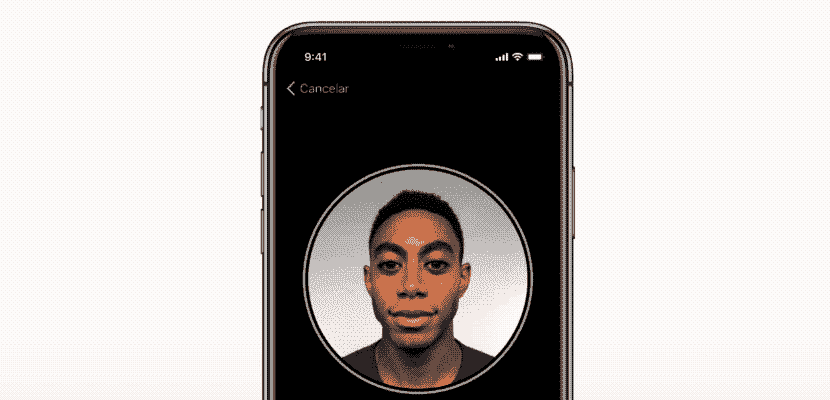

FaceID setup process.

第一步是仔细分析**FaceID 如何在 iPhone X 上工作**，他们的[白皮书](https://images.apple.com/business/docs/FaceID_Security_Guide.pdf)可以帮助我们了解 FaceID 的基本机制。使用 TouchID，用户最初必须通过按几次传感器来注册他/她的指纹。大约 15-20 次不同的触摸后，智能手机完成了注册，TouchID 准备就绪。类似地，使用 FaceID，用户必须注册他/她的脸。这个过程非常简单:用户只需像平常一样看着手机，然后慢慢地将头部旋转一圈，从而从不同的姿势注册面部。就这样，过程完成，手机准备解锁。这个惊人快速的注册程序**可以告诉我们很多关于底层学习算法**的信息。例如，驱动 FaceID **的**神经网络**不仅仅是执行分类**，我将解释为什么。

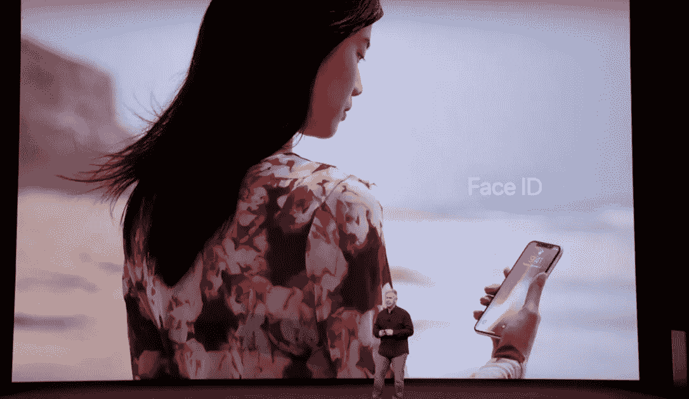

Apple Keynote unveiling iPhone X and FaceID.

对于神经网络来说，执行分类意味着学习预测它看到的人脸是否是用户的。因此，它应该使用一些训练数据来**预测“真”或“假”**，基本上，但不同于许多其他深度学习用例，这里这种方法**将不会工作**。首先，网络应该使用从用户面部获得的新数据从头开始重新训练。这将**需要大量的时间**、**能量消耗**以及不切实际的**不同面部的训练数据**的可用性，以得到负面的例子(在转移学习和对已经训练好的网络进行微调的情况下变化很小)。此外，对于苹果来说，这种方法不会利用“离线”训练更复杂的网络的可能性，即在他们的实验室中，然后将已经训练好的网络运送到他们的手机中使用。相反，我认为 FaceID 是由一个**暹罗状卷积神经网络**驱动的，它由苹果“离线”训练，利用*对比损失*将人脸映射到一个*低维潜在空间*中，该空间的形状使不同人的人脸之间的距离最大化。发生的事情是，你得到一个能够一次性学习的架构，正如他们在主题演讲中非常简要地提到的。我知道，有些名字很多读者可能不熟悉:继续读，我会一步一步解释我的意思。

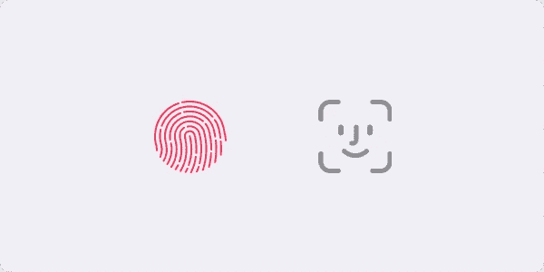

FaceID looks like it will be the new standard after TouchID. Will Apple bring it to all his new devices?

# 用神经网络从面孔到数字

一个**连体神经网络**基本上由两个*相同的*神经网络组成，它们也共享所有的权重。这种架构可以学习*计算特定类型数据之间的距离*，比如图像。其思想是，你通过暹罗网络传递几对数据(或者简单地通过同一网络分两步传递数据)，网络将其映射到一个*低维特征空间*，就像一个 n 维数组，然后你训练网络进行这种映射，以便来自不同类的数据点尽可能**远**，而来自同一类的数据点尽可能**近**。从长远来看，网络将学会从数据中提取最有意义的特征，并将其压缩到一个数组中，从而创建一个有意义的映射。为了对此有一个**直观的理解**，想象一下你将如何**用一个小向量来描述狗的品种**，这样相似的狗就有了更接近的向量。你可能会用一个数字来编码狗的皮毛颜色，用另一个数字来表示狗的大小，用另一个数字来表示皮毛的长度，等等。这样，彼此相似的狗就会有彼此相似的向量。很聪明，对吧？嗯，一个连体神经网络可以学会为你做这件事，类似于一个 [*自动编码器*](https://blog.keras.io/building-autoencoders-in-keras.html) 所做的。

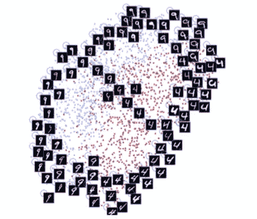

A figure from the paper “Dimensionality Reduction by Learning an Invariant Mapping” by Hadsell, Chopra and LeCun. Notice how the architecture is learning similarity between digits and is automatically grouping them in 2-dimensions. A similar technique is applied to faces.

通过这种技术，可以使用大量的人脸来训练这样的架构，以识别哪些人脸最相似。有了合适的预算和计算能力(就像苹果一样)，人们还可以使用**越来越难的例子**来使网络对诸如双胞胎、对抗性攻击(面具)等事情变得健壮。使用这种方法的最终优势是什么？你终于有了一个**即插即用模型**，它可以识别不同的用户，而无需任何进一步的训练，只是在初始设置期间拍摄一些照片后，简单地计算用户的面部在面部潜像图中的位置。(想象一下，就像前面说的，为一只新狗写下狗的品种向量，然后存储在某个地方)。此外，FaceID 能够适应你外貌的变化:既有突然的变化(如眼镜、帽子、化妆)，也有缓慢的变化(面部毛发)。这基本上是通过在这张地图上添加参考面向量来完成的，根据你的新外观来计算。

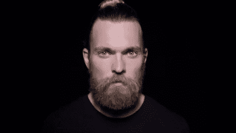

FaceID adapts when your looks change.

现在，让我们最后看看**如何使用 Keras** 在 Python 中实现。

# 在喀拉斯实施 FaceID

至于所有的机器学习项目，我们首先需要的是**数据**。创建我们自己的数据集需要时间和许多人的合作，这可能是相当具有挑战性的。因此，我在网上浏览了 RGB-D 人脸数据集，我[找到了一个看起来非常合适的](http://www.vap.aau.dk/rgb-d-face-database/)。它由一系列面向不同方向并做出不同面部表情的 RGB-D 照片组成，就像 iPhone X 用例中发生的那样。

要看最终的实现，可以去我的 [**GitHub 资源库**](https://github.com/normandipalo/faceID_beta) 看看，在那里可以找到 Jupyter 的笔记本。此外，我用一台 [**Colab 笔记本**](https://colab.research.google.com/drive/1OynWNoWF6POTcRGFG4V7KW_EGIkUmLYI) 进行了实验，你也可以试试。

我基于 [SqueezeNet](https://arxiv.org/abs/1602.07360) 架构创建了一个卷积网络。该网络将情侣脸的 RGBD 图片(即 4 通道图片)作为输入，并输出两个嵌入之间的距离。使用**对比损失**来训练网络，该对比损失最小化同一个人的图片之间的距离，并且最大化不同人的图片之间的距离。

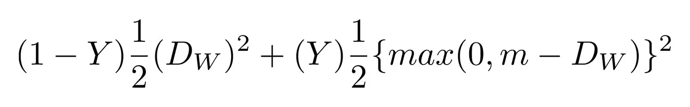

Contrastive loss.

经过一些训练后，该网络能够将人脸映射到 128 维的阵列中，这样同一个人的照片就可以分组在一起，而其他人的照片则远离。这意味着，为了**解锁您的设备**，网络只需计算解锁期间拍摄的图片与注册阶段存储的图片之间的距离。如果距离低于某个阈值，(距离越小，越安全)设备解锁。

我使用了 **t-SNE 算法**来在二维空间中可视化 128 维嵌入空间。每种颜色对应不同的人:正如你所看到的，网络已经学会了将这些图片紧密地分组。(当使用 t-SNE 算法时，聚类之间的距离是没有意义的)当使用 **PCA 降维算法时，一个有趣的情节也出现了。**

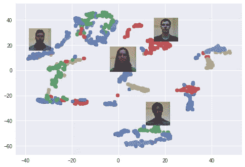

Clusters of faces in the embedding space created using t-SNE. Every color is a different face (but colors are reused).

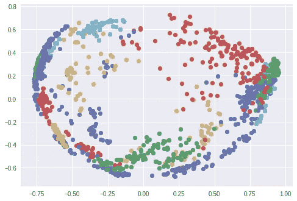

Clusters of faces in the embedding space created using PCA. Every color is a different face (but colors are reused).

# 实验！

我们现在可以试着看看这个模型的工作原理，模拟一个通常的 FaceID 循环:首先，注册用户的面部。然后，解锁阶段，用户(应该成功)和其他人都不能解锁设备。如前所述，差异在于网络计算的解锁手机的人脸和注册人脸之间的距离，以及该距离是否低于某个阈值。

让我们从注册开始:我从数据集中拍摄了同一个人的一系列照片，并模拟了一个注册阶段。该设备现在正在计算这些姿势中每一个的嵌入，并将它们存储在本地。

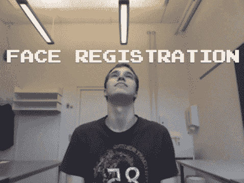

Registration phase for a new user, inspired by the FaceID process.

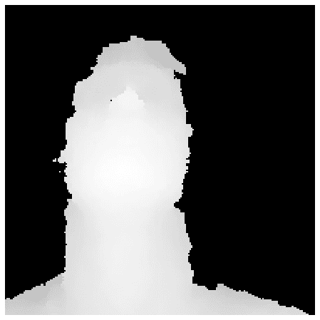

Registration phase as seen by the depth camera.

现在让我们看看，如果同一个用户试图解锁设备会发生什么。同一用户的不同姿势和面部表情实现了平均大约 0.30 的低距离。

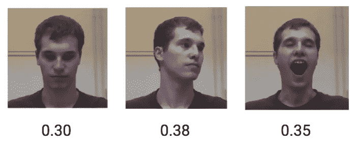

Face distances in the embedding space for the same user.

另一方面，不同人的 RGBD 图片得到的平均距离为 1.1。

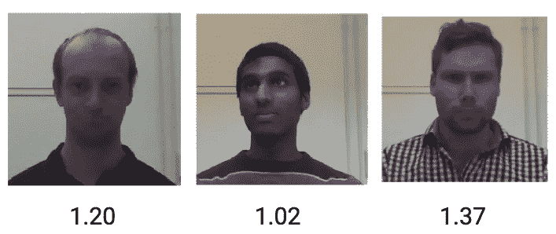

Face distances in the embedding space for different users.

因此，使用 0.4 左右的阈值应该足以防止陌生人解锁您的设备。

# 结论

在这篇文章中，我展示了如何基于面部嵌入和暹罗卷积网络实现 FaceID 解锁机制的概念验证。我希望它对你有所帮助，有任何问题你可以联系我。 [**你可以在这里找到所有相关的 Python 代码。**](https://github.com/normandipalo/faceID_beta)

在推特上关注我的工作更新和更多:【https://twitter.com/normandipalo 

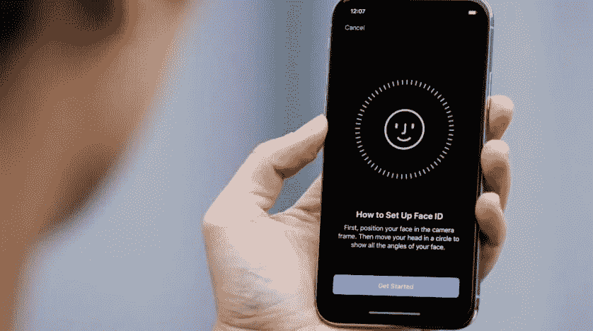