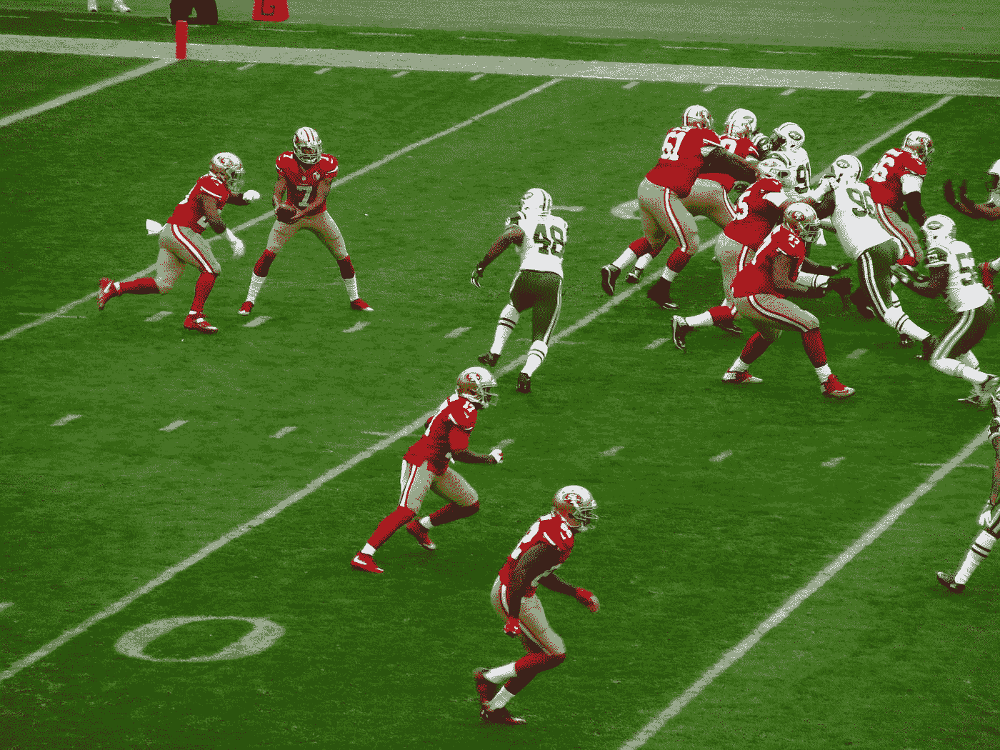

# 我是如何战胜一个 538 预测算法的

> 原文：<https://medium.com/s/story/how-i-outsmarted-fivethirtyeights-nfl-forecasting-algorithm-592a301fa318?source=collection_archive---------1----------------------->

## 你也可以

Photo by [Fredrick Lee](https://unsplash.com/@mkaine17?utm_source=medium&utm_medium=referral) on [Unsplash](https://unsplash.com?utm_source=medium&utm_medium=referral)

今年，内特·西尔弗的《FiveThirtyEight》向读者发出挑战，要求[预测 NFL 比赛结果](https://projects.fivethirtyeight.com/nfl-predictions-game/)比[的预测算法](https://fivethirtyeight.com/features/nfl-elo-ratings-are-back/)更好。结果呢？在 20，352 名参与的读者中，不到 2%的人胜过 FiveThirtyEight 的 Elo 算法。

我是其中之一。