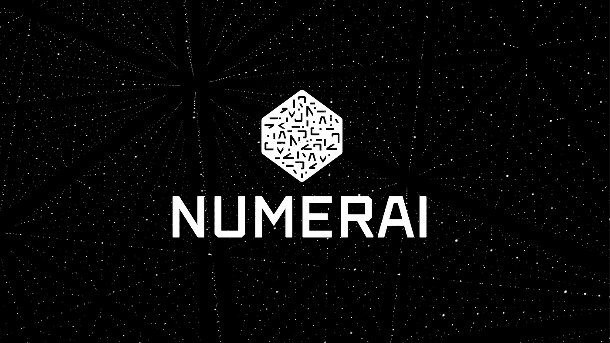

# 我是如何在锦标赛中预测股市的

> 原文：<https://towardsdatascience.com/how-i-predicted-the-stock-market-at-numerai-ml-tournament-6f74e1c8809e?source=collection_archive---------1----------------------->



在此之前，我的机器学习教程是无聊的故事和理论:)，在这篇文章中，我将分享我在人工智能竞赛中的第一次代码体验。我在数字上尝试了我的基本机器学习技能。

**Github 源代码:**【https://github.com/andela-ysanni/numer.ai 

根据他们比赛的网站，*数字*是一个预测股票市场的全球人工智能比赛。Numerai 有点类似于 Kaggle，但是数据集干净整洁；你下载数据，建立模型，然后上传你的预测。很难找到一个比赛，你可以应用你喜欢的任何方法，而不需要太多的数据清理和特征工程。在这场锦标赛中，你可以做到这一点。

哦，是的，我最初开始学过 [Udacity 机器学习入门](https://www.udacity.com/course/intro-to-machine-learning--ud120)，并且有一些关于使用 scikit-learn 的监督机器学习算法的基础知识。一开始我很害怕；像我这样的新手如何参加有排行榜的在线比赛？我不在排行榜末尾的可能性有多大？总之，我不畏艰险。

**本项目使用的包**

**Pandas** 是一个用 Python 编写的包，用于数据结构和数据分析， **numpy** 用于创建大型多维数组和矩阵，您可以使用 [pip install](https://packaging.python.org/installing/) 命令简单地安装这些包。我们还将从 sklearn 库导入一些包，sklearn 库由简单高效的数据挖掘和数据分析工具组成，包括监督和非监督算法。

**数据概述**

对于这场比赛，我们有两个数据集，即我们的训练数据和测试数据。我建议你用数字加载你的数据集(默认情况下，它是 Mac OS 自带的)，看看它看起来怎么样，否则，感谢微软 Excel。您还可以使用 Sublime 或 Atom 等文本编辑器来加载数据集。

我使用 panda 库方法“read_csv”将数据解析成 DataFrame 对象。read_csv 方法接受 file_path 和一些其他可选参数。

```
import pandas as pdtraining_data = pd.read_csv('numerai_training_data.csv')tournament_data = pd.read_csv('numerai_tournament_data.csv')
```

**训练数据集**有 22 列。第 21 列包括从特征 1 到特征 21 的特征，而最后一列是目标值；将用于训练我们的分类器的 1 或 0 值。我们大约有 96321 行。

**锦标赛数据集**是我们的测试集，它也有 22 列。列 1 是 t_id，它是来自我们训练数据的目标 id。剩下的 21 列是我们的特性值。

**交叉验证**

交叉验证主要是衡量统计模型对独立数据集的预测性能的一种方式(从 [http://robjhyndman.com 检索)。](http://robjhyndman.com).)衡量模型预测能力的一种方法是在一组未用于训练数据的数据上进行测试。数据挖掘者称之为“测试集”，用于估计的数据是“训练集”。

验证的主要目的是避免过度拟合。当机器学习算法(如分类器)不仅识别数据集中的信号，还识别噪声时，就会发生过拟合。*噪声*这里意味着模型对数据集的特征过于敏感，而这些特征实际上没有任何意义。过度拟合的实际结果是，对其训练数据表现良好的分类器可能对来自相同问题的新数据表现不佳，甚至可能非常差。

为了开发我们的分类器，我们使用 70%的数据将数据集分成两部分来训练算法。然后，我们对剩下的 30%进行分类，并记录这些结果。下面是我们自己的交叉验证版本:

```
from sklearn import cross_validationfeatures_train, features_test, labels_train, labels_test = cross_validation.train_test_split(training_data.iloc[:,0:21], training_data['target'], test_size=0.3, random_state=0)
```

我使用了 sklearn 的 cross_validation 方法，从训练数据中提取了 30%的测试集。让我解释一下参数:

**train_test_split** 获取我们的训练数据数组，该数组包括特征训练，但不包括我们的目标值，后跟我们的目标值数组。

**test_size** 是我们百分之三十的数据比例。

**random_state** 取用于随机采样的伪随机数发生器状态的整数值。

我们的交叉验证返回四个数组，其中包括 70%的 features_train 和 labels_train，剩余 30%的 features_test 和 labels_test。

**分类器的实现和装配**

在这个项目中，任务是二进制分类，输出变量也称为我们的目标预计是 1 或 0。我将使用 SVC(支持向量分类)作为分类器。一个**支持向量机** ( **SVM** )是一个判别**分类器**形式上**由一个分离超平面定义**。换句话说，给定标记的训练数据(监督学习)，算法输出一个分类新例子的最佳超平面。

支持向量机的优势在于:

*   在高维空间有效。
*   在维数大于样本数的情况下仍然有效。
*   在决策函数中使用训练点的子集(称为支持向量)，因此它也是内存高效的。
*   通用:可以为决策函数指定不同的[内核函数](http://scikit-learn.org/stable/modules/svm.html#svm-kernels)。提供了通用内核，但是也可以指定定制内核。

```
from sklearn.svm import SVC as svcclf = svc(C=1.0).fit(features_train, labels_train)
```

**C** 这里控制训练数据的误分类成本。大的 C 给你低偏差和高方差。低偏差是因为你对错误分类的代价进行了大量的惩罚，而小的 C 给了你更高的偏差和更低的方差。

**。fit()** 方法根据给定的训练数据来拟合 SVM 模型，即特征训练和标签训练。

**做预测**

下一步是使用 30%的数据集对我们训练的分类器进行预测。

```
predictions = clf.predict(features_test)
```

**predict()** 方法获取一个数组并对该数组执行分类。

**精度**

精确度是我们建立的模型的精确度的加权算术平均值。我将使用 sklearn 测量准确度分数。该方法返回给定测试数据和标签的平均准确度。

```
from sklearn.metrics import accuracy_scoreaccuracy = accuracy_score(predictions,labels_test)
```

accuracy_score()接受两个数组；我们之前做的预测和真实的目标测试数据。

这里得到的准确度分数是**0.51849391。**非常低，所以我决定将 C 的值提高到 100.0，以获得更好的分类和高方差。这实际上几乎花了很长时间(15 分钟)来运行分类，但给出的分数为 **0.518133997785** ，比之前的分数略高。它仍然是低的，但是我很高兴知道它稍微高于平均水平。对新手来说够公平了:)

**重大挑战**

我使用的分类器非常慢，当 C=1.0 时需要大约 10 分钟，当 C=100.0 时需要 15 分钟才能获得更好的分数，如果我们的数据集大小增加两倍，这将是不可伸缩的。**为什么？**实现基于 libsvm。因此，拟合时间复杂度大于样本数量的平方，这使得难以扩展到具有超过 10000 个样本的数据集。

**改进与结论**

在我的下一篇文章中，我将谈论我如何微调我的分类器的参数，以及我如何切换到使用另一种算法来优化我的结果。我希望到目前为止你喜欢这个教程。欢迎在评论区发表评论和问题。再见
更新:这里是[链接](https://medium.com/@Yettie/how-i-predicted-the-stock-market-at-numerai-ml-tournament-final-tutorial-1b46c459b7ba#.vltzpvwm0)到最终教程。