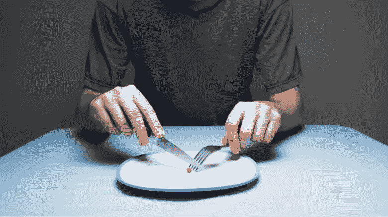
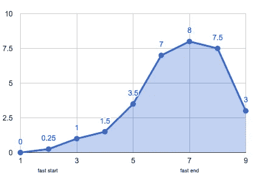
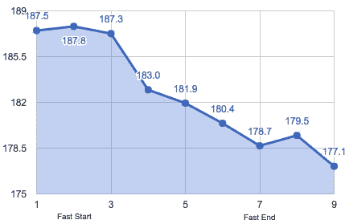
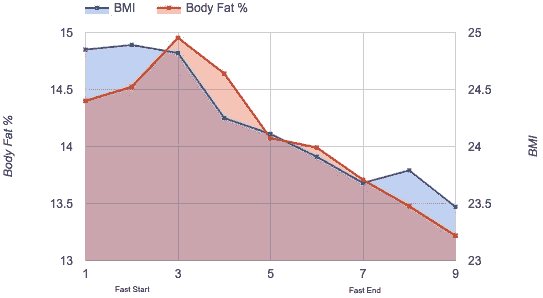
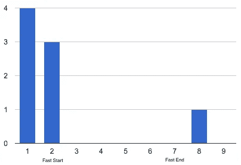
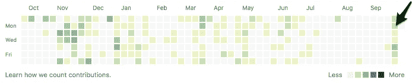
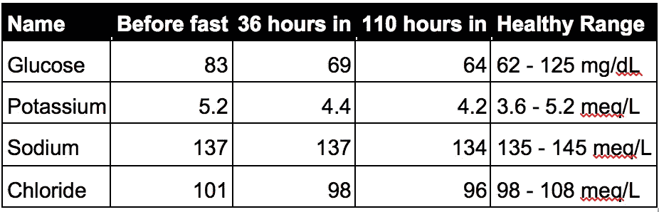
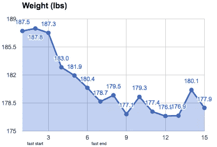
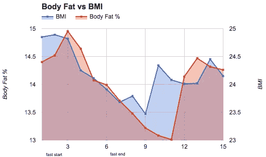
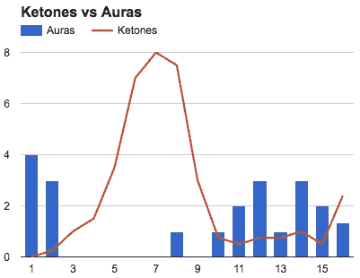

# 禁食比你想象的要容易

> 原文：<https://towardsdatascience.com/how-i-survived-fasting-for-five-days-using-one-weird-trick-8629166bf2ad?source=collection_archive---------0----------------------->

## 我的 5 天禁食可以减少饥饿感，提高精神集中力

如果有人说你可以用[一个奇怪的技巧](https://s3-us-west-2.amazonaws.com/medium-articles/one_simple_trick_muscle.png)来减肥、提高注意力、减少对食物的渴望、延长寿命，会怎么样？如果你像我一样，你可能会想:

1.  这是雅虎广告吗？
2.  我才不要尝试那种禁食垃圾。
3.  我喜欢食物。我为什么要放弃？

狼吞虎咽地吃下一整盒 Xtra Cheddar 金鱼来平静我的神经后，我想了想，意识到我仍然很好奇。毕竟，[碧昂斯](http://www.nowloss.com/how-did-beyonce-knowles-lose-weight.htm)做到了？

# **间歇性禁食的健康益处**

愉快地屈服于[证实偏见](https://en.wikipedia.org/wiki/Confirmation_bias)，我开始在谷歌上搜索证实这些说法的*严肃的*研究。这里有一些潜在的好处，我发现即使是核实科学类型的人也不会完全反对。

*   防止肥胖和[神经退化](https://www.ncbi.nlm.nih.gov/pmc/articles/PMC2622429/)
*   增加[寿命](https://www.ncbi.nlm.nih.gov/pmc/articles/PMC3919445/)
*   提高[认知](https://www.ncbi.nlm.nih.gov/pmc/articles/PMC3670843/)表现
*   增强你的免疫系统
*   在食物上省钱:)

> 禁食有可能延缓衰老，有助于预防和治疗疾病，同时将慢性饮食干预引起的副作用降至最低。
> 
> [*禁食:分子机制*](https://www.ncbi.nlm.nih.gov/pmc/articles/PMC3946160/) *瓦尔特·d·隆戈和马克·p·马特森*

禁食也有良好的记录。宗教和精神团体已经禁食几个世纪了。冥想和瑜伽的练习者利用禁食来提高注意力和自律。

# 个人对禁食的兴趣

*   癫痫症——我从 19 岁开始就患有癫痫症。在我们找到正确的药物组合后，[癫痫大发作](https://en.wikipedia.org/wiki/Generalised_tonic-clonic_seizure#Phases)(电视节目中的身体抖动)停止了。然而，尽管尝试了不同的药物和剂量，我仍然频繁出现被称为[光环](https://en.wikipedia.org/wiki/Aura_(symptom)#Examples)的“眩晕发作”。我在哪里读到过禁食会有帮助。
*   精神专注——任何有希望让我精神振奋的事情，我都愿意尝试。还记得*无限的*吗？通常这相当于我在亚马逊上购买不科学的垃圾。
*   减肥——我刚刚结束为期三周的欧洲之旅。考虑到我吃了数量惊人的糕点，当我回来时，我毫不惊讶地发现自己重了几磅。我很好奇，想看看我是否能“快速启动”塑身的过程。
*   对食物的渴望——我发现自己无时无刻不在想食物，尤其是在旅行的时候。禁食似乎是一种减少食欲和减少食物依赖的合理方法。是的，我们的祖先有很好的理由去思考这个问题——食物、睡眠、击退捕食者——但今天的生活非常不同——巨无霸、懒汉、在使命召唤中击退纳粹僵尸。

# 结果呢

我周日晚上 9 点开始禁食，周六中午 12:30 停止。我在早上用我的 Fitbit Aria 和酮[测试条](https://www.amazon.com/dp/B00SODYZQK)进行了测量。

## 酮

身体通常依靠葡萄糖运转，葡萄糖来自分解碳水化合物。然而，如果你饿了，你的身体不能找到足够的葡萄糖，所以它开始分解脂肪来获取能量。酮是葡萄糖转化为脂肪的酸性副产品。

酮对追踪很重要。它们标志着你的身体从碳水化合物向脂肪的转变，如果你走得太远，它们会警告你。根据这张[图](https://drive.google.com/open?id=0B89hiv50hjcYQ2xNSUllekZUWlk)，在脂肪上跑步的“好处”在 1.5-3 左右显现。空腹酮症在 4 岁开始，k [依托酸中毒](http://www.healthline.com/health/ketosis-vs-ketoacidosis#Overview1)(危及生命)在 9-10 岁左右开始。

## 体重和体脂

我怀疑禁食是一种可持续的减肥技术，但它绝对不是一个噱头。

Weight decreased 8.8 pounds

Body fat decreased .7%. BMI decreased 1.2 lbs/in².

## 光环(眩晕)

这是整个斋戒中最令人兴奋的发现。我通常平均每天有 3 个光环，但在禁食期间，我连续 4 天没有一个光环。更好的是，禁食后光环的数量仍然很低。

## 精神焦点

总的来说，我感觉更加专注和坚定。白天我的能量水平保持不变，有一次我甚至发现自己熬夜阅读*重构:改进现有代码的设计*，它已经在我的床头柜上积了 6 个月的灰尘。

Based on GitHub contributions, I was more productive than usual during the fast

## 对食物的渴望

两周后，我仍然渴望某些食物，但总的来说，我对食物的关注减少了，当我不能按时吃饭时，我也不会感到压力。就像马拉松训练让跑 5000 米变得微不足道一样，禁食 5 天的经历让不吃饭，甚至禁食一整天，看起来都像是儿戏。我怀疑我新发现的超脱将会导致与食物更健康的关系。

# 禁食的副作用

*   **身体迟缓—** 这是迄今为止最明显的副作用。3 天来，我的腿感觉不稳定，下班走回家很有趣。
*   **便秘** —这么说吧，那周我在卫生纸上省了钱；)
*   对寒冷的敏感——我记得不止一次问我的同事:“伙计们，这里冷吗？还是只有我冷？”显然只有我一个人。

据我的医生说，副作用是由于我血液中的电解质失衡造成的。尽管喝了大量的盐水，我还是很快脱水并缺乏关键矿物质(钾、钠、氯)。

My doctor ordered blood work at key times during the fast.

**医生提示**:用盐片代替盐水，并添加镁、钾补充剂，减轻上述症状。

副作用在很大程度上是可以控制的，但是我很高兴在尝试之前和我的医生谈过。

# 其他观察

*   **禁食 5 天出奇不差**。根据我禁食一天的经验，我假设禁食 5 天的痛苦等于禁食一天的痛苦乘以 5。事实并非如此。几天后，我的身体适应了，饥饿感慢慢演变成隐隐作痛。
*   **社会含义。**没想到和朋友出去不吃东西会有多尴尬。我发现自己反复向持怀疑态度的观众解释我的推理。不要指望你的朋友会支持你或给你留下深刻印象。
*   **咖啡有助**。所以我作弊，每天喝大约 3 杯咖啡，一半一半(每天 120 卡路里)。咖啡是一种众所周知的食欲抑制剂，我在禁食期间肯定受益于这一事实。有趣的是，这项研究建议你应该喝不含咖啡因的咖啡。

# 快速发布

禁食之后，我恢复了我通常的低碳水化合物饮食，并开始四处走动。大多数症状在 48 小时内消失，但是一天早上我犯了一个错误，早餐吃了 6 个鸡蛋。还好我在卫生纸上省了钱！

## 减肥成功了吗？

体重仍然很低，但身体脂肪又回来了，这表明我在禁食期间也减掉了肌肉和水的重量。第 12 天，我开始尝试一种[生酮饮食](https://en.wikipedia.org/wiki/Ketogenic_diet)，这可能解释了水重量持续下降的原因。

Weight decreased 9.6 pounds

Body fat decreased .14%. BMI decreased .7 lbs/in².

## 光环回归，但不完全

在斋戒之前，我平均每天有 3 个光环。在禁食期间，我平均获得 0.5 光环，禁食后，我平均获得 1.6 光环。我的生酮饮食可能解释了为什么酮保持在禁食前水平以上，而光环保持在禁食前水平以下。

I had a hard time getting Ketones above 1, despite my new diet

# 下次

那么，什么是[减肥、提高性生活质量、获得超人智力的一个怪异诀窍](https://s3-us-west-2.amazonaws.com/medium-articles/one_simple_trick.jpg)？我会留到下一篇[文章](https://en.wikipedia.org/wiki/Ketogenic_diet)来说，但是现在这里有 3 个我用来维持 5 天禁食的简单窍门:

1.  喝咖啡，最好是无咖啡因的。如果再来一次，我还会加入鸡汤，这是另一种值得期待的美味高盐饮料。
2.  **拥抱久坐不动的生活**——犒劳自己，享受所有你渴望的与食物无关的事物。用瑜伽代替慢跑，骑优步去上班，狂看第一季*奇人异事*，在家工作，或者更好，翘班！
3.  **找一个副业**——找一个令人兴奋的副业，全神贯注。在哈比神工作非常有趣，我几乎忘了吃饭..；)至少，在工作中安排一些无意义的会议，这样你就没有时间在办公桌前思考食物了。

我很快肯定会再次斋戒。也许不是连续 5 天，但每季度 3 天禁食和每两周 1 天禁食的频率似乎是合理的。敬请期待！