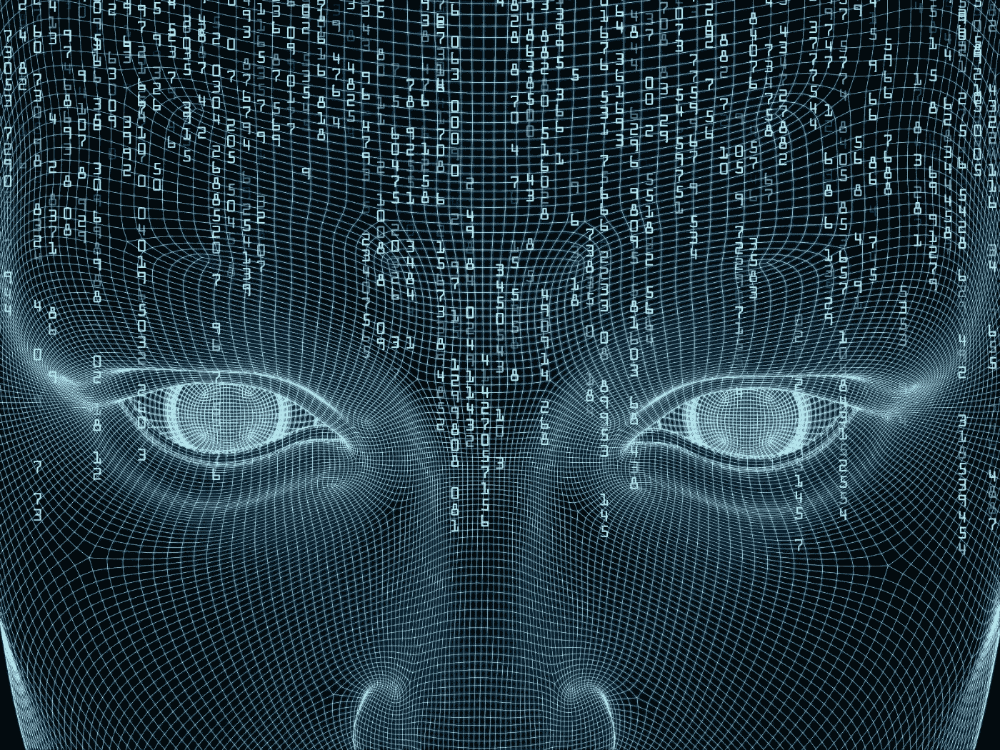
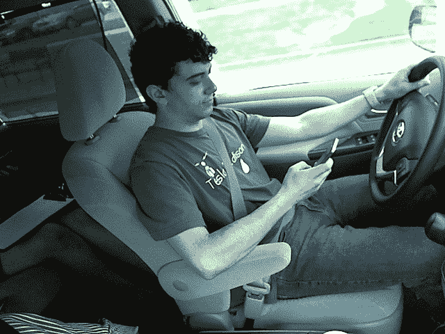
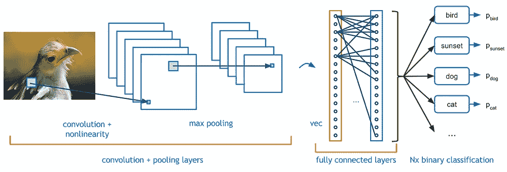
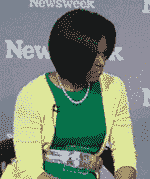

# 我如何使用深度学习解决我的第一个 Kaggle 挑战——第 1 部分

> 原文：<https://towardsdatascience.com/how-i-tackled-my-first-kaggle-challenge-using-deep-learning-part-1-b0da29e1351b?source=collection_archive---------4----------------------->



Artificial Intelligence

在过去的几周里，我一直在参加免费且优秀的 [fast.ai](http://course.fast.ai/) 在线课程，该课程从实用的角度教授深度学习。作为一名编程出身的人，我发现这是正确的方法。然而，我一直在用各种材料补充我的理论理解(我强烈推荐那些来自 [CS231n 斯坦福课程](http://cs231n.github.io/)的笔记)。

## 进入 Kaggle

[Kaggle](https://www.kaggle.com) 是应用深度学习挑战的战场和训练场，我被其中一个特别吸引:州立农场分心司机检测挑战。在这项挑战中，我们得到了一组大约 20K 的驾驶员照片，这些驾驶员要么处于专注状态，要么处于分心状态(例如，拿着电话，化妆等)。).测试集由大约 80K 幅图像组成。目标是建立一个模型，该模型可以在一组 10 个类别中准确地对给定的驾驶员照片进行分类，同时最小化[对数损失](https://www.quora.com/What-is-an-intuitive-explanation-for-the-log-loss-function)(即，每次分类器得到错误的预测时，惩罚分数都会按照对数顺序上升)。

我对 State Farm challenge 感兴趣，因为我目前正在开发一款由人工智能驱动的 dash cam 手机应用程序，它将使驾驶变得更加安全和丰富。KamCar 将做的一件事是检测司机的注意力分散/困倦，并提醒司机避免灾难。根据[疾病预防控制中心](https://www.cdc.gov/motorvehiclesafety/distracted_driving/)的数据，司机分心是 20%车祸的原因，我相信，随着当前深度学习的进步和智能手机功能的增强，我们可以采取更多措施来解决这一问题。



Driver in different distracted states

在严格遵循杰瑞米·霍华德(fast.ai 联合创始人)的方法之前，我尝试了自己的愚蠢方法，但收效甚微。

## 第 1 步—获得正确的验证集

据我所知，对于有多少训练集应该放在验证集中没有明确的规则，所以我设计了一个在训练集和验证集之间 80/20 的划分。

当我开始应对州立农场挑战时，我只是在所有 10 个类中随机移动了 20%的图像，从训练集到验证集。但是当我对数据运行一个简单的线性模型时，训练集的损失是巨大的(超过 14)，而验证集的准确性未能超过 17%。

我回到州立农场挑战赛页面，再次阅读其详细信息，并注意到以下内容:

> *训练和测试数据被分割在驱动程序上，* ***使得一个驱动程序只能出现在训练或测试集上。***

*有趣…* 我想…既然我们根据验证集来验证(而不是训练)我们的模型，它应该表现出与测试集相似的属性，对吗？因此，解决方案是**分割训练集和验证集，使得验证集中一定比例的驾驶员不在训练集中。** State Farm 方便地提供了一个 csv 文件，该文件将给定的驱动程序 id 映射到一个文件名，因此分割非常简单:

```
import pandas as pd
import randomdf = pd.read_csv(path + ‘/driver_imgs_list.csv’)
by_drivers = df.groupby(‘subject’)
unique_drivers = by_drivers.groups.keys()# Set validation set percentage with regards to training set
val_pct = 0.2
random.shuffle(unique_drivers)# These are the drivers we will be entirely moving to the validation set
to_val_drivers = unique_drivers[:int(len(unique_drivers) * val_pct)]
```

## 步骤 2 —从样品组开始

由于训练和验证集总计 20K 个图像，当您只是检查一些设置是否有效时，在这么大的数据量上训练模型仍然需要一点时间。

样本集只是训练集和验证集的子集:您的模型将根据样本训练集进行训练，以快速评估哪些有效，哪些无效。这样做让我节省了很多时间！我选择我的样本集是大约 20%的数据，其中图像被随机复制到样本集。

## 第三步——尝试准系统模型

下面的模型非常简单，事实上它根本没有卷积层:

```
def linear_model():
    model = Sequential() # image size is 3 (RGB) x 224x224 (WidthxHeight)
   model.add(BatchNormalization(axis=1, input_shape=(3, img_size_1D, img_size_1D)))

    model.add(Flatten())
    # here we have 10 classes        
    model.add(Dense(num_classes, activation='softmax'))

    model.compile(loss='categorical_crossentropy', optimizer='adam', metrics=['accuracy'])
    return model
```

有趣的是，在没有卷积和正则化的情况下，它是如何在验证集上达到接近 40%的准确率的！

```
model = linear_model()
model.optimizer.lr = 10e-5model.fit_generator(sample_train_batches, samples_per_epoch=sample_train_batches.nb_sample, nb_epoch=3, 
                   validation_data=sample_val_batches, nb_val_samples=sample_val_batches.nb_sample, verbose=1)Epoch 1/3
1803/1803 [==============================] - 29s - loss: 5.7358 - acc: 0.2806 - val_loss: 10.9750 - val_acc: 0.1741
Epoch 2/3
1803/1803 [==============================] - 24s - loss: 1.6279 - acc: 0.6339 - val_loss: 4.6160 - val_acc: 0.3304
Epoch 3/3
1803/1803 [==============================] - 24s - loss: 0.5111 - acc: 0.8358 - val_loss: 3.1399 - val_acc: 0.3951
```

显然，你可以看出它大大超出了训练集，因为在仅仅 3 次完整运行中，它就达到了超过 80%的准确率，而验证集的准确率是两倍。问题是我们的简单模型已经学会记忆大多数图像的正确权重，这使得它无法很好地概括以前从未遇到过的驾驶员图像(猜猜看，他们都在验证集中！).

## 第四步——在你的生活中增加一些回旋的余地



Example of a convolutional neural network — from Adit Deshpande’s blog [https://adeshpande3.github.io/](https://adeshpande3.github.io/)

好了，这才是真正有趣的地方……我创建了一个模型，用一些卷积来测试这样的架构是否会提高准确性:

```
def simple_convnet():
    model = Sequential([
        BatchNormalization(axis=1, input_shape=(3,224,224)),
        Convolution2D(32,3,3, activation='relu'),
        BatchNormalization(axis=1),
        MaxPooling2D((3,3)),
        Convolution2D(64,3,3, activation='relu'),
        BatchNormalization(axis=1),
        MaxPooling2D((3,3)),
        Flatten(),
        Dense(200, activation='relu'),
        BatchNormalization(),
        Dense(10, activation='softmax')
    ])model.compile(Adam(lr=1e-5), loss='categorical_crossentropy', metrics=['accuracy'])
    return model
```

令人惊讶的是(至少对我来说)，该模型在验证集上表现很差，但在训练集上很快达到了 100%的准确率:

```
Epoch 1/3
1803/1803 [==============================] - 34s - loss: 1.2825 - acc: 0.6184 - val_loss: 2.0999 - val_acc: 0.2612
Epoch 2/3
1803/1803 [==============================] - 25s - loss: 0.2360 - acc: 0.9590 - val_loss: 2.2691 - val_acc: 0.2098
Epoch 3/3
1803/1803 [==============================] - 26s - loss: 0.0809 - acc: 0.9939 - val_loss: 2.4817 - val_acc: 0.1808
Epoch 1/3
1803/1803 [==============================] - 30s - loss: 0.0289 - acc: 0.9994 - val_loss: 2.6927 - val_acc: 0.1585
Epoch 2/3
1803/1803 [==============================] - 29s - loss: 0.0160 - acc: 1.0000 - val_loss: 2.7905 - val_acc: 0.1540
Epoch 3/3
1803/1803 [==============================] - 26s - loss: 0.0128 - acc: 1.0000 - val_loss: 2.7741 - val_acc: 0.1562
```

## 第五步——有意愿，就有增加

数据扩充使我们能够对图像进行随机修改，以降低模型记忆特定图像权重的能力。一些类型的增强包括旋转、宽度/高度移动、[剪切](https://en.wikipedia.org/wiki/Shear_mapping)和 RGB 通道移动。我尝试了一系列参数，并确定了以下最佳结果:

```
gen_all = image.ImageDataGenerator(rotation_range=15, height_shift_range=0.05, shear_range=0.15, channel_shift_range=10, width_shift_range=0.1)
```

经过多次运行，我设法在验证集上实现了 60%的准确率，这对于接下来的事情来说是非常令人鼓舞的:

```
Epoch 13/15
1803/1803 [==============================] - 26s - loss: 0.4834 - acc: 0.8697 - val_loss: 1.4806 - val_acc: 0.5625
Epoch 14/15
1803/1803 [==============================] - 26s - loss: 0.4944 - acc: 0.8658 - val_loss: 1.4361 - val_acc: 0.5759
Epoch 15/15
1803/1803 [==============================] - 27s - loss: 0.4959 - acc: 0.8597 - val_loss: 1.3884 - val_acc: 0.6004
```

对于这样一个简单的模型来说还不错，你同意吗？



Not bad at all, according to Michelle Obama

我正在进行这个系列的第 2 部分，在那里我们将使用完整的数据集，并通过利用已经预先训练好的 [VGG 网](https://arxiv.org/pdf/1409.1556)模型来执行[迁移学习](https://en.wikipedia.org/wiki/Transfer_learning)。代码也将很快出现在我的 github 上。

敬请期待，喜欢就分享，不要犹豫留下评论:)。

*我是建筑*[*KamCa*](http://gokamcar.com/)*r，AI 驱动的 dash cam app，让驾驶更安全、更丰富的体验。如果你是一名移动开发者，想要开发一些令人兴奋的技术和产品，或者只是想提供一些建议，请在*[*Twitter*](https://twitter.com/Ed_Forson)*或这里联系我:)*