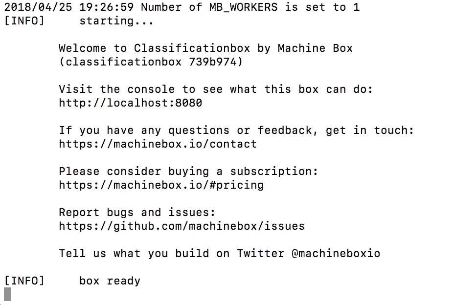
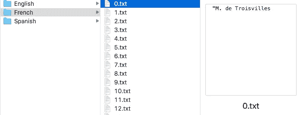
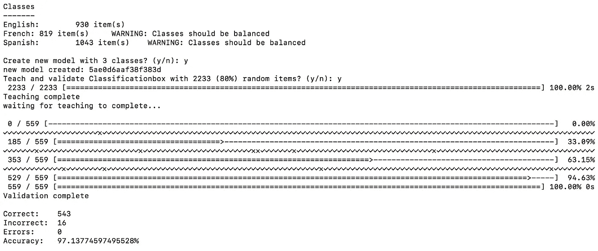

# 我如何在 20 分钟内训练一个语言检测人工智能，准确率达到 97%

> 原文：<https://towardsdatascience.com/how-i-trained-a-language-detection-ai-in-20-minutes-with-a-97-accuracy-fdeca0fb7724?source=collection_archive---------3----------------------->

Weird — I actually kind of look like that guy

这个故事一步一步地指导我如何在 20 分钟内使用机器学习建立一个语言检测模型(最终准确率为 97%)。

语言检测是机器学习的一个很好的用例，更具体地说，是文本分类。给定来自电子邮件、新闻文章、语音到文本功能的输出或任何其他地方的一些文本，语言检测模型将告诉您它是什么语言。

这是快速对信息进行分类和排序，以及应用特定于语言的工作流的附加层的好方法。例如，如果您想对 Word 文档应用拼写检查，您首先必须为正在使用的词典选择正确的语言。否则你会发现拼写检查是完全错误的。

其他用例可能包括将电子邮件路由到地理位置正确的客户服务部门，对视频应用正确的字幕或隐藏式字幕，或者对正在分析的文本应用一些其他语言特定的文本分类。

好了，你明白了，语言检测真的很有用，让我们继续我是如何这么快做到的。

我从这个数据集开始。[https://cloud.google.com/prediction/docs/language_id.txt](https://cloud.google.com/prediction/docs/language_id.txt)

它基本上是一个. csv 格式的文件，带有英语、法语和西班牙语的样本。我的目标是看看我是否可以训练一个机器学习模型来理解这些语言之间的差异，然后，给定一些新文本，预测它是哪种语言。

所以我做的第一件事是启动[分类框](https://goo.gl/PkjUxE)，一个运行在 Docker 容器中的机器学习模型生成器，有一个简单的 API。这用了不到一分钟。

The output of the terminal

然后我下载了[这个方便的工具](https://github.com/machinebox/toys/tree/master/textclass)，它可以让你在电脑上用文本文件训练分类框变得非常容易。这又花了一分钟左右。

下一步是将 CSV 转换成文本文件，这样我就可以很容易地训练 Classificationbox。

> 一个合格的开发人员会跳过这一步，直接解析 CSV 文件并从那里对 Classificationbox 进行 API 调用。

这里是我写的一些不太好的 [Go](https://golang.org/) 代码，以防你感兴趣，如果不感兴趣，请跳到下一步。

运行这个脚本后，我的硬盘上有了以不同语言命名的文件夹。每个文件夹里都有语言样本的文本文件。我花了大约 10 分钟编写脚本并运行它。

现在有趣的部分来了。我确保[分类框](https://goo.gl/aJKLWi)已经启动并运行，然后我在语言文件夹的父目录上运行`textclass`。大约花了 3 秒钟:

1.  处理所有样本
2.  将 20%的样本分成一个验证集
3.  用训练集训练分类框
4.  使用验证集进行验证

这些是我的结果:

97% !对于只花 20 分钟训练语言检测机器学习模型来说，这已经很不错了。

需要注意的一件重要事情是，我的班级并不是**平衡的**。我对每一个类都有不同数量的样本，这不符合训练模型的最佳实践。理想情况下，我会在每节课中有相同数量的例子。

关键是，机器学习最受益于实验。我强烈鼓励每个人尝试使用[机器盒](https://goo.gl/aJKLWi)或任何其他工具。我希望我能够展示给定一个好的数据集，创建自己的机器学习/分类模型是多么容易。

# 什么是机器盒子？

[Machine Box](https://goo.gl/aJKLWi) 将最先进的**机器学习**功能放入 **Docker 容器**中，这样像您这样的开发人员就可以轻松地将自然语言处理、面部检测、对象识别等融入其中。到您自己的应用程序中。

盒子**是为扩展**而建造的，所以当你的应用真正起飞时，只需水平地添加更多的盒子，直到无限甚至更远。哦，它比任何云服务都要便宜得多([而且可能更好](https://hackernoon.com/which-face-recognition-technology-performs-best-c2c839eb04e7))……而且**你的数据不会离开你的基础设施**。