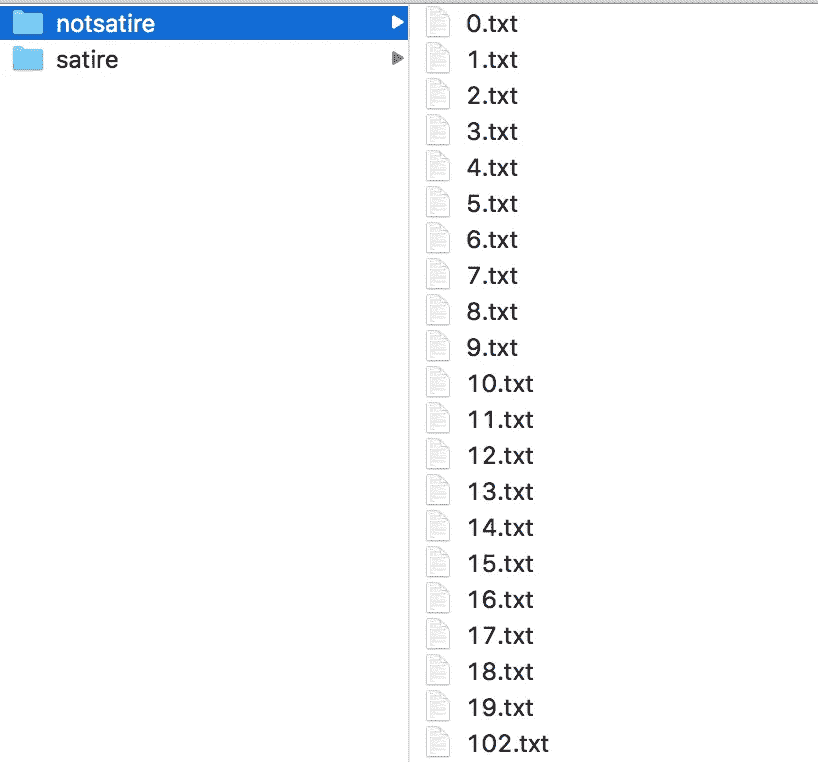
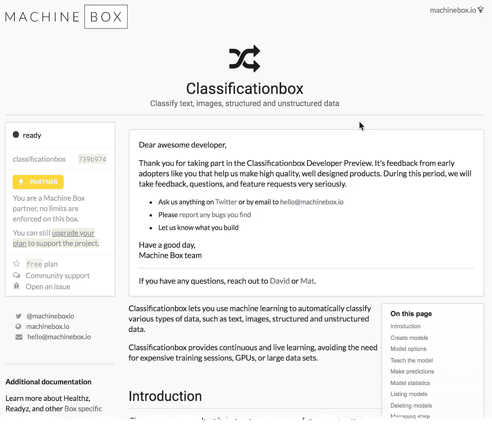
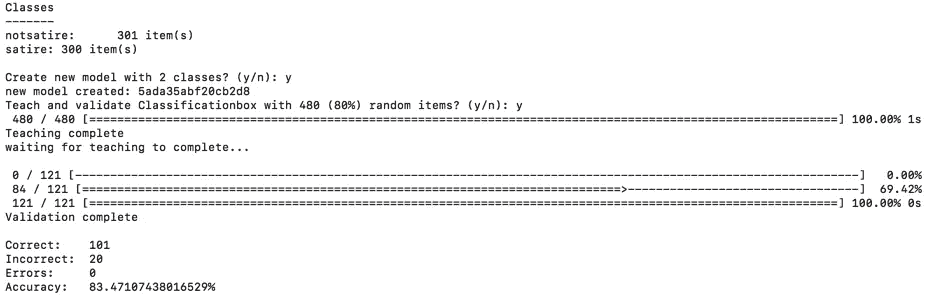

# 我如何训练一个人工智能在一小时内发现讽刺

> 原文：<https://towardsdatascience.com/how-i-trained-an-ai-to-detect-satire-in-under-an-hour-2b8b300ea805?source=collection_archive---------5----------------------->


source: [https://www.theonion.com/nasa-announces-plans-to-place-giant-pair-of-shades-on-s-1825413851](https://www.theonion.com/nasa-announces-plans-to-place-giant-pair-of-shades-on-s-1825413851)

我决定给自己一个挑战，看看我能否教会一个机器学习模型在不到一个小时的时间内检测洋葱文章(和其他讽刺文章)和真实新闻文章之间的差异。这些是我的结果:

解决这个问题的第一步是收集训练数据。这是迄今为止最困难的部分。有很多方法可以实现这一点。一种方法是尝试抓取网站。如果你正在寻找合适的工具，你当然可以尝试“[https://scrapy.org/](https://scrapy.org/)或[https://scrapinghub.com/open-source](https://scrapinghub.com/open-source)，或者简单地构建你自己的工具(如果你愿意的话)。

我不太擅长计算机，不知道如何抓取网站，所以我决定手动收集数据(畏缩)。**这个过程占用了大半个小时。**我访问了[www.theonion.com](http://www.onion.com)，开始将文章内容复制粘贴到单独的文本文件中，我简单地按顺序命名为(“0.txt”、“1.txt”等……)。我把这些文本文件保存在一个名为“讽刺”的文件夹里。(前 10 个之后，我开始用 Command-C 变得非常快，打开一个新的文本编辑窗口，Command-V sequence。)

> 我当然不建议手动这么做。做一个比我更好的程序员，做适当的网页抓取。



Screenshot of my Finder

一旦我有了大约 300 篇洋葱文章，我就转向路透社和美联社，作为非讽刺新闻的来源。我开始手动将这些文章复制粘贴到文本文件中，并保存到一个新文件夹中，我称之为“notsatire”。

再说一次，一开始进展很慢，但是一旦我掌握了窍门，事情就变快了。在这一点上，我做了大约 45 分钟，已经非常累了。我决定每个类 300 个就足够了，看看我是否可以训练一个分类器来检测两者之间的差异。



Classificationbox

自然，我的计划是使用[分类框](https://goo.gl/YpVjup)，因为它使得构建和部署分类器变得极其容易。而且，为了让事情变得更简单，我很快从 GitHub 克隆了 [Mat Ryer 的便利的](https://github.com/machinebox/toys/tree/master/textclass) `textclass` [工具，这样我就可以直接从我的计算机上的文件中运行这个小东西(而不是试图用正文中的文本构建 API 查询)。](https://github.com/machinebox/toys/tree/master/textclass)

首先，我启动了分类箱。

然后，我发出了这个命令:

```
go run main.go -teachratio 0.8 -src ./testdata/fakenews/
```

坐下来看结果出来。



Terminal view of imgclass running

大约 1 秒钟，[分类框](https://goo.gl/YpVjup)就训练好了！然后又花了 2 或 3 秒钟来确定，然后进行验证。

结果显示准确率为 83%。这告诉我，很有可能建立一个分类器来检测讽刺和真实新闻之间的差异，我可能只需要添加更多的例子来增加准确性。

为了确保万无一失，我花了 5 分钟时间，每篇文章又增加了 20 篇，然后重新进行测试。这次我考了 86 分。

这表明，在没有大量训练数据的情况下，你可以开始构建一个机器学习驱动的分类器。甚至像检测讽刺或真实新闻这样复杂的事情也能在一个小时内完成！

我强烈建议你亲自尝试一下。

# 什么是机器盒子？


[Machine Box](https://goo.gl/YpVjup) 将最先进的**机器学习**功能放入 **Docker 容器**中，以便像您这样的开发人员可以轻松整合自然语言处理、面部检测、对象识别等功能。到您自己的应用程序中。

这些盒子**是为扩展**而建造的，所以当你的应用真正起飞时，只需水平地添加更多的盒子，直到无限甚至更远。哦，它比任何云服务都便宜**([它们可能更好](https://hackernoon.com/which-face-recognition-technology-performs-best-c2c839eb04e7))……而且**你的数据不会离开你的基础设施**。**