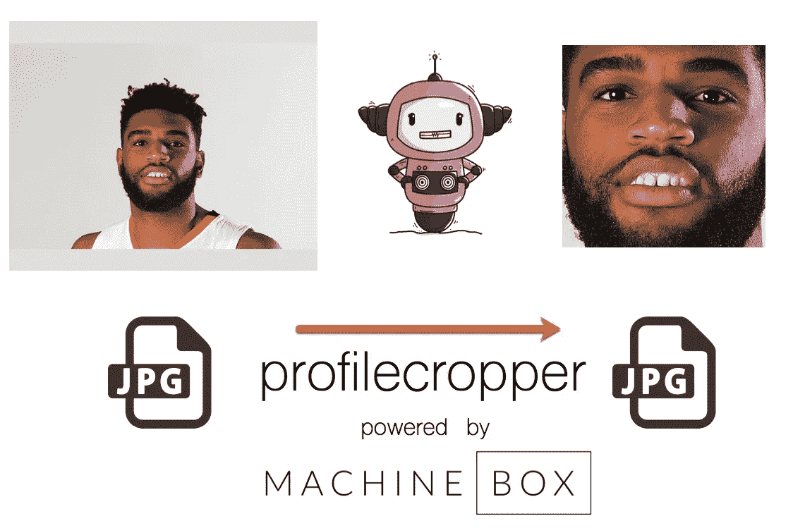
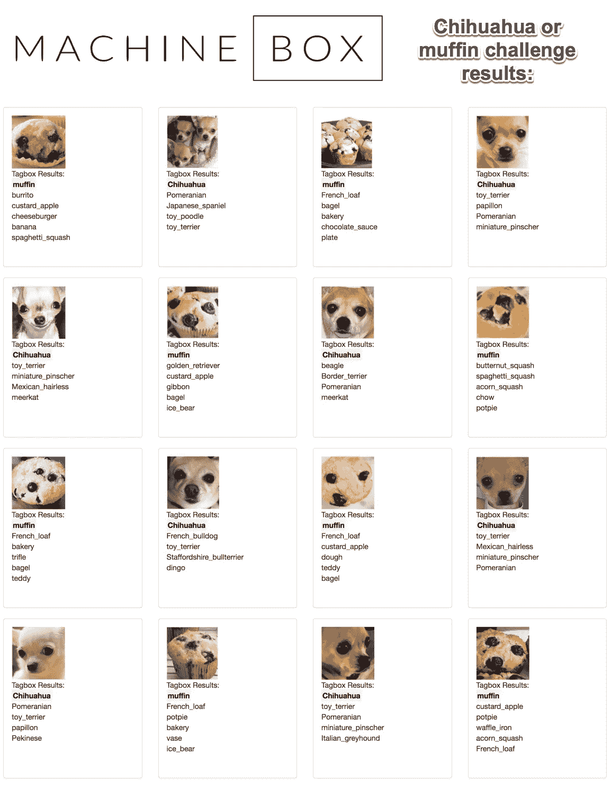

# 我如何使用机器学习来节省时间

> 原文：<https://towardsdatascience.com/how-i-use-machine-learning-to-save-time-49f8b0ee0881?source=collection_archive---------10----------------------->

事情已经变了。某些类型的问题曾经非常困难，或者需要大量重复的工作才能解决。我相信我们都有过这样的经历，面对一些我们知道需要很长时间才能完成的事情，不是因为它具有挑战性，而是因为它重复且耗时。

像苹果公司的 Automator 这样的东西可以用来使某些与计算机相关的任务变得更可行，尤其是如果你不擅长脚本语言的话。这些工具可用于解决需要重命名文件夹中的数千个文件或删除重复文件等问题。但是有些事情是它解决不了的。

许多年前，我制作了一个网络系列，有相当广泛的演员阵容。我需要完成的一项任务是为这个节目制作一个网站。我记得我很喜欢这部作品，直到我看到演员名单。我突然意识到，我需要裁剪和放置大量不同大小和形状的头像，以便在网站上看起来统一(这是在我知道网格布局之前)。这个过程花了我几天时间来完成。自从我手动完成所有工作后，我从来没有觉得自己做得很对。

今天，这个问题可以通过机器学习很容易地解决。以下是我的方法:

1.  从[机器盒子](https://goo.gl/2buX6a)(我帮忙创立的一家初创公司)下载并安装 Facebox。
2.  编写一个脚本，将您想要裁剪的每张照片发布到 Facebox，并获取人脸的位置。
3.  使用 Facebox 返回的尺寸在脸部周围裁剪照片(带有一些填充)。

> 我已经在这里开源了一些这样做的代码: [profilecropper](https://github.com/aaronedell/profilecropper)

profilecropper powered by Machine Box

你可以用这种方式创建和自动裁剪数以百万计的个人资料图片，而不必做任何手工劳动。只需要知道人脸在哪里，这是机器学习可以解决的问题。

让我们再举一个例子。比方说，你已经有了一个过去 50 年扫描的照片库。扫描每张照片是一种痛苦，但至少现在它们都是数字文件。但问题是，你无法搜索它们。幸运的是，机器学习可以再次拯救我们。以下是我的方法:

1.  从[机器盒](https://goo.gl/2buX6a)下载并安装 Tagbox
2.  编写一个脚本，将你拥有的每张照片发布到 Tagbox，并获取标签列表。
3.  您可以根据结果决定是否过滤掉低可信度的标签。
4.  将标签与文件名一起存储在一个文本文件中，您的操作系统稍后将对其进行索引。或者，将数据写入简单的数据库，如 excel 电子表格或 SQL 表。
5.  现在，您可以通过照片中的内容来搜索照片。

> 为了让你开始，这里也有一些解决这个问题的开源代码: [tagroll](https://github.com/aaronedell/tagroll)

Solving the chihuahua/muffin problem with Tagbox

好玩的小旁注；假设你有特定类型的想要搜索的对象，比如一辆特殊类型的汽车或房子。你可以用一两张样本照片来教 Tagbox 这些东西，然后它会从那时起标记它看到的每张照片。点击阅读更多关于如何做的[。](https://blog.machinebox.io/introducing-tagbox-custom-tags-49c28b4bfdaf)

你还可以做一些非常聪明的事情，比如对你所有的照片进行[视觉相似性搜索](https://blog.machinebox.io/visual-search-by-machine-box-eb30062d8abe)。上传某样东西的照片，并使用 Tagbox 向您显示您收藏的其他类似照片。

可以想象，这些解决方案几乎无处不在。例如，您的电子商务网站可以为客户提供强大的工具，根据他们喜欢的东西的视觉相似性来找到他们更有可能购买的衣服。

在这个时代，我们都在处理大量的数据。无论是个人照片还是产品目录，我们都需要开始定期考虑将机器学习作为一种强大的方法，来解决因拥有如此多的数据而产生的问题。