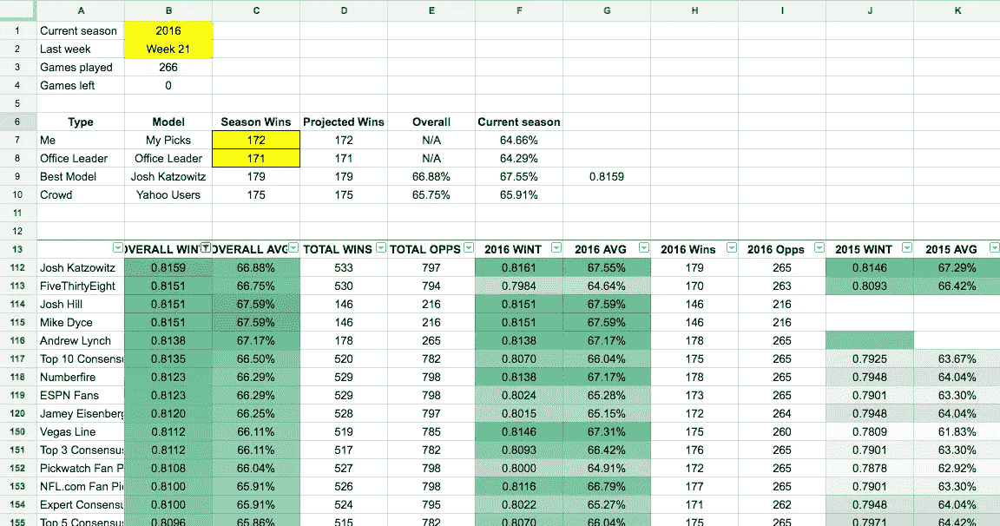
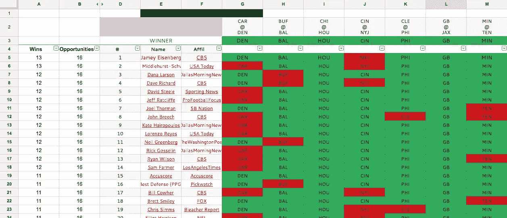
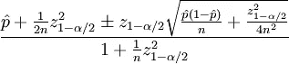
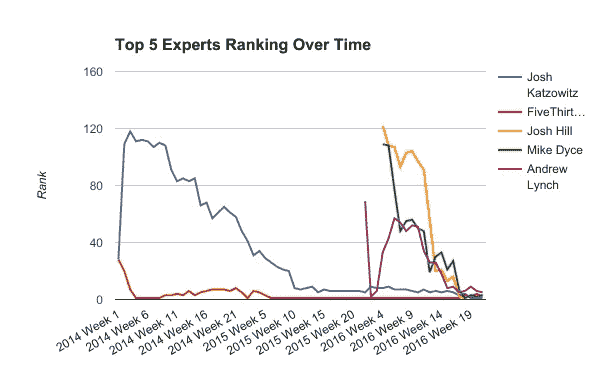
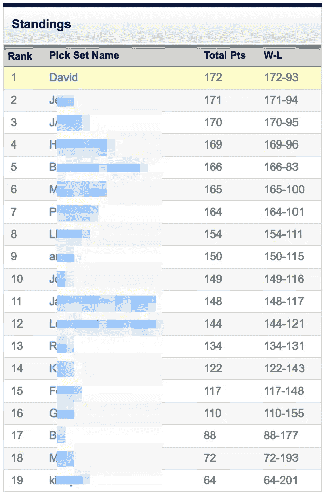

# 我如何使用 200 名专家和 Reddit 的评论排名算法来赢得我的办公室 NFL Pick'em 池

> 原文：<https://towardsdatascience.com/how-i-used-200-experts-and-reddits-comment-ranking-algorithm-to-win-my-office-nfl-pick-em-pool-cbca64abe31d?source=collection_archive---------0----------------------->

The spreadsheet that won me my NFL pick’em office pool: [https://docs.google.com/spreadsheets/d/1caV-Uv7f4OsVuioSU3iPWn8cMkYjG0S9XgU9pgKwlPU/edit?usp=sharing](https://docs.google.com/spreadsheets/d/1caV-Uv7f4OsVuioSU3iPWn8cMkYjG0S9XgU9pgKwlPU/edit?usp=sharing)

我发现，每年参加我办公室的 NFL 扑克比赛都是一种极大的快乐。去年(2015-2016 NFL 赛季)，在没有任何连贯策略的情况下，我在 24 场比赛中排名第 18，并在赛季结束时排名并列第 4。今年，我想如果我采用一致的策略，我可能真的会赢。

我赢了。

新英格兰队昨天在超级碗比赛中令人难以置信地战胜了亚特兰大队，使我在 19 名同事中排名第一，在 265 次正确选择中取得了 172 次的成绩。

我是怎么做到的？我创建了一个系统，使用来自 200 多名“专家”的数据和 Reddit 评论排名算法的变体，有条不紊地产生超越我同事的优势。

我的主要论点是:每周，我都会听从记录最好的专家的建议，将他或她预先宣布的选择作为自己下周的选择。

随着这些专家证明了他们在挑选赢家方面的熟练程度，我也跟着他们走向了成功。随着他们争夺和交换最高神谕的位置，我也相应地改变了我的忠诚。

我的逻辑虽然在理论上容易出错，但在实践中是成功的:过去在某些专家中的成功确实保证了我未来的表现。

结果呢？一个将数以千计的专家预测变成办公室吹嘘资本的系统。

# 收集“专家”预测

如果我要追随最可靠的专家，我首先需要数据来告诉我，这些所谓的“专家”中的哪一个实际上每周都在挑选赢家。

我在 [NFL Pickwatch](http://nflpickwatch.com) 找到了我所需要的。

NFL Pickwatch 跟踪 NFL“专家”在 NFL 赛季期间每周的选择和预测。大多数专家是 NFL 媒体分析师(因此他们的“专家”身份)，但 NFL Pickwatch 也跟踪 Vegas line、ESPN 用户共识、微软的人工智能机器人 Cortana 和算法，如 [FiveThirtyEight 的 Elo 预测](https://fivethirtyeight.com/datalab/nfl-elo-ratings-are-back/)。NFL Pickwatch 背后的家伙，用他们自己的话说，“跟踪、观察和跟踪(象征性地)每个网络和网站上的每个 NFL 专家”。

NFL Pickwatch 每周都有专家预测，可以追溯到 2014 赛季。8 月，我从 NFL Pickwatch 手动复制并粘贴了 2014 和 2015 赛季每周选秀权数据到一个[谷歌电子表格](https://docs.google.com/spreadsheets/d/1caV-Uv7f4OsVuioSU3iPWn8cMkYjG0S9XgU9pgKwlPU/edit?usp=sharing)。每周的数据如下所示:

第 3 行包含每场比赛的获胜者，我会每周手动发布。左边的一个公式计算了所有选秀权中的获胜次数。

该公式只惩罚错误选择的专家，而不是不完整的选择。这是我自己计算的，而不是依靠 NFL Pickwatch 的计算，因为他们只是在 2016 赛季开始时停止了对不完整选秀权[的处罚。](http://nflpickwatch.com/what-is-new-for-pickwatch-in-2016/)

# 寻找最好的专家

NFL Pickwatch 的数据面临的一个挑战是，他们只能跟踪专家公开提供的预测。多年来，NFL Pickwatch 已经扩大了他们追踪的专家数量。这意味着一些专家拥有 2014 年的数据，而其他人则是 2016 赛季开始时的新手。这使得比较专家成为一个挑战。

## 胜率的问题

比较专家的一个自然的起点是比较他们的胜率，即所有预测中正确预测的数量。例如，如果我做了 100 个预测，并在其中的 60 个中选择了正确的赢家，我的胜率将是 60%。

这种方法的问题是，在 500 场比赛中表现稳定的专家不容易与第一周运气好的新手相比。

例如，在 2014、2015 和 2016 赛季，要被认为是所有专家中第 90 百分位的顶级专家，专家必须在至少 66.25%的时间里正确选择获胜者。同一时期的几个基准供参考:

*   拉斯维加斯线:66.11%
*   ESPN 粉丝共识度:66.29%
*   主队赢了 56.4%的时间

使用获胜百分比对专家进行排名将导致一位公认的专家预测 600 场游戏中的 400 名获胜者(66.67%的获胜百分比)，排名*在*之后，一位新参与者在第一周运气不错，在 16 名获胜者中正确选择了 13 名(81.25%的获胜百分比)。

我希望我的系统能够平衡新加入者(他们可能发现了一种创新的预测方式)和专家(他们在多个季节里一直表现良好)之间的优势。

## 输入 Reddit 的评论排名算法

几年前，我偶然看到阿米尔·萨利哈芬迪克的一篇文章，详细介绍了[Reddit 如何对评论进行排名](https://medium.com/hacking-and-gonzo/how-reddit-ranking-algorithms-work-ef111e33d0d9#.ar9spcw5k)。

Reddit 允许评论被投票赞成和投票反对，以根据其众包质量对评论进行排名。为了对它们进行排名，Reddit 必须将一条有 1 张赞成票和 0 张反对票的评论与另一条有 50 张赞成票和 0 张反对票的评论进行比较。两者都有 100%的“正面”评价，但 Reddit 的算法将第二条评论的排名高于第一条。

Reddit 通过执行“置信度排序”来做到这一点。它平衡了评论的质量和信心，即从长远来看，当前的赞成票和反对票的分配将是准确的。参见“[如何不按平均评分排序](http://www.evanmiller.org/how-not-to-sort-by-average-rating.html)”，了解为什么这种方法比城市字典和亚马逊等其他网站的排名计算更准确。

为了进行置信度排序，Reddit 使用了一个[威尔逊评分区间](https://en.wikipedia.org/wiki/Binomial_proportion_confidence_interval#Wilson_score_interval):

Source: [https://medium.com/hacking-and-gonzo/how-reddit-ranking-algorithms-work-ef111e33d0d9#.ar9spcw5k](https://medium.com/hacking-and-gonzo/how-reddit-ranking-algorithms-work-ef111e33d0d9#.ar9spcw5k)

Salihefendic [解释](https://medium.com/hacking-and-gonzo/how-reddit-ranking-algorithms-work-ef111e33d0d9#.ar9spcw5k):

"*在上述公式中，参数定义如下:*

*   *p 是正面评级的观察分数*
*   *n 是评级总数*
*   *zα/2 是标准正态分布* 的(1-α/2) [*分位数*](https://en.wikipedia.org/wiki/Normal_distribution#Quantile_function)

*下面我们总结一下:*

*   信心排序将计票视为每个人的假想全票的统计抽样

我们可以使用相同的参数为我们的专家计算威尔逊评分区间。在我们的例子中，

*   p 是正确预测的数量
*   n 是预测的总数
*   zα/2 仍然是标准正态分布的理想分位数，或者我们希望对专家预测的准确性有多有信心

下面是公式在 Excel 公式中的表示方式:= sqrt((p/n)+z * z/(2 * n)-z *(p/n)*(1-(p/n))+z * z/(4 * n))/n)/(1+z * z/n)

根据 Salihefendic 的说法， [Reddit 的评论排名算法](https://medium.com/hacking-and-gonzo/how-reddit-ranking-algorithms-work-ef111e33d0d9#.bq36q8a1x)使用的置信区间(上面 *z* 的值)为 1.281551565545。他声称这相当于 85%的置信区间，这意味着:

*   *“置信度排序给一个评论一个临时排序，它有 85%的把握它会到达*
*   *投票越多，85%的置信度得分越接近实际得分”*

我认为他弄错了，基于维基百科上的这个[分位数函数表](https://en.wikipedia.org/wiki/Normal_distribution#Quantile_function)显示 1.28 是 80%置信区间的值，而不是 85%。

不管怎样，总的想法是一样的。我们应该根据我们对专家预测质量的信心程度来选择 z 的值。

在试验不同的 *z* 值时，我选择使用 1.6，从代表 90%置信区间的 1.644853626951 取整。我选择了 90%超过 95%和 98%的置信区间( *z* = 2.0， *z* = 2.3 分别)。我觉得 90%给了我最好的平衡，既尊重久经考验的专家，又有足够的进取心，在短短几周持续的优秀选择后识别出“冉冉升起的新星”。

# 结合数据和算法

使用 NFL Pickwatch 的两个赛季的数据，我根据他们的**威尔逊得分区间**对 177 名专家进行了排名。前 5 名专家:

*   538—**0.8205**(531 个中的 360 个，占 67.8%)
*   ESPN 球迷—**0.8144**(533 人中的 356 人，占 66.8%)
*   杰米·艾森伯格—**0.8144**(533 人中的 356 人，占 66.8%)
*   拨片风扇拨片—**0.8133**(533 个中的 355 个，占 66.6%)
*   乔希·卡佐维茨—**0.8129**(532 人中的 354 人，占 66.5%)

于是，在 2016 赛季的第一周，我把 FiveThirtyEight 的选秀权据为己有。

我每周都重复这个方法。我从 NFL Pickwatch 导出了前一周的结果，重新计算了每位专家的威尔逊得分区间，并相应地更改了我的选择。在 2016 赛季，NFL Pickwatch 增加了 30 多名专家，使专家总数超过 200 人。我还添加了一些我自己的专家，我可能会在以后的帖子中写一些。

这是显示我的系统的[完整电子表格](https://docs.google.com/spreadsheets/d/1caV-Uv7f4OsVuioSU3iPWn8cMkYjG0S9XgU9pgKwlPU/edit?usp=sharing)，其中有从 2014 赛季第一周到昨天超级碗 51 的数据。

正如你在上面看到的， [FiveThirtyEight 的 Elo 模型](https://projects.fivethirtyeight.com/2016-nfl-predictions/)在整个 2014 和 2015 赛季占据主导地位，在 2016 赛季开始时，比排名第二的“专家”ESPN 粉丝高出近一个百分点。正因为如此，FiveThirtyEight 在整个 2016 赛季都保持领先！

尽管要花费数小时复制和粘贴数据，并创建一个复杂的自动生成公式的电子表格，但我的系统一直告诉我只需遵循 FiveThirtyEight 的建议。

FiveThirtyEight 在整个常规赛中都将是顶级专家，只是在 2016 年季后赛第一周之后被踢下了宝座。

到本赛季结束时，使用 2014 年、2015 年和 2016 年(包括每个赛季的季后赛和超级碗)的数据，目前排名前 5 的专家是:

*   乔希·卡佐维茨—**0.8159**(797 人中的 533 人，占 66.9%)
*   538—**0.8151**(794 个中的 530 个，占 66.8%)
*   迈克·戴斯—**0.8151**(216 人中的 146 人，占 67.6%)
*   乔希·希尔—**0.8151**(216 人中的 146 人，占 67.6%)
*   安德鲁·林奇—**0.8138**(265 个中的 178 个，7.2%)

以下是这五位专家从 2014 年第一周开始每周的排名:

正如你所知，FiveThirtyEight 在过去的三年中占据了主导地位，在 63 周中有 39 周高居榜首，只是在 2016 年季后赛的最后几周输给了 Josh Katzowitz。

# 赢得办公室赌注

使用这个系统，实际上相当于整个赛季都在复制 FiveThirtyEight 的选秀权，我在 265 场比赛中选对了 172 场，最终胜率为 64.66%。我排名第二的同事做了 171 次正确的选择，几乎赢得了所有的选择，直到她的超级碗 51 次选择，亚特兰大猎鹰队，在第四季度崩溃。

现在，我很乐意承认我们的办公室并不特别热衷于运动。此外，游泳池显然很小。这个系统可能不会在另一个更大的办公室里工作。尽管如此，我花了无数个小时把这个系统组装在一起，这是一个巨大的乐趣，只是碰巧最后胜出了。

可悲的是。如果我们中的任何人只是随大流，选择了雅虎用户的最爱，我们会以 174 个正确的选择排名第一。如果我们选择拉斯维加斯线的最爱，我们会有 175 个正确的选择。这显示了大众和市场的力量，以及为什么在试图击败它们时要小心谨慎。

但至少今年，办公室的荣耀——以及几块钱——是我的。

请在下面的评论中告诉我你对我的方法的看法。我没有花时间详细指出它的各种缺陷，但是如果你读到这里，我相信你已经有了自己的一些聪明的批评和建议。