# 我如何使用深度学习来优化 Keras 的电子商务业务流程

> 原文：<https://towardsdatascience.com/how-i-used-deep-learning-to-optimize-an-ecommerce-business-process-with-keras-8ba328e12d9c?source=collection_archive---------7----------------------->

# 问题介绍

在进入问题细节之前，我想先介绍一下业务工作流程， [Avito.ma](https://www.avito.ma/) 是摩洛哥领先的电子商务广告平台，用户在这里发布广告，销售二手或新产品，如手机、笔记本电脑、汽车、摩托车等。

现在让我们进入问题的细节，为了发布你的广告来销售产品，你必须填写一个表格，在表格中描述你的产品，设定价格，并上传相应的照片。成功填写这些字段后，您需要等待大约 60 分钟，以便您的广告在版主验证这些图像后发布。


如今，在深度学习和计算机视觉的时代，手动检查网页内容被认为是一种缺陷，非常耗时，此外，它可能会导致许多错误，如下面的这个错误，其中版主接受了电话类别中的笔记本电脑广告，这是错误的，并影响搜索引擎质量，而这项工作可以通过深度学习模型在一秒钟内完成。

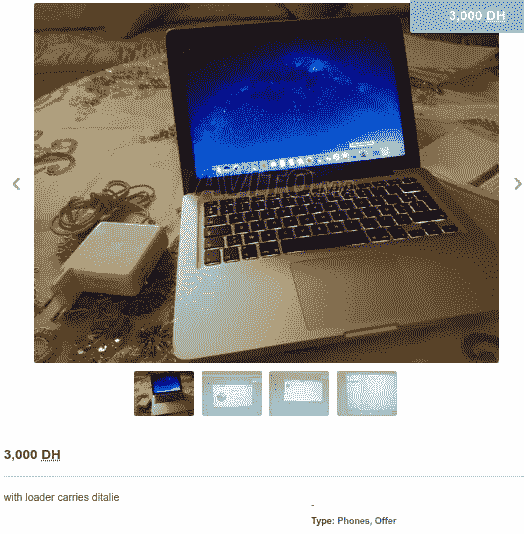

Laptop ad published on phones category — [link](https://www.avito.ma/fr/casablanca/t%C3%A9l%C3%A9phones/MacBook_pro_2012_29259793.htm)

在这篇博文中，我将介绍我如何通过使用 [Keras](https://keras.io/) 框架构建一个简单的卷积神经网络来优化这一过程，该网络可以分类上传的图像是用于手机还是笔记本电脑，并告诉我们图像是否与广告类别匹配。

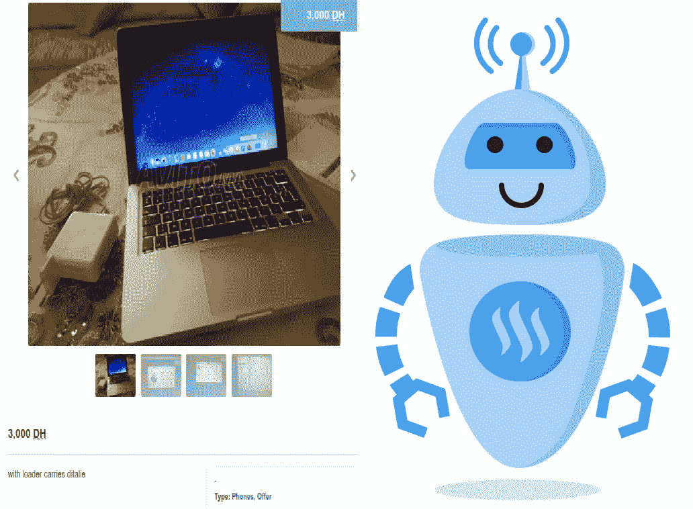

这篇博客将分为 5 个具体步骤。

1.  数据收集
2.  数据预处理
3.  数据建模
4.  用张量板分析模型
5.  模型部署和评估

# 1.数据收集

像任何数据科学项目一样，我们应该寻找的第一个组成部分是数据，在这种情况下，我们将处理的数据是从同一网站 [Avito.ma](https://www.avito.ma) 废弃的一组图像。对于笔记本电脑和手机两类，结果文件夹将包含两个子目录，分别名为“**笔记本电脑**和“**手机**”，其中下载图像的形状在 120 x 90 和 67 x 90 之间变化，每个图像有 3 个通道的 RGB。这里是执行这项任务的代码的快照，而完整的代码在[笔记本](https://github.com/PaacMaan/avito_upload_classifier/blob/master/avito_image_classifier.ipynb)中提供。

一旦这个过程很好地完成，我们得到了 2097 张**笔记本**和 2180 张**手机的图像。**为了使分类更加准确且没有偏差，我们需要验证两个类别具有几乎相同数量的观察值，因为我们可以从下图中看到两个类别大致相当平衡。

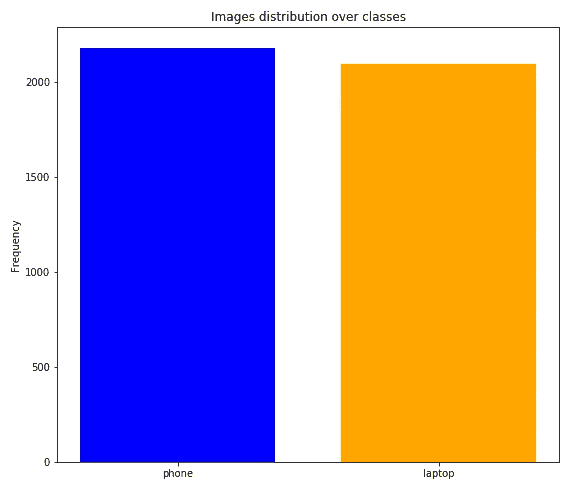

Images distribution over classes

# 2.数据预处理

对于预处理任务，我们将它分成如下三个子任务:

## 2.1 去除噪声数据

当手动检查下载的图像时，我注意到存在一些与相关类别无关的噪声图像，例如，在手机文件夹中观察到以下图像(手机充电器、手机包、虚拟现实眼镜):

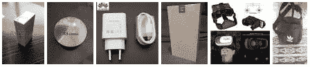

Noisy images found with phones images

不幸的是，没有自动的方法来处理这个问题，所以我们必须手动检查它们，并开始删除它们，以便只保留那些与适当的类相关的图像。

## 2.2 图像大小调整

这一步完全取决于所采用的深度学习架构，例如当使用 [Alexnet](http://papers.nips.cc/paper/4824-imagenet-classification-with-deep-convolutional-neural-networks.pdf) 模型对图像进行分类时，输入形状应该是 227 x 227，而对于 [VGG-19](https://arxiv.org/pdf/1409.1556.pdf) 来说，输入形状是 224 x 224。

由于我们不打算采用任何预先构建的架构，我们将构建自己的卷积神经网络模型，其中输入大小为 64 x 64，如下面的代码快照所示。

为了执行这个任务，我们在两个子目录`**phone**` 和`**laptop**` **，**中创建了另一个名为`preprocessed_data` 的目录，然后我们对`raw_data`的原始文件夹中的每个图像进行循环，以调整其大小并将其保存在新创建的目录中。

因此，我们最终在 64 x 64 的适当形状内得到两个类的新生成数据集。

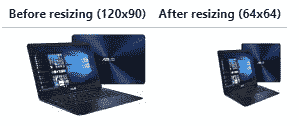

## 2.3 数据拆分

在调整数据集的大小后，我们将其分成 80%用于训练集，剩下的用于验证。为了执行这个任务，我们创建了一个名为`data` **、**的新目录，其中我们设置了另外两个新目录`train` 和`validation` **、**，我们将在其中为`**phones**`和`**laptops**`设置两个类图像。

更明确地说，我们定义当前目录和目标目录，然后我们将训练集的比率固定为 0.8，将验证的比率固定为 0.2，以测量我们将有多少图像从原始路径移动到目标路径。

Snapshot of code doing the data splitting

为了更好地显示文件夹层次结构，下面是项目树视图:

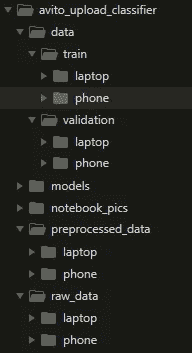

Global project structure

# 3.数据建模

现在，我们来到了所有这些管道中的主要步骤，即数据建模，为此，我们将建立一个卷积神经网络，该网络将在我们之前处理过的几千张手机和笔记本电脑图像上进行训练。

在计算机视觉中，卷积运算是卷积神经网络的基本构建模块之一，它需要 4 个强制组件:

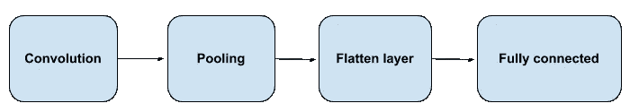

Major components of a convolutional neural networks

对于该模型，我们将讨论每个组件是如何使用 [Keras](https://keras.io/) 及其自身参数实现的，从卷积到全连接层，但首先，让我们了解内置模型的完整架构。

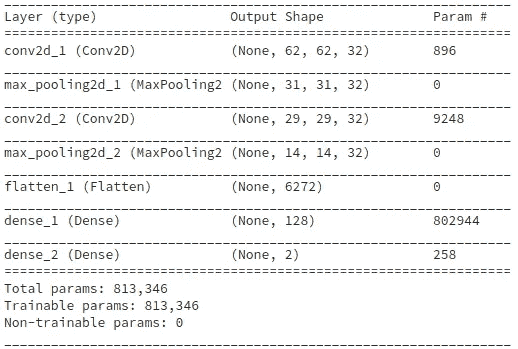

CNN model architecture

## 卷积层

```
model.add(Conv2D(filters=32, kernel_size=(3, 3), input_shape=(64, 64, 3), activation=‘relu’))
```

在将一个顺序对象实例化为`model`后，我们使用`add`方法添加一个名为`Conv2D`的卷积层，其中第一个参数是`filters`，它是输出体积的维度，就像模型摘要上显示的那样，第一层输出的形状是`(None, 62, 62, **32**)`。

因为第二个参数`kernel_size`是指定 1D 卷积窗口的长度，这里我们选择 3×3 的窗口大小来卷积输入体积。

第三个参数代表`input_shape`，它是分别与`image_width x image_height x color channels (RGB)`相关的`64 x 64 x 3`的量，最后但并非最不重要的是`activation_function`，它负责向网络添加非线性变换，在这种情况下，我们选择`relu`激活函数。

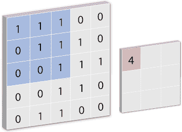

Illustration of a convolution operation with kernel_size = (3, 3)

## 最大池层

在卷积后添加最大池图层的原因是为了减少我们之前应用的卷积图层提取的要素数量，换句话说，我们对这些要素的位置感兴趣。

为了给网络一个高度概括，如果我们有一个从 x 到 y 的垂直边，这并不重要，但是有一个近似垂直的边，距离左边缘大约 1/3，大约图像的 2/3 高度。

所有这些过程都在 Keras 的一行代码中恢复:

```
model.add(MaxPooling2D(pool_size = (2, 2)))
```

简单地说，这里我们使用`add`方法注入另一个最大池层`MaxPooling2D`，其中 pool_size 是(2，2)的窗口，默认情况下是`strides=None` 和`padding='valid'`。

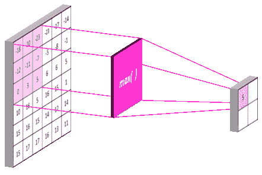

Illustration of Maximum pooling with pool_size = (2, 2)

## 拉平输出

在结束 CNN 模型时，将最大池输出展平为连续的一维向量是一个强制步骤。

```
model.add(Flatten())
```

Keras 在这里所做的，只是简单地在网络中添加了一个`Flatten`层，它简单地等同于带有`‘C’`排序的`numpy`中的`reshape`功能。

## 全连接层

最后，我们将最后一层注入到网络中，这是一个完全连接的层，您可以将其视为一种廉价的方式来学习从以前的卷积中提取的特征的非线性组合。

```
model.add(Dense(units = 128, activation = 'relu'))
model.add(Dense(units = 2, activation = 'sigmoid'))
```

Keras 通过在网络中添加`Dense`函数很容易做到这一点，它只需要两个参数`units`和`activation`，这两个参数分别代表我们将拥有的输出单元的数量，因为我们正在进行二元分类，所以它将值 2 和激活函数作为要使用的值。

## 编译网络

最后，我们必须通过调用`compile`函数来编译我们刚刚构建的网络，这是使用 Keras 构建的每个模型的强制步骤。

```
model.compile(optimizer = 'adam', loss = 'binary_crossentropy', metrics = ['accuracy'])
```

`loss`参数，因为我们有一个二进制分类，其中类的数量 *M* 等于 2，交叉熵可以计算为:

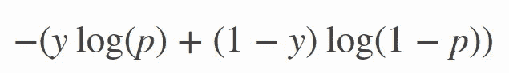

Objective function of binary cross entropy

其中`p`是预测概率，`y`是二进制指示器(0 或 1)。

为了最小化这个目标函数，我们需要调用一个优化器，比如`adam`是`Adaptive Moment Estimation`的缩写，默认情况下它的学习率被设置为 0.001，但是这并没有关闭超参数调整窗口。总结我们所做的，下面是内置模型的完整代码。

## 加载图像和数据转换

为了将图像馈送到我们编译的模型，我们调用`ImageDataGenerator`函数，它将帮助我们生成批量的张量图像数据，并进行实时数据扩充。数据将(分批)循环。

现在我们已经创建了两个`ImageDataGenerator`实例，我们需要用一个`categorical`类模式为它们提供训练和验证数据集的正确路径。

一旦`train`和`validation`集合准备好提供给网络，我们调用`fit_generator`方法将它们提供给模型。

通常，除了评估最终训练模型的验证之外，我们还准备了另一个测试数据集，但我们将保持它的简单性，只在验证集上评估它。

## 模型评估

训练结束后，准确率达到了 87.7%，仍然有 0.352 的较高损失，但高准确率并不一定意味着我们拥有好的模型质量。我们需要跟踪并可视化模型在这段时间内的行为，为此，我们使用了 TensorBoard，它提供了 Keras 作为与 TensorFlow 后端一起运行的回调函数。

# 4.用 TensorBoard 分析模型

在这一步中，我们将看到如何使用 TensorBoard 来分析我们的模型行为。TensorBoard 是一个工具，用于与 TensorFlow 后端一起构建模型，帮助我们可视化基本上我们的模型随时间的训练，以及
观察准确性与验证准确性或损失与验证损失。

使用 Keras，这个步骤可以通过调用`TensorBoard`函数，在仅仅一行代码中重新开始，并在拟合数据时注入它作为回调。

```
from keras.callbacks import TensorBoardtensorboard = TensorBoard(log_dir='./tf-log', histogram_freq=0,
                          write_graph=True, write_images=False)
```

## 失败

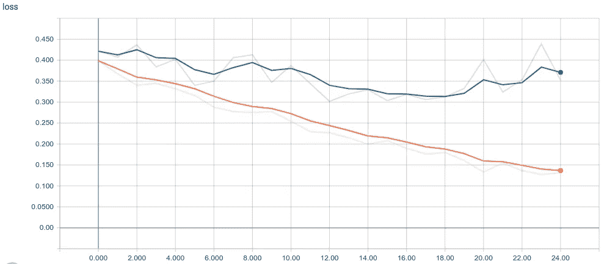

Loss histogram for both training and validation set

从上面的图中，我们可以清楚地看到，对于从 0.39 开始到 0.13 的训练线，损失严格地减小，而对于从 0.42 开始并且花费 25 个历元来达到 0.35 的验证线，损失缓慢地减小。

就我个人而言，每当我要评估一个模型时，我会观察验证损失，这里我们可以想象的是，在第 19 个纪元之后，验证损失开始增加一点，这可能会导致模型记住许多输入样本，为了验证这个假设，我们最好检查准确性直方图。

## 准确(性)

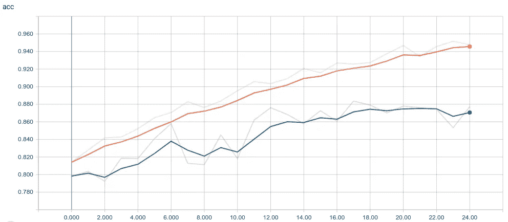

Evolution of Accuracy histogram for both training and validation set

如我们所见，验证准确度一直在增加，直到第 19 个纪元，此时验证准确度趋于稳定，出现了预期的下降和上升，这可以用从同一纪元开始增加验证准确度时的验证损失行为来解释。

为了保持良好的模型质量，建议在这种情况下使用提前停止回调，这将迫使模型在验证损失开始增加或准确度以一定容差下降时停止训练。

# 5.使用 Flask 进行模型部署

在转到部署细节之前，我们首先需要保存之前已经训练好的模型，为此我们调用`save`方法如下图所示:

```
# save models weights on hdf5 extension
models_dir = 'models/'
model.save(models_dir+'avito_model.h5')
```

一旦我们的模型被保存，我们以后就可以使用它来预测新的图像类。

## 为什么是 Flask？

Flask 是 Python 的一个微型框架，它的灵感来自于一句名言“做一件事，把它做好”，这就是我选择 Flask 作为 REST API 的原因。

flask 应用程序由两个主要组件组成:python 应用程序(`app.py`)和 HTML 模板，对于`app.py`，它将包含进行预测的逻辑代码，并作为 HTTP 响应发送。该文件包含三个主要组成部分，可呈现如下:

1.  载入储存的模型。
2.  变换上传的图像。
3.  使用加载的模型预测其适当的类。

在下一节中，我们将讨论其中最重要的组成部分。

## 回到主要问题。

当用户选择笔记本电脑作为广告类别时，预计他必须为笔记本电脑上传图像，但发生的事情是不同的。正如我们之前看到的，许多广告中的图片都包含手机类别中的笔记本电脑。

运行应用程序后，假设模型成功加载，用户可能上传不同大小的图像，而我们的模型只能预测 64 x 64 x 3 的图像，因此我们需要将它们转换为正确的大小，以便我们的模型可以很好地预测它。

Snapshot of code processing uploaded images

一旦上传的图像被转换，我们就将它作为参数发送给加载的模型，以便进行预测，并以 JSON 对象的形式返回 HTTP 响应，模式如下:

```
{"class" : "laptop/phone", "categories_matched": True/False}
```

第一个属性是图像预测类别，第二个属性是布尔值，指示从用户选择的类别是否与上传的图像匹配。下面我展示了完成这项工作的代码逻辑的快照。

## 应用程序演示

要运行应用程序，我们只需切换到创建`app.py`的文件夹，并运行以下命令:

```
$ python3 app.py
```

然后，我们浏览控制台上显示的以下 URL:`[http://127.0.0.1:5000/](http://127.0.0.1:5000/)`，一旦显示索引页面，选择广告类别并上传其相关照片，在后台会向路由`/upload`发送一个请求，该路由会将照片保存在一个目录中，以预测其适当的类别。

这是一个现场演示，展示了我们在这个项目结束时能够建造的东西。

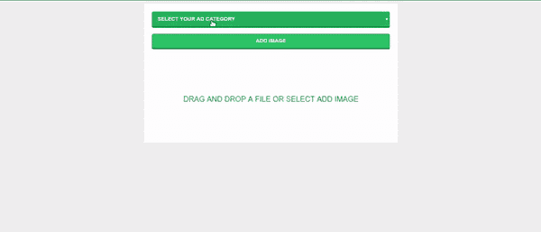

Web application demo

如果选择的类和预测的类都匹配，那么你会得到一个成功的消息，表明一切正常，否则你会得到一个警告消息，并且`select box`会自动改变到适当的预测类。

# 结论

最后，这篇博文通过建立一个深度学习模型，展示了一个完整的计算机视觉管道，该模型可以预测应用于电子商务环境的上传图像的类别，从数据收集到数据建模，最后通过模型部署为 web 应用程序来完成。

# **改进方法**

1.  通过废弃两个类别的更多图像并移除有噪声的图像来增加数据大小。
2.  学习率和 beta 值的超参数调整。
3.  尝试其他架构，如 [Lenet-5](http://yann.lecun.com/exdb/publis/pdf/lecun-01a.pdf) 。
4.  在完全连接的(密集)层上使用 Dropout。

# 有用的链接

完整项目+笔记本+数据集:[https://github.com/PaacMaan/avito_upload_classifier](https://github.com/PaacMaan/avito_upload_classifier)

Flask Web 应用:[https://github . com/PaacMaan/avito _ upload _ classifier/tree/master/flask _ app](https://github.com/PaacMaan/avito_upload_classifier/tree/master/flask_app)